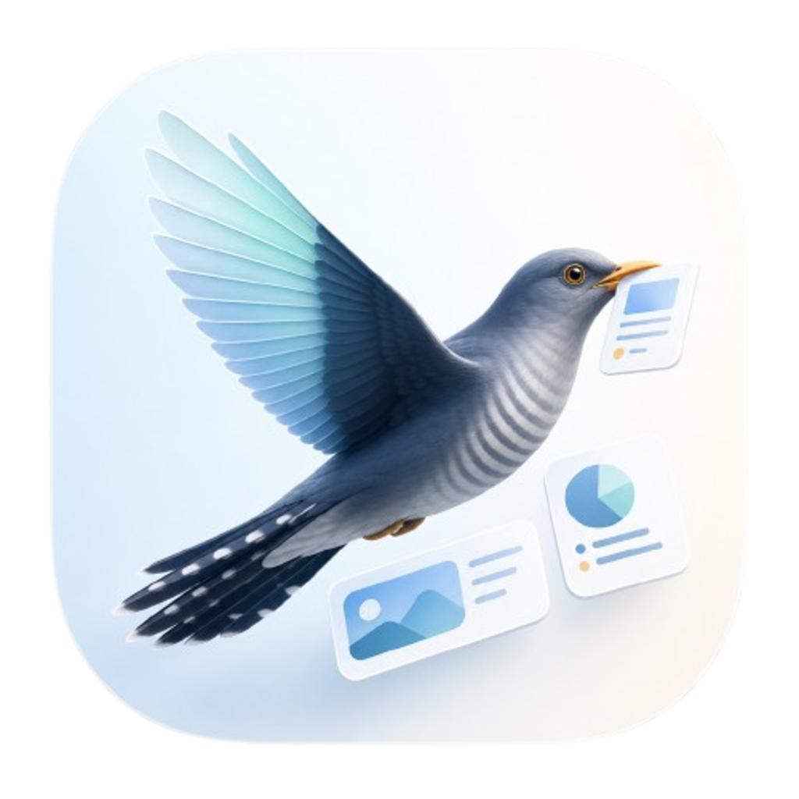

<p align="center">
  
</p>

# 布谷AI · 内容工厂

布谷AI 是一个基于 Electron、React、Vite、官方 `@anthropic-ai/claude-agent-sdk` 和协议化生成服务路由的桌面内容工厂。

产品主线不是通用聊天平台，而是面向电商和个人 IP 内容生产的「已成型知识库 -> 提示词包 -> 场景库 -> 文章 / 图片 / 视频素材」闭环。

```text
已成型知识库
-> 品牌 / 产品提示词包
-> 产品场景库
-> 文案 / 脚本 / 图片提示词
-> 图片素材
-> 视频生成队列
-> 生成历史 / 素材库
```

## 当前定位

- **桌面壳**：Electron + React + Vite + TypeScript。
- **文本编排底座**：Claude / Anthropic 官方链路默认走 `@anthropic-ai/claude-agent-sdk`；OpenAI、Gemini 和兼容网关走显式协议，不把非 Claude 模型硬塞进 Claude SDK。
- **能力库**：支持内置能力和工作区 `.claude/skills` / `.agents/skills`；用户主目录能力仅在调试环境变量开启时扫描。
- **知识库**：v1 只消费已经成型的产品型知识库和个人 IP 型知识库。
- **本地事实源**：工作区下的 `.content-studio` 保存知识库索引、提示词包、场景卡、生成日志和能力启用状态。
- **安全边界**：API Key 只在 Electron main process 保存，Renderer 不读取明文 Key、不直接执行文件或命令；未配置真实生成服务时返回 `blocked`，不再用 mock/占位产物伪装成功。

## 当前已包含

- 深色三栏桌面工作台：左侧能力导航、中间内容生产区、右侧全局参数舱。
- 模型配置：文字协议、图片协议、视频 HTTP 生成服务分开配置；协议显式选择，不根据模型名猜测。
- 能力管理：扫描、安装内置能力、启用 / 停用、无效能力错误展示。
- 已成型知识库：内置脱敏样例、工作区安装、DOCX / Markdown / TXT / JSON 导入、关键词检索和引用选择。
- 提示词包：从知识引用生成品牌口吻、视觉风格、卖点规则、合规边界和平台约束。
- 产品场景库：生成目标人群、痛点、使用场景、画面构图、口播方向和素材建议。
- 文章生成：生成标题候选、大纲、Markdown 草稿和发布检查。
- 图片生成：支持 OpenAI Responses `image_generation`、OpenAI Chat data URI、Gemini GenerateContent 图片协议；未配置图片 Key 时返回 `blocked`，不生成 SVG 占位。
- 视频拆解 / 生成请求：支持 HTTP 视频理解 / 生成服务；未配置时返回 `blocked`，只保存可追溯队列文件。
- 生成历史：记录提示词包、场景卡、文章、图片请求和视频队列请求。

## 当前不包含

- 不做竞品抓取、用户差评采集、店铺诊断和策略报告生成。
- 不做 AI 自动搭建知识库；只接入用户已有的成型知识库。
- 不内置真实视频模型网关；视频结果不会伪造成功素材。
- 不做云端协作、团队权限、计费、多租户、复杂向量检索。
- 不 fork Craft，不迁移 Craft 的远程服务、多会话 inbox 或通用聊天复杂度。

## 快速开始

```bash
npm install
npm run dev
```

首次运行后：

1. 打开「模型配置」：先选择文字协议和图片协议，再填写对应端点 / Key / 模型。Claude 官方路径可复用本机 Claude Code 登录；兼容网关可选择 Anthropic Messages、OpenAI Chat 或 Gemini GenerateContent；视频端点会收到 `operation: "analyze"` 或生成请求 payload。
2. 选择一个工作区。
3. 在「知识库」中安装内置样例或导入 DOCX / Markdown / TXT / JSON 成型知识库。
4. 检索并选择知识引用。
5. 生成品牌 / 产品提示词包，再生成产品场景库。
6. 进入文章、图片或视频模块生成内容资产或生成请求。

## macOS 首次打开

当前 GitHub Actions 产物用于内部预览，默认没有 Apple 签名和 notarization。macOS 可能会提示「`布谷AI` 已损坏，无法打开」或阻止启动。

如果确认安装包来自本仓库 Release，可按以下方式移除 quarantine 标记：

1. 将 `布谷AI.app` 拖入「应用程序」目录。
2. 打开「终端」，执行：

```bash
xattr -dr com.apple.quarantine "/Applications/布谷AI.app"
```

3. 重新打开 `布谷AI.app`；如仍被拦截，右键点击应用并选择「打开」。

> 仅对可信来源的安装包执行该命令；正式分发会在接入 Apple 签名和 notarization 后移除此步骤。

## 目录结构

```text
src/main/                 Electron main process
  services/               Settings、模型配置、能力库、知识库、提示词包、场景库、生成日志
  providers/              文字 / 图片 / 视频生成服务适配
src/preload/              类型化 IPC facade
src/renderer/             React 工作台 UI
src/shared/               main / preload / renderer 共用类型
resources/skills/         App 内置能力模板
resources/knowledge-bases/脱敏内置知识库样例
docs/roadmap/v1/          v1 PRD、UI 蓝图、架构图和实施计划
```

## 能力路径

布谷AI优先使用 Claude 官方路径，同时兼容 Craft 风格路径：

```text
<workspace>/.claude/skills/{slug}/SKILL.md
<workspace>/.agents/skills/{slug}/SKILL.md
~/.claude/skills/{slug}/SKILL.md
~/.agents/skills/{slug}/SKILL.md
```

## 模型协议边界

当前迭代不引入 Pi；先用轻量协议路由覆盖内容工厂 v1 的文本和媒体生成链路：

| 能力 | 协议 | 典型端点 |
| --- | --- | --- |
| Claude 官方文字 | `claude-sdk` | `https://api.anthropic.com` 或本机 Claude Code 登录 |
| Anthropic 兼容文字 | `anthropic-messages` | `/v1/messages` |
| OpenAI 兼容文字 | `openai-chat` | `/v1/chat/completions` |
| Gemini 原生文字 / 图片 | `gemini-generate-content` | `/v1beta/models/{model}:generateContent` |
| OpenAI Responses 图片 | `openai-responses` | `/v1/responses` + `image_generation` |
| Chat 图片兼容网关 | `openai-chat-data-uri` | `/v1/chat/completions` 返回 `data:image/...;base64` |

Pi 只作为后续完整会话运行底座候选：当非 Claude 模型也需要会话恢复、工具调用、权限、安全模式、MCP / 能力调度时再评估引入。

## 本地验证

```bash
npm run typecheck
npm run build
npm run test:functional
npm run smoke:electron
npm run verify:local
```

## GitHub Actions 发布

仓库包含 `.github/workflows/release.yml`：

- 推送 `v*.*` 或 `v*.*.*` tag 时自动构建 macOS / Windows / Linux 桌面包，并上传到对应 GitHub Release。
- 也可以在 GitHub Actions 页面手动触发 `Release Desktop Packages`，输入已有 tag，例如 `v0.3`。
- CI 默认设置 `CSC_IDENTITY_AUTO_DISCOVERY=false`，产物用于内部预览；正式分发签名和 notarization 后续通过 `CSC_*` / `APPLE_*` secrets 接入。

## 客户端更新检查

- 桌面端启动正式安装包后，会在开启“自动检查更新”时读取 布谷AI更新服务，并用 R2 `latest.json` 作为静态兜底。
- 客户端只选择当前设备匹配的安装包：Windows 使用 NSIS，macOS 优先 DMG，Linux 使用 AppImage；未匹配时回退打开 GitHub Release。
- 开发环境默认不做后台轮询；如需本地验证启动自动检查，可设置 `CONTENT_STUDIO_ENABLE_DEV_UPDATE_CHECK=1`。
- 手动检查入口在“设置 -> 关于”，发现新版本时左下角账号卡片会显示新版本提示。

## Release Notes

详见 [`RELEASE_NOTES.md`](./RELEASE_NOTES.md)。

## 参考

- Craft 开源项目: https://github.com/craft-ai-agents/craft-agents-oss
- Claude SDK 文档: https://docs.claude.com/en/docs/agent-sdk/overview
- Claude SDK 能力文档: https://docs.claude.com/en/docs/agent-sdk/skills
