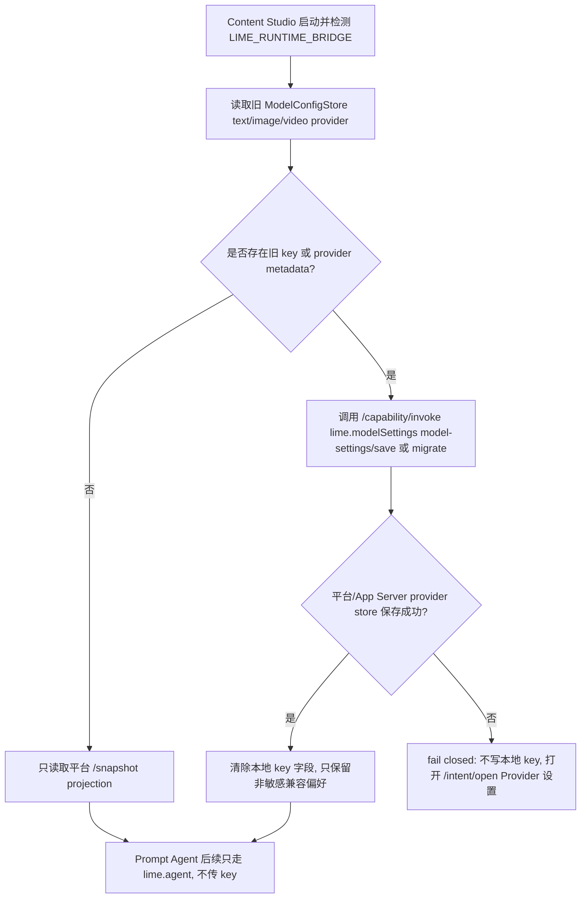

# Lime Agent 接入路线图

> 状态：current planning source
> 更新时间：2026-06-11
> Owner：content-studio 主进程 / Agent runtime 集成
> 定位：content-studio 如何接入 Lime App Server，并把 Agent runtime 全面收敛到 Lime Agent Server sidecar。

## 1. 背景

content-studio 的 Agent 执行已从客户端自带 runtime 收敛到 Lime App Server sidecar。目标架构中，`lime-desktop-platform` 是 Host Kit、Capability Gateway、Provider 设置 UI 和 App Server sidecar owner，负责 Host Bridge、Provider readiness、App Server sidecar lifecycle 和应用中心基础设施。Provider metadata、API Key、runtime DB 的唯一事实源是 App Server provider store；Content Studio 作为 Product App 不保存、不读取、不传递 Agent Runtime API Key。2026-06-09 后，截图中的左侧 `AI agents` / 主区 `agents 工作台` Prompt Agent 已先切到 App Server `runtime` backend 和 provider store 合同；通用文字、图片、视频 App Server capability 在平台宿主下也已切到 provider store 合同。当前仓库自托管 sidecar 是 standalone/dev 过渡路径，packaged external backend 只保留为 smoke / 旧 HTTP provider 兼容面。

```text
renderer -> contentStudio.runAgentTask (preload)
  -> ipcMain 'agent:run' (src/main/ipc.ts:779)
  -> AppServerSidecarService
  -> app-server sidecar + runtime backend / packaged external backend compat
  -> webContents.send('agent:event:${taskId}') (src/main/ipc.ts:471)
```

Lime 侧把 Agent runtime 服务化成 App Server（见 Lime 仓库 `internal/roadmap/appserver/`），对外发布：

1. `app-server-client` npm package（JSON-RPC client + sidecar 启动 helper；content-studio 当前尚未引入 npm 依赖）。
2. `app-server` sidecar binary（stdio newline-delimited JSON-RPC）。
3. release manifest（version / platform / sha256）。

本路线图定义 content-studio 作为第一批消费方如何接入，且**不复制 Lime runtime、不 import Lime Rust crate**。

## 2. 事实源声明

| 分类 | 对象 | 说明 |
| --- | --- | --- |
| `current` | `docs/roadmap/limeagent/*` | content-studio 接入 App Server 的规划与边界 |
| `current` | `lime-desktop-platform` Host Kit / Capability Gateway / Provider 设置 UI / App Server sidecar owner | 目标宿主层，负责 Provider 设置入口、Host Bridge、sidecar lifecycle 和 capability dispatch |
| `current` | App Server provider store + `--data-dir <platform userData>/app-server` | Provider metadata、API Key、runtime DB 唯一事实源 |
| `current` | 平台宿主 `LIME_RUNTIME_BRIDGE` -> `/snapshot`、`/capability/invoke`、`/intent/open` | Content Studio 在平台内运行时的 Host Bridge 合同 |
| `current` | `AI agents` 工作台 -> `AppServerPromptAgentService` -> `lime.agent` / App Server runtime contract | Prompt Agent 主链，只传业务上下文、provider/model preference，不传 key |
| `compat` | `AppServerSidecarService.runPromptTurn(... backendMode=runtime)` | Content Studio standalone/dev 过渡路径，等待真实平台宿主联调留证后只保留自托管开发用途 |
| `compat` | 随包 Lime `app-server` sidecar + packaged external backend | smoke、媒体和旧 HTTP provider 兼容面，必须进入内容工厂安装包但不再作为 AI agents key source |
| `compat` | `ModelConfigStore` 本地 text/image/video key | 仅作为 standalone 旧媒体/通用文字/视觉兼容面和一次性迁移 source；平台宿主迁移成功后必须清除本地 key |
| `compat` | `agent:run` / `agent:cancel` IPC 合同 | 命令名和事件名保持不变，内部改为委托 sidecar |
| `deprecated` | Prompt Agent 从 `ModelConfigStore.getTextApiKey()` 读取 key 或通过 `backendEnv` 传 key | 已下线，不允许回流 |
| `deprecated` | 平台宿主下通用文字/图片/视频 App Server capability 通过 Product App key/env 调模型 | 已下线，不允许回流 |
| `deprecated` | 平台宿主下素材拆解/视频拆解直连 Provider 读取 Product App key/env | 已阻断；迁到 `lime.agent` / 平台 capability 前只能 blocked |
| `dead` | 客户端自带 SDK runtime / 第二套 runtime adapter / 在 content-studio 内重写 RuntimeCore / Product App 保存 Provider key 作为 Agent Runtime key source / Provider key 双存 | 不作为接入方向 |

## 3. 文档索引

| 文档 | 作用 |
| --- | --- |
| [integration.md](./integration.md) | 接入边界、改动点、目录落点、阶段顺序、阻塞点与验收口径。 |
| [host-provider-runtime-prd.md](./host-provider-runtime-prd.md) | `AI agents` 工作台 Provider/runtime/data-root 主计划，包含 PRD、架构图、时序图、流程图和治理分类。 |
| [../../aiprompts/platform-host-runtime.md](../../aiprompts/platform-host-runtime.md) | 真实 `lime-desktop-platform` 宿主 + Lime App Server runtime provider store 联调 playbook。 |

## 4. 主目标

1. content-studio 通过 `lime-desktop-platform` Host Kit / Capability Gateway 消费 Lime App Server；standalone 过渡路径可通过 `AppServerSidecarService` 直接消费。
2. sidecar 由 Electron main 管理生命周期，renderer 只拿业务投影。
3. 保持现有 `agent:run` / `agent:cancel` IPC 合同与 `agent:event:${taskId}` 事件名不变。
4. sidecar binary 由 release manifest pin 住并校验 sha256，随 `electron-builder` 打包到 `process.resourcesPath/app-server`。
5. 不 import Lime Rust crate，不复制 RuntimeCore / ExecutionBackend / AsterBackend。
6. `AI agents` 工作台 Prompt Agent 不读取、不保存、不传递模型 API Key；只通过 Host Kit 或 runtime contract 提交 `runtimeOptions.providerPreference` / `modelPreference`，让 App Server runtime backend 从 provider store 取 key。
7. 平台宿主下旧本地模型设置只能经 `lime.modelSettings` `model-settings/save` / `migrate` 一次性迁到平台/App Server provider store；保存失败必须 fail closed，不得继续写本地 key。

## 5. 非目标

1. 不重写 content-studio 业务 UI 和内容工厂主链。
2. 不在 renderer 直接 spawn sidecar 或读 stdout。
3. 不恢复客户端自带 SDK runtime 或显式 fallback。
4. 不在 content-studio 内自建第二套 Agent runtime。

## 6. 当前状态

Lime standalone `app-server` binary 已支持 host-independent `external` backend；Content Studio 的旧 `agent:run` / smoke 兼容路径仍可使用 packaged external backend。`AI agents` 工作台 Prompt Agent 已切到 App Server runtime backend 合同，目标经由 `lime-desktop-platform` Host Kit：

```text
AI agents 工作台
  -> AgentPromptSessionStore
  -> AppServerPromptAgentService
  -> LIME_RUNTIME_BRIDGE /capability/invoke lime.agent
  -> lime-desktop-platform Host Bridge / Capability Gateway
  -> app-server --stdio --backend runtime --data-dir <platform userData>/app-server
  -> agentSession/turn/start(providerPreference, modelPreference)
  -> App Server provider store
```

平台宿主桥接合同：

```text
LIME_RUNTIME_BRIDGE
  POST /snapshot
    -> host readiness、provider projection、model preference、capability 列表
  POST /capability/invoke
    -> lime.modelSettings model-settings/save | migrate
    -> lime.agent Prompt Agent turn
  POST /intent/open
    -> 打开平台 Provider 设置 / diagnostics / 应用中心意图
```

旧本地设置迁移路径：



standalone 过渡路径：

```text
AI agents 工作台
  -> AgentPromptSessionStore
  -> AppServerPromptAgentService
  -> AppServerSidecarService.runPromptTurn
  -> app-server --stdio --backend runtime --data-dir <userData>/app-server
  -> agentSession/turn/start(providerPreference, modelPreference)
  -> App Server provider store
```

external 兼容路径：

```text
content-studio AppServerSidecarService smoke / compat
  -> app-server --stdio --backend external --backend-command resources/app-server/backend/content-backend.mjs --app-policy content-studio.policy.json
  -> initialize
  -> capability/list
  -> agentSession/start
  -> agentSession/turn/start
  -> agentSession/event
  -> AgentEvent(status / assistant / result / error / done)
  -> artifact/read
  -> evidence/export
```

已落地：

1. `src/main/services/appServerSidecarService.ts`：main 进程管理 App Server newline-delimited JSON-RPC sidecar、external backend smoke 和 health check。
2. `appServer:health` / `appServer:smoke` IPC：renderer 可通过 preload 查询接入状态，但当前不改变业务 UI。
3. `npm run smoke:app-server`：默认验证 `resources/app-server/current/app-server(.exe)`；也可通过 `APP_SERVER_RESOURCES_DIR` 验证打包输入目录。
4. `electron-builder.yml`：通过 `extraResources` 把 `resources/app-server` 打包进内容工厂。
5. `agent:run` 默认委托 `AppServerSidecarService.runAgent(...)`，保持 `agent:event:${taskId}` 事件合同不变。
6. `agent:cancel` 只取消 App Server running task；旧 runtime 已归为 `dead`，不保留显式 fallback。
7. functional tests 已覆盖 packaged backend 文本模型未配置 error、packaged backend echo artifact、显式 external backend 事件投影、metadata / queue flags 透传、慢 backend cancel 不假完成、backend stderr crash error 投影、同一 service 下一任务恢复和 smoke 链路。
8. `npm run app-server:prepare`：从 Lime release manifest 选择当前平台 artifact，复制 / 下载 sidecar，校验 sha256，写入 `resources/app-server/current` 和 `app-server.release.json`。
9. `APP_SERVER_RESOURCES_DIR=... npm run smoke:app-server`：已支持 resources 路径 smoke，验证打包输入目录可启动；`APP_SERVER_BIN` 仅在 `CONTENT_STUDIO_ALLOW_APP_SERVER_BIN_OVERRIDE=1` 时作为开发 / 测试覆盖。
10. `resources/app-server/backend/content-backend.mjs`：默认 packaged external backend，按 `CONTENT_STUDIO_TEXT_*` / 通用 LLM env 调真实 HTTP 文本模型生成 Markdown artifact；未配置模型时返回明确失败，不伪造成功。
11. `npm run app-server:backend:test`：直接验证 packaged backend 缺模型失败、echo 成功，以及 OpenAI Chat / Anthropic Messages / Gemini GenerateContent 三种协议级请求与响应映射；测试使用本地 HTTP server，不依赖外网密钥。
12. `npm run app-server:backend:live`：发布前真实模型环境验收入口；要求真实 provider key，禁止 echo mode，成功条件是 packaged backend 真实产出 `artifact.snapshot` 和 `turn.completed`。
12.1. `npm run app-server:runtime:live`：真实 App Server runtime provider store 验收入口；要求显式 App Server resources / binary、独立 `--data-dir`、`providerPreference` 和 `modelPreference`，并拒绝 Product App key/token env。无真实 provider store 时必须失败，不能伪造成 live 通过。
13. 2026-06-06 已完成 macOS 分发包验证：`npm run dist:mac` 生成 `布谷AI-0.18.0-arm64.dmg` 和 `布谷AI-0.18.0-arm64-mac.zip`；zip 与只读挂载 DMG 均确认包含 `Contents/Resources/app-server/current/app-server`、`app-server.release.json` 和 `backend/content-backend.mjs`；镜像内 `APP_SERVER_RESOURCES_DIR=... npm run smoke:app-server` 返回 `source=resources`、`protocol=appserver.v0`、`content.draft.generate`、runtime events、artifact 和 evidence。
14. 2026-06-09 `AI agents` 工作台 Prompt Agent standalone 过渡路径已改为 `--backend runtime`，并默认追加独立 `--data-dir`。`AppServerPromptAgentService` 只读非敏感模型 view，不再调用 `getTextApiKey()`，不再注入 `CONTENT_STUDIO_TEXT_API_KEY` / `LLM_*` key env。
15. runtime sidecar env 会清理 `CONTENT_STUDIO_*KEY`、`OPENAI_API_KEY`、`ANTHROPIC_API_KEY`、`GEMINI_API_KEY`、`GOOGLE_API_KEY`、`LLM_API_KEY`、token、secret、password 类环境变量。
16. functional 回归已覆盖 `AI agents` Prompt Agent runtime backend、`--data-dir`、provider/model preference 和无 key payload/env。
17. 2026-06-09 平台宿主下通用文字、图片、视频 App Server capability 已改为 `--backend runtime` + `providerPreference/modelPreference`，不再把 Product App key 写入 `backendEnv`。
18. 2026-06-09 平台宿主下素材拆解和视频拆解直连 Provider 已 fail closed，不读取 Product App 本地 key 或 env key；后续迁到 `lime.agent` / 平台 capability 后再恢复平台宿主下的真实视觉/视频理解。
19. 2026-06-09 `AI agents` 工作台已接入共享 `@limecloud/agent-runtime-ui` / `@limecloud/agent-runtime-projection`：对话流和运行事实先通过共享 primitives 投影，Human-in-the-loop action 通过 `respondAgentPromptAction` 记录并跳转到模型设置或输入源补齐。
20. 2026-06-09 已新增 `npm run verify:lime-agent`，通过 `scripts/lime-agent-boundary-audit.mjs` 扫描 Prompt Agent key 回流、公开平台设置保存入口、第二套 runtime / SDK、共享 AgentUI 依赖和 agents 内部文案回流，并已串入 `verify:local`。
21. 2026-06-09 已新增 `npm run platform-host:runtime:live`，作为真实 `lime-desktop-platform` 宿主联调 gate；它要求真实 `LIME_RUNTIME_BRIDGE`、provider/model preference、`lime.agent` runtime events 和 `artifact.snapshot`，无真实宿主时必须 fail closed，不能作为默认 `verify:local` 项。
22. 2026-06-10 已跑通 `lime-desktop-platform` 跨仓 Product App runtime smoke：`npm run smoke:product-app-runtime-live -- --content-studio-root "$CONTENT_STUDIO_ROOT" --zhongcao-root "$ZHONGCAO_ROOT" --app-server-bin "$APP_SERVER_BIN"`。该 smoke 启动真实 `lime-desktop-platform` Electron，发布 runtime bridge discovery，写入平台模型设置到 App Server provider store，再由 Content Studio 的 `platform-host:runtime:live` 通过 discovery 调 `lime.agent` 并收到 `message.delta`、`artifact.snapshot`、`turn.completed`；后端使用本地 external fixture，不调用正式上游 LLM API。输出包含 `mode=lime-desktop-platform`、`source=discovery`、`model=platform-live-model`、artifact `平台 Runtime 生成草稿`，`zhongcao` 同链路 runtime projection 任务成功。
23. 2026-06-11 `AI agents` 工作台和通用 `AgentSessionPanel` 已统一通过 `AgentUiProjectionSurface` 渲染共享 AgentUI 投影；该 surface 集中组合已发布的 `AgentTimeline`、`RuntimeFactsPanel` 与 product-side `AgentRuntimeRefLists`，并输出 `.agent-ui-projection`、`.agent-ui-main`、`.agent-ui-sidecar` 标准 DOM surface。`npm run verify:lime-agent` 已增加守卫，禁止产品页面继续散装拼共享 primitives。
24. 2026-06-11 `AppServerSidecarService.runCapabilityTurn` 已把 `agentSession/start`、`agentSession/turn/start`、`agentSession/event`、`artifact/read`、`evidence/export` 主链委托到 `ContentStudioAgentRuntimeSessionGateway`；gateway 暴露 `startTurn`、`readSession`、`cancelTurn`、`respondAction`、`exportEvidence`、`nextEvent` 的标准 session gateway 形状，其中 `nextEvent` 保持 `agentSession/event` JSON-RPC notification 形状，内部轮询才消费 `nextRuntimeEvent`。

仍未完成：

1. `AI agents` runtime 主链已经有真实 `lime-desktop-platform` 宿主 + App Server JSON-RPC external fixture 证据；仍需要在真实上游 LLM Provider / `--backend runtime` provider store ready 环境中跑通 `npm run platform-host:runtime:live -- --provider <id> --model <id>`，完成正式 Provider live 留证。
2. standalone/dev 过渡路径需要在支持 `--backend runtime` 和 `--data-dir` 的 App Server release resources 上跑通 `npm run app-server:runtime:live`，完成真实 provider store live 验收。
3. `app-server:backend:live` 仍需在受控发布环境用真实生产密钥 / 真实网络模型跑过并留存结果，作为 external compat backend 的发布验收。
4. 图片、视频、视觉拆解和通用文字生成仍有 standalone 本地 `ModelConfigStore` key 兼容面；平台宿主下这些旧设置要作为一次性迁移 source 进入 `lime.modelSettings` / App Server provider store，迁移成功后不再双存 key。
5. 更接近生产环境的长流式输出压测、自动 restart / retry 退避策略仍需扩展。
6. 共享 AgentUI 仍缺完整发布版 `AgentUiProjectionView`、`@limecloud/agent-runtime-client` 产品依赖接入，以及业务 artifact workspace / evidence pack 打开闭环；Content Studio 当前通过 `ContentStudioAgentRuntimeSessionGateway` 对齐标准 session gateway 形状，并通过 `AgentUiProjectionSurface` 消费已发布的 `AgentTimeline`、`RuntimeFactsPanel`、projection read model，用 product-side `AgentRuntimeRefLists` 过渡展示 ArtifactRef / EvidenceRef。由于仓库尚未安装 `@limecloud/agent-runtime-client` 依赖，不能声明完整 AgentUI 100%。
7. 跨 App 下一刀已推进：`zhongcao` 只读盘点显示无本地 Provider key / 旧 SDK runtime / 旧本地 agent；`geo.generateDraft` 已从 `lime.modelSettings` 迁到 `lime.agent`，`geo.scoreDraft` / `geo.addSchema` 已归入 `lime.diagnostics`。`zhongcao` 已新增 `npm run smoke:runtime-bridge`，用真实 Electron IPC + 本地 `lime.runtimeBridge` fixture 验证 `lime.agent` -> draft result -> 业务 store 写回且 payload 不含 key/token/secret。2026-06-10 `lime-desktop-platform` 的 `smoke:product-app-runtime-live` 已在真实平台宿主 + App Server JSON-RPC external fixture 下同时跑通 Content Studio 与 zhongcao；剩余缺口是真实 Provider live API / RuntimeBackend 上游模型调用证据。

CI / release 已完成串联：

1. `npm run app-server:prepare:release` 通过 `APP_SERVER_RELEASE_MANIFEST` / `APP_SERVER_RELEASE_MANIFEST_URL` 从 release manifest 准备当前 runner 平台 sidecar。
2. GitHub release build 在 `prepare-oem-build.mjs` 前执行资源准备，并用 `CONTENT_STUDIO_REQUIRE_APP_SERVER_RESOURCES=1` 强制检查 `current/app-server(.exe)`、`app-server.release.json` 和 packaged backend。
3. CI / release verify job 均运行 `app-server:prepare:test` 与 `app-server:backend:test`，不依赖真实发布 manifest。
4. `verify:local` 已串联 `npm run verify:lime-agent`，阻断 Prompt Agent key/env 回流、公开平台模型保存入口、第二套 runtime / SDK 和 agents 内部文案回流。
