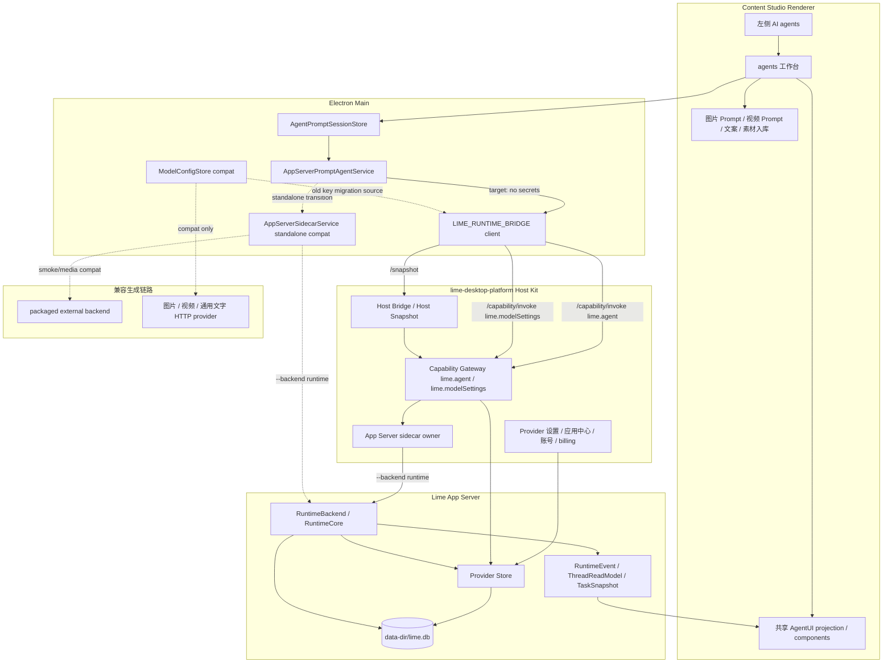
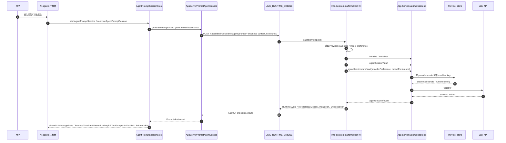
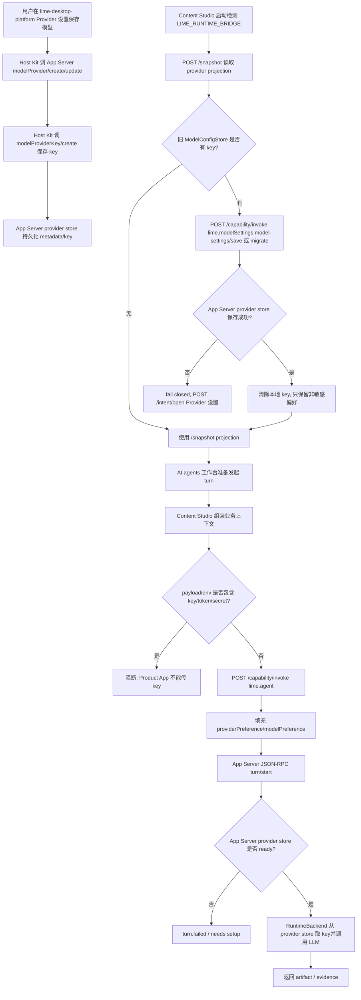
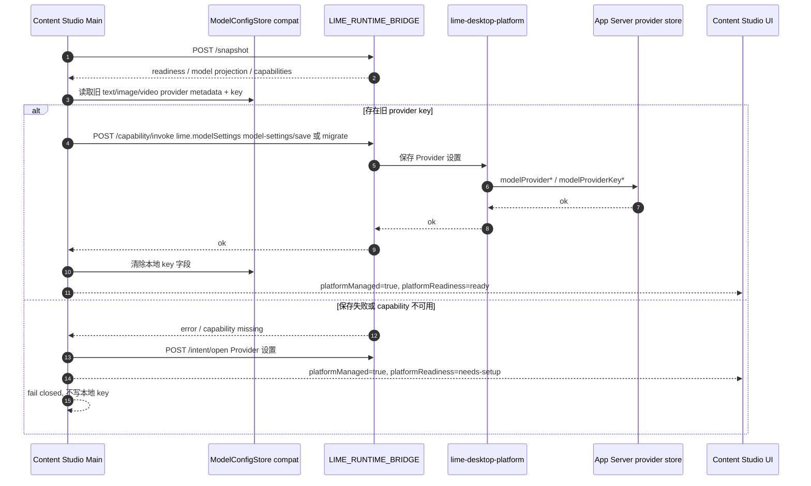

# Content Studio Host Provider Runtime 集成 PRD

## 1. 背景

Content Studio 已经有完整的内容工厂链路，且截图中的主入口是左侧 `AI agents` 和主区 `agents 工作台`。这个入口不是普通后台能力，它承载用户与 Prompt Agent 协作、生成图片 Prompt、视频 Prompt、种草文案、素材入库说明等跨模块任务。

新平台边界要求是：`lime-desktop-platform` 作为目标 Host Kit、Capability Gateway、Provider 设置 UI 和 App Server sidecar owner，承接应用中心、设置、Host Bridge、capability dispatch 和 App Server sidecar lifecycle；Provider metadata、API Key、Agent Runtime 和 App Server DB 由 Lime App Server provider store 统一拥有；Product App 不再保存、读取或传递 Provider key。Content Studio 仍保留图片、视频、通用文字生成的旧显式 HTTP provider 兼容面，但这些旧设置在 standalone 下才是兼容能力，在平台宿主下只能作为一次性迁移 source。`AI agents` 工作台、通用文字生成、图片生成和视频生成的 App Server capability 已切到 `runtime` backend provider store 合同；素材拆解、视频拆解等尚未接入平台视觉/视频 runtime 的直连 Provider 在平台宿主下必须 blocked。

## 2. 产品目标

- 用户在平台 Provider 设置里配置模型后，Content Studio 的 `AI agents` 工作台可以通过 App Server JSON-RPC runtime 调用模型。
- `AI agents` 工作台提交 turn 时只传业务上下文、`providerPreference` 和 `modelPreference`，不传 API Key、token、secret 或本地 key env。
- `AI agents` 工作台的消息、过程、工具、审批、产物和证据展示必须复用 Lime AgentUI 标准投影；Content Studio 只能提供业务上下文和样式适配，不能重新发明一套聊天 / 过程组件协议。
- `AI agents` 工作台的执行事实必须复用 Lime AgentRuntime / App Server read model；Content Studio 不能用 UI-only state、模块内 mock、普通助手正文或本地事件列表推断 turn、tool、permission、artifact、evidence 的完成状态。
- 目标宿主路径由 `lime-desktop-platform` 通过 `LIME_RUNTIME_BRIDGE` 提供 Host Snapshot、Provider readiness、App Server sidecar 和独立 data root；Content Studio 自托管 sidecar 只作为 standalone/dev 过渡路径。
- 平台宿主下，旧 `ModelConfigStore` provider/key 通过 `lime.modelSettings` `model-settings/save` / `migrate` 迁到平台/App Server provider store，迁移成功后清除本地 key，保存失败 fail closed。
- 平台宿主下，图片 / 视频 / 通用文字 App Server capability 只传 provider/model preference，由 App Server provider store 取 key；standalone 下旧 HTTP provider 继续作为兼容面保留。
- 平台宿主下，尚未接入 `lime.agent` 或平台 capability 的素材拆解、视频拆解直连 Provider 必须 blocked，不读取本地 key 或 env key。

## 3. 非目标

- 不在本轮删除 `ModelConfigStore`，因为图片、视频、视觉拆解和通用文字生成仍依赖本地显式 HTTP provider；但平台宿主下它只允许作为兼容读取和一次性迁移 source。
- 不在 Content Studio 内复制 Desktop Platform 的完整 Provider 设置、OAuth、billing 或应用中心事实源。
- 不在 Content Studio 内 fork Lime AgentUI 的 `UIMessageParts`、`ProcessTimeline`、`ExecutionGraph`、`ToolGroup`、`ActionRequired`、`ArtifactRef`、`EvidenceRef` 渲染模型。
- 不在 Content Studio 内 fork Lime AgentRuntime 的 `RuntimeEvent`、`ThreadReadModel`、`TaskSnapshot`、`ToolCallState`、`ActionState` 或 evidence/replay/review 事实源。
- 不让 Product App 初始化或直接读写 App Server DB。
- 不把 API Key 复制到 runtime JSON-RPC payload、`backendEnv`、Host Snapshot 或业务 workspace。
- 不把 Provider key 存储两遍；迁移成功后本地 key 必须清除。

## 4. 事实源声明

从 2026-06-09 起，Content Studio `AI agents` 工作台的目标 Agent runtime 主链是：

```text
AI agents 工作台
  -> agentPromptSessions:start / continue
  -> AppServerPromptAgentService
  -> LIME_RUNTIME_BRIDGE /capability/invoke lime.agent
  -> Host Bridge / lime-desktop-platform Capability Gateway
  -> app-server --stdio --backend runtime --data-dir <platform userData>/app-server
  -> agentSession/turn/start(runtimeOptions.providerPreference, runtimeOptions.modelPreference)
  -> App Server RuntimeBackend -> provider store -> LLM API
```

当前仓库已落地的 standalone/dev 过渡路径是 `AppServerPromptAgentService -> AppServerSidecarService.runPromptTurn -> app-server --backend runtime --data-dir <Content Studio userData>/app-server`。它用于本仓库可运行验证，不改变目标架构：Provider key 只存在于 App Server provider store；Provider 设置 UI 和 provider store 同步职责属于 `lime-desktop-platform` Host Kit。Content Studio 可以保存非敏感模型偏好和旧兼容 provider 配置，但不能把这些 key 当作 Agent Runtime 的凭证来源；在平台宿主下发现旧 key 时必须迁移到 `lime.modelSettings` / App Server provider store，成功后删除本地 key，失败则 fail closed 并打开平台设置。

Agent 标准事实源分层：

```text
Lime AgentRuntime
  -> App Server RuntimeEvent / ThreadReadModel / TaskSnapshot / Evidence refs
  -> Lime AgentUI projection model
  -> shared Agent UI components
  -> Content Studio agents 工作台业务壳层
```

Content Studio 的 renderer 只消费共享 projection 后的 `UIMessageParts`、`ProcessTimeline`、`ExecutionGraph`、`ToolGroup`、`TaskCapsule`、`ArtifactRef`、`EvidenceRef`；如果 App Server 或 Host Bridge 缺失某类 fact，UI 必须显示 `unknown` / `unavailable` / `blocked` / `needs-setup`，不能从助手正文、模块局部状态或旧 `executionEvents` 文本猜测。

当前产品接入拆成两层判断：

```text
已完成的标准形状：
  AppServerSidecarService
    -> ContentStudioAgentRuntimeSessionGateway
    -> agentSession/start
    -> agentSession/turn/start
    -> agentSession/event notification
    -> agentSession/read / artifact/read / evidence/export
    -> AgentUiProjectionSurface

仍未完成的标准包依赖：
  @limecloud/agent-runtime-client/sessionGateway
    -> createAgentRuntimeClientFromSessionGateway(...)
    -> readThread / subscribeEvents / nextEvent / exportEvidence
    -> @limecloud/agent-runtime-projection
    -> @limecloud/agent-runtime-ui
```

`ContentStudioAgentRuntimeSessionGateway` 是 current 过渡 owner，只允许封装 App Server current `agentSession/*` / `evidence/export` 方法和事件 notification，不拥有 projection state、React surface、Provider key 或 tool 状态机。它的 `nextEvent()` 必须保留 `agentSession/event` JSON-RPC notification 形状，以便后续无缝替换为 `@limecloud/agent-runtime-client/sessionGateway`；内部轮询如需裸 `RuntimeEvent`，只能通过 `nextRuntimeEvent()` helper 消费。真正安装并接入 `@limecloud/agent-runtime-client` 需要修改 `package.json` / `package-lock.json`，属于单独依赖变更，不在未确认的情况下夹写。

## 5. 架构图



## 6. 时序图



## 7. Provider / Key 流程图



## 8. 旧设置迁移时序图



## 9. App Server Data Root

目标宿主路径中，App Server sidecar 由 `lime-desktop-platform` 拥有：

```text
lime-desktop-platform
  -> app-server --stdio --backend runtime --data-dir "<Platform userData>/app-server"
```

Content Studio standalone 过渡路径默认启动方式：

```text
app-server --stdio --backend runtime --data-dir "<Content Studio userData>/app-server"
```

优先级：

1. `APP_SERVER_ARGS` 已显式传 `--data-dir` 或 `--data-dir=...` 时，尊重显式值。
2. `CONTENT_STUDIO_APP_SERVER_DATA_DIR` 或 `APP_SERVER_DATA_DIR` 存在时，作为默认 data root。
3. Electron 主进程可用时，默认使用 `app.getPath("userData")/app-server`。
4. Node-only smoke / functional 测试环境回退到系统临时目录。

注意：当前随包 external backend smoke 仍保留旧参数，避免旧 sidecar 不支持 `--data-dir` 时打断分发 smoke。`AI agents` runtime 主链必须使用支持 `--data-dir` 的 App Server 版本；旧 sidecar 只应停留在兼容 smoke。接入 `lime-desktop-platform` Host Kit 后，Content Studio 不应再自行决定 provider data root，也不应初始化或读取 Existing Lime `lime.db`。

## 10. AgentRuntime / AgentUI 共享合同

本节是纠偏边界：Content Studio 的 `AI agents` 不能因为要做自己的内容工厂体验，就复制一套 Agent runtime 或 Agent UI 协议。业务差异只能体现在输入上下文、业务对象、交付物和轻量样式适配上。

### 10.1 Runtime 合同

| 事实 | Content Studio 允许做 | 禁止 |
| --- | --- | --- |
| Session / thread / turn | 通过 `lime.agent` 或 standalone App Server runtime 创建、继续和读取 | 在 renderer 或 main service 内自建第二套 turn 状态机 |
| Tool lifecycle | 消费 App Server `tool.*` / process facts，并映射到共享 `ToolGroup` | 从助手正文、stderr 文本或局部日志猜 tool success |
| Human-in-the-loop | 通过稳定 `actionId` 调 `respond_action` 或平台 capability | 用 UI 按钮直接把本地状态标成 approved / rejected |
| Artifact | 只保存 App Server / artifact service 返回的 ref、preview 和 content handle | 把完整 artifact body 塞进 assistant 正文当作交付事实 |
| Evidence / replay / review | 消费 App Server evidence refs 和 shared evidence summary | 用 Content Studio 本地报告重建 runtime observability |
| Provider / model | 只传 provider/model preference，由 provider store 取 key | 传 key、env key、backendEnv key 或本地 credential handle |

`AgentPromptSession.messages` 和 `executionEvents` 只允许作为共享 projection 的缓存 / 兼容输入；它们不是新的 runtime truth。后续实现必须逐步把可展示的过程状态收敛到 App Server `RuntimeEvent` / `ThreadReadModel`，再由共享 AgentUI adapter 投影。

### 10.2 UI 合同

`AI agents` 工作台的标准 UI 分层如下：

```text
Composer
  -> UIMessageParts
  -> RuntimeStatus
  -> ProcessTimeline
  -> ExecutionGraph
  -> ToolGroup
  -> HumanInTheLoop
  -> TaskCapsule
  -> ArtifactRef / ArtifactWorkspace
  -> EvidenceRef
```

Content Studio 可以包一层内容工厂业务壳，例如当前对象、素材、提示词包、图片 / 视频 / 文案交付目标，但不能在模块里硬编码假 assistant 气泡、假工具步骤、固定执行脚本或单独的过程树。缺失共享组件时，短期可以写 adapter，但 adapter 输出必须对齐 Lime AgentUI projection model，并登记退出条件。

### 10.3 共享落点

| 层 | 目标事实源 | Content Studio 责任 |
| --- | --- | --- |
| Runtime protocol | Lime App Server JSON-RPC / AgentRuntime profile | 只做调用、迁移、blocked 处理和业务 metadata |
| UI projection | `/Users/coso/Documents/dev/ai/limecloud/agentui` | 复用 projection taxonomy 和 reference component contract |
| Product shell | Content Studio `AI agents` / `agents 工作台` | 绑定业务对象、输入素材、交付物和 blocked 恢复路径 |
| Compatibility | `AgentPromptSession.messages` / `executionEvents` | 作为过渡缓存；不能继续扩成新协议 |

验收口径：如果某个 Agent UI 能力无法从 App Server runtime facts 或共享 AgentUI projection 解释，就不能标记为 current；只能标记为 `compat` / `blocked`，并写清楚退出条件。

## 11. 治理分类

| 分类 | 对象 | 说明 |
| --- | --- | --- |
| `current` | `AI agents` / `agents 工作台` -> `AgentPromptSessionStore` -> `AppServerPromptAgentService` | 截图入口的 Agent 协作主链 |
| `current` | `lime-desktop-platform` Host Bridge / Capability Gateway / Provider 设置 UI / App Server sidecar owner | 目标宿主层，负责平台设置、Provider readiness、sidecar lifecycle |
| `current` | `LIME_RUNTIME_BRIDGE` `/snapshot`、`/capability/invoke`、`/intent/open` | Product App 在平台宿主下消费 host facts、capability 和设置意图 |
| `current` | `lime.modelSettings` `model-settings/save` / `migrate` | 旧设置迁移到平台/App Server provider store 的唯一入口 |
| `current` | `lime.agent` | Prompt Agent turn 的平台 capability 入口 |
| `current` | Lime AgentRuntime profile / App Server `RuntimeEvent` / `ThreadReadModel` | Agent 执行事实和 UI 投影输入的唯一标准 |
| `current` | Lime AgentUI `UIMessageParts` / `ProcessTimeline` / `ExecutionGraph` / `ToolGroup` / `ArtifactRef` / `EvidenceRef` projection | `AI agents` 工作台共享 UI 标准；Content Studio 只做业务壳层适配 |
| `current` | `runtimeOptions.providerPreference` / `runtimeOptions.modelPreference` | App Server runtime backend 选择 provider/model 的非敏感合同 |
| `current` | App Server provider store + `--data-dir <platform userData>/app-server` | Provider metadata、API Key、runtime DB 唯一事实源 |
| `compat` | `AppServerSidecarService.runPromptTurn(... backendMode=runtime)` | Content Studio standalone/dev 过渡路径；等待真实宿主联调留证后只保留自托管开发用途 |
| `compat` | `AgentPromptSession.messages` / `executionEvents` 本地投影缓存 | 只作为共享 AgentUI projection 的过渡输入；不得继续扩展成独立 UI 协议 |
| `compat` | `resources/app-server/backend/content-backend.mjs` external backend | smoke、旧文本/媒体路径兼容；不作为 AI agents runtime 凭证来源 |
| `compat` | `ModelConfigStore` 本地 text/image/video key | 仅服务 standalone 旧图片、视频、视觉、通用文字 HTTP provider 和一次性迁移 source；平台宿主迁移成功后清除本地 key |
| `deprecated` | Prompt Agent 从 `ModelConfigStore.getTextApiKey()` 读取 key | 已下线，不允许回流 |
| `deprecated` | Prompt Agent 通过 `backendEnv.CONTENT_STUDIO_TEXT_API_KEY` 传 key | 已下线，不允许回流 |
| `deprecated` | 模块内自建 assistant 气泡、过程树、工具结果卡、审批状态或 artifact/evidence 结论 | 迁到共享 AgentUI projection 前只能作为过渡 UI，不允许新增功能 |
| `deprecated` | 平台宿主下通用文字/图片/视频 App Server capability 通过 `backendEnv` 或 env 传 Product App key | 已下线，不允许回流 |
| `deprecated` | 平台宿主下素材拆解/视频拆解直连 Provider 读取 Product App 本地 key 或 env key | 已阻断；迁到 `lime.agent` / 平台 capability 前只能 blocked |
| `dead` | Product App 保存 Provider key 作为 Agent Runtime key source | 禁止 |
| `dead` | Provider key 双存于 Content Studio 与 App Server provider store | 禁止 |
| `dead` | Content Studio 初始化或直接读取 Existing Lime `lime.db` | 禁止 |
| `dead` | Content Studio 自建第二套 AgentRuntime / AgentUI 标准或复制 Lime RuntimeCore / process renderer | 禁止 |

## 12. 开发计划

### P0: 文档与边界冻结

状态：已完成。

任务：

- 固化本 PRD、架构图、时序图、Provider/key 流程和治理分类。
- README / integration 文档同步 current/compat 口径。

验收：

- 开发者能从文档判断 `AI agents` 主链不保存、不读取、不传递 Provider key。
- 开发者能从文档判断 `AI agents` 过程 UI 只能来自 Lime AgentRuntime facts 和共享 AgentUI projection，不能新增本地过程协议。

### P1: Prompt Agent runtime backend

状态：已完成。

任务：

- `AppServerPromptAgentService` 不再调用 `getTextApiKey()`。
- `runPromptTurn` 默认使用 `--backend runtime`。
- turn payload 写入 `providerPreference` / `modelPreference`。
- runtime sidecar env 清理 key/token/secret。

验收：

- functional 回归覆盖 runtime backend、data-dir、无 key env、无 key payload。

### P2: 接入 lime-desktop-platform Host Kit

状态：进行中。

任务：

- 引入 `LIME_RUNTIME_BRIDGE` Host Bridge / Capability Gateway，优先从 `lime-desktop-platform` 获取 Provider readiness、model preference 和 `lime.agent` capability。
- 通过 `/snapshot` 读取平台 projection，通过 `/capability/invoke` 调用 `lime.agent`，通过 `/intent/open` 打开平台 Provider 设置。
- `AI agents` 工作台在真实宿主 ready 时不再自托管 sidecar。
- 未连接真实宿主时保留 standalone/dev 过渡路径或显示 `needs-setup`，但不能伪造成平台 ready。

验收：

- Provider 设置只在 `lime-desktop-platform` 展示和保存。
- Content Studio runtime payload 仍不包含 key/token/secret。
- Host Bridge 不可用时有明确 blocked / diagnostics 入口。
- 平台宿主下 Prompt Agent turn 真实走 `lime.agent`，不走本地 key 或 mock fallback。

### P2.1: 旧 Provider 设置迁移

状态：进行中。

任务：

- 平台宿主下读取旧 `ModelConfigStore` text/image/video provider metadata 和 key。
- 通过 `lime.modelSettings` `model-settings/save` / `migrate` 写入平台/App Server provider store。
- 迁移成功后清除本地 key；迁移失败 fail closed，并通过 `/intent/open` 打开平台 Provider 设置。
- 前端设置保存时如果 `platformManaged=true`，只打开平台设置，不写本地 key。

验收：

- 旧 key 不会同时留在 Content Studio 与 App Server provider store。
- 保存失败不会回退到本地 `ModelConfigStore` key。
- `ModelConfigView` 能标记 `platformManaged`、`platformHost` 和 `platformReadiness`。

### P2.2: 共享 AgentUI projection 接入

状态：部分完成。

任务：

- 已将 `AgentPromptSession.messages` / `executionEvents` 适配到共享 `@limecloud/agent-runtime-projection` read model。
- 已将 `AI agents` 工作台和通用 `AgentSessionPanel` 统一切到 `AgentUiProjectionSurface`，产品页面不再直接散装组合 `AgentTimeline`、`RuntimeFactsPanel` 和 refs surface。
- `AgentUiProjectionSurface` 集中组合已发布的 `@limecloud/agent-runtime-ui` `AgentTimeline` / `RuntimeFactsPanel` 与 product-side `AgentRuntimeRefLists`，并输出 `.agent-ui-projection`、`.agent-ui-main`、`.agent-ui-sidecar` 标准 DOM surface。
- 已新增 product-side `AgentRuntimeRefLists` 过渡 surface，消费共享 read model 的 `artifactRefs` / `evidenceRefs`，渲染 `.agent-artifact-refs`、`.agent-evidence-refs`、`.agent-ref-card` 和 `data-ref-kind` / `data-ref-id` / `data-source-event-id` 稳定 DOM contract。退出条件：`@limecloud/agent-runtime-ui` 发布结构化 `ArtifactRefList` / `EvidenceRefList` 后替换为共享组件。
- 已将 standalone/dev App Server turn 主链抽到 `ContentStudioAgentRuntimeSessionGateway`，由 `AppServerSidecarService.runCapabilityTurn` 委托执行，sidecar service 只保留生命周期、资源解析和 transport owner 职责。
- `ContentStudioAgentRuntimeSessionGateway.nextEvent()` 已对齐标准 `agentSession/event` notification 形状；内部 `drainRuntimeEvents` 使用 `nextRuntimeEvent()`，避免未来接入 `@limecloud/agent-runtime-client/sessionGateway` 时再改事件合同。
- Host Bridge / App Server 返回 `RuntimeEvent` 时优先保留 runtime/artifact/evidence owner；旧本地事件标记为 `owner: "ui"`，只作为 standalone/dev 兼容输入。
- 缺失 fact 时显示 `blocked` / 待配置 / 恢复路径，不从助手正文猜测成功。

验收：

- 已覆盖：`AgentUiProjectionSurface`、`AgentTimeline`、`RuntimeFactsPanel`、Human-in-the-loop action、ArtifactRef / EvidenceRef 引用列表、运行事件列表和 blocked 恢复路径。
- 已覆盖：工具结果、审批状态、artifact body、内部 Prompt 回显不进入普通助手最终正文；`artifact.snapshot` 才能成为 Prompt 交付物，只有 `message.delta` 时 fail closed。
- 仍待共享包发布 / 真实 runtime：完整 `AgentUiProjectionView` 接入、安装并消费 `@limecloud/agent-runtime-client/sessionGateway`、`UIMessageParts`、`ProcessTimeline`、`ExecutionGraph`、`ToolGroup`、`TaskCapsule`、`ArtifactWorkspace`、`EvidencePack` 组件和 read model 合同；Content Studio 不自行补第二套协议。

### P3: App Server sidecar 版本收敛

状态：进行中。

任务：

- Content Studio release resources 升级到支持 `--backend runtime` 和 `--data-dir` 的 App Server。
- 分发 smoke 增加 runtime backend readiness gate。
- 旧 external backend smoke 保留到媒体/通用文字迁移完成。

验收：

- `AI agents` 工作台在真实 provider store ready 时可完成 Prompt Agent turn。

### P4: 通用文字/图片/视频 provider 迁移

状态：部分完成。

任务：

- 已评估并迁移 `TextGenerationService.generateJsonWithAppServer`、`MediaProvider.generateImageWithAppServer`、`generateVideoWithAppServer` 的平台宿主 key path。
- 平台宿主下通用文字、图片、视频 App Server capability 改为 `--backend runtime`，只传 `runtimeOptions.providerPreference` / `modelPreference`，由 App Server provider store 取 key。
- 素材拆解 `ReferenceReverseService` 和视频拆解 `VideoWorkflowService.analyze` 尚未接入 `lime.agent` 视觉/视频 runtime，平台宿主下先 blocked，不读取 Product App 本地 key 或 env key。
- 后续将视觉理解 / 视频理解能力迁到 `lime.agent` 或独立平台 capability，再移除 blocked 例外。
- 保留旧 HTTP provider 的明确退出条件和测试覆盖，避免破坏现有生产链路。

验收：

- 平台宿主下 Product App 不再保存、读取或传递 text/image/video key；通用文字/媒体模型调用由 App Server provider store 取 key。
- standalone 下旧 HTTP provider 继续可用，作为明确 `compat` 面保留。

### P5: 守卫

状态：已完成本仓库边界守卫，真实外部联调守卫待接平台证据。

任务：

- functional 覆盖 Prompt Agent request/env 不含 `apiKey`、`API_KEY`、测试 key 字符串。
- `scripts/lime-agent-boundary-audit.mjs` 覆盖公开桥接不暴露 `savePlatformModelSettings`、Prompt Agent 不引用 `getTextApiKey` / key env / `backendEnv`、平台 projection 不含明文 `apiKey`、agents UI 复用共享 AgentUI 依赖、`AgentUiProjectionSurface` 标准 DOM surface、产品页面禁止散装拼共享 AgentUI primitives，以及禁止第二套 runtime / SDK 回流。
- `scripts/lime-agent-boundary-audit.mjs` 覆盖 `ContentStudioAgentRuntimeSessionGateway` 必须暴露标准 session gateway 方法、`nextEvent()` 必须返回 `agentSession/event` notification、内部轮询只能通过 `nextRuntimeEvent()` 消费裸 runtime event，并要求 `AppServerSidecarService` 委托 gateway 而不是继续拼完整 turn 主链。
- `npm run verify:lime-agent` 已加入 `verify:local`。
- `npm run app-server:runtime:live` 作为真实 runtime provider store live gate；无真实 App Server resources / data-dir / providerPreference / modelPreference 时必须失败。

验收：

- `npm run test:functional -- --test-name-pattern "AI agents 工作台 Prompt Agent"` 通过。
- `npm run verify:lime-agent` 通过。
- `npm run typecheck` 通过。

## 13. 风险与处理

| 风险 | 处理 |
| --- | --- |
| 随包 App Server 版本过旧，不支持 `--data-dir` / runtime backend | AI agents runtime 主链 fail closed；external smoke 仅保留兼容；发布资源必须升级 |
| 本地 `ModelConfigStore` 仍保存媒体 key | 明确为 `compat`；平台宿主下只作为一次性迁移 source，迁移成功后清除本地 key |
| Provider key 被双存 | 迁移成功后清除本地 key；App Server provider store 是唯一事实源；功能验收必须检查本地 key 字段为空 |
| `lime.modelSettings` 保存失败 | fail closed，不写本地 key，并打开平台 Provider 设置 / diagnostics |
| Product App 误把 env key 传给 sidecar | runtime sidecar env 清理 key/token/secret；functional 回归覆盖 |
| 平台宿主下通用文字/媒体 capability 仍把 key 放进 backendEnv | 已改为 runtime backend + provider/model preference；functional 回归覆盖 Text/Media request/env 无 key |
| 素材拆解/视频拆解还没接平台视觉 runtime | 平台宿主下 blocked，不读本地/env key；后续迁到 `lime.agent` 或独立平台 capability |
| providerPreference 映射不等于 App Server provider id | 当前 standalone 按协议映射作为兼容；接入 `lime-desktop-platform` projection 后改为 App Server provider id |
| 文档或实现误把 Content Studio 自托管 sidecar 当长期目标 | 本 PRD 明确 Host Kit 是目标 current，自托管只作为 standalone 过渡 |
| 文档或实现误把 Content Studio 本地 `executionEvents` 当 AgentUI 标准 | 明确降级为 `compat` 缓存；P2.2 必须接共享 AgentUI projection |
| 模块内继续新增自定义过程树 / 工具卡片 / 假助手气泡 | 判为 `deprecated` 回流；只能补 adapter 到共享 projection，不能扩本地协议 |
| App Server runtime facts 不足以支撑 UI 展示 | UI 显示 `unknown` / `blocked`，并把缺口回推到 AgentRuntime event / read model，不在 Content Studio 猜测 |
| 用户未配置 provider store | App Server runtime 返回明确失败，UI 显示 blocked / 设置补齐入口，不伪成功 |

## 14. 验收标准

- `AI agents` 工作台 Prompt Agent 不读取 `ModelConfigStore.getTextApiKey()`。
- `agentSession/turn/start` payload 不包含 API Key、token、secret 或本地 key 字符串。
- runtime sidecar env 不包含 `CONTENT_STUDIO_TEXT_API_KEY`、`CONTENT_STUDIO_IMAGE_API_KEY`、`IMAGE_API_KEY`、`CONTENT_STUDIO_VIDEO_API_KEY`、`VIDEO_API_KEY`、`OPENAI_API_KEY`、`ANTHROPIC_API_KEY`、`GEMINI_API_KEY`、`GOOGLE_API_KEY`、`LLM_API_KEY`。
- `runtimeOptions.providerPreference` / `runtimeOptions.modelPreference` 可被 App Server runtime backend 读取。
- 平台宿主下通用文字、图片、视频 App Server capability 也只传 provider/model preference，不传 `backendEnv` key。
- 平台宿主下尚未接入 `lime.agent` 的视觉/视频直连 Provider 必须 blocked，不能改读 Product App env key。
- 平台宿主下 Content Studio 通过 `LIME_RUNTIME_BRIDGE` 调 `/snapshot`、`/capability/invoke`、`/intent/open`。
- 平台宿主下旧 Provider 设置通过 `lime.modelSettings` 迁移到 App Server provider store，成功后本地 key 被清除。
- Provider 设置保存失败时 fail closed，不写本地 key，不伪造成平台 ready。
- App Server data root 不默认落到 Existing Lime DB；平台宿主 data root 由 `lime-desktop-platform` sidecar owner 决定。
- `AI agents` 工作台的 UIMessageParts、ProcessTimeline、ExecutionGraph、ToolGroup、Human-in-the-loop、ArtifactRef、EvidenceRef 来自 Lime AgentUI projection 或同构 adapter，不来自模块内独立协议。
- `AI agents` 工作台的 turn / tool / action / artifact / evidence 完成态可追溯到 App Server RuntimeEvent / ThreadReadModel / ArtifactRef / EvidenceRef。
- 工具结果、审批状态、artifact body、evidence verdict 不进入普通助手最终正文。
- 缺失 runtime fact 时显示 blocked / unknown / needs-setup，不从助手正文、本地日志或旧 `executionEvents` 文本推断成功。
- 旧 external backend 和媒体生成路径仍按兼容状态可验证，不被本轮破坏。

### 14.1 当前证据矩阵

| 验收项 | 当前证据 | 状态 |
| --- | --- | --- |
| Prompt Agent 不读取 / 不传递 Product App key | `npm run test:functional -- --test-name-pattern "平台宿主下 Prompt Agent|AI agents 工作台 Prompt Agent"`；`npm run verify:lime-agent` | 已完成 |
| `runtimeOptions.providerPreference` / `modelPreference` 写入 turn payload | functional Prompt Agent runtime backend 回归；平台 fake bridge 回归 | 已完成本仓库合同 |
| runtime sidecar env 清理 key/token/secret | functional sidecar capture 回归 | 已完成 |
| 公开 bridge 不暴露平台模型设置保存入口 | functional `公开桥接不会暴露平台模型设置保存入口`；`verify:lime-agent` | 已完成 |
| 旧本地 key 迁移到 `lime.modelSettings` 后清除 | functional `平台宿主下模型设置从 Content Studio 本地迁移到 lime-desktop-platform provider store` | 已完成本仓库合同 |
| 平台宿主下通用文字 / 图片 / 视频只传 provider/model preference | functional text/media provider store 回归 | 已完成本仓库合同 |
| 平台宿主下未接视觉 / 视频 runtime 的直连 Provider blocked | functional / service 回归 | 已完成本仓库合同 |
| `AI agents` 入口页、回车发送、内容能力文案、动态内部词净化、布局不溢出 | `npm run test:e2e -- --grep "agents"` | 已完成 |
| 共享 AgentUI 已发布能力接入 | `AgentsWorkbench` 与 `AgentSessionPanel` 统一通过 `AgentUiProjectionSurface` 消费 `@limecloud/agent-runtime-projection` read model，并集中组合已发布 `AgentTimeline` / `RuntimeFactsPanel` 与 product-side `AgentRuntimeRefLists`；`verify:lime-agent` 守卫标准 DOM surface 和页面禁止散装拼 primitives | 部分完成，已进入真实产品 UI 主路径 |
| 标准 session gateway 形状 | `ContentStudioAgentRuntimeSessionGateway` 集中封装 `agentSession/start`、`agentSession/turn/start`、`agentSession/read`、`agentSession/action/respond`、`agentSession/turn/cancel`、`artifact/read`、`evidence/export` 和 `agentSession/event` notification；`AppServerSidecarService.runCapabilityTurn` 已委托该 gateway；`verify:lime-agent` 守卫事件形状和 sidecar 委托 | 已完成过渡形状，未安装标准 runtime-client 包 |
| 真实 `lime-desktop-platform` 宿主 `LIME_RUNTIME_BRIDGE` / `lime.modelSettings` / `lime.agent` external fixture 端到端 | 2026-06-10 跑通 `lime-desktop-platform` `npm run smoke:product-app-runtime-live -- --content-studio-root "$CONTENT_STUDIO_ROOT" --zhongcao-root "$ZHONGCAO_ROOT" --app-server-bin "$APP_SERVER_BIN"`；Content Studio `platform-host:runtime:live` 通过 discovery 收到 `message.delta`、`artifact.snapshot`、`turn.completed` | 已完成真实宿主 + App Server JSON-RPC external fixture 证据 |
| `npm run platform-host:runtime:live` 真实宿主 gate | 脚本已新增；要求真实 `LIME_RUNTIME_BRIDGE`、provider/model preference、runtime events 和 `artifact.snapshot`；默认无真实宿主时 fail closed；已由跨仓 smoke 用真实平台 discovery 调起 | 已完成脚本和 external fixture 宿主证据，正式 Provider live 未完成 |
| standalone/dev `--backend runtime --data-dir` 真实 provider store live | 需要支持 runtime/data-dir 的 App Server release resources 和真实 provider store 配置 | 未完成，外部联调阻塞 |
| `npm run app-server:runtime:live` live gate | 脚本已新增；默认无真实 runtime source 时 fail closed，不会伪通过 | 已完成脚本，未完成真实 live 证据 |
| 真实上游 LLM Provider / RuntimeBackend live | 需要显式授权真实 Provider key、真实 model 和网络调用；不能用 external fixture 代替 | 未完成，密钥与授权环境阻塞 |
| `app-server:backend:live` external compat backend 发布验收 | 需要受控真实 provider key / 网络模型 | 未完成，密钥环境阻塞 |
| 完整 `AgentUiProjectionView` / `UIMessageParts` / `ProcessTimeline` / `ExecutionGraph` / `ToolGroup` / `TaskCapsule` / `ArtifactWorkspace` / `EvidencePack` | 需要共享 AgentUI / AgentRuntime 发布对应 read model 和组件合同，并把 Product App runtime client 从当前过渡 gateway 替换为 `@limecloud/agent-runtime-client/sessionGateway` | 未完成，依赖安装、锁文件更新与 GUI smoke 阻塞 |
