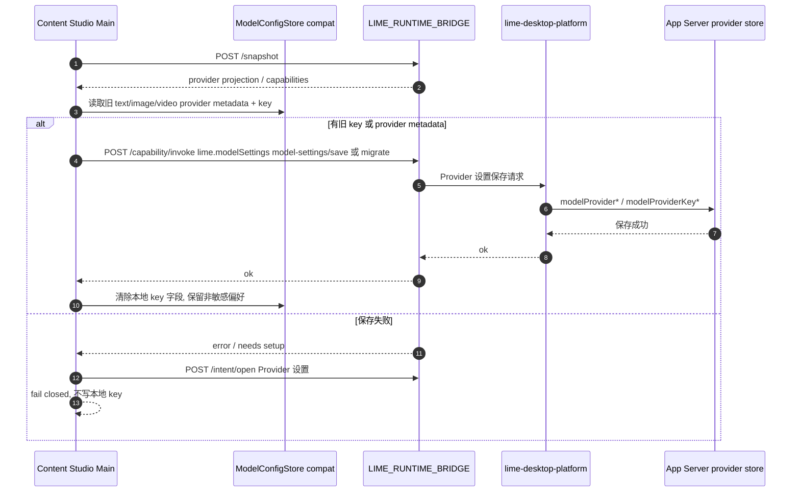

# content-studio 接入 Lime App Server

> 状态：current planning source
> 更新时间：2026-06-11
> 作用：定义 content-studio 接入 Lime App Server 的边界、改动点、目录落点、阶段顺序、阻塞点与验收口径。
> 关联：Lime 仓库 `internal/roadmap/appserver/consumer-integration.md`（独立 App 消费方案）、`architecture.md`（`ElectronClient` 路径）。

## 1. 结论

content-studio 已经是成熟 Electron 应用，接入 Lime App Server **不改业务 UI、不改 IPC 合同**，工作集中在 main 进程消费 Host Bridge / Capability Gateway、投影 App Server runtime facts，并保留 standalone/dev 的自托管 sidecar 验证能力。`agent:run` 仍保留 packaged external backend 兼容面；截图中的 `AI agents` / `agents 工作台` Prompt Agent 主链已切到 App Server `runtime` backend，Provider metadata、API Key 和 runtime DB 由 App Server provider store 统一拥有。旧客户端自带 runtime 已归为 `dead`。

核心思路：保持 renderer 和 preload 的调用面不变，只替换 main 进程里的执行后端；renderer 仍只接收既有 `AgentEvent` / `AgentPromptSession` 投影。平台宿主下，Content Studio 通过 `LIME_RUNTIME_BRIDGE` 调 `/snapshot`、`/capability/invoke`、`/intent/open`，由 `lime-desktop-platform` 作为 Host Kit、Capability Gateway、Provider 设置 UI 和 App Server sidecar owner。生产包必须携带 Lime `app-server` 与 packaged external backend，`APP_SERVER_BIN` 只允许本地开发 / 测试显式覆盖。`AI agents` 主链必须使用支持 `--backend runtime` 和 `--data-dir` 的 App Server 版本。

当前 App Server turn 主链已经抽出 `ContentStudioAgentRuntimeSessionGateway`，并固定安装 `@limecloud/agent-runtime-client@0.1.1`。本地 gateway 只封装 `agentSession/start`、`artifact/read` 以及现有 sidecar transport 适配；`startTurn/readThread/cancelTurn/respondAction/exportEvidence/nextEvent` 通过 `@limecloud/agent-runtime-client/sessionGateway` 的 `createAgentRuntimeClientFromSessionGateway(...)` 进入标准 `AgentRuntimeClient`。它不拥有 UI projection、Provider key 或工具状态机，也不能回退到无 scope `app-server-client`。

## 2. 现状锚点（已核实）

| 环节 | 位置 | 现状 |
| --- | --- | --- |
| 命令注册 | `src/main/ipc.ts:779-780` | `agent:run` / `agent:cancel` |
| 执行实现 | `src/main/services/appServerSidecarService.ts` | Prompt Agent 默认启动 App Server runtime backend；external backend 保留为 smoke / compat |
| 事件投影 | `src/main/ipc.ts:471` | `webContents.send('agent:event:${taskId}', event)` |
| preload 暴露 | `src/preload/index.ts` | `contextBridge.exposeInMainWorld('contentStudio', api)` |
| 类型契约 | `src/shared/types.ts` | `AgentEvent` / `RunTaskInput` |
| 打包 | `electron-builder.yml` | `extraResources` 已带 `resources/app-server`，运行时解析到 `process.resourcesPath/app-server` |

## 3. 边界声明

| 分类 | 对象 | 说明 |
| --- | --- | --- |
| `不改` | renderer 业务组件 | 业务 UI 暂不接 sidecar，仍使用既有 Agent 投影 |
| `不改` | `agent:run` / `agent:cancel` IPC 名、`agent:event:${taskId}` 事件名 | 合同稳定，内部委托 sidecar |
| `current` | `src/main/services/appServerSidecarService.ts` | sidecar newline-delimited JSON-RPC 连接、health、Prompt Agent runtime backend、agent run/cancel compat |
| `current` | `src/main/services/appServerAgentRuntimeGateway.ts` | standalone/dev App Server turn 主链的标准 runtime-client adapter；通过 `@limecloud/agent-runtime-client/sessionGateway` 包装现有 sidecar transport，本地只保留 `agentSession/start` 与 `artifact/read` 补充能力 |
| `current` | `src/main/services/appServerPromptAgentService.ts` | `AI agents` 工作台 Prompt Agent 主链；只传 provider/model preference，不传 key |
| `current` | `lime-desktop-platform` Host Kit / Capability Gateway / Provider 设置 UI / App Server sidecar owner | 平台宿主事实源，Content Studio 不复制平台设置和 sidecar lifecycle |
| `current` | 平台宿主 `LIME_RUNTIME_BRIDGE` -> `/snapshot`、`/capability/invoke`、`/intent/open` | Product App 与宿主通信合同 |
| `current` | App Server provider store + `--data-dir <platform userData>/app-server` | Provider metadata、API Key、runtime DB 唯一事实源 |
| `current` | `resources/app-server/current/app-server(.exe)` + `resources/app-server/backend/content-backend.mjs` | 内容工厂随包 App Server 资源事实源 |
| `已新增` | `appServer:health` / `appServer:smoke` | 试点 IPC，不替代 `agent:run` |
| `已切换` | `src/main/ipc.ts` agent 接线 | `agent:run` 默认走 App Server，`agent:cancel` 优先取消 App Server task |
| `compat` | packaged external backend / `ModelConfigStore` 本地 text/image/video key | smoke、媒体、通用文字旧链路和一次性迁移 source；不作为 `AI agents` runtime key source |
| `deprecated` | Prompt Agent 从 `ModelConfigStore.getTextApiKey()` 读 key 或通过 `backendEnv` 传 key | 已下线，不允许回流 |
| `dead` | 客户端自带 SDK runtime / 第二套 runtime adapter / Product App 保存 Provider key 作为 Agent Runtime key source / Provider key 双存 | 不再保留 fallback 或新功能入口 |
| `当前实现` | main 侧轻量 JSON-RPC transport + `ContentStudioAgentRuntimeSessionGateway` + `@limecloud/agent-runtime-client/sessionGateway` | 直接消费 sidecar transport，标准 lifecycle 由 `@limecloud/agent-runtime-client@0.1.1` 拥有；不得安装无 scope `app-server-client`，不得引入 Lime Rust workspace |

禁止方向（对齐 Lime `consumer-integration.md` §4）：

1. renderer 不直接 spawn sidecar。
2. renderer 不直接读写 App Server stdout。
3. 不把 Lime Rust workspace 拉进 content-studio 构建图。
4. 不复制 RuntimeCore / ExecutionBackend / AsterBackend。
5. Product App 不保存、不读取、不传递 Agent Runtime API Key；旧 key 只能作为迁移 source。
6. 平台宿主保存 Provider 设置失败时必须 fail closed，不得回退写本地 `ModelConfigStore` key 伪造成功。

## 4. 运行时路径

```text
平台宿主目标形态：
Renderer
  -> contentStudio.startAgentPromptSession / continueAgentPromptSession (preload, 不变)
  -> ipcMain agentPromptSessions:* (不变)
  -> AppServerPromptAgentService
  -> LIME_RUNTIME_BRIDGE /capability/invoke lime.agent
  -> lime-desktop-platform Capability Gateway
  -> app-server sidecar --stdio --backend runtime --data-dir <platform userData>/app-server
  -> RuntimeCore -> ExecutionBackend
  -> agentSession/event notification
  -> AgentPromptSession messages / executionEvents 投影

standalone/dev 过渡：
Renderer
  -> contentStudio.startAgentPromptSession / continueAgentPromptSession
  -> ipcMain agentPromptSessions:*
  -> AppServerPromptAgentService
  -> AppServerSidecarService.runPromptTurn
  -> app-server sidecar --stdio --backend runtime --data-dir <Content Studio userData>/app-server
  -> App Server provider store

legacy compat:
Renderer
  -> contentStudio.runAgentTask (preload, 不变)
  -> ipcMain 'agent:run' (不变)
  -> AppServerSidecarService.runAgent
  -> app-server sidecar --stdio --backend external
  -> webContents.send('agent:event:${taskId}') (事件名不变)
```

与现状对照：

```text
AI agents current:
  ModuleOutlet activeModule=agents
  -> AgentsWorkbench
  -> contentStudio.startAgentPromptSession / continueAgentPromptSession
  -> AgentPromptSessionStore
  -> AppServerPromptAgentService
  -> LIME_RUNTIME_BRIDGE /capability/invoke lime.agent
  -> lime-desktop-platform Capability Gateway
  -> app-server sidecar --backend runtime --data-dir <platform userData>/app-server
  -> agentSession/turn/start(providerPreference, modelPreference)
  -> App Server provider store

compat:
  ipcMain 'agent:run'
  -> AppServerSidecarService.runAgent
  -> app-server sidecar --backend external
  -> notification
  -> webContents.send('agent:event:...')
```

## 5. 目录落点

对齐 Lime `consumer-integration.md` §4 推荐接入点：

```text
content-studio
  src/main/services/platformHostBridgeClient.ts LIME_RUNTIME_BRIDGE /snapshot、/capability/invoke、/intent/open
  src/main/services/appServerSidecarService.ts  binary 解析 / spawn / JSON-RPC / runtime prompt turn / compat run / cancel / smoke
  src/main/services/appServerPromptAgentService.ts Prompt Agent -> App Server runtime provider/model handoff
  src/main/services/modelConfigStore.ts          旧 provider 设置兼容读取 + 平台宿主一次性迁移
  src/main/ipc.ts                              agent:run / agent:cancel 只走 App Server，appServer:* 试点 IPC
  src/preload/index.ts                         health / smoke facade，业务 agent facade 不变
  src/renderer/src/...                         不变
  resources/app-server/                        打包带入的 sidecar binary + manifest
```

## 6. 改动点明细

### 6.1 已新增 `appServerSidecarService.ts`：试点生命周期

main 进程职责（对齐 Lime `consumer-integration.md` §4）：

1. `resolveBinaryPath(...)`：按 `APP_SERVER_RESOURCES_DIR` / packaged `process.resourcesPath/app-server` → 显式开发测试 `APP_SERVER_BIN` override → repo resources 查找 sidecar，不硬编码用户路径。
2. `spawn` sidecar，完成 `initialize / initialized` 握手。
3. 临时生成 content-studio app policy，默认委托 packaged external backend，跑通 capability、turn、event、artifact 和 evidence。
4. 失败返回 explicit `ok: false` / `source: missing`，不伪造成功；生产包缺少随包 App Server 时必须暴露 blocked / missing。
5. Prompt Agent 主链使用 `--backend runtime` 并默认追加 `--data-dir <userData>/app-server`；external backend smoke 暂不追加 `--data-dir`，以免旧 sidecar 版本打断分发 smoke。

```ts
const result = await appServer.runSmoke();
// result.eventTypes includes message.delta and artifact.snapshot
// result.artifactRefs includes content-studio-draft-smoke
```

### 6.2 `runAgent(...)`：会话与 turn 映射

把现有 `RunTaskInput` 映射到 App Server 的 session + turn：

```ts
const session = await sidecar.request('agentSession/start', {
  appId: 'content-studio',
  workspaceId,
});

const turn = await sidecar.request('agentSession/turn/start', {
  sessionId: session.result.session.sessionId,
  turnId,
  input: { text: input.prompt },
  runtimeOptions: {
    capabilityId: 'content.draft.generate',
    stream: true,
    metadata: {
      selectedSkillSlugs: input.selectedSkillSlugs ?? [],
      permissionMode: input.permissionMode,
    },
  },
  queueIfBusy: true,
  skipPreSubmitResume: true,
});
```

main 进程会持续消费 `agentSession/event`，直到收到 `turn.completed` / `turn.failed` / `turn.canceled` 终态；禁止用短暂静默假定任务完成。Agent turn 等待默认 120s，可通过 `CONTENT_STUDIO_APP_SERVER_AGENT_TIMEOUT_MS` 或 `APP_SERVER_AGENT_TIMEOUT_MS` 覆盖。

2026-06-11 后，`runCapabilityTurn` 不再直接拼完整 turn 主链，而是委托 `ContentStudioAgentRuntimeSessionGateway`：

```text
AppServerSidecarService.runCapabilityTurn
  -> new ContentStudioAgentRuntimeSessionGateway(sidecar, timeoutMs)
  -> runContentStudioAgentRuntimeTurn(...)
  -> startSession / startTurn / nextEvent / readArtifact / exportEvidence
```

该 gateway 与 Lime 标准 `@limecloud/agent-runtime-client/sessionGateway` 的核心形状保持一致：

| 方法 | App Server current method | 形状要求 |
| --- | --- | --- |
| `startTurn` | `agentSession/turn/start` | 只提交 runtime intent，不生成 UI state。 |
| `readSession` | `agentSession/read` | 用于 hydration / repair，不直读数据库。 |
| `cancelTurn` | `agentSession/turn/cancel` | 失败直接向上抛出，不本地假完成。 |
| `respondAction` | `agentSession/action/respond` | 不乐观改 pending action，等待 runtime facts。 |
| `exportEvidence` | `evidence/export` | 缺 surface 时 fail closed，不伪造空 evidence。 |
| `nextEvent` | `agentSession/event` | 返回 JSON-RPC notification 形状，不能返回裸 runtime event。 |
| `nextRuntimeEvent` | 内部 helper | 仅供本仓库 drain loop 消费裸 `RuntimeEvent`，不是标准 client API。 |

当前已经接入 `@limecloud/agent-runtime-client/sessionGateway`；后续只能继续压薄本地 gateway 适配层，把它限制在 session 创建、artifact read 和 sidecar transport，不得继续扩展成第二套 runtime client。

### 6.3 `runPromptTurn(...)`：AI agents current 主链

`AI agents` 工作台不会走旧 packaged external backend 取模型 key。平台宿主下，Prompt Agent 优先通过 `LIME_RUNTIME_BRIDGE` 调 `lime.agent` capability；standalone/dev 下才用本地 `AppServerSidecarService.runPromptTurn` 启动 App Server runtime backend。两条路径都只读取非敏感模型 view，并提交 provider/model preference：

```ts
await hostBridge.invokeCapability('lime.agent', {
  workspacePath,
  prompt,
  permissionMode: 'ask',
  providerPreference: 'openai',
  modelPreference: 'gpt-4.1-mini',
  metadata: {
    agentSurface: 'prompt-workbench',
    operation: 'draft',
    textProtocol: 'openai-chat',
    textModel: 'gpt-4.1-mini',
  },
});
```

standalone/dev 过渡路径中，`AppServerSidecarService` 会启动：

```text
app-server --stdio --backend runtime --app-policy <temp policy> --data-dir <userData>/app-server
```

runtime sidecar 启动前会先执行 provider store 预检：`app-server --help` 必须包含 `--data-dir`，并且 `--stdio --backend unavailable --data-dir <tmp>` 下的 `modelProvider/list` 必须可用。预检失败时 `AI agents` runtime 主链 fail closed，旧 packaged external smoke binary 不能进入 Prompt Agent runtime。runtime sidecar env 会清理 `CONTENT_STUDIO_*KEY`、`OPENAI_API_KEY`、`ANTHROPIC_API_KEY`、`GEMINI_API_KEY`、`GOOGLE_API_KEY`、`LLM_API_KEY`、token、secret、password 类变量。Provider key 只能由 App Server provider store 解析。

### 6.3.1 `LIME_RUNTIME_BRIDGE` 与 Provider 设置迁移

平台宿主下，Content Studio main 进程通过 `LIME_RUNTIME_BRIDGE` 访问宿主：

```text
POST /snapshot
  -> host readiness、provider projection、model preference、capability 列表
POST /capability/invoke
  -> lime.modelSettings model-settings/save | migrate
  -> lime.agent Prompt Agent turn
POST /intent/open
  -> 打开平台 Provider 设置 / diagnostics / 应用中心意图
```

旧本地 Provider 设置迁移只允许走 `lime.modelSettings`：



约束：

1. `ModelConfigStore` 本地 key 在平台宿主下只是迁移 source，不是 Agent Runtime 凭证来源。
2. 迁移成功后不得双存 key；本地只允许保留 provider id、model、protocol 这类非敏感兼容偏好。
3. 迁移失败或平台 capability 不可用时必须 fail closed，并引导用户打开平台 Provider 设置；不能回退到本地 key 调 runtime。
4. Host Snapshot 不包含明文 key、token、secret；只包含 readiness、provider/model projection 和打开设置的 intent。

### 6.4 `ipc.ts`：agent 接线委托

`agent:run` 调用 App Server service，并把 `agentSession/event` notification 转成现有 `AgentEvent` 投影：

```ts
ipcMain.handle('agent:run', async (_event, input: RunTaskInput) => {
  const taskId = await appServer.runAgent(input, publish);
  return { taskId };
});
```

要点：

1. 事件 envelope 从 `agentSession/event` 映射到现有 `AgentEvent`（`assistant` / `tool` / `result` 等），保持 renderer 投影不变。
2. `agent:cancel` 映射到 `agentSession/turn/cancel`。
3. notification fanout 在 main 完成，renderer 只拿业务投影。

### 6.5 事件映射表

| App Server 公共事件 | content-studio `AgentEvent` | 说明 |
| --- | --- | --- |
| `turn.started` | 内部状态置 running | 可不直接投影 |
| `message.delta` | `{ type: 'assistant', text }` | 流式拼接 |
| `tool.started` / `tool.result` / `tool.failed` | tool 事件 | 按现有 UI 投影 |
| `action.required` | 走 `agentPromptSessions:respondAction` 类交互 | 需人工介入时 |
| `turn.completed` | `{ type: 'result', summary }` / `{ type: 'done' }` | 成功终态 |
| `turn.failed` / 任意 `*.failed` | `{ type: 'error', message }` | 失败终态，禁止继续发送 done |

## 7. 打包

对齐 Lime `consumer-integration.md` §5，`electron-builder.yml` 用 `extraResources` 带上 sidecar：

```yaml
extraResources:
  - from: resources/app-server
    to: app-server
    filter:
      - '**/*'
```

目录结构：

```text
resources/app-server/
  current/app-server
  darwin-arm64/app-server
  darwin-x64/app-server
  win32-x64/app-server.exe
  linux-x64/app-server
  app-server.release.json
  content-studio.policy.json
  backend/
```

运行时 binary 解析顺序：

1. `APP_SERVER_RESOURCES_DIR/current/app-server(.exe)` 或 `${platform}-${arch}/app-server(.exe)`：打包输入目录 / smoke 明确指定资源。
2. packaged `process.resourcesPath/app-server/current/app-server(.exe)` 或 `${platform}-${arch}/app-server(.exe)`：生产包主路径。
3. `APP_SERVER_BIN`：仅当 `CONTENT_STUDIO_ALLOW_APP_SERVER_BIN_OVERRIDE=1` 时启用，用于本地开发 / functional fake sidecar 测试；即使开启，仍不能抢占前两类资源路径。
4. repo dev fallback `resources/app-server/current/app-server(.exe)`：源码仓库本地验证。

生产必须从 manifest 选 artifact、校验 sha256，并把结果打包进 `resources/app-server`。正式包不依赖 `APP_SERVER_BIN`。

默认 backend 解析顺序：

1. `CONTENT_STUDIO_APP_SERVER_BACKEND_COMMAND`：显式覆盖，用于联调或替换 backend。
2. `APP_SERVER_RESOURCES_DIR/backend/content-backend.mjs`：资源目录 smoke / 打包输入目录验证。
3. packaged resources `app-server/backend/content-backend.mjs`。
4. repo dev fallback `resources/app-server/backend/content-backend.mjs`。

默认 backend 使用 `CONTENT_STUDIO_TEXT_*` / 通用 LLM env 调真实 HTTP 文本模型生成 Markdown artifact；缺少模型配置时返回明确失败，不伪造成功。

AI agents runtime backend data root：

1. `APP_SERVER_ARGS` 显式 `--data-dir` 优先。
2. `CONTENT_STUDIO_APP_SERVER_DATA_DIR` / `APP_SERVER_DATA_DIR` 可覆盖默认 data root。
3. Electron 主进程默认 `<userData>/app-server`。
4. Node-only smoke / functional 测试回退系统临时目录。

当前资源准备入口：

```bash
npm run app-server:prepare -- \
  --manifest /path/to/app-server.release.json \
  --resources-dir resources/app-server

APP_SERVER_RESOURCES_DIR=resources/app-server npm run smoke:app-server
```

`app-server:prepare` 会按当前平台选择 artifact，复制或下载 sidecar，校验 sha256，写入 `resources/app-server/current` 与 `resources/app-server/app-server.release.json`。

同平台 release artifact 写入 `current/` 前必须通过 runtime provider store 预检：`--help` 输出要包含 `--data-dir`，并且 `--stdio --backend unavailable --data-dir <tmp>` 下的 `modelProvider/list` 要返回成功。失败会 fail closed 并清理临时文件，避免旧 App Server binary 继续进入 release 资源。跨平台 artifact 因当前主机无法执行 binary，会标记 `runtimeProviderStore=skipped-cross-platform`；显式跳过开关只允许本地诊断，不作为正式 release 证据。

正式 release workflow 已串联：

```bash
APP_SERVER_RELEASE_MANIFEST=/path/or/url/app-server.release.json \
npm run app-server:prepare:release
```

GitHub release build 在 `prepare-oem-build.mjs` 前执行资源准备，并设置 `CONTENT_STUDIO_REQUIRE_APP_SERVER_RESOURCES=1`，强制 OEM 打包前检查：

```text
resources/app-server/current/app-server(.exe)
resources/app-server/app-server.release.json
resources/app-server/backend/content-backend.mjs
```

OEM builder config 同时保留原有 `resources -> resources`，并额外映射 `resources/app-server -> app-server`，确保运行时 `process.resourcesPath/app-server/...` 可解析 sidecar。`assert-oem-artifact-scope.mjs` 在 release 模式下也会检查最终产物包含 App Server binary、release manifest 和 packaged backend。

## 8. 阶段顺序

```text
阶段 A：client skeleton（不依赖 Lime 真实 backend）
  - 新建 AppServerSidecarService 轻量 JSON-RPC client
  - 本地用随包 resources 或显式 APP_SERVER_BIN override 指向 Lime debug binary
  - 跑通 initialize -> startSession -> startTurn -> event -> shutdown
  退出条件：已完成，agent:run 能产出事件并投影到 renderer

阶段 B：真实 Agent flow（依赖 Lime App Server P4）
  - Lime backend 已有 host-independent external backend seam
  - content-studio 已有 appServer:smoke 试点 IPC
  - AI agents Prompt Agent 默认走 App Server runtime backend + provider store
  - agent:run 保留 App Server external backend compat，旧客户端自带 runtime 已删除
  - packaged backend 已接入 resources/app-server/backend/content-backend.mjs
  - functional tests 覆盖 packaged backend 缺模型 error、echo artifact、真实 sidecar event projection、metadata / queue flags 透传、慢 backend cancel 不假完成、backend stderr crash error 投影、同一 service 下一任务恢复
  - app-server:backend:test 覆盖 OpenAI Chat / Anthropic Messages / Gemini GenerateContent 三种协议级请求与响应映射，本地 mock server 不依赖外网密钥
  - app-server:backend:live 提供发布前真实模型环境验收入口，要求真实 provider key，禁止 echo mode，成功条件是 packaged backend 产出 artifact.snapshot 和 turn.completed
  - AppServerSidecarService runtime path 内置 provider store 预检，阻断不支持 --data-dir / modelProvider/list 的旧 sidecar
  - app-server:runtime:live 提供真实 App Server runtime provider store 验收入口，要求 App Server resources / binary、独立 data-dir、providerPreference 和 modelPreference，拒绝 Product App key/token env
  - platform-host:runtime:live 提供真实 lime-desktop-platform 宿主验收入口，要求真实 LIME_RUNTIME_BRIDGE、lime.agent、provider/model preference、runtime events 和 artifact.snapshot
  退出条件：AI agents runtime backend 在支持 --data-dir 的真实 App Server resources + provider store 上跑通 app-server:runtime:live；真实 lime-desktop-platform 宿主下跑通 platform-host:runtime:live；app-server:backend:live 在受控发布环境用真实生产密钥 / 真实网络模型跑通并留存结果，更接近生产环境的长流式输出压测和带退避策略的自动 restart / retry 跑通

阶段 C：打包与 CI 同步
  - electron-builder extraResources 带 sidecar
  - app-server:prepare 已能按 manifest 下载 / 复制、校验 sha256、放入 resources/app-server/current
  - app-server:prepare 对同平台 artifact 增加 runtime provider store gate，阻断不支持 --data-dir / modelProvider/list 的旧 binary
  - resources smoke 已能通过 APP_SERVER_RESOURCES_DIR 验证 packaged resources 路径
  - runtime resolver 已固定 packaged resources 优先于 APP_SERVER_BIN override
  - CI / release verify job 已覆盖 app-server:prepare:test 与 app-server:backend:test
  - release build 已在 OEM 打包前串联 app-server:prepare:release，并检查最终产物 App Server 资源
  - 2026-06-06 npm run dist:mac 通过，zip / DMG 分发包均包含 app-server sidecar、release manifest 和 packaged backend；只读挂载 DMG 后用镜像内 app-server 资源跑通 smoke
  退出条件：已完成；后续只补真实生产环境模型与更强生命周期验收

阶段 D：旧链路下线
  - 旧客户端自带 runtime 已删除，后续只补治理扫描和生产强验证
  - Prompt Agent 本地 key/env path 已删除
  - 图片、视频、视觉和通用文字 provider key path 仍按 compat 单独迁移
  - verify:lime-agent 已新增，阻断公开平台保存入口、Prompt Agent key/env 回流、第二套 runtime / SDK、共享 AgentUI 依赖缺失和 agents 内部文案回流
  退出条件：无旧 runtime import、Prompt Agent `getTextApiKey` 回流、旧协议名或废弃环境变量残留；真实 lime-desktop-platform 宿主联调留证后再把 standalone 自托管 runtime 降为仅开发用途
```

## 9. 本地开发

对齐 Lime `consumer-integration.md` §6：

```bash
# 默认验证仓库 resources/app-server/current/app-server
npm run smoke:app-server

# 验证 release manifest -> resources/current -> resources smoke
npm run app-server:prepare -- --manifest /path/to/app-server.release.json
APP_SERVER_RESOURCES_DIR=resources/app-server npm run smoke:app-server

# AI agents runtime 主链 release gate，要求 provider store App Server
CONTENT_STUDIO_APP_SERVER_DATA_DIR=/tmp/content-studio-app-server-data \
CONTENT_STUDIO_RUNTIME_PROVIDER_PREFERENCE=<providerId> \
CONTENT_STUDIO_RUNTIME_MODEL_PREFERENCE=<modelId> \
npm run app-server:runtime:live

# 显式指向 Lime 本地 debug sidecar，仅开发 / 测试
CONTENT_STUDIO_ALLOW_APP_SERVER_BIN_OVERRIDE=1 \
APP_SERVER_BIN=/path/to/app-server \
npm run smoke:app-server

# 可选：显式覆盖 external backend command
CONTENT_STUDIO_ALLOW_APP_SERVER_BIN_OVERRIDE=1 \
APP_SERVER_BIN=/path/to/app-server \
CONTENT_STUDIO_APP_SERVER_BACKEND_COMMAND=/path/to/backend \
npm run start

# 默认 packaged backend 使用真实文本模型配置
CONTENT_STUDIO_TEXT_PROTOCOL=openai-chat \
CONTENT_STUDIO_TEXT_API_KEY=... \
npm run start

# AI agents runtime 主链要求 App Server provider store 已配置
CONTENT_STUDIO_APP_SERVER_DATA_DIR=/path/to/app-server-data \
CONTENT_STUDIO_ALLOW_APP_SERVER_BIN_OVERRIDE=1 \
APP_SERVER_BIN=/path/to/app-server \
npm run start

# 真实平台宿主联调，必须由 lime-desktop-platform 提供 LIME_RUNTIME_BRIDGE
npm run platform-host:runtime:live -- --provider <providerId> --model <modelId>
```

标准包依赖已经固定：

1. `package.json` 固定 `@limecloud/agent-runtime-client: 0.1.1`，不使用 `^` 漂移、`file:`、本机绝对路径、tarball 临时路径或 `npm link` 作为完成证据。
2. `package-lock.json` 必须解析到 `https://registry.npmjs.org/@limecloud/agent-runtime-client/-/agent-runtime-client-0.1.1.tgz`，并由它传递依赖 `@limecloud/app-server-client: 1.66.0`。
3. `appServerAgentRuntimeGateway.ts` 必须从 `@limecloud/agent-runtime-client/sessionGateway` 导入 `createAgentRuntimeClientFromSessionGateway`，把现有 sidecar gateway 包装为标准 `AgentRuntimeClient`。
4. `nextEvent()` 必须继续返回 `agentSession/event` notification，不能为适配本地 drain loop 改成裸 event。
5. `verify:lime-agent` 已增加标准包导入和 lockfile 守卫，确认产品 runtime client 真实来自 `@limecloud/agent-runtime-client`。

## 10. 验收口径

1. IPC 合同稳定：`agent:run` / `agent:cancel` 命令名与 `agent:event:${taskId}` 事件名不变。
2. renderer 零改动：业务组件和 preload 调用面不触及。
3. main 委托 sidecar：`agent:run` 默认走 App Server，不再直接调客户端自带 runtime，也不保留显式 fallback。
4. 不 import Lime Rust crate：当前仅依赖 sidecar binary、main 进程 JSON-RPC transport 与 `@limecloud/agent-runtime-client` 标准 facade；不得引入无 scope `app-server-client`。
5. sidecar 被 pin：生产包从 manifest 选 artifact 并校验 sha256。
6. 生命周期完整：main 能 spawn / initialize / cancel / shutdown / restart。
7. renderer 只拿投影：不直接 spawn sidecar、不读 stdout。
8. `AI agents` Prompt Agent 不读取、不传递 Product App 本地模型 API Key。
9. `agentSession/turn/start` 包含 `runtimeOptions.providerPreference` 和 `runtimeOptions.modelPreference`，不包含 `apiKey` / `token` / `secret`。
10. runtime sidecar data root 不默认落到 Existing Lime DB。
11. `npm run verify:lime-agent` 通过，阻断 Prompt Agent key/env、公开平台模型保存和第二套 runtime 回流。
12. `npm run app-server:runtime:live` 在缺真实 runtime source / data-dir / providerPreference / modelPreference 时 fail closed；在真实 provider store ready 环境中必须产出 `turn.completed` 和 `artifact.snapshot`。
13. `npm run platform-host:runtime:live` 在缺真实 `LIME_RUNTIME_BRIDGE` 时 fail closed；在真实 `lime-desktop-platform` 宿主中必须产出 `mode=lime-desktop-platform`、`sessionId`、`turnId`、runtime events 和 `artifact.snapshot`。
14. `npm run app-server:prepare:test` 必须覆盖同平台 provider store gate：支持 `--data-dir` 且暴露 `modelProvider/list` 的 artifact 才能进入 release resources；不支持的 artifact 被拒绝。
15. `AppServerSidecarService.runPromptTurn` 必须在启动 `--backend runtime` 前执行同等 provider store gate；旧 `resources/app-server/current/app-server` 只能保留在 packaged external backend smoke / compat 路径。
16. `ContentStudioAgentRuntimeSessionGateway.nextEvent()` 必须保留标准 `agentSession/event` notification 形状；内部如需裸 runtime event，只能通过 `nextRuntimeEvent()` helper。

### 10.1 2026-06-06 macOS 分发验证

已完成：

- `npm run dist:mac` 通过，生成 `release/布谷AI-0.18.0-arm64.dmg`、`release/布谷AI-0.18.0-arm64-mac.zip` 和对应 blockmap。
- `unzip -l release/布谷AI-0.18.0-arm64-mac.zip` 确认 zip 内包含 `Contents/Resources/app-server/current/app-server`、`Contents/Resources/app-server/app-server.release.json` 和 `Contents/Resources/app-server/backend/content-backend.mjs`。
- `hdiutil verify release/布谷AI-0.18.0-arm64.dmg` 通过，校验和有效。
- 只读挂载 DMG 后，`APP_SERVER_RESOURCES_DIR=/tmp/content-studio-dmg-verify/布谷AI.app/Contents/Resources/app-server npm run smoke:app-server` 通过，返回 `source=resources`、`protocol=appserver.v0`、`content.draft.generate`、`message.delta`、`artifact.snapshot`、`content-studio-draft-smoke`、evidence events 和 evidence artifacts。
- `npm run app-server:backend:live` 在无真实 provider key 环境下按预期失败，错误为缺少真实 provider config，且 echo mode 不允许；这证明 live gate 不会在无 Key 环境伪造成发布通过。

当前判断：

- macOS 分发包已经证明 Lime App Server 被打包进内容工厂，且镜像内 sidecar 可以从 packaged resources 运行完整 smoke。
- 发布级真实模型验收仍必须在受控密钥环境运行 `npm run app-server:backend:live`，并留存真实 provider 输出证据。

### 10.2 2026-06-10 平台宿主 runtime smoke

已完成：

- 在 `lime-desktop-platform` 侧运行 `npm run smoke:product-app-runtime-live`，通过参数显式传入 content-studio root、zhongcao root 和 App Server binary；命令不写入仓库内的本机绝对路径。
- 2026-06-10 复跑通过时使用 Lime 主仓库 `/Users/coso/Documents/dev/ai/aiclientproxy/lime/lime-rs/target/debug/app-server`，该 binary 支持 `--backend runtime`、`--data-dir` 和 `modelProvider*` / `modelProviderKey*` provider store 方法。`content-studio/resources/app-server/current/app-server` 当前随包版本不支持 `--data-dir`，只能作为旧 packaged external backend smoke 证据，不能作为平台 provider store live 证据。
- smoke 返回 `mode=lime-desktop-platform`、`source=discovery`，证明 Content Studio 作为 Product App 通过真实平台宿主发现与调用 runtime bridge。
- Content Studio `platform-host:runtime:live` 收到 `message.delta`、`artifact.snapshot`、`turn.completed`，artifact 标题为 `平台 Runtime 生成草稿`。
- 同一平台 smoke 同步覆盖 `zhongcao` runtime projection，证明 Host Bridge / Capability Gateway / App Server sidecar owner 不只服务单一业务 App。
- smoke 输出的 provider id 来自 App Server provider store 运行时生成的 `custom-*` provider，Content Studio 只接收 provider/model preference 与 runtime facts，不接收或保存 Provider Key。

当前判断：

- `agents` 主链已经跑通真实 `lime-desktop-platform` 宿主、真实 App Server JSON-RPC lifecycle 和 external fixture 的端到端事件投影。
- 这次证据不是“真实上游 LLM Provider live”。发布前仍必须在受控 provider store 与真实模型网络环境中补跑 `npm run app-server:runtime:live` 或平台侧 live provider smoke，并留存真实 Provider 输出证据。
- 平台 JSON-RPC client 已补齐请求超时和 sidecar 退出时 pending request 拒绝，平台 renderer 不再因为 App Server 能力缺失或 binary 参数不匹配永久停在初始化页；失败会 fail closed 并输出具体 sidecar 错误。

### 10.3 2026-06-10 AgentUI / runtime facts 投影验证

已完成：

- `src/main/services/appServerPromptAgentService.ts` 已修正平台 runtime event 映射顺序，`tool.failed` 不再被通用失败分支误归类成 `model.failed`，而是保留为 Tool UI fact。
- `tests/functional/content-flow.test.mjs` 的“平台宿主下 Prompt Agent 优先走 lime-desktop-platform lime.agent bridge”覆盖 `tool.failed`、`evidence.changed`、`action.required`、`artifact.snapshot`，断言这些 facts 保持各自 `eventClass` / `kind`，且 `tool.failed` 不会变成 `model.failed`。
- `tests/e2e/electron-app.spec.mjs` 新增“agents 将平台运行事实投影到 AgentUI 面板而不是普通正文”，fake platform Host Bridge 返回工具失败、证据更新、人工待办和交付物事件后，页面必须通过共享 AgentUI 投影显示摘要、Tool UI、Evidence、Human action 和 Artifact 计数；普通消息气泡和草稿正文不得承载这些 runtime facts。
- 同一 E2E 覆盖人工动作交互：点击 `action.required` 的“补输入源”后跳转到真实输入源工作台，并写回 `action.resolved`。
- 2026-06-11 `AI agents` 工作台和通用 `AgentSessionPanel` 已统一通过 `AgentUiProjectionSurface` 渲染；该 surface 集中组合已发布 `AgentTimeline` / `RuntimeFactsPanel` / `AgentRuntimeRefLists`，并输出 `.agent-ui-projection`、`.agent-ui-main`、`.agent-ui-sidecar` 标准 DOM surface。
- `scripts/lime-agent-boundary-audit.mjs` 已补守卫：`AgentsWorkbench` / `AgentSessionPanel` 只能消费 `AgentUiProjectionSurface`，共享 AgentUI primitives 只能在该 surface 内组合；`tests/functional/content-flow.test.mjs` 的边界审计负向 fixture 覆盖该回流。
- `scripts/lime-agent-boundary-audit.mjs` 已补守卫：`ContentStudioAgentRuntimeSessionGateway.nextEvent()` 必须返回 `AppServerJsonRpcMessage` / `agentSession/event` notification，`drainRuntimeEvents` 只能通过 `nextRuntimeEvent()` 消费裸 runtime event，防止未来接入标准 runtime-client 时事件形状漂移。

验证命令：

```bash
npm run test:functional -- --test-name-pattern "平台宿主下 Prompt Agent 优先走 lime-desktop-platform lime.agent bridge"
npm run test:functional -- --test-name-pattern "Lime Agent 边界审计会阻断 runtime/key/UI 协议回流"
npm run test:e2e -- --grep "agents 入口页启动后会绑定真实图片输入源并进入线程|agents 默认不自动打开历史会话或显示模型选择|agents 文案能力能发起文章、标题和脚本协作会话|agents 会阻断 Lime 回显内部 Prompt 片段且不展示内部事实|agents 将平台运行事实投影到 AgentUI 面板而不是普通正文|模型设置入口使用 lime-desktop-platform 公共 Provider 设置页"
npm run verify:lime-agent
```

当前判断：

- `agents` UI 已验证为消费 runtime projection facts，并通过 `AgentUiProjectionSurface` 统一进入共享 AgentUI surface，不再依赖普通助手正文承载工具、审批、证据或交付物事实。
- 这仍不替代真实 Provider live；真实模型输出和 provider store key 解密链路仍需在受控环境补跑 `app-server:runtime:live` / `platform-host:runtime:live`。
