# 布谷AI内容工厂 Ontology 架构与流程图

更新时间：2026-05-28  
状态：Draft

## 1. 设计结论

Ontology 是 Content Studio 的内容工程中间层，不是独立图数据库产品。它位于输入源 / 知识库和场景库 / Prompt 工作台 / SOP / 素材库之间，负责把原始资料变成可审核、可追溯、可复用的概念、关系、主张、证据、约束和覆盖矩阵。

在此之上，Operational Ontology 把品牌舆论和获客动作纳入同一操作层：Signal 触发 Objective，Objective 组合 CampaignCell 和 ResourceBundle，标准 ActionType 经过 DecisionGate 后执行，并通过 ActionLog 和 FeedbackLoop 回写 Ontology。

内部事实源优先落在 `.content-studio/` 的本地 JSON 文件。对外发布时导出 Agent Knowledge v0.7.2 ontology-aware 知识包；互操作场景再导出 JSON-LD / RDF / Turtle。

## 2. 总体架构图

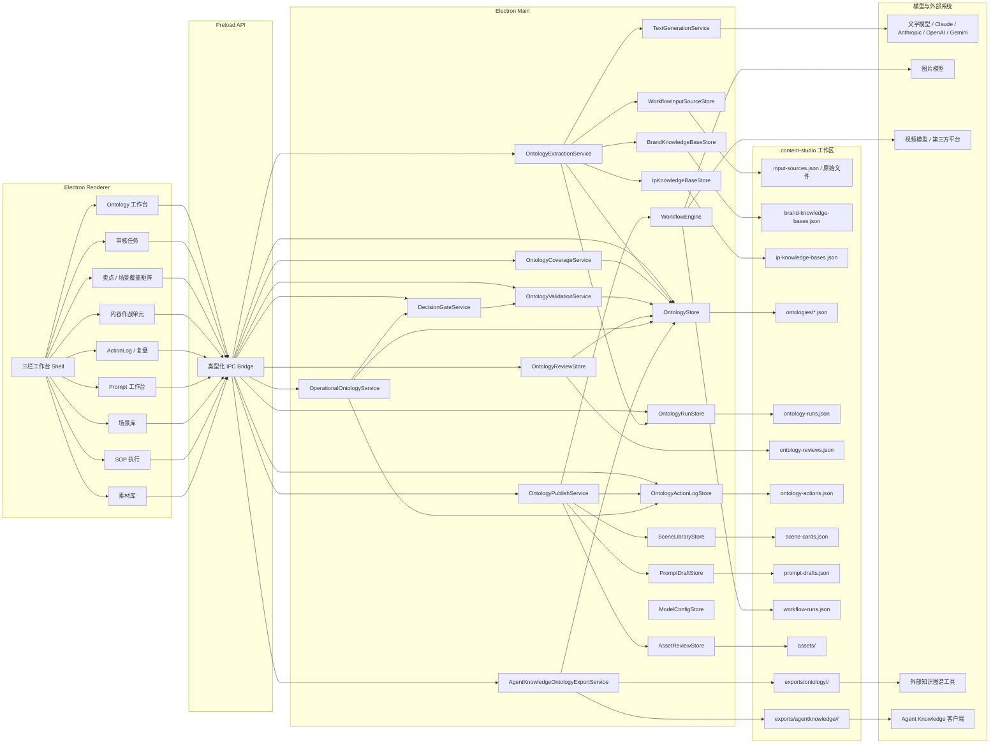

## 3. 事实源边界图

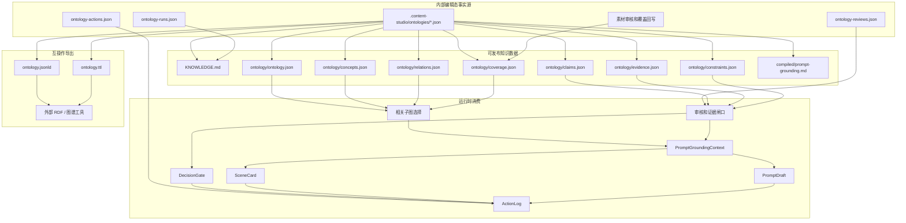

边界规则：

- `.content-studio/` 是可编辑事实源。
- Agent Knowledge 知识包是审核后的发布形态。
- `ontology/` 目录只保存结构化数据，不保存 workflow、工具调用、脚本或 prompt 指令。
- Prompt 工作台只加载相关子图，不注入完整 Ontology。
- Operational Action 必须写入 ActionLog；ActionLog 证明行动发生过，不证明产品事实。

## 4. 构建流程图

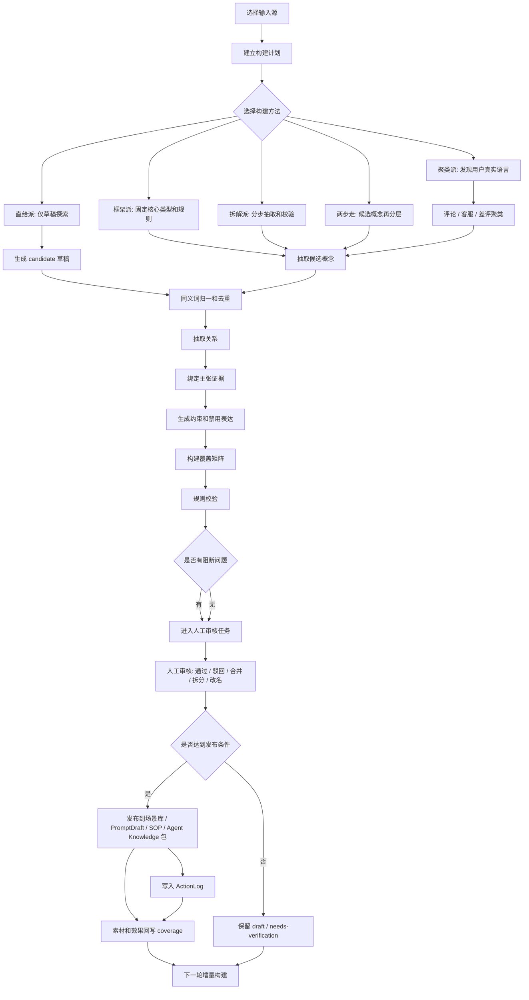

## 5. 内容生产闭环图

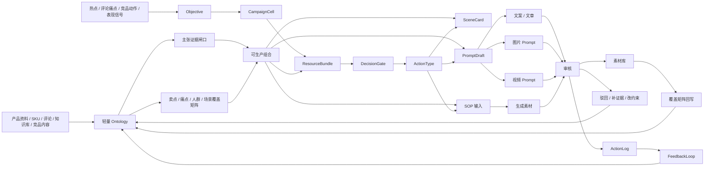

## 6. 构建时序图

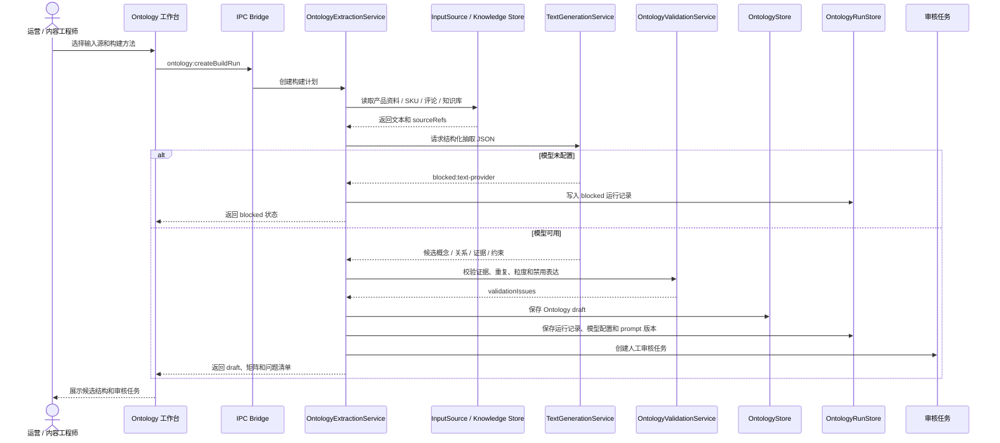

## 7. 审核发布时序图

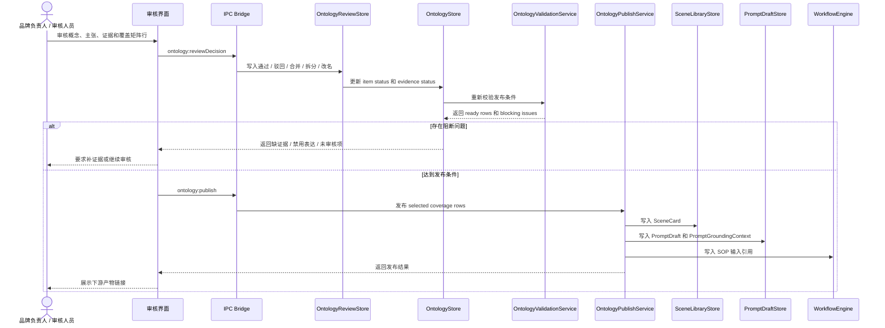

## 8. Agent Knowledge 包发布和消费时序图

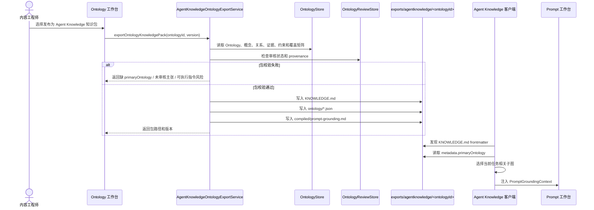

## 9. 状态流转图

### 9.1 Ontology item 状态

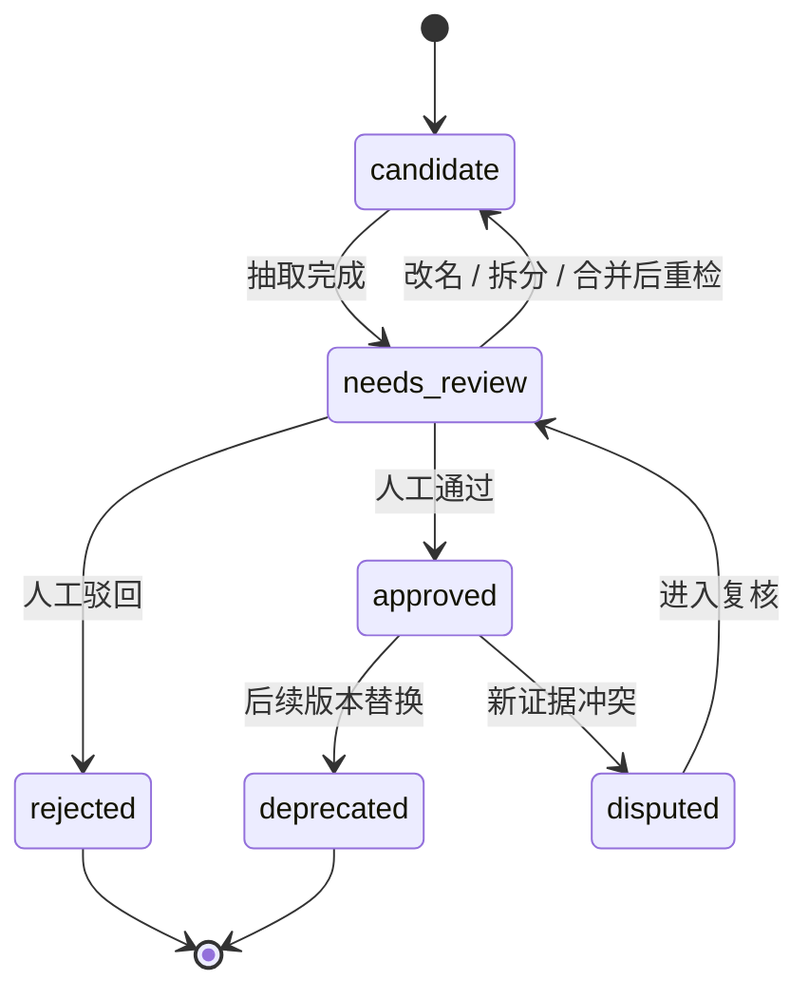

### 9.2 覆盖矩阵行状态

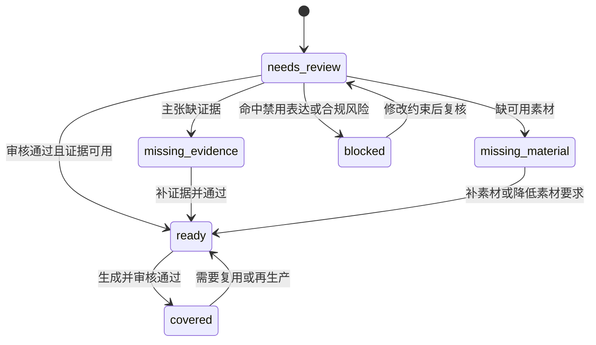

### 9.3 ActionLog 状态

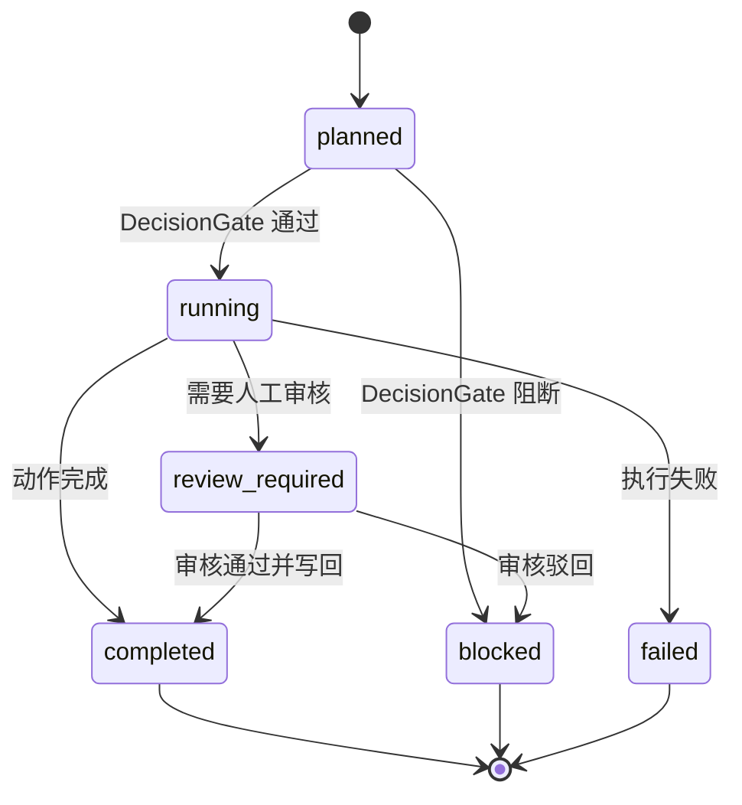

## 10. 动态内容作战时序图

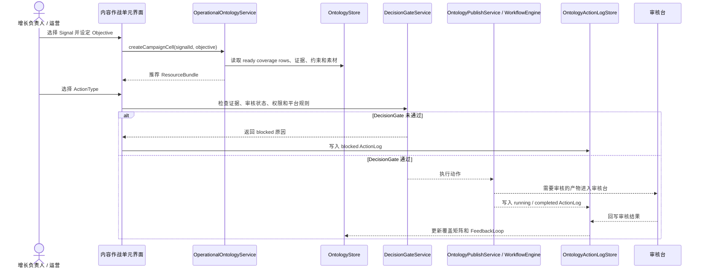

## 11. MVP 架构边界

| 进入 MVP | 不进入 MVP |
| --- | --- |
| 本地 JSON Ontology Store。 | 云端图数据库。 |
| 候选概念、关系、证据、约束和覆盖矩阵。 | 完整 OWL 编辑器。 |
| 最小 ActionLog。 | 多 CampaignCell 协同和复杂排班。 |
| Agent Knowledge v0.7.2 知识包导出。 | 将 `ontology/` 作为 Skill 或 workflow 执行目录。 |
| PromptGroundingContext 子图选择。 | 把完整 Ontology 直接塞进 Prompt。 |
| 人工审核和 blocked 状态。 | 无人值守自动发布。 |
| DecisionGate 规则雏形。 | 舆论操控、刷量、自动发帖。 |
| JSON-LD / RDF / Turtle 后置导出。 | SPARQL 作为 MVP 查询引擎。 |
