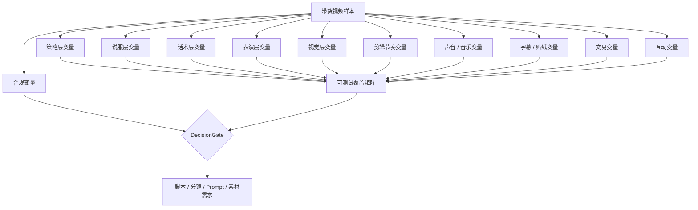
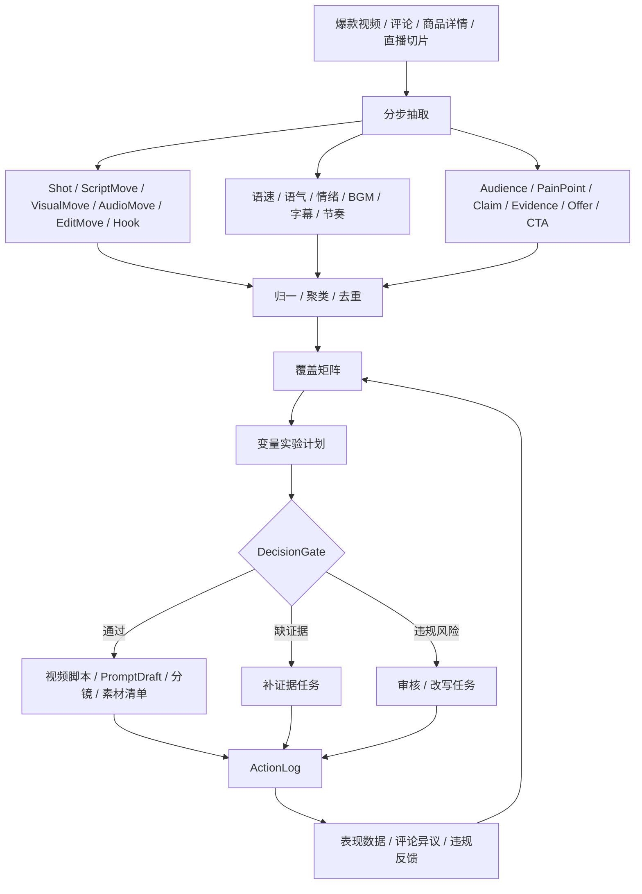
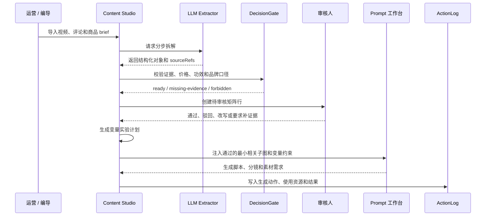

# 抖音带货爆款视频拆解的 Ontology 方法论研究

更新时间：2026-05-28  
状态：Research Draft

## 1. 研究结论

这套 Ontology 方法论可以用于抖音带货爆款视频拆解，但目标不是“复制爆款”或规避平台审核，而是把高表现视频拆成可验证、可组合、可复盘的内容生产对象：

```text
爆款视频 / 评论 / 商品详情 / 直播间信号
-> 镜头结构 / 话术结构 / 卖点主张 / 证据 / 风险表达
-> Hook / Audience / PainPoint / Claim / Evidence / Demo / Offer / CTA
-> 节奏 / 语气 / 情绪 / 语速 / BGM / 字幕 / 剪辑 / 镜头 / 场景 / 互动变量
-> 八大人群 / O-5A 阶段 / 内容偏好 / 购买偏好 / 基础属性
-> 人群 x 痛点 x 卖点 x 场景 x 钩子 x 证据 x 视听表达 x 优惠 x CTA 覆盖矩阵
-> PromptDraft / 视频脚本 / 分镜 / 素材清单 / 审核任务
-> 发布后表现 / 评论异议 / 成交反馈 / 违规反馈
-> Ontology 版本更新
```

它对布谷AI内容工厂的作用是：把“看见一个爆款后凭感觉模仿”升级为“拆解结构、保留证据、识别风险、批量生成可审核变体、按数据回写”。这和前面讨论的 Operational Ontology 一致：每个运营、编导、投手、审核人和 Agent 都可以是一个内容作战单元，围绕实时信号快速组合资源，但所有行动必须受证据和平台规则约束。

## 2. 资料边界

本研究参考了公开平台规则、TikTok Shop 官方政策和电商内容研究。由于抖音电商国内规则会持续更新，落地时必须以抖音电商学习中心、巨量平台和店铺后台展示的最新规则为准。

可稳定抽象出的规则约束：

- 内容、短视频、直播、标题、封面、字幕、口播、商品链接和商品详情页必须一致。
- 商品功能、效果、价格、品牌、规格、产地、售后、认证和奖项主张必须可证明。
- 不能做夸大、虚假、恶意比较、科学上不成立或超出商品范围的效果承诺。
- 价格、优惠和赠品需要说明适用条件，不能制造低价错觉。
- 不能把爆款拆解变成虚假互动、刷量、搬运抄袭、伪造体验或规避审核。

## 3. 为什么爆款拆解需要 Ontology

传统拆解通常会产出“3 秒钩子、痛点、卖点、转化话术”这类笔记，但很难进入可复用生产系统：

| 常见问题 | Ontology 处理方式 |
| --- | --- |
| 拆解结论依赖分析师经验。 | 用固定对象模型承接 Hook、Claim、Evidence、VisualMove、Offer 和 CTA。 |
| 一条爆款只能复制一条脚本。 | 抽成覆盖矩阵后可以按人群、痛点、场景和证据组合生成变体。 |
| 卖点夸张但不知道能不能用。 | `Claim` 必须绑定 `Evidence` 和 `DecisionGate`。 |
| 爆款结构和品牌事实脱节。 | 所有主张回查产品详情、知识库、素材证据和禁用表达。 |
| 复盘只看播放量。 | 用 `ActionLog` 记录脚本来源、矩阵组合、投放对象、数据结果和评论异议。 |
| 趋势变化快。 | 用 `Signal -> Objective -> ResourceBundle -> ActionLog` 做动态编组。 |

### 3.1 X 开源推荐算法对我们的启发

X / Twitter 在 2023 年开源了推荐系统的大量代码和说明。它不能直接告诉我们“抖音如何分发”，也不能替代抖音电商的数据后台，但它公开了一个成熟内容推荐系统的工程骨架：

```text
Candidate Sources
-> Feature Hydration
-> Scoring / Ranking
-> Heuristics / Filters
-> Mixing
-> Serving / Feedback / Logging
```

对布谷有用的不是具体权重，而是这套分层思想。我们可以把它转成内容工厂内部的“爆款机会发现和脚本实验排序”框架：

| X 推荐系统概念 | X 的含义 | 布谷可复用方式 |
| --- | --- | --- |
| `Candidate Sources` | 从关注网络、搜索索引、图遍历、相似兴趣和推荐服务里取候选内容。 | 从竞品爆款、评论痛点、商品知识库、素材库、直播间切片、搜索词和热点里取候选选题 / 角度 / 脚本。 |
| `Feature Hydration` | 给候选内容补齐大量用户、内容、社交、图谱和交互特征。 | 给每个候选脚本补齐人群、O-5A 阶段、卖点、证据、节奏、语气、BGM、字幕、Offer、风险和素材可用性特征。 |
| `Ranking` | 用模型预测多种互动概率，再把候选排序。 | 先用规则分和轻量模型分排序：证据充分度、人群匹配、素材可得性、历史表现、风险等级、创新度和生产成本。 |
| `Heuristics / Filters` | 做可见性过滤、作者多样性、内容平衡、去重、疲劳控制和已看内容移除。 | 做合规闸口、品牌闸口、重复角度去重、人群 / 卖点覆盖平衡、同质化疲劳控制和已发布内容排除。 |
| `Mixing` | 把推文、广告、关注推荐、提示等混合成最终 Feed。 | 把短视频脚本、直播预热视频、图文种草、商品卡、私域跟进话术和素材补采任务混排成内容作战队列。 |
| `Feedback` | 用用户行为和负反馈继续优化。 | 用播放、完播、商品点击、评论异议、成交、退款和违规反馈回写 Ontology。 |

这对我们最关键的判断是：内容工厂不要只做“生成脚本”，而要做一个小型内容推荐 / 实验系统。系统每天应该从多个来源召回候选机会，补齐 Ontology 特征，排序成生产队列，经过 DecisionGate，再把结果回写。

可以落成一个内部服务模型：

```text
OpportunityCandidateSource
-> OntologyFeatureHydrator
-> ScriptVariantRanker
-> DecisionGateFilter
-> ContentWorkQueueMixer
-> ActionLog / FeedbackLoop
```

MVP 不需要训练神经网络。第一版可以用可解释评分：

| 评分项 | 说明 |
| --- | --- |
| `audienceFitScore` | 是否匹配八大人群、O-5A 阶段和当前目标。 |
| `evidenceReadinessScore` | 主张是否有可发布证据。 |
| `contentNoveltyScore` | 是否避免重复脚本、重复 Hook 和重复素材。 |
| `materialAvailabilityScore` | 素材库是否已有必要镜头、图片、演示和证明。 |
| `commerceClarityScore` | SKU、价格、优惠、CTA 和商品页是否清楚一致。 |
| `riskPenalty` | 违规、夸大、无证据、价格模糊和品牌口径风险扣分。 |
| `historicalLiftScore` | 相似人群、相似卖点和相似变量组合的历史表现。 |
| `productionCostPenalty` | 拍摄、审核、素材补采和改稿成本扣分。 |

这也解释了为什么 Ontology 必须保存变量和日志：没有结构化特征，就无法排序；没有 ActionLog，就无法知道哪一次变化带来了表现变化；没有 DecisionGate，就会把“高互动”误当成“可发布”。

## 4. 爆款变量字典

爆款视频不是一个“脚本公式”，而是一组内容变量、视听变量、交易变量和平台变量在特定人群上的组合。Ontology 的价值是把这些变量从经验口头禅变成可枚举、可打标、可测试、可复盘的数据。

### 4.1 变量分层



### 4.2 策略层变量

| 变量 | 枚举方向 | 拆解问题 |
| --- | --- | --- |
| `ContentObjective` | 种草、转化、引流直播、解释异议、老客复购、品牌信任。 | 这条视频主要让用户做什么？ |
| `FunnelStage` | 认知、兴趣、比较、决策、下单、复购。 | 用户处于购买链路哪一段？ |
| `VideoRole` | 主推款、测款、清库存、直播预热、达人素材、售后解释。 | 视频在生意里承担什么任务？ |
| `ProductCategory` | 标品、非标、功效型、体验型、审美型、低价冲动型、高客单决策型。 | 品类天然适合什么说服方式？ |
| `AudienceSegment` | 新手、专家、预算敏感、效率导向、颜值导向、风险规避、送礼人群。 | 说给谁听？ |
| `DouyinCommerceCrowd` | Z 世代、新锐白领、精致妈妈、资深中产、都市银发、都市蓝领、小镇青年、小镇中老年。 | 目标落在哪个电商八大人群？ |
| `O5AStage` | O 机会、A1 了解、A2 吸引、A3 问询 / 种草、A4 行动 / 购买、A5 拥护 / 复购。 | 用户和品牌关系到哪一步？ |
| `AudienceSource` | 内容触达、内容兴趣、新人粉丝、老粉、商品展示、商品兴趣、首购、复购。 | 人群来自内容链路还是交易链路？ |
| `UseContext` | 时间、地点、人物、任务、情绪、消费场景。 | 用户何时何地会用？ |
| `CompetitiveFrame` | 替代旧方案、避坑同类、升级款、平替款、组合方案。 | 和什么方案比较？ |
| `TrendContext` | 平台热点、品类热点、节日节点、价格节点、达人话题、评论热词。 | 借了什么趋势？ |

### 4.3 抖音电商八大人群维度

“八大人群”不是简单的人口统计标签，而是内容策略、货品策略、价格策略和信任机制的组合约束。落地时必须结合电商罗盘 / 巨量云图里的真实画像、购买偏好、内容偏好和 O-5A 阶段校准，不能直接按刻板印象生成内容。

| 人群 | 典型关注 | 视频变量倾向 | 商品 / Offer 倾向 | 风险 |
| --- | --- | --- | --- | --- |
| `gen-z` Z 世代 | 新鲜感、表达自我、兴趣圈层、潮流话题、互动感。 | 快节奏、强视觉、趋势 BGM、梗化 Hook、弹幕感字幕、系列内容。 | 新品、联名、颜值款、轻量试错、低门槛优惠。 | 过度装年轻、硬蹭梗、信息不真实会被快速反感。 |
| `emerging-white-collar` 新锐白领 | 效率、品质、体面、悦己、性价比和精致生活平衡。 | 讲清价值、场景代入、专业但不端着、通勤 / 办公 / 租房场景。 | 组合装、提升效率、轻奢平替、会员权益。 | 只讲低价会削弱品质感；信息过载会降低决策效率。 |
| `refined-mom` 精致妈妈 / 宝妈 | 家庭健康、安全、成分、儿童 / 全家适用、时间管理。 | 温和语气、真实家庭场景、步骤清楚、证据前置、风险解释。 | 安全背书、检测报告、售后保障、套装囤货。 | 功效、儿童、健康相关主张必须强证据，不能夸大。 |
| `affluent-middle-class` 资深中产 / 新中产 | 品质、审美、专业背书、长期价值、服务体验。 | 克制节奏、质感画面、专业解释、品牌故事、细节特写。 | 高客单、品质升级、专属服务、长期使用价值。 | 低质感素材和强促销口吻会伤害信任。 |
| `urban-silver` 都市银发 | 健康、便利、信任、售后、家人推荐、清晰理解。 | 语速适中、字幕清楚、步骤可见、真人演示、少梗少跳切。 | 简单套餐、售后明确、易用设计、家人代购理由。 | 字幕太小、节奏太快、功能说不清会造成理解断裂。 |
| `urban-blue-collar` 都市蓝领 | 实用、耐用、省钱、省事、即时收益、工作 / 生活高频场景。 | 直接讲痛点、强演示、价格清楚、对比明显、口语化表达。 | 高性价比、耐用、刚需、包邮、售后和活动价。 | 只做情绪煽动但缺实用证明，容易转化弱。 |
| `town-youth` 小镇青年 | 性价比、潮流跟进、娱乐社交、国货认同、朋友推荐。 | 生活化场景、强互动、直播间福利、国货 / 潮流表达、轻松语气。 | 高性价比、新奇好玩、社交属性、活动促销。 | 过度都市化、过高客单或审美距离过远会降低共鸣。 |
| `town-middle-aged-senior` 小镇中老年 | 实用、价格、耐用、健康、家庭关系、简单可信。 | 讲人话、低剪辑复杂度、明确步骤、强价格解释、家用场景。 | 大包装、家庭装、耐用品、明确优惠和售后。 | 花哨包装、复杂玩法和模糊优惠会降低信任。 |

这八类人群应作为 `AudienceSegment` 的上层标签，再叠加：

- 基础属性：年龄、性别、城市等级、地域、活跃时段。
- 内容偏好：喜欢的内容类目、达人类型、视频风格、直播间类型。
- 购买偏好：品类、价格带、品牌偏好、促销敏感度、复购周期。
- 关系阶段：O-5A 或交易 / 粉丝流转层级。
- 当前目标：拉新、种草、转化、复购、客诉解释、直播间引流。

### 4.4 八大人群到视频变量的映射

| 人群 | Hook | 节奏 / 语速 | 语气 / 情绪 | BGM / 声音 | 证据 | CTA |
| --- | --- | --- | --- | --- | --- | --- |
| Z 世代 | 反常识、梗、结果前置、身份点名。 | 快切、高触发点、信息密集但要好懂。 | 兴奋、吐槽、轻松、共创感。 | 趋势音频、强节拍、音效 cue。 | 真实体验、评论共鸣、潮流背书。 | 评论互动、收藏、点商品卡试试。 |
| 新锐白领 | 效率痛点、通勤场景、品质平替。 | 中快节奏，重点信息前置。 | 专业亲近、克制种草。 | 轻节奏、干净口播。 | 参数、使用前后、专业解释。 | 领券、对比规格、下单省时间。 |
| 精致妈妈 | 安全问题、家庭场景、成分解释。 | 中速，步骤清晰。 | 温和、负责、安心。 | 低干扰 BGM，口播优先。 | 检测、成分、真实使用、售后。 | 看详情、问客服、按年龄 / 场景选。 |
| 资深中产 | 品质升级、审美、长期价值。 | 稳定讲解，镜头质感优先。 | 克制、专业、审美化。 | 质感音乐，少突兀音效。 | 品牌、工艺、材质、长期体验。 | 看完整详情、预约、组合购买。 |
| 都市银发 | 易用、健康、家人放心。 | 慢到中速，字幕大而清楚。 | 耐心、可信、陪伴。 | BGM 弱，口播清楚。 | 实操步骤、售后、家人证言。 | 点商品卡、问客服、给家人买。 |
| 都市蓝领 | 省钱、省事、耐用、马上能用。 | 直接、短平快、演示优先。 | 口语化、实在、强结果。 | 明确提示音、少复杂音乐。 | 压力测试、对比、价格计算。 | 领券、限时、直接下单。 |
| 小镇青年 | 性价比、潮流、国货、社交场景。 | 中快节奏，生活化转场。 | 轻松、热闹、朋友推荐感。 | 热门 BGM、娱乐化音效。 | 朋友推荐、评论、实拍。 | 进直播间、拼单、领福利。 |
| 小镇中老年 | 家用、耐用、省钱、简单。 | 慢到中速，低信息噪音。 | 朴实、可信、解释型。 | 声音清晰，BGM 低。 | 真实演示、价格明细、售后。 | 直接买、咨询、家庭装。 |

### 4.5 人群层的 Ontology 对象

```ts
export type DouyinCommerceCrowd =
  | 'gen-z'
  | 'emerging-white-collar'
  | 'refined-mom'
  | 'affluent-middle-class'
  | 'urban-silver'
  | 'urban-blue-collar'
  | 'town-youth'
  | 'town-middle-aged-senior';

export type AudienceAssetStage =
  | 'o-opportunity'
  | 'a1-aware'
  | 'a2-appeal'
  | 'a3-ask'
  | 'a4-act'
  | 'a5-advocate'
  | 'content-reached'
  | 'content-interested'
  | 'new-follower'
  | 'loyal-follower'
  | 'product-impressed'
  | 'product-interested'
  | 'first-purchase'
  | 'repeat-purchase';
```

字段建议：

- `crowdSegment`
- `assetStage`
- `demographics`
- `contentPreferences`
- `purchasePreferences`
- `priceSensitivity`
- `trustRequirements`
- `preferredVideoVariables`
- `forbiddenAssumptions`
- `sourceRefs`
- `confidence`

`forbiddenAssumptions` 很重要：人群标签只能帮助制定假设，不能把人群写成刻板、歧视或未经验证的判断。

### 4.6 说服层变量

| 变量 | 枚举方向 | 拆解问题 |
| --- | --- | --- |
| `HookType` | 避坑、反常识、结果前置、痛点直击、价格反差、身份点名、问题测试、评论回复、场景代入。 | 前 1-3 秒用什么拉停留？ |
| `ContentAngle` | 省钱、省时、省心、变美、变专业、提升效率、减少风险、情绪奖励、社交体面。 | 用哪个角度讲卖点？ |
| `PainPoint` | 显性痛点、隐性痛点、旧方案痛点、心理负担、选择困难、售后焦虑。 | 用户为什么需要改变？ |
| `Objection` | 太贵、怕没用、怕不适合、怕麻烦、怕踩雷、怕售后差、怕质量差。 | 用户为什么还不买？ |
| `ClaimStrength` | 弱主张、体验主张、规格主张、对比主张、结果主张、强功效主张。 | 主张强度是否被证据支撑？ |
| `ProofType` | 规格参数、实拍演示、前后对比、用户原声、资质证书、销量评价、主播实测、第三方测评。 | 用什么证明？ |
| `TrustMechanism` | 真人出镜、长期使用、过程透明、品牌背书、店铺保障、售后承诺、评论证言。 | 信任从哪里来？ |
| `UrgencyMechanism` | 限时、限量、节点价格、库存提醒、直播间福利、组合装截止。 | 为什么现在行动？ |
| `ValueStack` | 单品价值、套装价值、赠品价值、服务价值、售后价值、内容价值。 | 用户觉得值在哪里？ |

### 4.7 话术层变量

| 变量 | 枚举方向 | 拆解问题 |
| --- | --- | --- |
| `NarrativeArc` | 问题-方案-证据-CTA，场景-冲突-解决，测评-结论-购买建议，评论-回应-证明。 | 叙事骨架是什么？ |
| `ScriptMoveSequence` | 提问、断言、共情、演示、对比、解释、背书、异议处理、优惠说明、行动指令。 | 话术动作怎么排列？ |
| `OpeningLine` | 疑问句、命令句、反常识句、数字句、身份句、场景句、评论句。 | 第一句是什么结构？ |
| `SentenceLength` | 短句密集、中句解释、长句叙事。 | 句子是否适合短视频理解？ |
| `QuestionDensity` | 无提问、单问题、多问题、连续追问。 | 是否用问题拉互动和代入？ |
| `KeywordPlacement` | 标题、封面、首句、字幕高亮、中段解释、结尾 CTA。 | 关键词在哪里出现？ |
| `ClaimDensity` | 单主张、双主张、多主张、主张过载。 | 信息是否过载？ |
| `EvidenceDensity` | 只讲结论、结论+一条证据、多证据堆叠、证据不足。 | 证明是否跟得上主张？ |
| `CTAPlacement` | 开头轻 CTA、中段提醒、结尾强 CTA、多次 CTA。 | 行动指令何时出现？ |

### 4.8 表演层变量

| 变量 | 枚举方向 | 拆解问题 |
| --- | --- | --- |
| `SpeakerRole` | 创始人、店主、主播、达人、素人用户、专家、客服、旁白、多人对话。 | 谁在说？ |
| `PersonaTone` | 专业、亲近、急促、克制、兴奋、吐槽、陪伴、权威、真实记录感。 | 人设语气是什么？ |
| `EmotionCurve` | 平稳解释、先焦虑后安心、先惊喜后证明、先吐槽后推荐、紧迫感递增。 | 情绪如何变化？ |
| `SpeakingSpeed` | 慢速、中速、快速、变速、爆点加速。 | 语速如何影响信息密度？ |
| `PausePattern` | 无停顿、关键前停顿、价格前停顿、CTA 前停顿。 | 停顿用于强调哪里？ |
| `PitchContour` | 平直、上扬、下压、疑问上扬、强调跳跃。 | 声调是否强化情绪？ |
| `VolumeDynamics` | 平稳、逐步增强、重点增大、压低制造亲密感。 | 音量如何制造注意力？ |
| `GesturePattern` | 指物、开箱、手部演示、表情反应、指向字幕、拿起商品。 | 肢体是否服务理解？ |
| `AuthenticitySignal` | 口误、现场声、真实环境、未精修、过程细节、即时反馈。 | 是否有真实感信号？ |

### 4.9 视觉和镜头变量

| 变量 | 枚举方向 | 拆解问题 |
| --- | --- | --- |
| `ShotType` | 近景、特写、中景、全景、俯拍、手持 POV、第一视角、屏幕录制。 | 用什么镜头承载信息？ |
| `Framing` | 人脸中心、商品中心、手部中心、对比左右分屏、评论截图主导。 | 画面主体是谁？ |
| `CameraMovement` | 静态、推近、拉远、跟拍、摇移、快速切换、手持晃动。 | 运动感是否合理？ |
| `FacePresence` | 无脸、半脸、全脸、多人、表情特写。 | 人脸是否建立信任？ |
| `ProductVisibility` | 开头即出现、中段出现、全程可见、只在 CTA 出现。 | 商品什么时候出现？ |
| `DemoPattern` | 开箱、安装、使用前后、步骤演示、压力测试、错误示范、对比测试。 | 如何展示产品有效性？ |
| `BackgroundSetting` | 家庭、办公室、户外、直播间、仓库、门店、白底棚拍、真实使用现场。 | 场景是否贴近使用语境？ |
| `LightingStyle` | 自然光、硬光、柔光、高对比、低照度、直播间灯光。 | 光线是否影响质感和可信度？ |
| `ColorPalette` | 高饱和、低饱和、品类色、品牌色、生活化自然色。 | 颜色是否服务品类和情绪？ |
| `PropUse` | 对照物、尺子、计时器、账单、包装、说明书、旧产品。 | 道具是否帮助证明？ |

### 4.10 剪辑节奏变量

| 变量 | 枚举方向 | 拆解问题 |
| --- | --- | --- |
| `DurationSec` | 7-12 秒、13-20 秒、21-35 秒、35 秒以上。 | 时长是否匹配信息量？ |
| `HookWindowSec` | 0.5 秒、1 秒、2 秒、3 秒、6 秒。 | 多快进入核心冲突？ |
| `AvgShotLengthSec` | 极快切、中快切、稳定讲解、长镜头。 | 平均镜头长度是多少？ |
| `SceneChangeRate` | 低、中、高、爆点密集。 | 场景变化是否维持刺激？ |
| `EventTriggerCount` | 音效、切镜、字幕弹出、表情、动作、品牌 cue、商品 cue。 | 一条视频有多少注意力触发点？ |
| `BeatAlignment` | 不对齐、弱对齐、强对齐、按 BGM 节拍切。 | 剪辑是否跟音乐节拍对齐？ |
| `RhythmCurve` | 开头快后面稳、全程快、先慢后快、爆点间歇。 | 节奏是否有曲线？ |
| `LoopDesign` | 无循环、结尾呼应开头、结果回看、评论引导二刷。 | 是否鼓励复看？ |
| `InformationDensity` | 稀疏、适中、密集、过载。 | 单位时间信息是否可理解？ |

### 4.11 声音和音乐变量

| 变量 | 枚举方向 | 拆解问题 |
| --- | --- | --- |
| `BgmType` | 无 BGM、流行歌、节奏鼓点、轻音乐、电子、国风、品牌音乐、趋势音频。 | 音乐类型是什么？ |
| `BgmTempo` | 慢、中、快、变速、鼓点强。 | BGM 节奏是否匹配画面？ |
| `BgmMood` | 兴奋、治愈、紧张、轻松、专业、戏剧化、烟火气。 | 音乐制造什么情绪？ |
| `VoiceBgmBalance` | 口播清晰、BGM 抢话、无口播、音乐主导。 | 用户能否听清关键信息？ |
| `SoundEffectCue` | 开箱声、点击声、提示音、价格出现音、ASMR、环境声。 | 音效是否强化关键动作？ |
| `AudioHook` | 开头音效、开头人声、趋势音频、突停、强节拍。 | 声音是否参与拉停留？ |
| `SilenceUse` | 无静音、爆点前静音、价格前静音、转场静音。 | 静音是否用于制造强调？ |
| `CopyrightStatus` | 商用音乐库、原创授权、未知、不可商用。 | 音乐版权是否可发布？ |

### 4.12 字幕、贴纸和屏幕文字变量

| 变量 | 枚举方向 | 拆解问题 |
| --- | --- | --- |
| `CoverText` | 痛点型、结果型、价格型、避坑型、身份型、问题型。 | 封面文字是否承担点击理由？ |
| `SubtitleMode` | 全量字幕、关键词字幕、无字幕、自动字幕、手工强调字幕。 | 字幕如何服务理解？ |
| `TextDensity` | 低、中、高、过载。 | 屏幕字数是否可读？ |
| `TextSync` | 与口播同步、提前剧透、滞后解释、冲突不一致。 | 字幕和口播是否一致？ |
| `HighlightStyle` | 颜色高亮、放大、描边、动效、价格牌、箭头、圆圈。 | 重点如何被看见？ |
| `SafeZoneStatus` | 安全、遮挡商品、遮挡按钮、遮挡字幕、被 UI 覆盖。 | 是否被平台 UI 挡住？ |
| `StickerUse` | 表情、投票、评论贴纸、商品卡提示、倒计时、手绘标注。 | 贴纸是否增强互动或理解？ |

### 4.13 交易和商品变量

| 变量 | 枚举方向 | 拆解问题 |
| --- | --- | --- |
| `ProductCueTiming` | 首帧、3 秒内、10 秒内、中段、结尾。 | 商品何时被看见？ |
| `PriceRevealTiming` | 开头、中段、证据后、结尾、只在商品卡。 | 价格什么时候讲？ |
| `OfferStructure` | 单品价、券后价、组合价、赠品、满减、直播间专属、限时福利。 | 优惠是否讲清楚？ |
| `SkuClarity` | 单 SKU、多 SKU 清晰、多 SKU 混乱、规格缺失。 | 用户是否知道买哪个？ |
| `GuaranteeSignal` | 运费险、退换、正品、售后、质保、试用、客服承诺。 | 购买风险如何降低？ |
| `CartCue` | 口播商品卡、画面指向、字幕提示、评论引导、直播间引导。 | 用户如何行动？ |
| `LandingConsistency` | 视频和商品页一致、部分一致、不一致、缺少证据。 | 视频承诺能否在商品页找到？ |

### 4.14 互动和社交变量

| 变量 | 枚举方向 | 拆解问题 |
| --- | --- | --- |
| `CommentPrompt` | 提问、二选一、求反馈、引导咨询、评论关键词、回复评论。 | 如何引发评论？ |
| `CommunityLanguage` | 品类黑话、用户原话、达人口头禅、品牌固定句式。 | 语言是否属于目标社群？ |
| `SocialProofPlacement` | 开头截图、中段评论、结尾评价、直播间弹幕、成交截图。 | 社会证明何时出现？ |
| `CreatorRelation` | 自用分享、专业测评、店主推荐、粉丝答疑、用户投稿。 | 创作者和商品关系是什么？ |
| `SeriesDesign` | 单条、系列测评、连续避坑、评论回复系列、直播预热系列。 | 是否可持续生产？ |

### 4.15 合规和风险变量

| 变量 | 风险方向 | 处理方式 |
| --- | --- | --- |
| `ForbiddenExpression` | 极限词、绝对化、医疗化、虚假对比、无法证明的功效。 | 进入 `DecisionGate`，禁止进入 Prompt。 |
| `EvidenceMismatch` | 口播、字幕、画面、商品页和证据不一致。 | 阻断发布，生成补证据或改写任务。 |
| `PriceAmbiguity` | 券后价、到手价、赠品条件不清。 | 要求补充适用条件。 |
| `BeforeAfterRisk` | 前后对比误导、光线角度不一致、夸大效果。 | 要求真实条件说明或删除。 |
| `CompetitorAttackRisk` | 恶意比较、贬损竞品、未证实排名。 | 改为通用场景对比或删除。 |
| `AiSyntheticRisk` | AI 伪造体验、虚假真人、虚假评论。 | 标记来源，禁止伪造证据。 |

## 5. 可测量字段

变量不是只能人工判断。MVP 可以先用人工标注和 LLM 抽取，v1 再接入多模态分析，逐步自动计算以下字段。

| 字段 | 类型 | 用途 |
| --- | --- | --- |
| `durationSec` | number | 视频总时长。 |
| `hookWindowSec` | number | 首个强钩子出现时间。 |
| `firstProductAppearanceSec` | number | 商品首次出现时间。 |
| `firstClaimSec` | number | 首个商品主张出现时间。 |
| `firstEvidenceSec` | number | 首个证据出现时间。 |
| `firstCtaSec` | number | 首个 CTA 出现时间。 |
| `shotCount` | number | 镜头数。 |
| `avgShotLengthSec` | number | 平均镜头长度。 |
| `sceneChangeRate` | number | 每 10 秒场景变化次数。 |
| `eventTriggerCount` | number | 音效、切镜、字幕弹出、表情、动作等触发点数量。 |
| `speechWordsPerMinute` | number | 口播语速。 |
| `pauseCount` | number | 明显停顿次数。 |
| `subtitleCharsPerSecond` | number | 字幕阅读负载。 |
| `onScreenTextCoverageRatio` | number | 屏幕文字覆盖面积比例。 |
| `faceScreenTimeRatio` | number | 人脸出镜占比。 |
| `productScreenTimeRatio` | number | 商品可见占比。 |
| `demoStepCount` | number | 演示步骤数。 |
| `bgmBpm` | number | 背景音乐速度。 |
| `voiceBgmLoudnessGap` | number | 口播和 BGM 音量差。 |
| `soundEffectCueCount` | number | 关键音效数量。 |
| `claimCount` | number | 商品主张数量。 |
| `verifiedClaimRatio` | number | 已证实主张占比。 |
| `riskExpressionCount` | number | 风险表达数量。 |
| `ctaCount` | number | 行动召唤次数。 |
| `offerClarityScore` | 0-1 | 优惠条件清晰度。 |

## 6. 爆款视频拆解对象模型

### 6.1 内容结构对象

| 对象 | 含义 | 例子 |
| --- | --- | --- |
| `VideoArtifact` | 被拆解的视频样本。 | 竞品带货短视频、达人种草视频、品牌自有视频。 |
| `Shot` | 镜头片段。 | 开箱、上脸、前后对比、使用步骤、价格展示。 |
| `ScriptMove` | 话术动作。 | 提问、反常识、痛点共鸣、证据展示、异议处理、催单。 |
| `VisualMove` | 视觉动作。 | 近景细节、字幕强调、手部操作、对比画面、评论截图。 |
| `Hook` | 前 1-3 秒注意力入口。 | “别再买错了”、问题直击、结果先展示、价格反差。 |
| `Rhythm` | 节奏结构。 | 3 秒钩子、8 秒卖点、15 秒证据、25 秒 CTA。 |
| `AudioMove` | 声音动作。 | 开头音效、趋势 BGM、ASMR、价格提示音、静音停顿。 |
| `PerformanceMove` | 表演动作。 | 语速变化、语气下压、情绪递进、表情反应、手势强调。 |
| `TextOverlayMove` | 屏幕文字动作。 | 封面标题、关键词高亮、价格牌、字幕弹出、评论贴纸。 |
| `EditMove` | 剪辑动作。 | 快切、跳切、转场、速度变化、节拍对齐、循环结尾。 |

### 6.2 商品和说服对象

| 对象 | 含义 | 例子 |
| --- | --- | --- |
| `Audience` | 目标人群。 | 新手妈妈、油皮通勤人群、小户型租房用户。 |
| `PainPoint` | 真实痛点。 | 怕踩雷、怕贵、怕麻烦、怕效果不明显。 |
| `Objection` | 购买异议。 | 会不会不适合我、有没有售后、是不是智商税。 |
| `Scenario` | 使用场景。 | 通勤前、厨房收纳、旅行收纳、直播间抢券。 |
| `SellingPoint` | 卖点。 | 便携、省时、低刺激、强承重、可拆洗。 |
| `Claim` | 内容主张。 | “适合敏感肌日常清洁”“10 分钟整理桌面”。 |
| `Evidence` | 支撑证据。 | 商品详情页、包装参数、检测报告、用户原声、实拍演示。 |
| `TrustProof` | 信任证明。 | 店铺资质、品牌授权、销量评价、真实使用过程、售后承诺。 |
| `Offer` | 交易条件。 | 优惠券、组合装、限时赠品、包邮、退换承诺。 |
| `CTA` | 行动召唤。 | 点商品卡、进直播间、领券、收藏、评论提问。 |

### 6.3 操作层对象

| 对象 | 含义 | 在爆款拆解里的作用 |
| --- | --- | --- |
| `Signal` | 市场、竞品、平台、评论或交易信号。 | 竞品视频爆量、评论集中问价格、平台治理升级。 |
| `Objective` | 当前行动目标。 | 解释异议、放大某卖点、抢新品类关键词、补素材证据。 |
| `ResourceBundle` | 可组合资源包。 | 已审核卖点、证据、镜头素材、达人脚本、禁用表达、商品链接。 |
| `CampaignCell` | 临时内容作战单元。 | 编导 + 审核 + Agent + 3 个视频 Prompt + 10 条商品证据。 |
| `ActionType` | 标准化动作。 | 拆解视频、生成变体、补证据、生成分镜、发起审核。 |
| `DecisionGate` | 决策闸口。 | 证据不足、价格不一致、功效夸张、涉嫌恶意比较时拦截。 |
| `ActionLog` | 行动记录。 | 用哪个爆款结构生成了哪些脚本，发布后结果如何。 |
| `FeedbackLoop` | 复盘回写。 | 高转化组合升级，负评异议进入新痛点或禁用表达。 |

## 7. 拆解流程

### 7.1 采集

输入源建议分为六类：

1. 视频：成片、封面、标题、字幕、口播转写、镜头切片、挂车商品。
2. 商品：商品详情页、SKU、价格、优惠、规格、售后、包装和资质。
3. 评论：高赞评论、质疑评论、成交反馈、售后反馈、竞品评论。
4. 直播间：主播话术、互动高峰、优惠节点、异议处理片段。
5. 品牌知识库：品牌口径、禁用表达、证据资产、历史素材。
6. 表现数据：播放、完播、互动、点击商品卡、成交、退款、违规反馈。

MVP 不必接平台 API，可以先支持用户导入视频转写、截图、评论 CSV、商品 brief 和人工填报指标。

### 7.2 抽取

LLM 抽取不应一次性产出“爆款秘籍”，而是分步产出结构化对象：

```text
视频转写 + 镜头描述
-> Shot / ScriptMove / VisualMove / AudioMove / EditMove / PerformanceMove / TextOverlayMove
-> Hook / PainPoint / Audience / Scenario / Rhythm / EmotionCurve / SpeakingSpeed / BgmType
-> SellingPoint / Claim / EvidenceCandidate
-> Offer / TrustProof / CTA
-> RiskExpression / MissingEvidence
```

每一步都要保留 `sourceRefs`，包括视频时间戳、字幕行、截图编号、商品详情字段和评论原文。

### 7.3 归一和聚类

同一类爆款常常使用不同说法表达同一机制，需要归一：

| 原始表达 | 归一对象 |
| --- | --- |
| “懒人必备”“上班前 5 分钟搞定”“不用动脑” | `PainPoint: 时间少 / 决策成本低` |
| “学生党闭眼入”“百元内能打”“不心疼” | `Audience: 预算敏感人群` + `Offer: 低门槛价格` |
| “我自己用了三个月”“评论区都在问” | `TrustProof: 个人体验 / 社会证明` |
| “别买错版本”“这个型号才对” | `Hook: 避坑型` + `Objection: 选择困难` |

聚类派适合从评论和竞品内容发现用户真实语言；框架派适合把这些语言归入布谷的核心 schema。

### 7.4 证据绑定

每条 `Claim` 必须落到证据状态：

| 状态 | 含义 | 生产处理 |
| --- | --- | --- |
| `verified` | 商品详情、包装、资质或实拍证据可支撑。 | 可进入审核。 |
| `experience-based` | 只来自个人体验或用户原声。 | 需要保留主观表达，不能写成普遍承诺。 |
| `needs-verification` | 有推断但证据不足。 | 进入补证据任务。 |
| `forbidden` | 平台规则、品牌禁用或科学上不成立。 | 禁止进入 Prompt。 |

### 7.5 覆盖矩阵

爆款拆解的核心产物不是一篇报告，而是一张可穷举、可筛选、可复盘的矩阵：

```text
Audience
x DouyinCommerceCrowd
x O5AStage
x PainPoint
x Objection
x SellingPoint
x Scenario
x Hook
x NarrativeArc
x EmotionCurve
x SpeakingSpeed
x VisualMove
x EditRhythm
x BgmType
x SubtitleMode
x Evidence
x Offer
x CTA
```

矩阵行示例：

| 八大人群 | 阶段 | 痛点 | 卖点 | 场景 | Hook | 视听变量 | 证据 | CTA | 状态 |
| --- | --- | --- | --- | --- | --- | --- | --- | --- | --- |
| 新锐白领 | A3 问询 | 怕买错 | 型号选择清晰 | 下单前 | 避坑型 | 中快语速 + 型号对比字幕 | 商品详情页规格 | 点商品卡看版本 | ready |
| 都市蓝领 | A4 购买 | 怕贵 | 组合装均价低 | 大促 | 价格反差 | 价格计算板 + 明确提示音 | 当前活动价截图 | 先领券 | needs-review |
| 精致妈妈 | A2 吸引 | 怕刺激 | 温和清洁 | 晚间护理 | 体验型 | 温和口播 + 上脸实拍 | 用户原声 + 成分说明 | 看成分表 | missing-evidence |
| 小镇中老年 | 商品兴趣 | 怕复杂 | 简单易用 | 家庭日用 | 步骤型 | 慢速口播 + 大字幕 + 实操镜头 | 实拍演示 | 问客服 / 直接买 | ready |

矩阵让“各种穷举”变成结构化组合，而不是让模型临时胡列清单。

但这里不能做全量笛卡尔积。几十种变量直接相乘会爆炸，正确做法是：

- 用品类和人群约束先筛掉明显不合适的变量。
- 每个实验只控制 1-3 个关键变量，保留其他变量稳定。
- 高风险变量先过 `DecisionGate`，例如功效主张、价格、前后对比和竞品比较。
- 把表现好的变量组合升级为模板，把表现差的组合记录为反例。

### 7.6 决策闸口

爆款机制进入生产前至少经过四类闸口：

| 闸口 | 拦截条件 |
| --- | --- |
| 证据闸口 | 商品详情页、包装、资质、真实演示或用户原声不能支撑主张。 |
| 平台规则闸口 | 功效夸大、虚假价格、恶意比较、误导性前后对比、AI 伪造体验。 |
| 品牌口径闸口 | 不符合品牌语气、禁用表达、竞品攻击、低俗化表达。 |
| 素材闸口 | 缺少真实镜头、缺产品实拍、视觉效果会制造误解。 |

拦截后不是简单丢弃，而是生成 `ReviewTask` 或 `MissingEvidenceTask`，让内容作战单元补证据、改表达或换角度。

### 7.7 抽取 JSON 草案

```json
{
  "videoArtifact": {
    "id": "video-001",
    "sourceRefs": ["video://sample#0-32s"],
    "durationSec": 32,
    "objective": "conversion"
  },
  "timeline": [
    {
      "startSec": 0,
      "endSec": 2.5,
      "shotType": "close-up",
      "scriptMove": "hook",
      "visualMove": "product-close-up",
      "audioMove": "voice-first",
      "textOverlay": "avoid-wrong-model",
      "emotion": "urgent"
    }
  ],
  "variables": {
    "hookType": "avoid-mistake",
    "narrativeArc": "problem-solution-proof-cta",
    "speakingSpeed": "fast",
    "bgmType": "rhythmic-beat",
    "subtitleMode": "keyword-highlight",
    "demoPattern": "comparison-test",
    "offerStructure": "coupon-price",
    "ctaPlacement": "end-strong"
  },
  "claims": [
    {
      "claim": "适合新手快速选择正确型号",
      "evidenceIds": ["product-spec-001"],
      "evidenceStatus": "verified",
      "riskLevel": "low"
    }
  ],
  "metrics": {
    "shotCount": 12,
    "avgShotLengthSec": 2.67,
    "speechWordsPerMinute": 210,
    "eventTriggerCount": 8,
    "productScreenTimeRatio": 0.72,
    "verifiedClaimRatio": 1
  }
}
```

## 8. 实验设计

爆款拆解进入内容工厂后，不应该一次生成几十条风格完全不同的视频。更稳的方式是建立变量实验：

| 实验类型 | 控制变量 | 改动变量 | 观察指标 |
| --- | --- | --- | --- |
| 人群实验 | 同产品、同卖点、同证据、同价格。 | Z 世代、新锐白领、精致妈妈、资深中产、都市银发、都市蓝领、小镇青年、小镇中老年的人群表达。 | 3 秒播放、完播、商品点击、评论质量、转化。 |
| 阶段实验 | 同人群、同产品、同素材。 | O/A1 认知、A2 吸引、A3 问询、A4 购买、A5 复购的内容目标。 | 关注、互动、搜索、商品点击、成交、复购。 |
| Hook 实验 | 同产品、同卖点、同证据、同 CTA。 | 避坑型、价格型、评论型、结果型 Hook。 | 2 秒跳出、3 秒播放、5 秒完播。 |
| 节奏实验 | 同脚本、同素材、同 BGM。 | 快切、中切、稳定讲解、节拍对齐。 | 完播率、商品点击率。 |
| 语气实验 | 同脚本、同镜头、同优惠。 | 专业、亲近、急促、吐槽、陪伴。 | 评论率、收藏率、转化率。 |
| 声音实验 | 同画面、同字幕、同口播。 | 无 BGM、趋势音、鼓点、ASMR、静音停顿。 | 完播率、复看、互动。 |
| 证据实验 | 同 Hook、同 CTA、同人群。 | 参数证据、用户原声、实拍演示、店铺保障。 | 商品点击率、下单转化、质疑评论。 |
| Offer 实验 | 同主张、同证据、同节奏。 | 券后价、组合装、赠品、包邮、直播间福利。 | 点击商品卡、成交、退款。 |

`ActionLog` 需要记录每次实验改变了哪些变量，不能只记录“发了一条视频”。否则后续无法判断到底是 Hook、节奏、语气、音乐还是优惠导致表现变化。

## 9. 在内容工厂里的产品化形态

### 9.1 新增研究型工作流

建议在 Ontology MVP 后增加一个“爆款视频拆解”工作流：

```text
导入视频 / 转写 / 评论 / 商品 brief
-> 选择拆解目标：学习结构 / 生成变体 / 审核风险 / 补素材
-> LLM 分步抽取结构化对象
-> 规则校验和人工审核
-> 生成覆盖矩阵
-> 选择变量实验组
-> 生成 PromptDraft / 视频脚本 / 分镜 / 素材清单
-> 写入 ActionLog
```

### 9.2 输出物

| 输出物 | 用途 |
| --- | --- |
| `ViralVideoBreakdown` | 单条视频的结构化拆解结果。 |
| `CommerceVideoOntology` | 某品类或某品牌的视频带货内容地图。 |
| `ViralVariableDictionary` | Hook、节奏、语气、BGM、字幕、镜头、交易和互动变量库。 |
| `DouyinAudienceMatrix` | 八大人群、O-5A 阶段、内容偏好、购买偏好和视频变量映射。 |
| `CoverageMatrix` | 可批量生产的视频角度和脚本组合。 |
| `ExperimentPlan` | 控制变量、改动变量、样本数和观察指标。 |
| `PromptGroundingContext` | 给视频 Prompt 工作台注入的最小相关子图。 |
| `ReviewTask` | 合规、证据、品牌口径和素材风险审核任务。 |
| `ActionLog` | 从拆解到脚本、发布、复盘的完整记录。 |

### 9.3 和现有模块关系

| 模块 | 消费方式 |
| --- | --- |
| 知识库 | 提供商品事实、品牌口径、禁用表达和证据资产。 |
| Prompt 工作台 | 只注入相关矩阵行，不注入完整原文。 |
| 视频 Prompt | 生成分镜、口播、字幕、镜头清单和素材需求。 |
| SOP 工作流 | 批量生成脚本、审核、素材补采和复盘任务。 |
| 素材库 | 绑定真实镜头、产品图、实拍证据和历史高表现素材。 |
| 审核台 | 解释每条主张为什么能用、缺什么证据、风险在哪里。 |

## 10. Mermaid 流程图



## 11. 时序图



## 12. MVP 建议

第一刀只做“导入资料 -> 拆解 -> 矩阵 -> 审核 -> 生成脚本草稿”，不要直接做自动发布和平台数据回传。

| 优先做 | 暂不做 |
| --- | --- |
| 手工导入视频转写、评论、商品 brief。 | 自动抓取抖音数据。 |
| 建立八大人群维度和 O-5A / 交易 / 粉丝阶段字段。 | 把人群标签当成固定刻板画像。 |
| 抽取 Hook、痛点、卖点、证据、Offer、CTA、节奏、语气、情绪、语速、BGM、字幕、剪辑、镜头变量。 | 复杂多模态视频理解全自动化。 |
| 生成变量字典、覆盖矩阵和风险问题清单。 | 自动判定爆款因果。 |
| 生成变量实验计划，记录每条变体改了什么。 | 一次性全量组合几十种变量。 |
| 从审核通过矩阵行生成视频 Prompt / 脚本草稿。 | 自动发布、刷量或规避审核。 |
| 写入 ActionLog，方便复盘。 | 大规模投放归因系统。 |

## 13. 合规和伦理边界

这套能力只能用于真实品牌表达、证据驱动内容生产和复盘优化。

禁止方向：

- 搬运、洗稿或逐帧复刻他人视频。
- 伪造个人体验、伪造实拍、伪造评论或伪造成交。
- 生成刷量、控评、虚假互动或诱导站外交易方案。
- 绕过平台审核、规避平台风控或生成违规替代表达。
- 把无证据功效、医疗化暗示、极限价格和恶意比较包装成“爆款话术”。

## 14. 参考资料

- TikTok For Business, [Creative Codes](https://ads.tiktok.com/business/library/Creative_Codes_ENG.pdf). 重点参考：TikTok First、Trends、Production、Structure、Stimulation、Sounds 六类创意原则。
- TikTok For Business, [TikTok Creative Codes May 2023](https://ads.tiktok.com/business/library/TikTok_CreativeCodes_May2023.pdf). 重点参考：声音、趋势、9:16、安全区、结构和刺激变量。
- TikTok For Business, [TikTok Works: Recut, Remix, Reimagine](https://ads.tiktok.com/business/library/TikTok_Works_Recut_Remix_Reimagine.pdf). 重点参考：首帧钩子、早期品牌 / 产品 cue、音频、场景变化、文字叠加、表情、动作、产品演示和 CTA。
- TikTok Newsroom, [Sounds for Business](https://newsroom.tiktok.com/sounds-for-business?lang=en-GB). 重点参考：音乐、口播和方向性声音提示对小商家内容表达的作用。
- X Engineering, [Twitter's Recommendation Algorithm](https://blog.x.com/engineering/en_us/topics/open-source/2023/twitter-recommendation-algorithm). 重点参考：候选召回、排序、过滤、混排和反馈的推荐系统分层。
- X / Twitter GitHub, [the-algorithm](https://github.com/twitter/the-algorithm). 重点参考：`user-signal-service`、`SimClusters`、`TwHIN`、`RealGraph`、`visibility-filters`、`home-mixer` 和 `product-mixer` 等推荐系统组件。
- X / Twitter GitHub, [Home Mixer README](https://github.com/twitter/the-algorithm/blob/main/home-mixer/README.md). 重点参考：For You 时间线的 Candidate Generation、Feature Hydration、Scoring / Ranking、Filters / Heuristics、Mixing 和 Serving 流程。
- 巨量引擎帮助中心，[人群管理 DMP 产品介绍](https://support.oceanengine.com/support/content/130387). 重点参考：巨量千川人群管理包含电商八大人群、电商品类人群、活动人群等电商场景分层。
- 巨量引擎官网，[巨量云图人群蓄水期攻略指南，决胜 618](https://www.oceanengine.com/help/631). 重点参考：O-5A 人群运营、蓄水期高潜用户识别和动态优化。
- 巨量营销科学 / 罗兰贝格，[巨量引擎 O-5A 人群资产经营方法论](https://rolandberger.com/publications/publication_pdf/%E5%B7%A8%E9%87%8F%E5%BC%95%E6%93%8EO-5A%E4%BA%BA%E7%BE%A4%E8%B5%84%E4%BA%A7%E7%BB%8F%E8%90%A5%E6%96%B9%E6%B3%95%E8%AE%BA.pdf). 重点参考：以人为本、人群资产、O-5A、六大链路和八大应用场景。
- 青瓜传媒，[抖店人群画像解读](https://www.opp2.com/305572.html). 重点参考：抖店画像可从购买偏好、内容偏好、年龄、性别、地域、活跃时段和八大消费群体分析；需以平台后台实际定义为准。
- TOM 资讯，[《巨量云图投后结案｜营销策略洞察报告》发布](https://news.tom.com/202210/4885804184.html). 重点参考：八大人群在人群规模、转化路径和内容偏好上存在差异，应进入投后洞察和复盘。
- TikTok Shop Academy, [Avoid Misleading Content](https://seller-us.tiktok.com/university/essay?default_language=en&identity=1&knowledge_id=4581457528194817). 重点参考：商品信息与详情页一致、避免夸大和误导、价格和优惠条件清晰、功效主张需要证据。
- TikTok Shop Academy, [Misleading Content](https://seller-vn.tiktok.com/university/essay?knowledge_id=6837791128323842&lang=en). 重点参考：误导性内容覆盖商品列表、短视频、直播、封面、标题、脚本、字幕和链接等全部元素。
- IT之家转载抖音电商公告，[抖音电商宣布治理升级：严打直播间虚假宣传、违规营销](https://www.ithome.com/0/860/064.htm). 重点参考：达人带货视频、直播间和商品详情页会被持续治理，虚假宣传是高风险边界。
- Xiao et al., [Influence of audiovisual features of short video advertising on consumer engagement behaviors: Evidence from TikTok](https://www.sciencedirect.com/science/article/pii/S0148296325004850). 重点参考：cadence、colorfulness、colloquial expression 和 visual prominence 等视听变量。
- Chen et al., [Exploring user engagement behavior with short-form video advertising on short-form video platforms: a visual-audio perspective](https://doi.org/10.1108/INTR-07-2023-0521). 重点参考：镜头数、画面复杂度、竖屏格式、语速和音频频谱特征。
- Han and Zappavigna, [Multimodal rhythm in TikTok videos](https://journals.sagepub.com/doi/10.1177/26349795231207228). 重点参考：短视频节奏可跨语言、动作、手势、音乐和剪辑共同分析。
- Wang et al., [Harmonizing Sight and Sound](https://www.mdpi.com/0718-1876/20/2/69). 重点参考：声音情绪唤醒、视觉变化和视听一致性对短视频营销互动的影响。
- Liu et al., [D&M: Enriching E-commerce Videos with Sound Effects by Key Moment Detection and SFX Matching](https://arxiv.org/abs/2408.13226). 重点参考：电商视频中的商品首次出现、特征展示、购买链接等关键时刻适合匹配音效。
- Wu et al., [Malicious Selling Strategies in E-Commerce Livestream](https://arxiv.org/abs/2111.10491). 重点参考：直播电商中恶意销售策略会损害用户信任，内容系统需要把高转化和合规边界同时建模。
- Zhang et al., [Poet: Product-oriented Video Captioner for E-commerce](https://arxiv.org/abs/2008.06880). 重点参考：电商视频需要面向商品属性和产品知识做视频描述，不是普通视频 caption。
- Qin et al., [Exploring the Distribution Regularities of User Attention and Sentiment toward Product Aspects in Online Reviews](https://arxiv.org/abs/2209.03690). 重点参考：评论中的商品方面关注和情绪可用于发现卖点、痛点和异议。
