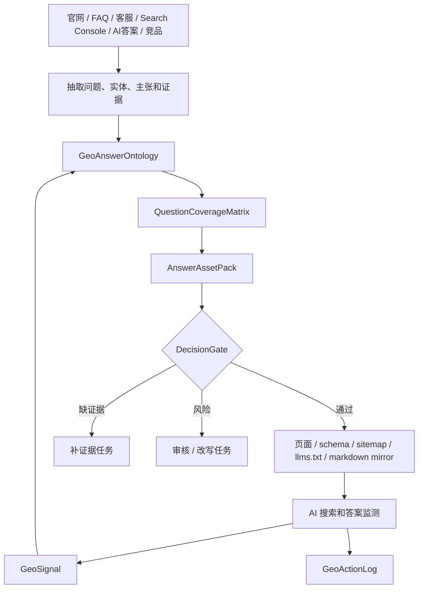
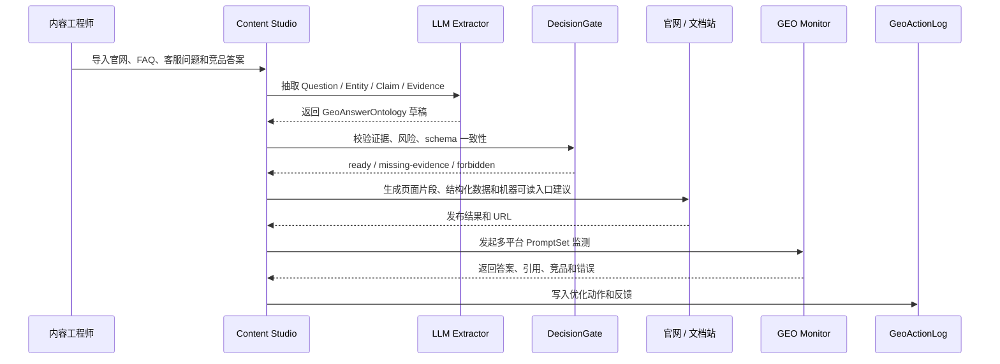

# GEO / AEO 的内容 Ontology 方法论研究

更新时间：2026-05-28
状态：Research Draft

## 1. 研究结论

GEO / AEO 对布谷AI内容工厂有直接价值。它们本质上不是新的“玄学 SEO”，而是把品牌、产品、证据、问答、页面结构和机器可读数据做成可被搜索引擎、答案引擎、AI Overview、Copilot、Perplexity、ChatGPT Search 和 AI Agent 稳定理解、引用、合成的知识资产。

内容工厂的机会不是做黑帽“AI 投毒”，而是做白帽的 Answer Visibility Engineering：

```text
品牌 / 产品 / 服务事实
-> Entity / Claim / Evidence / Question / Answer / Source / Page
-> Query Intent x Audience x Funnel Stage x Answer Format x Evidence x Surface
-> GEO / AEO 内容资产：定义页、对比页、FAQ、产品页、案例页、指南页、数据页
-> 结构化数据 / 内链 / sitemap / robots / llms.txt / 多模态素材
-> AI 搜索监测 / 引用监测 / 答案差异 / 竞品占位 / 风险审计
-> Ontology 版本更新
```

这套方法论和抖音爆款视频拆解是同一套底层逻辑：先把不可控平台表现拆成可枚举变量，再用证据、结构、审核和反馈闭环稳定生产。

## 2. 资料边界

本研究参考了：

- 用户提供的飞书文档《GEO白皮书：AI搜索时代的品牌增长新范式》。该文档可公开访问，重点提纲包括 GEO 定义、GEO 与 SEO 对比、AI 答案生成过程、E-E-A-T、内容结构、差异化策略、监测评估、合规指南、llms.txt 与 robots.txt、倒金字塔、信息分块和企业级风控。
- Google Search Central 关于 AI features、helpful people-first content、结构化数据、抓取索引和页面体验的官方文档。
- Bing Webmaster Guidelines 对内容质量、结构化数据、prompt injection / AI manipulation 的官方约束。
- GEO 论文和近期 GEO 评估研究。

边界判断：

- GEO / AEO 不等于操控模型，也不等于堆关键词。
- `llms.txt` 是有价值的机器可读导航约定，但不能把它当成主流 AI 搜索排名保证。
- 结构化数据必须和页面可见内容一致，不能用 schema 塞页面上没有的事实。
- AI 搜索优化的前提仍然是可抓取、可索引、可理解、可信、可引用、可更新。

## 3. GEO、AEO、SEO 的关系

| 概念 | 核心目标 | 主要对象 | 内容工厂应做什么 |
| --- | --- | --- | --- |
| `SEO` | 在搜索结果中获得可见排名和点击。 | 网页、标题、摘要、链接、结构化数据、站点质量。 | 让页面可抓取、可索引、内容有用、结构清晰、技术健康。 |
| `AEO` | 在答案引擎或搜索答案模块中被直接回答或引用。 | 问题、短答案、FAQ、定义、步骤、表格、摘要。 | 把用户问题变成标准问答资产，并绑定证据和页面。 |
| `GEO` | 在生成式答案中被检索、引用、吸收和合成。 | 实体、主张、证据、引用、页面段落、结构化内容。 | 让 AI 能准确理解品牌事实、引用来源、合成答案且不幻觉。 |

GEO / AEO 的生产目标不是“写更多文章”，而是建立一张问答型知识地图：

```text
UserQuestion -> SearchIntent -> Entity -> Claim -> Evidence -> AnswerBlock -> Page -> StructuredData -> CitationSurface
```

## 4. 核心对象模型

### 4.1 知识对象

| 对象 | 含义 | 例子 |
| --- | --- | --- |
| `Entity` | 被 AI 需要识别的实体。 | 品牌、产品、创始人、服务、门店、软件、行业术语。 |
| `Question` | 用户或 AI Agent 会问的问题。 | “哪个工具适合小红书矩阵号？”“A 产品和 B 产品区别？” |
| `Intent` | 搜索和答案意图。 | 定义、比较、购买、教程、故障、价格、评价、替代方案。 |
| `AnswerBlock` | 可被答案引擎直接引用的回答单元。 | 50 字定义、步骤列表、对比表、FAQ 回答。 |
| `Claim` | 品牌或产品主张。 | “支持本地工作区”“适合内容团队做批量 Prompt 管理”。 |
| `Evidence` | 支撑主张的来源。 | 官方文档、产品规格、截图、客户案例、评测、数据报告。 |
| `SourcePage` | 公开可抓取页面。 | 产品页、指南页、案例页、文档页、FAQ 页。 |
| `CitationTarget` | 希望被 AI 引用的最小页面或段落。 | 一个可独立回答问题的标题段落。 |
| `StructuredData` | 机器可读标记。 | Organization、Product、FAQPage、Article、Review、Breadcrumb。 |
| `MediaEvidence` | 多模态证据。 | 图片、图表、视频、转写、alt 文本、产品演示。 |

### 4.2 操作对象

| 对象 | 含义 | 例子 |
| --- | --- | --- |
| `GeoSignal` | AI 搜索或传统搜索中的机会 / 风险信号。 | 竞品被引用、品牌答案错误、某问题没有权威来源。 |
| `GeoObjective` | 本轮优化目标。 | 让品牌定义被正确回答、占位“最佳工具”类问题、修正错误答案。 |
| `AnswerAsset` | 可发布的答案资产。 | FAQ、对比页、指南段落、产品定义、案例摘要。 |
| `CitationOpportunity` | 可能获得引用的查询和页面组合。 | “X 是什么”对应品牌定义页。 |
| `DecisionGate` | 发布前闸口。 | 证据不足、夸大宣传、隐私风险、schema 与页面不一致。 |
| `GeoActionLog` | 优化动作记录。 | 更新页面、补 schema、提交 sitemap、生成 llms.txt、监测答案变化。 |
| `AnswerFeedback` | 反馈回写。 | 是否被引用、答案是否准确、竞品是否替代、点击或转化变化。 |

## 5. GEO / AEO 行业术语字典

这一节用于把行业常用词转成 Content Studio 可维护的 ontology 对象。后续产品里不应该只显示“做 GEO”，而要能追踪具体是哪个信源、哪段引用、哪个查询、哪个答案表面、哪个证据链出了问题。

### 5.1 信源和语料

| 术语 | 含义 | Ontology 对象 / 字段 |
| --- | --- | --- |
| `信源` / `Source` | 被搜索引擎、答案引擎或模型引用、检索、采信的信息来源。 | `SourcePage`、`SourceRef`、`AuthoritySource` |
| `权威信源` | 官方、机构、专家、行业媒体、论文、标准、政府或高可信站点。 | `authorityLevel`、`sourceType=official/third-party/expert` |
| `一手信源` | 品牌官网、产品文档、原始数据、真实案例、公开报告。 | `sourceOrigin=first-party` |
| `第三方信源` | 媒体报道、测评、百科、社区讨论、行业报告、合作伙伴页面。 | `sourceOrigin=third-party` |
| `语料` / `Corpus` | 可能被检索或训练 / 摘要使用的文本、网页、文档、图片、视频转写集合。 | `CorpusItem`、`contentSurface` |
| `知识库语料` | 企业内部或公开知识库中的事实资产。 | `KnowledgeBaseSource` |
| `公开语料` | 可被爬虫访问的网页、新闻、文档、公开社区内容。 | `publicAvailability` |
| `训练语料` | 模型训练阶段使用的数据，通常不可控且更新慢。 | `modelTrainingSurface` |
| `检索语料` | RAG / AI 搜索实时或近实时检索的数据。 | `retrievalSurface` |
| `索引语料` | 搜索引擎已经抓取、解析并纳入索引的数据。 | `indexedSurface` |

### 5.2 引用和答案占位

| 术语 | 含义 | Ontology 对象 / 字段 |
| --- | --- | --- |
| `引用` / `Citation` | AI 答案、搜索摘要或答案卡片中指向来源页面的链接或来源标识。 | `CitationRecord` |
| `引用目标` / `CitationTarget` | 希望被引用的页面、章节、段落、表格或数据点。 | `CitationTarget` |
| `引用机会` / `CitationOpportunity` | 某个查询下有机会被 AI 引用的实体、问题和页面组合。 | `CitationOpportunity` |
| `引用占位` | 品牌或页面在答案引用列表中的出现位置和频次。 | `citationPosition`、`citationShare` |
| `答案占位` / `Answer Occupancy` | 品牌是否进入答案正文，以及占据多少核心答案空间。 | `AnswerPresence`、`AnswerShare` |
| `品牌提及` / `Brand Mention` | AI 答案中出现品牌名但未必附带引用。 | `BrandMentionRecord` |
| `无链接提及` | 答案提到品牌，但没有链接到品牌信源。 | `mentionWithoutCitation` |
| `主推荐` | 答案把品牌作为首选、最佳、推荐项或重点方案。 | `recommendationRole=primary` |
| `并列推荐` | 品牌和竞品一起出现。 | `recommendationRole=co-mentioned` |
| `负面提及` | 答案中出现投诉、风险、缺点或错误负面信息。 | `sentiment=negative`、`riskSignal` |
| `误引用` | 引用了页面，但答案抽取或归因错误。 | `citationAccuracy=incorrect` |
| `断链引用` | 引用目标不可访问、跳转错误或被删除。 | `citationHealth=broken` |

### 5.3 检索、召回和排序

| 术语 | 含义 | Ontology 对象 / 字段 |
| --- | --- | --- |
| `召回` / `Retrieval` | 系统从索引或语料中取回候选文档、段落或实体。 | `RetrievalCandidate` |
| `召回率` | 目标信源是否能进入候选集合。 | `retrievalPresence`、`retrievalShare` |
| `排序` / `Ranking` | 候选来源或答案片段被排序、筛选和展示的过程。 | `rankingSignal` |
| `重排` / `Reranking` | 初始召回后根据相关性、权威、质量、时效和多样性再次排序。 | `rerankFeature` |
| `片段` / `Snippet` | 页面中被截取用于搜索摘要或答案的文本块。 | `SnippetCandidate` |
| `Chunk` / `信息分块` | 为检索和答案合成切分的最小语义单元。 | `ContentChunk` |
| `Chunking` | 将长文档拆成标题、段落、表格、问答、数据块的过程。 | `chunkStrategy` |
| `Embedding` | 用向量表示文本、页面、问题或实体语义。 | `embeddingRef` |
| `向量召回` | 用语义相似度取回相关内容。 | `retrievalMethod=vector` |
| `关键词召回` | 用关键词、BM25、倒排索引取回内容。 | `retrievalMethod=keyword` |
| `混合召回` | 同时使用关键词、向量、实体图谱和行为信号。 | `retrievalMethod=hybrid` |
| `RAG` | 检索增强生成，先检索信源再合成答案。 | `ragContext` |
| `Grounding` | 将生成答案锚定到来源和证据。 | `groundingRefs` |

### 5.4 答案引擎和展示表面

| 术语 | 含义 | Ontology 对象 / 字段 |
| --- | --- | --- |
| `答案引擎` / `Answer Engine` | 直接给出合成答案的搜索或聊天系统。 | `AnswerPlatform` |
| `生成式引擎` / `Generative Engine` | 使用生成模型合成答案的引擎。 | `GenerativeEngine` |
| `AI Overview` | Google 搜索中的 AI 摘要展示表面。 | `surface=google-ai-overview` |
| `ChatGPT Search` | ChatGPT 的联网搜索 / 答案表面。 | `surface=chatgpt-search` |
| `Perplexity` | 引用驱动的 AI 搜索和答案引擎。 | `surface=perplexity` |
| `Bing Copilot` | Bing / Microsoft Copilot 的搜索答案表面。 | `surface=bing-copilot` |
| `豆包 / Kimi / 夸克 / 秘塔` | 国内 AI 搜索和答案引擎表面。 | `surface=<platform>` |
| `SERP` | 传统搜索结果页。 | `surface=serp` |
| `Featured Snippet` | 搜索结果中的精选摘要。 | `surface=featured-snippet` |
| `Knowledge Panel` | 知识面板或实体卡片。 | `surface=knowledge-panel` |
| `Shopping Surface` | 商品摘要、购物卡、价格和库存展示。 | `surface=shopping` |
| `Local Surface` | 本地商家、地图、附近服务答案。 | `surface=local` |
| `Video / Image Surface` | 视频、图片、图表被搜索或 AI 引用的表面。 | `surface=video/image` |

### 5.5 可见性和效果指标

| 术语 | 含义 | Ontology 对象 / 字段 |
| --- | --- | --- |
| `AI 可见性` / `AI Visibility` | 品牌在 AI 答案、引用、推荐和提及中的整体可见程度。 | `aiVisibilityScore` |
| `答案份额` / `Answer Share` | 某类问题中品牌进入答案正文的比例。 | `answerShare` |
| `引用份额` / `Citation Share` | 某类问题中品牌信源被引用的比例。 | `citationShare` |
| `提及份额` / `Mention Share` | AI 答案中品牌被提到的比例。 | `mentionShare` |
| `推荐份额` | 品牌被推荐为方案、产品或服务的比例。 | `recommendationShare` |
| `竞品占位` | 竞品在目标问题中的答案、引用和推荐占位。 | `competitorOccupancy` |
| `答案准确率` | AI 答案对品牌、产品、价格、功能和限制描述的准确程度。 | `answerAccuracy` |
| `幻觉率` | 答案中出现不存在事实、错误归因或错误功能的比例。 | `hallucinationRate` |
| `可引用率` | 页面段落是否满足可被引用的结构、证据和清晰度。 | `citeabilityScore` |
| `信源健康度` | 页面可访问、可索引、可引用、可更新和证据完整程度。 | `sourceHealthScore` |

### 5.6 技术协议和机器入口

| 术语 | 含义 | Ontology 对象 / 字段 |
| --- | --- | --- |
| `robots.txt` | 控制爬虫访问路径的站点协议文件。 | `robotsPolicy` |
| `sitemap.xml` | 告诉搜索引擎站点 URL 和更新时间的文件。 | `sitemapEntry` |
| `llms.txt` | 面向 LLM 的 Markdown 导航入口约定。 | `llmsEntry` |
| `llms-full.txt` | 面向 LLM 的完整上下文聚合文件。 | `llmsFullEntry` |
| `Markdown Mirror` | 将页面或文档同步为机器友好的 Markdown 镜像。 | `markdownMirror` |
| `Schema.org` | 结构化数据词表。 | `StructuredData` |
| `JSON-LD` | 推荐的结构化数据嵌入格式之一。 | `structuredDataFormat=json-ld` |
| `Canonical` | 标明规范 URL，降低重复内容歧义。 | `canonicalUrl` |
| `Open Graph` | 面向社交平台预览的元数据。 | `openGraphMeta` |
| `AI Crawler` | AI 搜索或模型服务使用的爬虫。 | `crawlerType=ai` |
| `IndexNow` | 主动通知搜索引擎 URL 更新的协议。 | `indexNotifyProtocol` |

### 5.7 风控和治理

| 术语 | 含义 | Ontology 对象 / 字段 |
| --- | --- | --- |
| `AI 投毒` | 通过低质、虚假或操控性内容污染 AI 答案。 | `riskType=ai-poisoning` |
| `Prompt Injection` | 在页面或内容中植入诱导模型忽略规则的指令。 | `riskType=prompt-injection` |
| `Schema Spam` | 用结构化数据标记页面上不存在或不真实的内容。 | `riskType=schema-spam` |
| `虚假权威` | 伪造专家、机构、奖项、评测、案例或证书。 | `riskType=fake-authority` |
| `负面 GEO` | 通过第三方内容影响 AI 对品牌的负面认知。 | `riskType=negative-geo` |
| `内容漂移` | 页面更新后主张、证据、schema 和答案资产不再一致。 | `driftSignal` |
| `答案漂移` | 同一问题在不同时间或平台答案发生偏移。 | `answerDrift` |
| `审计链路` | 从问题、答案、页面、证据到发布动作的可追溯记录。 | `GeoActionLog` |

## 6. 变量字典

### 6.1 查询和意图变量

| 变量 | 枚举方向 | 拆解问题 |
| --- | --- | --- |
| `QueryType` | 定义、教程、对比、最佳、替代、价格、评价、附近、故障、清单。 | 用户在问什么类型的问题？ |
| `IntentStage` | 认知、探索、比较、决策、购买、使用、复购。 | 用户处于哪一阶段？ |
| `AudienceRole` | 创始人、运营、采购、开发者、消费者、代理商、媒体、投资人。 | 谁在问？ |
| `QuestionSpecificity` | 宽泛问题、中等问题、长尾问题、品牌问题、竞品问题。 | 答案需要多具体？ |
| `Commerciality` | 无商业、弱商业、强商业、交易型。 | 是否会影响转化？ |
| `Locality` | 无地域、本地服务、门店附近、区域政策、跨境市场。 | 是否需要本地信息？ |

### 6.2 答案格式变量

| 变量 | 枚举方向 | 拆解问题 |
| --- | --- | --- |
| `AnswerFormat` | 一句话定义、摘要、步骤、表格、FAQ、清单、优缺点、对比矩阵、案例。 | AI 最容易引用哪种结构？ |
| `AnswerLength` | 30-60 字、100-200 字、短段落、长指南。 | 是否适合被答案引擎截取？ |
| `EvidencePlacement` | 答案前、答案后、每条主张后、表格列。 | 证据在哪里出现？ |
| `CitationGranularity` | 页面级、章节级、段落级、数据点级。 | 引用目标是否足够小？ |
| `FreshnessSignal` | 更新时间、版本号、数据周期、变更记录。 | AI 能否判断内容新鲜度？ |
| `DifferentiationSignal` | 原创数据、真实案例、独家图表、专家观点、第一手经验。 | 是否不是通用搬运内容？ |

### 6.3 信任和证据变量

| 变量 | 枚举方向 | 拆解问题 |
| --- | --- | --- |
| `AuthoritySource` | 官方、专家、客户案例、第三方报告、社区口碑、媒体报道。 | 权威从哪里来？ |
| `AuthorIdentity` | 机构作者、专家作者、产品团队、匿名、AI 生成。 | 谁负责内容？ |
| `ReviewStatus` | 草稿、已审、已发布、需更新、有争议、废弃。 | 内容是否可被引用？ |
| `EvidenceStrength` | 无证据、弱证据、体验证据、规格证据、数据证据、第三方证据。 | 主张能否站住？ |
| `SourceTraceability` | 无来源、内部来源、公开链接、可下载报告、可复验数据。 | 读者和 AI 能否追溯？ |
| `RiskLevel` | 低、中、高、禁止。 | 是否涉及医疗、金融、法律、隐私或夸大宣传？ |

### 6.4 技术可发现变量

| 变量 | 枚举方向 | 拆解问题 |
| --- | --- | --- |
| `Crawlability` | 可抓取、被 robots 阻止、登录后、JS 难渲染、重复页。 | 搜索和 AI 检索能否访问？ |
| `Indexability` | 可索引、noindex、canonical 到别处、重复内容。 | 页面能否进入索引？ |
| `StructuredDataType` | Organization、Product、Article、FAQPage、Review、Breadcrumb、LocalBusiness。 | 需要哪种 schema？ |
| `VisibleSchemaMatch` | 完全一致、部分一致、不一致。 | schema 是否和页面可见内容一致？ |
| `InternalLinkRole` | 核心页、支撑页、案例页、证据页、FAQ 页。 | 内链是否帮助理解主题权重？ |
| `MachineReadableIndex` | sitemap、RSS、llms.txt、llms-full.txt、API 文档、Markdown 镜像。 | 是否给机器提供清晰入口？ |
| `MediaAccessibility` | alt 文本、视频转写、图表说明、文件名、字幕。 | 多模态内容能否被理解？ |

### 6.5 监测变量

| 变量 | 枚举方向 | 拆解问题 |
| --- | --- | --- |
| `PromptSet` | 品牌词、品类词、问题词、比较词、场景词、竞品词。 | 要监测哪些问法？ |
| `AnswerPresence` | 未出现、被提及、被引用、作为主要推荐、被错误描述。 | AI 答案里有没有我们？ |
| `CitationPosition` | 无引用、引用靠前、引用靠后、竞品引用。 | 引用强度如何？ |
| `CitationAbsorption` | 只引用链接、吸收定义、吸收证据、吸收结论、误吸收。 | 页面内容是否进入答案正文？ |
| `AnswerAccuracy` | 准确、部分准确、过时、错误、幻觉。 | 答案是否可接受？ |
| `CompetitorOccupancy` | 无竞品、竞品并列、竞品主导、竞品错误占位。 | 竞品占了哪些问题？ |

## 7. 构建流程

### 7.1 问题挖掘

输入源：

1. Search Console / 站内搜索 / 客服问题 / 销售问答。
2. AI 搜索结果截图和回答记录。
3. 竞品页面、竞品被引用的 AI 答案。
4. 小红书、知乎、抖音、B 站、社群里的真实提问。
5. 产品知识库、官网、帮助中心、案例库、报价和服务条款。

输出：

```text
Question -> Intent -> Audience -> FunnelStage -> Commerciality -> TargetEntity
```

### 7.2 答案资产生成

每个问题不是只写一篇文章，而是生成多层资产：

| 资产 | 用途 |
| --- | --- |
| `DefinitionBlock` | 让 AI 能正确解释品牌、产品、术语。 |
| `DirectAnswerBlock` | 给 AEO / AI Overview 抽取短答案。 |
| `ComparisonBlock` | 承接“谁更好 / 对比 / 替代方案”问题。 |
| `EvidenceBlock` | 把主张和来源绑定。 |
| `FAQBlock` | 承接长尾问答。 |
| `ProductFactBlock` | 保持商品、价格、规格和服务一致。 |
| `CaseBlock` | 提供非通用、可验证的经验和结果。 |
| `RiskBlock` | 声明适用边界、限制条件和不适合人群。 |

### 7.3 结构化发布

```text
AnswerAsset
-> SourcePage
-> Heading / Summary / Table / FAQ / Evidence
-> schema.org JSON-LD
-> internal links
-> sitemap
-> robots / canonical
-> llms.txt / markdown mirror
```

发布前必须通过：

- 页面可见内容和结构化数据一致。
- 每条强主张都有证据。
- 时间、价格、库存、版本、政策有更新责任人。
- AI 生成内容有人工审核。
- 高风险行业不输出无资质建议。

### 7.4 监测和回写

```text
PromptSet
-> 多平台查询
-> 捕获答案 / 引用 / 竞品 / 错误
-> 归因到 Question / Entity / SourcePage
-> 生成 GeoSignal
-> 更新 AnswerAsset / Evidence / StructuredData
-> 写入 GeoActionLog
```

关键是记录“改了什么”。如果只记录排名变化，就无法知道是标题、摘要、证据、schema、内链、发布时间还是页面权威造成变化。

## 8. 覆盖矩阵

GEO / AEO 的矩阵应该按“问题和答案资产”组织：

```text
AudienceRole
x IntentStage
x QueryType
x Entity
x Claim
x EvidenceStrength
x AnswerFormat
x StructuredDataType
x CitationSurface
x RiskLevel
```

示例：

| 角色 | 阶段 | 问题类型 | 实体 | 答案格式 | 证据 | 技术标记 | 目标表面 | 状态 |
| --- | --- | --- | --- | --- | --- | --- | --- | --- |
| 创始人 | 探索 | 定义 | AI 内容工厂 | 一句话定义 + FAQ | 产品文档 | Organization / Article | AI Overview / ChatGPT Search | ready |
| 运营 | 比较 | 替代方案 | Prompt 工作台 | 对比表 | 功能清单 + 截图 | Product / FAQPage | Perplexity / Bing Copilot | needs-review |
| 采购 | 决策 | 价格 | 企业版服务 | 价格说明 | 报价政策 | Product / Offer | Google / Bing | missing-evidence |
| 开发者 | 使用 | 教程 | API / 本地工作区 | 步骤指南 | 文档和示例 | HowTo 不作为富结果依赖，仅保留页面结构 | ChatGPT Search | ready |

## 9. 和内容工厂的产品化形态

### 9.1 新工作流

```text
导入品牌 / 产品 / 官网 / FAQ / 客服问题 / 竞品答案
-> 生成 GEO / AEO 问题图谱
-> 绑定 Entity / Claim / Evidence / SourcePage
-> 生成 AnswerAsset 和页面改写建议
-> 生成结构化数据建议
-> 生成 llms.txt / llms-full.txt / markdown mirror 建议
-> 发起审核
-> 发布后监测 AI 答案和引用变化
-> 回写 Ontology
```

### 9.2 输出物

| 输出物 | 用途 |
| --- | --- |
| `GeoAnswerOntology` | GEO / AEO 的实体、问题、主张、证据和答案图谱。 |
| `QuestionCoverageMatrix` | 品牌应覆盖的问题、意图、阶段和页面状态。 |
| `AnswerAssetPack` | 定义、FAQ、对比、案例、证据和风险说明。 |
| `StructuredDataPlan` | schema.org、Open Graph、canonical、sitemap 和内链建议。 |
| `LlmsEntryPlan` | `llms.txt`、`llms-full.txt`、Markdown 镜像和 AI 可读入口建议。 |
| `GeoMonitoringRun` | 多平台查询、答案、引用、竞品、错误和趋势记录。 |
| `GeoActionLog` | 页面更新、结构化数据更新、发布、复查和回写记录。 |
| `GeoTermDictionary` | 信源、引用、召回、答案占位、可见性、协议和风控术语字典。 |

### 9.3 和现有模块关系

| 模块 | 消费方式 |
| --- | --- |
| 知识库 | 提供品牌事实、产品事实、证据和禁用表达。 |
| Ontology 工作台 | 维护实体、问题、答案、证据、页面和结构化数据关系。 |
| Prompt 工作台 | 生成页面片段、FAQ、对比表、摘要和 schema 草稿。 |
| SOP 工作流 | 批量执行页面审计、答案生成、审核、发布和监测。 |
| 素材库 | 提供图片、视频、图表、截图和转写作为多模态证据。 |
| 审核台 | 拦截无证据主张、结构化数据不一致、风险行业误导表达。 |

## 10. Mermaid 流程图



## 11. 时序图



## 12. MVP 建议

第一刀只做“问题图谱 + 答案资产 + 审核 + 发布建议 + 人工监测记录”，不要直接承诺 AI 搜索排名提升。

| 优先做 | 暂不做 |
| --- | --- |
| 从官网、知识库、FAQ、客服问题抽取 Question / Entity / Claim / Evidence。 | 自动控制全站 CMS 发布。 |
| 建立 GEO / AEO 行业术语字典，统一信源、引用、召回、答案占位和可见性指标口径。 | 用模糊术语替代可追溯对象。 |
| 生成问题覆盖矩阵和 AnswerAsset 草稿。 | 黑帽 AI 投毒、批量垃圾站、伪造引用。 |
| 生成 schema.org、sitemap、llms.txt、Markdown 镜像建议。 | 宣称 llms.txt 一定提升 AI 排名。 |
| 审核无证据主张、过时信息和结构化数据不一致。 | 自动修改高风险行业内容。 |
| 手工记录 AI 搜索答案、引用和竞品占位。 | 直接做跨平台自动化爬取和绕过限制。 |

## 13. 合规和风险边界

禁止方向：

- 用隐藏文本、prompt injection、schema 造假或页面不可见内容操控 AI。
- 伪造作者、专家资质、客户案例、第三方评测、奖项和数据。
- 对医疗、金融、法律、安全等高风险主题输出无资质建议。
- 把 AI 生成页面批量发布为低质量站群。
- 用 GEO 包装负面攻击、竞品造谣或虚假比较。

白帽方向：

- 以用户问题为中心，而不是以关键词堆砌为中心。
- 以实体、主张、证据和来源为事实源。
- 让页面、结构化数据、机器可读入口和引用目标保持一致。
- 持续监测 AI 答案是否准确，主动修复过时和错误内容。

## 14. 参考资料

- 姚金刚飞书文档，[《GEO白皮书：AI搜索时代的品牌增长新范式》](https://yaojingang.feishu.cn/docx/Jv85dXAeZoKJ7exJi4Yc4Edrnhf)。重点参考：GEO 定义、方法、内容结构、E-E-A-T、监测评估、合规指南、llms.txt / robots.txt 协同和 Chunking。
- Google Search Central, [AI features and your website](https://developers.google.com/search/docs/appearance/ai-features). 重点参考：AI features 仍依赖 Search 基础最佳实践、people-first content、可抓取可索引、结构化数据和可见内容一致。
- Google Search Central, [Creating helpful, reliable, people-first content](https://developers.google.com/search/docs/fundamentals/creating-helpful-content). 重点参考：原创性、完整性、专业性、来源、Who / How / Why 和 E-E-A-T。
- Bing Webmaster Tools, [Webmaster Guidelines](https://www.bing.com/webmasters/help/webmasters-guidelines-30fba23a). 重点参考：内容质量、结构化数据真实性、prompt injection 和 AI manipulation 风险。
- Bing Webmaster Tools, [Marking Up Your Site with Structured Data](https://www.bing.com/webmasters/help/marking-up-your-site-with-structured-data-3a93e731). 重点参考：结构化数据帮助搜索理解内容类型，但必须准确表达页面内容。
- Aggarwal et al., [GEO: Generative Engine Optimization](https://arxiv.org/abs/2311.09735). 重点参考：生成式引擎优化、可见性指标、引用、统计、权威表达和内容改写实验。
- llms.txt reference site, [llms.txt](https://llmtxt.info/). 重点参考：`/llms.txt` 作为给 LLM 的 Markdown 导航入口，目前应视为辅助约定，不是排名保证。
- AgenticGEO, [A Self-Evolving Agentic System for Generative Engine Optimization](https://arxiv.org/abs/2603.20213). 重点参考：GEO 正从排名优化转向内容被纳入生成答案的动态优化。
