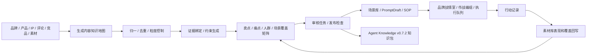

# 布谷AI内容工厂 Ontology v1 落地方案

更新时间：2026-05-29
状态：Draft / First Implementation + Field Supplement Cut

## 一句话目标

Ontology v1 是内部工程代号。面向普通使用者时，产品应呈现为“内容知识地图、卖点矩阵、场景矩阵、审核任务、团队知识包、品牌战情室、作战编组和执行队列”，不要求用户理解 Ontology。本文档不覆盖抖音带货爆款视频专项和 GEO / AEO 专项，那两类需求保留在独立 research 文档中。

更准确地说，v1 不应停留在“知识地图”。知识地图是底座，最终用户价值是“品牌内容作战系统”：把评论、竞品、热点、素材表现和品牌风险变成信号，把信号变成目标，把目标快速组合为资源包、标准动作、执行队列和复盘回写。

## 最新设计原则校准

v1 后续设计和实现必须先过业务 UI 契约，再进入原型或代码：

- 页面必须围绕一个正在处理的业务对象，例如某个产品项目、某条评论痛点、某个作战目标、某个资源包或某个待审主张。
- 同一页面只保留一个当前主动作；其他按钮必须服务当前对象的补资料、送审、交接、回写或导出。
- 空态、待配置、缺证据、待审核、冲突和同步失败都必须给恢复路径，不能只展示状态标签。
- 普通用户页面禁止做成能力概览、入口合集、功能卡片墙或状态胶囊堆叠。
- 工程术语只能留在协议、代码、导出标准和高级说明；普通用户主路径必须使用业务语言。
- 模块设计必须遵守 `Renderer View -> Controller Hook -> Preload -> IPC -> Application Service -> Domain Policy / Assembler -> Store -> Port / Adapter`，不把业务规则塞进 React、IPC 或服务端路由大函数。
- Bugu 是业务后端事实源；Content Studio 只做桌面工作台、本地缓存和离线草稿；LimeCore 只做 OEM 云底座。

业务 UI 契约见 [`business-ui-contract.md`](./business-ui-contract.md)，模块设计模式见 [`module-design.md`](./module-design.md)。

## 当前落地进度

- Content Studio 已落地内容知识地图、审核任务、品牌战情室、生产交接、素材回写、团队知识包导出和 Bugu 同步适配器的第一刀。
- Bugu 业务后端已落地团队内容工作区、变更包、审核任务、审核结论、执行队列、行动记录、素材覆盖、同步冲突和团队知识包版本 API，并有 smoke 覆盖。
- Bugu 控制台已新增团队内容工作区面板，围绕当前工作区展示待处理审核、同步冲突、生产交接、行动记录、素材覆盖和团队知识包版本；旧版本提交不会覆盖团队当前版本。
- Content Studio 桌面端内容知识地图页已接入同步冲突队列，可查看旧版本提交、影响内容、处理建议，并选择“以团队版本为准 / 保留本机修改 / 转人工确认”；处理后本机地图回到待同步状态。
- Content Studio 会把本机导出的 Agent Knowledge 包打成 zip 随 release 提交；Bugu 通过对象存储端口登记包对象、下载地址和上传状态，控制台与桌面端都能看到团队知识包是否可分发。
- Bugu 控制台已能把团队知识包旧版本切回默认版本，服务端记录发布包默认版本切换审计。
- Bugu 业务后端和控制台已补团队知识包审批：待确认版本不会自动成为默认知识包，内容负责人可批准并设为默认，也可驳回；服务端已支持多步骤确认、步骤角色校验和工作区默认确认模板，控制台可显示确认进度并切换模板。
- Content Studio 已能基于已同步工作区拉取 Bugu 团队知识包版本并缓存到本机，保留本机预览路径，同时展示服务端包地址和分发状态。
- Content Studio 生产交接生成的 Prompt 草稿、场景卡或 SOP 运行记录会绑定团队知识包版本，避免下游消费脱离已审核口径。
- 已有功能测试用两个本地工作区模拟用户 A / B：A 发布团队知识包，B 拉取同一团队工作区版本，并把版本绑定到 Prompt 草稿和 SOP 运行记录。
- Content Studio 已新增团队知识包只读在线验收脚本，可从 Bugu release 元数据校验公开包地址、大小和 sha256；功能测试用本地 HTTP server 模拟 R2 / OSS 下载链路，避免把 metadata-only 版本误判为可分发。
- Content Studio 已新增团队共享只读在线验收脚本，要求两组账号 token 同时看到同一团队工作区、同一默认知识包、审核任务和执行队列；功能测试用本地 HTTP server 模拟双账号链路。
- 团队共享在线验收已补同清单校验：两账号看到的审核任务数量、执行队列数量、任务 ID 清单和队列 ID 清单必须一致；生产归档门禁会拒绝任务 / 队列清单不一致的报告。
- Content Studio 已新增 v1 在线验收总入口，可一次汇总团队知识包下载验收和两账号团队共享验收，并输出 JSON 报告。
- Content Studio 已新增 v1 验收报告归档校验，生产归档必须通过 `content:v1:verify-report -- --production`；localhost / mock 报告只能作为功能测试证据。
- Content Studio 和 Bugu 控制台已补同步冲突逐项合并处理清单第一刀：冲突卡片可展开查看本机提交、团队当前内容、建议处理方式和下一步，不自动覆盖团队版本。
- Bugu 服务端已支持合并处理清单落库审计：处理冲突时保存清单、追加行动记录并推进团队 revision；仍不静默覆盖业务内容。
- Content Studio 已补离线变更包导出 / 导入：变更包导出为 `manifest.json`、`draft-change.json` 和导入说明，包内不写本机 `workspacePath`、API Key、凭证或本机绝对路径；导入后成为当前工作区的本机变更包，再由用户提交团队工作区。
- Content Studio 内容知识地图页已补团队知识包详情浏览：普通用户可以在当前工作台查看团队版本、文件数、包文件、对象 key、sha256、确认状态和最近版本，不需要进入 prototype 里的独立“团队知识包”大页。
- Content Studio 内容知识地图矩阵已把证据 ID 转成可读摘要，痛点行会优先展示用户原声或客服记录，承接 prototype 中“评论痛点聚类必须看见真实原话”的要求。
- Content Studio 已补素材覆盖字段级回写：已通过素材会回写矩阵行素材状态、真实素材引用和表现标签；素材库详情页可反查每个素材覆盖的卖点 / 痛点 / 场景组合；待确认补充会同步到 Bugu 团队审核，但不会改写已发布卖点、痛点、场景或主文案。
- Content Studio 内容知识地图构建器已补 SKU、IP 六层知识库和竞品观察输入域：SKU 表进入 SKU 组合和 SKU 场景；IP 身份、价值观、语言规则和场景延伸进入矩阵、证据和约束；竞品观察只生成差异化机会、结构参考和不可搬运边界，并默认进入待审核，不作为本品牌事实证据。
- Content Studio 内容知识地图质量门禁已补重复 / 近似条目、孤立条目、粒度异常和可交付缺证据检查；这些问题进入缺口清单后由审核调整闭环处理。
- Content Studio 已把生产交接发布检查收敛到 main 侧 policy：审核通过后仍会二次检查禁用 / 绝对化表达、禁用标记、竞品观察直交和 IP 语言漂移；命中风险时只记录 blocked 交接，不生成 PromptDraft 或 SceneCard。
- Content Studio 已把提示词依据收敛为短摘录注入：只包含当前审核组合、已通过证据、生成边界和来源引用，不拼接完整原始文档或未通过证据。
- Content Studio 审核任务页已支持改名、合并同类条目和拆分过粗条目；调整由 main 侧服务回写内容知识地图并提交变更包，审核决策同步到 Bugu 时保留结构化调整 payload；审核详情已展开证据原文 / 摘录、证据状态、来源引用和推荐恢复路径，避免审核人员只能看到证据数量。
- Content Studio 品牌战情室资源包已读取矩阵行真实素材引用，执行队列 ready 的 `generate-prompt-draft` 动作会创建真实 Prompt 草稿并回填资源包，`create-scene-card` 动作会创建真实场景卡并回填资源包，`launch-sop-run` 动作会创建真实 SOP 运行记录并回填资源包，`write-back-material-coverage` 动作会调用素材覆盖回写服务并留下覆盖变更引用；补证据 / 补素材 / 送审动作会创建真实审核任务并可同步到 Bugu。执行前发布检查已覆盖平台规则和团队角色权限，Bugu 行动记录追加接口会拒绝只读角色写入。
- Content Studio 品牌战情室信号雷达已从“评论痛点 / 场景 / 缺口”扩展为“评论痛点、竞品动作、素材表现、投放表现、平台热点 / 搜索问题、品牌风险”：这些信号会映射为拉新、转化、价格防守、风险控制、补证据或补素材目标，并保留风险边界，防止把竞品、投放或素材表现误当作产品事实。
- Content Studio 品牌战情室已补“目标树”页签：普通用户可看到每个内容信号转成的拉新、转化、信任、价格防守、风险控制、补证据或补素材目标，并查看优先级、渠道、成功标准、关联信号、资源包和队列动作。
- Content Studio 品牌战情室已补资源包、执行队列和行动记录的可审计详情：资源包展示真实卖点 / 痛点、场景、证据摘录、禁用边界、资源缺口、素材和交接引用；执行队列展示动作类型、交付物、席位、渠道、发布时间窗口、团队同步、发布检查消息和恢复路径；行动记录展示操作者角色、产物引用、素材回写、未通过原因和团队记录状态。
- Content Studio 作战分组已把左侧“品牌战情室、目标树、作战编组、执行队列、行动记录”落成真实直达视图：每个入口都有独立页面标题、当前业务对象、主判断、主动作、交付去向和真实 record 计算的小型图表；页面只消费 `BrandCommandCenterRecord`、内容知识地图、队列和行动记录，不补 mock 数据。
- Content Studio 已补矩阵组合治理：卖点 / 痛点 / 场景矩阵支持状态、素材、关键词筛选，支持按优先级、可信度、证据数和素材缺口排序，支持分页和本批送审；ready 行也能按指定行生成审核任务，用于人工批准后再交接。
- Content Studio 已把矩阵行恢复路径落成真实任务：同一卖点 / 痛点 / 场景组合可以同时存在发布审核任务和补素材任务；补素材任务进入审核任务列表、同步链路和行动记录事实源，不停留在页面提示。
- Bugu 业务后端已保存并返回补素材审核任务类型：`npm run smoke:oem-service` 覆盖 `taskPurpose=material-supplement`、`status=needs-material`、`suggestedAction=request-material`，Bugu 控制台会把待补素材任务纳入待处理审核列表。
- Content Studio 已把人群、渠道、内容形式和使用场景从标签文本升级为结构化覆盖维度：构建器会从 SKU 表、场景卡、品牌知识库、输入源标签和 IP 延伸场景写入维度；矩阵可按人群、渠道和形式筛选；行详情、场景卡交接和 Agent Knowledge 导出都会保留这些维度。
- Content Studio 品牌战情室已消费结构化覆盖维度：内容信号生成作战目标时优先使用矩阵行渠道，资源包、作战单元和执行队列会保存目标人群、渠道、内容形式和使用场景；生成 Prompt 草稿、场景卡和 SOP 运行时会把这些生产变量写入真实下游输入，并随执行队列同步到 Bugu。
- Content Studio 已补内容知识地图生成流程记录：每次生成都会写入输入收集、团队状态、生成服务检查、来源证据整理、结构化矩阵生成和质量检查步骤；待配置、缺结构化接口、模型失败和成功路径都可在工作台查看，不再只保存最终知识地图。
- Content Studio 真实客户端已补原型第一批落地差距：内容知识地图支持矩阵行下钻查看证据摘录、素材状态、恢复路径和交付去向；行详情可直接把已审核组合交接成真实 Prompt 草稿、场景卡或 SOP 运行记录，未审核组合会先创建审核任务；详情页可切换 IP 口径、竞品观察、团队知识包、素材回写和高级导出；高级导出可生成本机预览。
- Content Studio 已补本地工作台远端同步兜底：未配置真实 Bugu 管理 token 或远端冲突接口不可用时，同步冲突列表降级为空列表，不再阻断输入源、内容知识地图、团队知识包和品牌战情室的本地读取。
- v1 HTML 原型已升级为可交互确认版：左侧可见导航全部可切换；右侧可按表格行、资源卡、队列卡、知识包目录和素材卡下钻查看证据、风险、恢复路径和交付去向；按钮会更新交付结果和行动记录，不再停留在静态占位反馈。
- 已新增 v1 完成度审计：逐项对照 AC-00 到 AC-13 区分本地已验证、生产证据待补和不可宣称完成的硬门槛，避免把本地 mock / localhost / 双本地工作区模拟误报为生产完成。
- 已新增 v1 本地 readiness gate：`npm run content:v1:verify-readiness` 会检查 v1 必需文档、实现文件、在线验收脚本、package scripts、普通用户原型禁用词、完成度审计和生产报告归档状态；默认本地模式允许缺少生产报告但给出 warning，`-- --require-production-report` 会把缺少真实线上报告视为失败。该 gate 已接入 `npm run verify:local`。
- 仍未完成：使用真实 R2 / OSS、真实账号和两台设备运行 v1 在线验收总入口并归档报告。

## v1 解决的问题

| 现有问题 | v1 落地方式 |
| --- | --- |
| 卖点、痛点、人群、场景散落在不同模块。 | 用内容知识地图统一承接，并在用户侧呈现为卖点矩阵、场景矩阵和素材覆盖表。 |
| 用户希望“各种穷举”，但 prompt 列表容易漏项。 | 建立可枚举变量体系，按产品、用户、场景、渠道、证据和约束生成矩阵。 |
| 品牌口径、IP 人设和素材表达不稳定。 | 每条主张、表达规则和禁用语都绑定证据、来源和审核状态。 |
| Prompt 工作台经常塞完整文档，结果上下文长且漂移。 | 只交接本次生成需要的提示词依据：相关卖点、证据、规则、禁用表达和来源。 |
| SOP 和素材库无法反哺知识库。 | 通过行动记录、素材覆盖回写和表现标签更新内容矩阵。 |
| 品牌获客像动态战场，资源需要快速组合。 | 建立品牌内容作战系统：信号雷达、目标树、资源包、作战单元、执行队列、发布检查和复盘回写。 |
| Ontology 只在个人本机，团队无法共享、审核和复用。 | 以 Bugu 业务后端作为团队事实源，用服务端工作区、审核、冲突队列和 Agent Knowledge release 串起协作；本地只保留缓存和离线草稿。 |
| 普通用户不理解也不需要理解 Ontology。 | 用户界面隐藏工程术语，只展示内容知识地图、矩阵、证据、规则、团队知识包、品牌战情室、作战编组、执行队列和行动记录。 |

## 用户可见产品形态

| 内部能力 | 用户看到的名称 | 用户要完成的事 |
| --- | --- | --- |
| Ontology Workspace | 内容知识地图 | 把品牌、产品、IP、评论、素材整理成可复用知识。 |
| Coverage Matrix | 卖点矩阵 / 场景矩阵 / 素材覆盖表 | 穷举卖点、人群、痛点、场景和渠道组合。 |
| Evidence / Constraint | 证据 / 规则 / 禁用表达 | 判断哪些主张能用，哪些必须补证据或禁止使用。 |
| Prompt Grounding | 提示词依据 | 生成前确认 Prompt 会引用哪些卖点、证据和规则。 |
| Knowledge Release | 团队知识包版本 | 团队共用一套已审核口径。 |
| Signal / Objective | 内容信号 / 作战目标 | 把评论、竞品、素材表现和品牌风险变成可指挥目标。 |
| ResourceBundle | 资源包 | 组合卖点、证据、素材、FAQ、Prompt、SOP 和禁用边界。 |
| Action Record | 行动记录 | 追溯谁用哪些资源生成了什么内容。 |

原则：

- 普通用户主路径不出现 `Ontology`、`Concept`、`Relation`、`CoverageMatrix` 等工程术语。
- 内容工程师和开发者可以在高级模式、导出设置和协议文档中看到内部术语。
- 文档可以继续使用 Ontology 作为工程模型名，但必须明确它不是用户要学习的概念。

## v1 范围

优先落地的通用内容工程对象：

| 领域 | 关键对象 | 下游用途 |
| --- | --- | --- |
| 品牌 / 产品 | 产品、SKU、功能、属性、卖点、收益、主张、证据、禁用表达。 | 卖点矩阵、详情页文案、图片 Prompt、视频 Prompt、审核规则。 |
| 用户反馈 | 评论、差评、客服问题、痛点、异议、用户原声、购买障碍。 | 痛点聚类、选题矩阵、异议处理、补证据任务。 |
| 人群 / 场景 | 人群、角色、阶段、使用时刻、空间、动作、情绪、渠道。 | 场景穷举、内容角度、批量 Prompt、SOP 输入。 |
| IP / 创始人 | 身份、观点、语言规则、方法论、故事资产、表达边界。 | IP 一致性、口播 Prompt、私域内容、观点型文章。 |
| 竞品观察 | 竞品卖点、内容结构、证据类型、评论痛点、差异化机会。 | 竞品拆解、差异化定位、不可搬运边界。 |
| 素材库 | 素材、渠道、格式、覆盖组合、审核结论、表现标签。 | 覆盖回写、高表现组合复用、缺素材提醒。 |
| SOP / 作战 | 信号、目标、资源包、标准动作、决策闸口、执行队列、行动日志。 | 品牌战情室、作战编组、执行追踪、复盘和下一轮生产。 |

## 品牌内容作战系统

v1 的作战系统由 6 个面向用户的能力组成：

| 能力 | 解决的问题 | 用户看到的界面 |
| --- | --- | --- |
| 信号雷达 | 评论、竞品、热点、投放、素材表现和品牌风险分散。 | 品牌战情室。 |
| 目标树 | “生成内容”太宽泛，无法指挥资源。 | 拉新、转化、信任、复购、风险、素材等目标。 |
| 资源包 | 每次行动不知道该调哪些卖点、证据、素材、Prompt 和 SOP。 | 资源包编组。 |
| 发布检查 | Agent 或运营可能绕过证据、品牌和平台边界。 | 发布检查和拦截原因。 |
| 执行队列 | 可执行、待审、待补资源、已拦截动作混在一起。 | 执行动作队列。 |
| 复盘回写 | 高表现内容无法沉淀，表现数据又容易被误当事实。 | 复盘和素材回写。 |

详细拆解见 [`brand-content-command-system.md`](./brand-content-command-system.md)，工程模块边界和设计模式见 [`module-design.md`](./module-design.md)。

不进入 v1 的内容：

- 不做完整 OWL / RDF 编辑器。
- 不做云端图数据库和多人实时协同。
- 不做自动发布、刷量、虚假互动或绕过平台审核。
- 不把 Agent Knowledge 包里的 `ontology/` 或 `answers/` 当成可执行指令。
- 不把抖音爆款视频专项变量和 GEO / AEO 信源监测逻辑并入通用 v1 主链。

## 总体闭环

## v1 主链路

1. 选择输入源：产品 brief、SKU 表、品牌知识库、IP 知识库、评论、客服问题、竞品观察和素材记录。
2. 按 scope 创建 `OntologyWorkspace`，同步到 Bugu 团队内容工作区；`.content-studio/` 只保存本地缓存、离线草稿和运行临时产物。
3. 使用框架派 + 拆解派 + 聚类派构建候选概念、关系、证据和约束。
4. 生成覆盖矩阵，支持卖点、痛点、人群、场景、渠道、素材和证据状态筛选，并支持排序、分页和本批送审。
5. 通过规则校验和人工审核，阻断无证据主张、禁用表达、重复概念、孤立概念和过粗 / 过细粒度。
6. 将 ready coverage rows 发布为 `SceneCard`、`PromptDraft` 或 SOP 输入。
7. 把评论痛点、竞品动作、素材表现和品牌风险进入品牌战情室，形成作战目标和资源包。
8. 通过发布检查生成执行队列，区分可执行、待审核、待补资源和已拦截动作。
9. 写入行动记录，记录谁基于哪些资源做了什么、产出了什么、是否被拦截。
10. 素材审核和表现回写覆盖矩阵，形成高表现组合和缺口清单。
11. 导出 Agent Knowledge v0.7.2 ontology-aware 知识包，可选附带 answer-ready `answers/` 数据。

## 文档索引

| 文档 | 用途 |
| --- | --- |
| [`implementation-plan.md`](./implementation-plan.md) | v1 阶段、写集、依赖、里程碑和风险控制。 |
| [`module-design.md`](./module-design.md) | v1 模块边界、设计模式、接口契约、时序和后续扩展规则。 |
| [`data-model.md`](./data-model.md) | v1 服务端事实源、本地缓存、核心对象、状态机、矩阵和 Agent Knowledge v0.7.2 映射。 |
| [`workflow-integration.md`](./workflow-integration.md) | 与知识库、场景库、Prompt 工作台、SOP、素材库和作战单元的集成方式。 |
| [`brand-content-command-system.md`](./brand-content-command-system.md) | 品牌内容作战系统的方法论、席位、信号、目标、资源包、执行队列和验收标准。 |
| [`brand-content-command-diagrams.md`](./brand-content-command-diagrams.md) | 品牌内容作战系统架构图、流程图、时序图、状态图、资源包结构图和回写图。 |
| [`business-ui-contract.md`](./business-ui-contract.md) | v1 普通用户业务 UI 契约、页面主对象、主动作、异常恢复和反功能平铺门禁。 |
| [`server-integration-plan.md`](./server-integration-plan.md) | Bugu、LimeCore 和 Content Studio 的服务端事实源、API、同步和发布边界。 |
| [`team-sharing-plan.md`](./team-sharing-plan.md) | 团队共享、服务端工作区、离线草稿、权限、冲突和 release 管理方案。 |
| [`user-facing-language.md`](./user-facing-language.md) | 普通用户不可见 Ontology 的命名原则、UI 文案、导航和验收标准。 |
| [`acceptance-plan.md`](./acceptance-plan.md) | v1 验收用例、测试策略、完成定义和发布前检查。 |
| [`completion-audit.md`](./completion-audit.md) | v1 完成度审计，区分本地已验证、生产证据待补和完成声明硬门槛。 |
| [`prototype/index.html`](./prototype/index.html) | 普通用户不可见 Ontology 术语的桌面端 HTML 原型。 |
| [`reports/README.md`](./reports/README.md) | 真实线上验收报告归档规则、生产校验命令和 schema。 |

## 里程碑

| 里程碑 | 目标 | 主线完成度 |
| --- | --- | --- |
| v1.0 | 内部 Ontology Store、用户可见内容知识地图、产品卖点矩阵、用户反馈痛点矩阵、人工审核、发布到 PromptDraft。 | 45% |
| v1.1 | IP Ontology、竞品观察、素材覆盖回写、审核台解释能力。 | 60% |
| v1.2 | 品牌内容作战系统，支持信号雷达 -> 作战目标 -> 资源包 -> 执行队列 -> 行动记录。 | 70% |
| v1.3 | Agent Knowledge v0.7.2 导出、可选 answer-ready 层、互操作导出。 | 80% |
| v1.4 | Bugu 服务端团队工作区、冲突队列、离线草稿同步和团队 release 消费；按需对接 LimeCore OEM 云底座。 | 90% |
