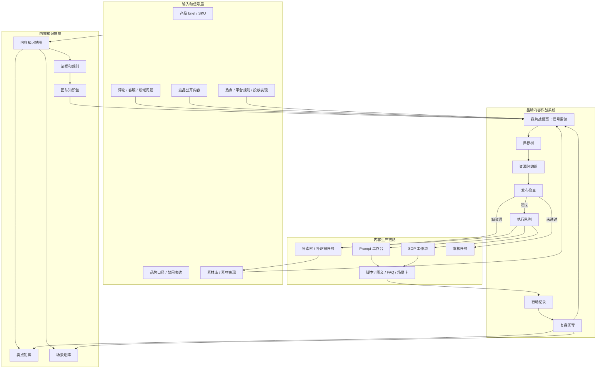
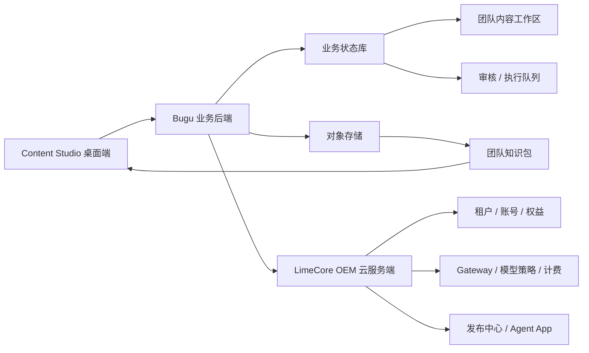
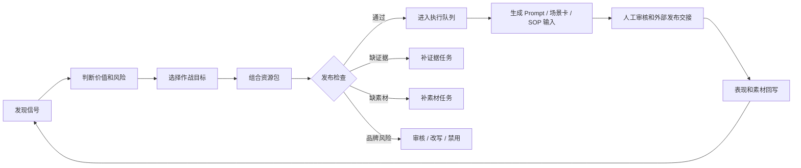
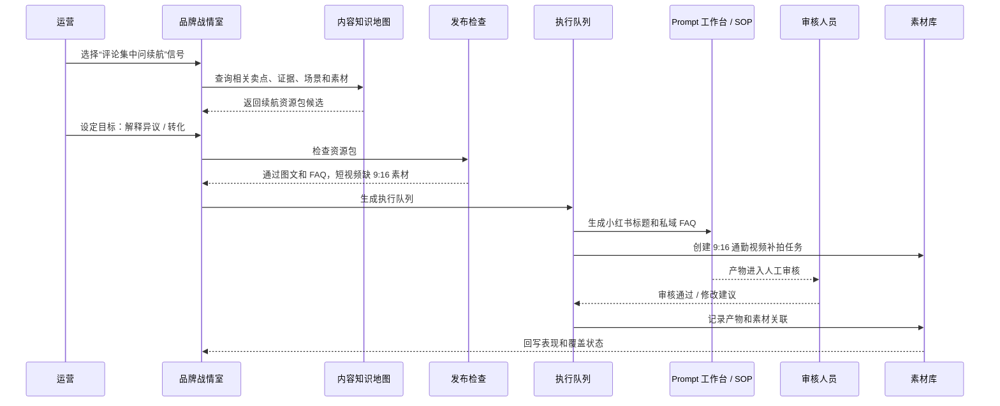
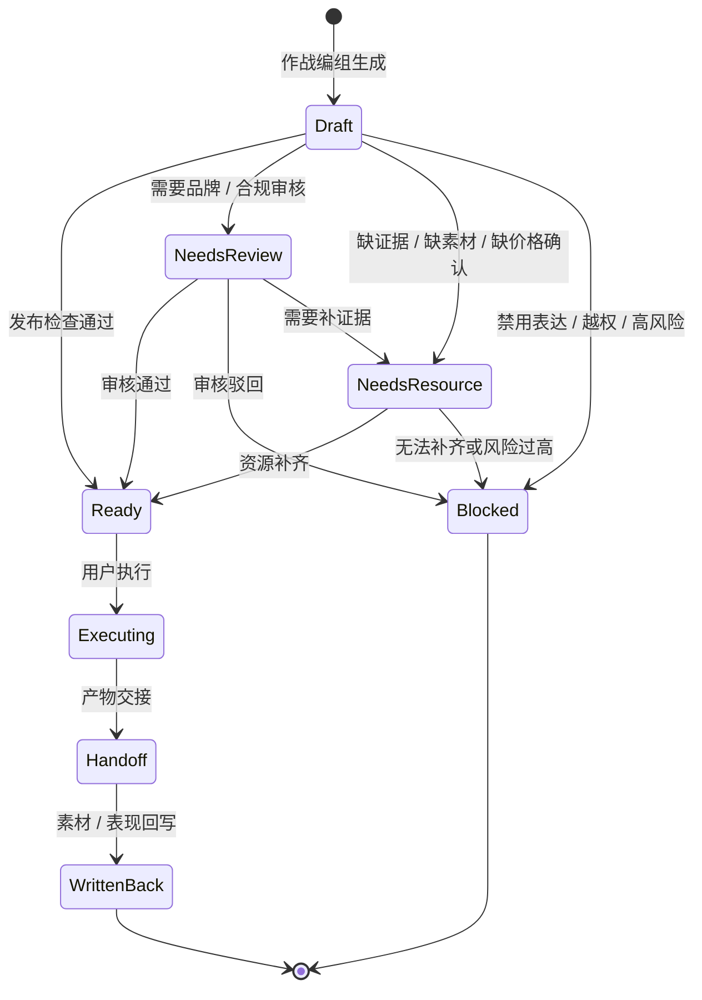
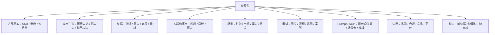
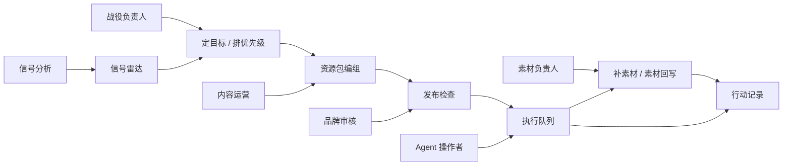
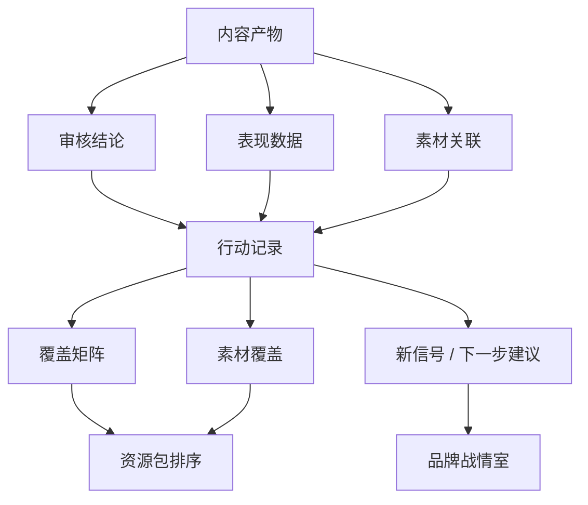
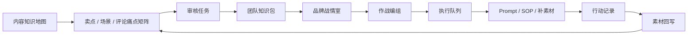

# 品牌内容作战系统图表

更新时间：2026-05-28
状态：Draft

本文是 [`brand-content-command-system.md`](./brand-content-command-system.md) 的图表补充，用于把品牌内容作战系统从“概念说明”落成可讨论的系统结构、流程、状态和时序。

## 1. 总体架构图

## 2. 服务端拓扑图

## 3. 作战闭环流程图

## 4. 用户作战时序图

## 5. 执行队列状态图

## 6. 资源包结构图

## 7. 团队席位和权限图

## 8. 数据回写图

## 9. 页面映射图

