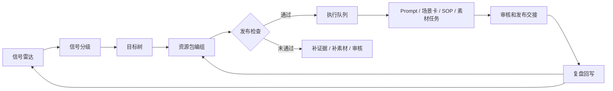

# 品牌内容作战系统 v1

更新时间：2026-05-31
状态：Historical Archive / Retired From Current Client

> 归档说明：本文记录旧品牌战情室方案的历史设计语义。当前 Content Studio 客户端已退役品牌战情室、目标树、作战编组和执行队列运行时；可复用语义只允许沉淀到内容制造批次、阶段恢复任务和生产交接行动记录。当前事实源以 `content-knowledge-maps`、`content-build-runs`、`content-review-tasks`、`content-action-records` 和 `content-knowledge-releases` 为准。

## 1. 设计结论

`内容知识地图` 只解决“内容事实和关系稳定”的问题，还不是品牌内容作战系统。品牌内容作战系统要解决的是：

```text
外部信号快速变化
-> 团队判断目标
-> 调用已审核资源
-> 编组人 / Agent / SOP
-> 执行可审计动作
-> 产物进入内容生产链
-> 数据和素材表现回写
```

因此 v1 必须把能力从“矩阵视图”升级为“内容战情室 + 作战编组 + 执行队列 + 复盘回写”。普通用户仍然不需要知道 Ontology；他们看到的是信号、目标、资源包、发布检查、任务和复盘。

## 2. 不是项目管理，而是内容指挥系统

| 不是 | 是 |
| --- | --- |
| 不是通用项目管理工具。 | 围绕品牌获客、内容生产和内容复盘的轻量指挥层。 |
| 不是自动发帖或舆论操控。 | 所有动作必须通过证据、品牌口径、平台规则和人工审核。 |
| 不是让每个人重新问模型。 | 每个行动都调用团队已审核知识包、素材和提示词依据。 |
| 不是单条 Prompt 生成器。 | 从信号到目标、资源、动作、产物和回写形成闭环。 |
| 不是静态知识库。 | 市场、评论、竞品、素材表现会持续触发新行动。 |

## 3. 作战席位

| 席位 | 用户角色 | 关键问题 | 主要动作 |
| --- | --- | --- | --- |
| 战役负责人 | 增长负责人 / 内容负责人 | 今天该打哪几个目标？ | 选择目标、定优先级、分配资源包和负责人。 |
| 信号分析 | 新媒体运营 / 电商运营 | 哪些信号值得行动？ | 收集评论、竞品、热点、搜索、投放和素材表现信号。 |
| 资源编组 | 内容运营 / 内容工程师 | 用哪些卖点、证据、素材和 SOP？ | 组合资源包、选择提示词依据和内容格式。 |
| 品牌审核 | 品牌负责人 / 审核人员 | 哪些表达可以发布？ | 审核主张、证据、风险、禁用表达和竞品边界。 |
| 素材指挥 | 素材负责人 / 编导 | 缺哪些图、视频、截图和证明？ | 创建补拍、补图、补证据和素材回写任务。 |
| Agent 操作者 | 运营 / 内容工程师 | Agent 可以做什么，不能做什么？ | 触发标准动作、查看拦截原因、写入行动记录。 |

## 4. 核心对象

| 用户可见对象 | 内部对象 | 说明 |
| --- | --- | --- |
| 内容信号 | `Signal` | 评论痛点、竞品动作、热点、平台规则、投放表现、素材表现、品牌风险。 |
| 作战目标 | `Objective` | 拉新、转化、解释异议、补证据、维护品牌口径、价格防守、私域承接。 |
| 作战单元 | `CampaignCell` | 一个目标下的负责人、Agent、渠道、时间窗口、资源包和动作队列。 |
| 资源包 | `ResourceBundle` | 已审核卖点、证据、素材、场景卡、Prompt、SOP、禁用表达和 FAQ。 |
| 发布检查 | `DecisionGate` | 证据、品牌、合规、平台、素材、竞品边界、权限和疲劳检查。 |
| 标准动作 | `ActionType` | 生成 Prompt、创建场景卡、请求审核、补证据、启动 SOP、补素材、回写素材。 |
| 执行队列 | `ExecutionQueue` | 可执行、待审核、被拦截和待补资源的动作列表。 |
| 行动记录 | `ActionLog` | 谁基于哪些信号和资源做了什么，产出了什么，为什么被拦截。 |
| 复盘回写 | `FeedbackLoop` | 内容表现、审核结论、素材覆盖和下一轮行动建议。 |

## 5. 信号雷达

信号不是事实证据，只是行动触发器。信号必须归类、评分、连接目标和资源。

| 信号类型 | 例子 | 可能目标 | 风险边界 |
| --- | --- | --- | --- |
| 评论痛点 | “续航到底够不够”“包里会不会重”。 | 解释异议、转化、FAQ。 | 评论不能证明产品事实，必须回查证据。 |
| 竞品动作 | 竞品主打小巧、露营、大风力。 | 差异化、价格防守、素材补拍。 | 不复制竞品标题、构图、分镜和可识别表达。 |
| 平台热点 | 高温天气、夏日通勤、露营季。 | 拉新、话题内容、短视频脚本。 | 热点不能绕过证据和平台规则。 |
| 投放表现 | 某类标题点击高但转化低。 | 优化转化、补证据、改 CTA。 | 表现数据不能替代产品证据。 |
| 素材表现 | 通勤包内图收藏率高。 | 复用高表现组合、扩展相似场景。 | 高表现只证明内容组合有效，不证明产品事实。 |
| 品牌风险 | 达人想写“绝对安全”。 | 风险拦截、口径维护。 | 禁用表达必须硬拦截。 |
| 搜索 / 私域问题 | “Mini 和 Pro 怎么选”。 | 购买指南、客服 FAQ、直播答疑。 | 价格和库存需要实时确认。 |

信号评分建议：

| 评分项 | 含义 |
| --- | --- |
| 业务价值 | 是否影响拉新、转化、复购、信任或风险。 |
| 证据可用性 | 是否已有产品事实、测试、用户原声或素材。 |
| 时效性 | 是否需要当天响应。 |
| 风险等级 | 是否涉及功效、价格、儿童、安全、竞品比较。 |
| 生产成本 | 是否已有素材和 SOP，是否需要补拍。 |
| 覆盖缺口 | 是否填补矩阵里长期缺失的人群、痛点或场景。 |

## 6. 目标树

作战目标必须比“生成内容”更具体。

| 一级目标 | 二级目标 | 典型产物 |
| --- | --- | --- |
| 拉新 | 抢品类关键词、热点借势、扩大人群覆盖。 | 图文标题、短视频脚本、搜索型文章、达人 Brief。 |
| 转化 | 解释购买异议、对比 SKU、价格防守。 | FAQ、详情页模块、私域话术、直播答疑。 |
| 信任 | 证据解释、品牌背书、售后承诺边界。 | 证据卡、客服回答、品牌口径说明。 |
| 复购 | 使用提醒、场景扩展、配件组合。 | 私域内容、老客福利、复购 SOP。 |
| 风险 | 禁用表达拦截、竞品边界、平台规则适配。 | 审核任务、改写建议、风险记录。 |
| 素材 | 补拍缺口、复用高表现素材、生成素材清单。 | 补拍清单、素材需求、混剪包输入。 |

## 7. 资源包结构

每个资源包必须能回答“凭什么生成、能生成什么、不能说什么、缺什么”。

| 槽位 | 内容 |
| --- | --- |
| 产品事实 | SKU、规格、价格带、使用条件、禁忌条件。 |
| 卖点主张 | 已审核卖点、可用表达、弱表达、禁用表达。 |
| 证据 | 产品文档、测试记录、用户原声、客服问答、素材来源。 |
| 人群 / 痛点 | 目标人群、痛点、异议、购买阶段、原声证据。 |
| 场景 | 时刻、空间、动作、情绪、渠道、内容格式。 |
| 素材 | 图片、视频、截图、案例、证书、报告、可复用标签。 |
| Prompt / SOP | 可用提示词依据、场景卡、SOP 模板和历史高表现动作。 |
| 边界 | 品牌语气、合规规则、竞品不可搬运边界、平台限制。 |
| 缺口 | 缺证据、缺素材、缺审核、缺实时价格或库存确认。 |

## 8. 作战流程



最小闭环：

1. 运营从评论、竞品、投放或素材表现中选择一个内容信号。
2. 战役负责人把信号归入目标树，选择优先级和渠道。
3. 系统推荐资源包：卖点、证据、场景、素材、Prompt、SOP 和禁用边界。
4. 发布检查判断是否可执行。
5. 通过后进入执行队列，生成 Prompt、场景卡、SOP 输入或素材任务。
6. 审核后由用户手动发布到外部渠道。
7. 表现、素材覆盖、审核意见和新问题回写到知识地图和信号雷达。

## 9. 发布检查

| 检查项 | 通过条件 | 未通过处理 |
| --- | --- | --- |
| 证据检查 | 主张有产品事实、测试、用户原声或品牌确认。 | 创建补证据任务，或改成弱表达。 |
| 品牌口径 | 语气、禁用词、承诺边界符合团队知识包。 | 发起审核或改写。 |
| 平台规则 | 不含高风险功效、夸大承诺、违规引导。 | 拦截并记录原因。 |
| 竞品边界 | 不复制竞品可识别表达，不做无证据贬损。 | 改成通用场景对比。 |
| 素材可用 | 产物需要的图片、视频、截图或证明存在。 | 创建补素材清单。 |
| 疲劳和重复 | 不重复近期已发布角度、素材和标题。 | 调整人群、场景或钩子。 |
| 权限 | 当前用户或 Agent 有权执行该动作。 | 转交负责人或进入待授权。 |

## 10. 执行队列

执行队列不是发布队列。它只管理内容生产动作和交接状态。

| 状态 | 含义 |
| --- | --- |
| 可执行 | 通过发布检查，可以生成 Prompt、场景卡或 SOP 输入。 |
| 待审核 | 资源基本齐全，但主张、品牌口径或竞品边界需人工确认。 |
| 待补资源 | 缺证据、缺素材、缺价格确认或缺 SKU 信息。 |
| 已拦截 | 包含禁用表达、无证据承诺、越权动作或平台风险。 |
| 已交接 | Prompt、素材任务或 SOP 输入已生成，等待用户外部发布或导入成品。 |
| 已回写 | 产物表现和素材覆盖已写回。 |

## 11. UI 落地

v1 原型必须覆盖 5 个作战视图：

| 视图 | 第一屏要回答 | 核心组件 |
| --- | --- | --- |
| 品牌战情室 | 今天有哪些信号，哪些目标最值得打？ | 信号雷达、目标树、优先级、风险摘要、今日战役。 |
| 作战编组 | 这个目标需要哪些资源，谁负责，能不能执行？ | 资源包、席位、渠道、时间窗口、发布检查。 |
| 执行队列 | 哪些动作可执行、待审、被拦截、待补资源？ | 动作卡、状态列、拦截原因、补资源入口。 |
| 复盘回写 | 哪些产物有效，哪些要回写，哪些不能当事实？ | 表现摘要、素材覆盖、高表现组合、下一步建议。 |
| 团队知识包 | 作战资源是否来自同一套已审核事实？ | 版本、变更包、冲突、下游消费、发布检查。 |

## 12. v1 工程落地

### MVP

- 在现有内容行动页内增加信号、目标、资源包、发布检查和行动记录。
- 支持从评论痛点、竞品观察和素材表现创建信号。
- 支持从 ready 内容组合生成资源包。
- 执行前跑发布检查，未通过时生成补证据 / 补素材 / 审核任务。

### v1 完整

- 独立品牌战情室视图。
- 作战目标树和资源包模板。
- 执行队列状态列。
- 复盘回写看板。
- 团队知识包版本绑定。
- Agent Knowledge v0.7.2 发布包消费。

### 远景

- 多品牌 / 多战役看板。
- 跨项目资源推荐。
- 实时团队 Hub。
- 自动监测信号和半自动创建行动建议。
- 但仍不做自动发布、虚假互动、刷量或绕过平台规则。

## 13. 验收标准

- 一个评论痛点、竞品动作或素材表现能创建内容信号。
- 一个信号能映射到明确作战目标和优先级。
- 一个目标能生成资源包，且资源包列出卖点、证据、素材、Prompt、SOP 和禁用边界。
- 发布检查能解释为什么通过、待补资源、待审核或被拦截。
- 执行队列能展示可执行动作、待审核动作、补资源任务和已拦截动作。
- 行动记录能串起信号、目标、资源包、执行结果、审核和回写。
- 素材表现和投放表现只作为复盘信号，不能自动变成产品事实。
- 普通用户界面不出现 `Ontology`、`Concept`、`Relation`、`CoverageMatrix`、`PromptGroundingContext`、`DecisionGate`、`ActionLog`、`DraftChange` 等工程术语。
