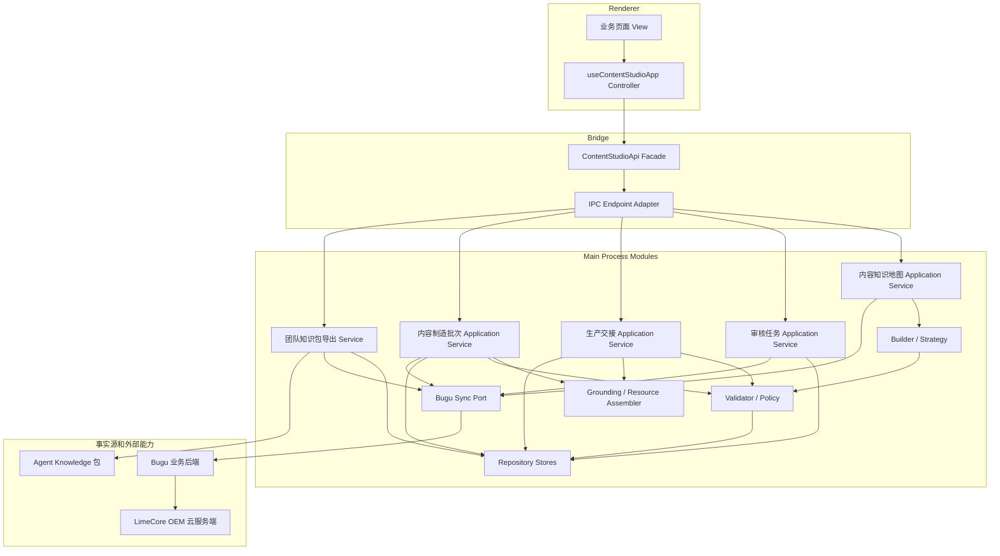
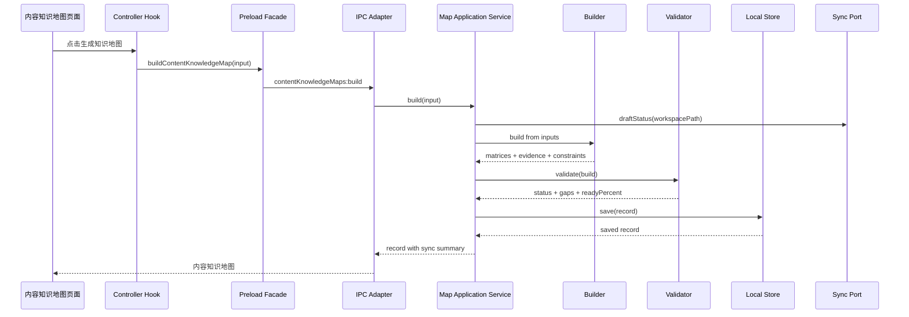
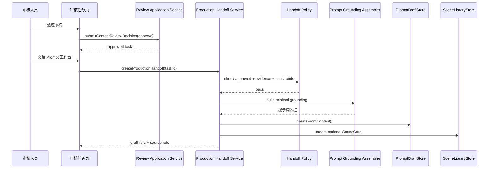
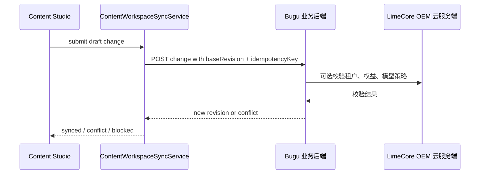

# 内容知识地图 v1 模块设计

更新时间：2026-05-31
状态：Local Verified / Production Evidence Pending

## 1. 设计结论

内容知识地图 v1 不是一个 React 页面，也不是把多个 store 的结果拼成一个大 JSON。它是内容工厂里的“内容工程中间层”，用来把输入源、品牌知识、审核、Prompt、SOP、素材和团队共享串成可追溯闭环。

根据最新 `AGENTS.md` 和 `bugu-product-design-cheatsheet`，v1 模块设计必须从业务 UI 契约倒推，不允许先堆能力入口或后端 helper：

- 先确认用户角色、业务对象、当前状态、唯一主动作、异常恢复和交付物。
- 再确定 renderer View Model、IPC 业务动作、Application Service 和 Store。
- 最后才决定是否接 Bugu 服务端 API、Agent Knowledge 发布包或高级互操作导出。

v1 采用主进程模块化单体设计，后续通过端口接 Bugu 业务后端：

```text
Renderer View
-> Controller Hook
-> Preload Facade
-> IPC Endpoint Adapter
-> Application Service
-> Domain Service / Policy / Assembler
-> Repository Store
-> Port / Adapter
```

核心原则：

- Content Studio 只做桌面工作台、本地缓存、离线草稿和交互编排。
- Bugu 是业务后端事实源，承载团队工作区、知识地图、生成流程、审核任务、生产交接行动记录、素材覆盖和知识包 release。
- LimeCore 只做 OEM 云服务端，承载租户、账号、权益、模型策略、Gateway、发布中心和 Agent App enablement，不承载布谷内容业务对象。
- 普通用户界面只出现“内容知识地图、卖点矩阵、痛点矩阵、场景矩阵、团队知识包、内容制造批次、发布检查、行动记录”等业务语言。
- 内部代码可以保留 `ContentKnowledgeMap`、`Coverage`、`Ontology` 等工程名，但不得泄漏到普通用户主路径。
- 每个新能力先落 Application Service + Store + UI View 的最小纵向闭环，再决定是否拆 strategy / policy / adapter 文件。

禁止的实现方式：

- 在 React 组件中生成矩阵、判断审核状态、决定发布检查或拼接服务端 URL。
- 在 `ipc.ts` 中写业务规则、合并冲突或构造复杂领域对象。
- 在 Bugu Worker 的路由大函数里直接堆内容业务规则；服务端内容对象需要独立 service / policy / store helper 后再挂路由。
- 在 Bugu API 未接通时把本地 JSON、共享目录或 Agent Knowledge 包伪装成团队事实源。
- 为了“远景”提前引入图数据库、CRDT、实时协作或完整 RDF / OWL 编辑器。

业务 UI 契约事实源：[`business-ui-contract.md`](./business-ui-contract.md)。

## 2. 总体模块图



## 3. Bounded Context

| 上下文 | 用户看到的能力 | 主服务 | 核心模式 | 不做什么 |
| --- | --- | --- | --- | --- |
| Knowledge Map | 内容知识地图、卖点矩阵、痛点矩阵、场景矩阵、缺口。 | `ContentKnowledgeMapApplicationService` | Application Service + Builder Strategy + Repository | 不做审核决策、不直接发布下游产物。 |
| Review | 审核任务、证据、来源、禁用表达、风险处理、改名 / 合并 / 拆分。 | `ContentReviewTaskApplicationService` | State Machine + Append Decision + Map Mutation | 不替用户自动通过，不把未通过内容交给生产链路，不在 renderer 中直接改矩阵。 |
| Production Handoff | 提示词依据、生成 Prompt 草稿、创建场景卡、SOP 输入。 | `ContentProductionHandoffService` | Policy + Assembler + Target Adapter | 不绕过审核，不注入完整原文，不直接自动发布平台。 |
| Team Knowledge Prompt | 团队知识包详情页生成 Prompt 草稿。 | `ContentTeamKnowledgePromptDraftService` | Application Service + Release Scope Gate + Prompt Assembler | 不在 React 中拼业务依据，不允许其他地图的 release 误绑定当前项目，不把包元数据当产品事实。 |
| Material Feedback | 素材覆盖、表现标签、待确认补充、高表现组合。 | `ContentMaterialFeedbackService` | Feedback Loop + Supplement Policy | 不把素材表现自动当成产品事实证据，不改写已发布主文案。 |
| Team Sharing | 团队工作区、未同步草稿、变更包、冲突、影响内容、知识包版本。 | `ContentWorkspaceSyncService` | Port / Adapter + Revision Policy | 不把本地 JSON 或共享目录当团队事实源，不做未审核自动合并。 |
| Knowledge Pack | 团队知识包、Agent Knowledge v0.7.x 导出、发布包 zip。 | `AgentKnowledgeContentExportService` | Export Assembler + Validation | 不导出凭证、本机绝对路径和未审核高风险主张。 |

## 4. 设计模式约束

模式选型必须服务当前业务对象，不能为了显得完整而提前抽象。v1 默认只使用以下模式：

| 模式 | 用在 | 不用在 |
| --- | --- | --- |
| Application Service | 每个粗粒度用户动作的主进程编排。 | 不放到 React 组件或 Bugu 路由大函数里。 |
| Controller Hook | renderer 侧聚合状态、调用 preload、生成 View Model。 | 不承载业务规则、审核迁移或发布检查。 |
| Repository / Store | 本地缓存、离线草稿、运行临时产物。 | 不作为团队事实源，不判断业务通过。 |
| Builder Strategy | 抽取卖点、痛点、场景、IP 口径、竞品结构。 | 不直接落盘，不绕过校验。 |
| Policy / Specification | 审核、发布检查、团队同步、导出安全。 | 不散落在 UI 条件判断中。 |
| State Machine | 审核任务、内容制造批次、同步状态、知识包版本。 | 不靠自由字符串随意改状态。 |
| Assembler | 生产交接、资源包、知识包导出。 | 不把完整原文或完整知识地图塞给下游。 |
| Port / Adapter | Bugu 同步、模型能力、对象存储、Agent Knowledge 发布。 | 不在业务模块里直接拼 URL。 |

暂不引入：

- Graph Database Repository：v1 结构化 JSON 足够，图数据库等服务端事实模型稳定后再评估。
- CRDT / Realtime Collaboration：v1 做服务端 revision + 离线草稿 + 冲突队列。
- Event Sourcing 全量账本：审核记录、行动记录 append-only；其他对象先用 revision。
- Generic Plugin Runtime：内容作战标准动作先明确类型，不做任意脚本执行。

### 4.1 Application Service

每条用户动作进入 main 进程后，必须由一个 Application Service 编排。IPC 只做参数转发、错误返回和服务装配。

```text
UI action
-> IPC handler
-> ApplicationService.method(input)
-> domain service / policy / store
-> view record / result
```

当前已落地：

- `ContentKnowledgeMapApplicationService`
- `ContentReviewTaskApplicationService`
- 旧内容制造批次应用服务已退役，不再作为当前模块扩展点。

后续继续按这个命名和职责扩展：

- `ContentProductionHandoffService`
- `ContentMaterialFeedbackService`
- `ContentWorkspaceSyncService`

### 4.2 Repository / Store

Store 只负责读写本地缓存和离线草稿，路径在工作区 `.content-studio/` 下。Store 不生成业务结论、不调用模型、不判断发布状态、不合并团队冲突。

```text
list(workspacePath)
save(record)
update(record)
append(record)      # 只用于审核决策、行动记录等 append-like 数据
```

团队共享上线后，Bugu 才是事实源；本地 Store 只保存最近快照、未同步草稿、导出预览和失败兜底。

### 4.3 Strategy / Builder

构建逻辑按输入类型拆 strategy；当前实现先放在单个 builder 内的纯函数中，等规则稳定再拆文件，避免过早抽象。

| Strategy | 输入 | 输出 |
| --- | --- | --- |
| `ProductBriefMapStrategy` | 产品 brief、SKU 表、品牌知识库。 | 产品事实、卖点、收益、约束。 |
| `FeedbackMapStrategy` | 评论、客服问题、差评、用户访谈。 | 痛点、异议、用户原声、标题方向。 |
| `IpVoiceMapStrategy` | IP 六层知识库、IP 场景延伸记录。 | IP 立场、语言规则、场景矩阵和漂移边界。 |
| `SceneMapStrategy` | 场景卡、素材表现、PromptDraft。 | 场景矩阵、素材建议、下游任务。 |
| `ComplianceMapStrategy` | 合规边界、禁用表达、证据材料。 | 风险约束、审核任务、缺证据项。 |
| `CompetitorMapStrategy` | 竞品观察、公开页面、人工记录。 | 差异机会、风险边界、不可搬运提醒。 |

约束：

- Builder 只生成候选结构和摘要，不写文件。
- Builder 输出必须经过 Validator。
- LLM 推断必须标记为待确认，不能直接进入可发布状态。
- 当前实现仍在 `contentKnowledgeMapBuilder.ts` 内，以纯函数覆盖产品资料、SKU 表、用户反馈、IP 六层知识库、竞品观察、场景卡和 Prompt 草稿；等输入规则稳定后再拆成 strategy 文件。

### 4.4 Policy / Specification

审核、发布检查、团队同步和导出校验都用 Policy 表达，不把判断散落在 UI 或 Store 里。

建议拆分：

| Policy | 职责 |
| --- | --- |
| `ContentMapValidationPolicy` | 判断知识地图质量、证据状态、禁用 / 绝对化表达、IP 漂移、竞品 ready 风险、缺口和 blocked 原因。 |
| `ContentMatrixRiskPolicy` | 统一识别禁用表达、禁用标记、竞品直交和 IP 口径漂移，供校验、审核任务和生产交接复用。 |
| `ReviewDecisionPolicy` | 将审核动作转换为任务状态，限制非法状态迁移。 |
| `ProductionHandoffPolicy` | 只允许审核通过、证据可追溯、无禁用表达、无竞品直交、无 IP 漂移的组合进入 Prompt / 场景 / SOP。 |
| `ContentBatchGatePolicy` | 批次阶段推进前检查输入完整度、审核、素材、权限、渠道边界和恢复任务。 |
| `TeamSyncRevisionPolicy` | 检查 `baseRevision`、冲突、幂等键和 append-only 对象。 |
| `KnowledgePackExportPolicy` | 导出前检查敏感数据、本机路径、凭证和未审核主张。 |

### 4.5 State Machine

审核任务、内容制造批次、团队同步和知识包版本都必须有显式状态机，禁止靠字符串随意改状态。

审核任务：

```text
open
-> approved
-> rejected
-> needs-evidence
-> forbidden
-> open (downgrade-to-needs-verification / rename-target / merge-related / split-target)
approved -> open (改名 / 合并 / 拆分后重新审核)
needs-evidence -> needs-evidence (缺证据条目调整后仍需补证据)
```

内容制造批次：

```text
draft
-> ready
-> running
-> approved
needs-human
blocked
rejected
```

团队同步：

```text
local-only
-> pending-sync
-> synced
-> conflict
-> blocked
```

规则：

- `approved` 才能进入生产交接。
- `forbidden`、`rejected`、`needs-evidence` 不能进入确定性 Prompt。
- 竞品观察行不能直接进入 PromptDraft，必须先转写为本品牌已审核卖点或场景。
- IP 行必须携带核心立场和语言规则边界；疑似漂移表达进入 blocked。
- append-only 对象只能追加，不允许静默覆盖。

### 4.6 Assembler / Factory

跨模块交接必须通过 Assembler 生成“最小相关上下文”，不要把完整知识地图或完整文档塞给下游。

| Assembler | 输出 |
| --- | --- |
| `PromptGroundingAssembler` | 提示词依据：相关卖点、证据、约束、禁用表达、来源引用。 |
| `SceneCardAssembler` | 场景卡：人群、痛点、卖点、场景、渠道、优先级。 |
| `ResourceBundleAssembler` | 资源包：可用矩阵行、素材、FAQ、Prompt、SOP、规则和缺口。 |
| `KnowledgePackAssembler` | Agent Knowledge 包文件结构和 manifest。 |

### 4.7 Ports and Adapters

外部事实源、服务端同步、对象存储和模型能力都走端口，不让业务模块直接拼 URL 或读取生产配置。

```ts
interface ContentKnowledgeMapSyncPort {
  draftStatus(workspacePath: string): Promise<ContentKnowledgeMapTeamSyncSummary>;
  pushDraft(input: PushDraftInput): Promise<SyncResult>;
  pullWorkspace(input: PullWorkspaceInput): Promise<WorkspaceSnapshot>;
  publishRelease(input: PublishReleaseInput): Promise<ReleaseResult>;
}
```

实现分两类：

- `LocalOnlyContentKnowledgeMapSyncAdapter`：离线兜底，只返回“本机草稿，待同步 Bugu”。
- `BuguContentWorkspaceSyncAdapter`：已接入 `/Users/coso/Documents/dev/ai/bugu/bugu` 的最小团队工作区、变更包、审核任务、审核结论、同步冲突、行动记录、素材覆盖、知识包版本和发布包对象登记 API；Bugu 控制台已完成团队内容工作区面板、同步冲突查看、逐项合并处理清单、清单落库审计、处理方向记录、知识包可分发状态展示、默认版本回滚、待确认版本批准、多步骤确认进度展示和工作区默认确认模板切换；Content Studio 桌面端已完成同步冲突列表、版本差异提示、逐项合并处理清单、处理方向记录、素材覆盖待确认补充、团队知识包可下载状态、Prompt 草稿版本绑定、SOP 运行记录版本追溯和内容制造批次阶段恢复；生产公开下载执行报告和真实双账号验收仍属于生产证据待补。

禁止新增 `LimeCoreContentSyncAdapter` 承载业务对象。LimeCore 只能由 Bugu 侧用于租户、账号、权益、模型策略、Gateway、发布中心和 Agent App enablement。

### 4.8 Presenter / View Model

renderer 只消费适合 UI 的业务记录，不直接操作内部图谱对象。

`ContentKnowledgeMapRecord` 应包含：

- `coverage.readyPercent`
- `sellingPoints`
- `painPoints`
- `scenarios`
- `evidence`
- `constraints`
- `gaps`
- `teamSync`

UI 负责选择、展示、筛选和触发动作；矩阵行状态、审核状态和发布检查结果由 main 侧生成。

当前矩阵 View Model：

- `src/shared/contentMatrixPlanning.ts` 负责把矩阵行转换成可展示计划，包含状态 / 素材 / 关键词筛选、优先级 / 可信度 / 证据 / 素材缺口排序、分页、本批摘要和风险计数。
- 当前矩阵消费层只消费计划结果，负责选择本页条目、显示本批摘要和触发审核任务生成；旧独立知识地图页面已退役。
- `ContentReviewTaskApplicationService` 通过 `targetRowIds` 生成指定矩阵行审核任务；ready 行可送审，未选行和缺口不会混入本批。
- UI 文案保持“本批、条目、审核任务、证据、素材、竞品边界、IP 口吻”等业务语言，不暴露内部覆盖矩阵对象名。

### 4.9 Business UI Contract Gate

每个 View / Module 必须在实现前写清楚：

```text
目标用户
正在处理的业务对象
输入物
当前状态
唯一主动作
用户决策点
系统反馈
异常恢复
最终交付物
```

如果页面无法回答这些问题，先回到 PRD 和 `business-ui-contract.md`，不进入 UI 或代码实现。

### 4.10 Bugu Server Application Service

Bugu 是团队事实源，但 Bugu 侧不能把内容业务继续塞进 OEM 路由大函数。建议服务端按同样模式拆分：

```text
HTTP Route Adapter
-> ContentWorkspaceApplicationService
-> RevisionPolicy / PublishPolicy / ConflictPolicy
-> ContentWorkspaceRepository
-> State Store / SQL Store
```

服务端最小模块：

| 模块 | 职责 | 设计模式 |
| --- | --- | --- |
| `contentWorkspaceService` | 工作区、revision、权限上下文、快照摘要。 | Application Service |
| `contentDraftChangeService` | 提交变更包、幂等、冲突检测。 | Application Service + Revision Policy |
| `contentKnowledgeReleaseService` | 发布团队知识包、校验、记录发布版本。 | Application Service + Publish Policy |
| `contentAuditLogService` | 关键写操作审计。 | Append-only Record |
| `contentRepository` | 读写 Bugu state / SQL。 | Repository |

服务端写接口必须统一检查：

- `tenantId` 和业务工作区权限。
- `baseRevision`，冲突返回明确 `409`，不能 silent last-write-wins。
- `idempotencyKey` 或对象 `id`，重复提交返回已存在结果。
- 发布检查、审核状态和敏感数据检查。
- LimeCore 只做租户、账号、权益、模型策略、Gateway、发布中心和 Agent App enablement 校验，不保存内容业务对象。

## 5. 目录规划

### 5.1 已落地文件

```text
src/shared/types.ts
src/shared/contentMatrixPlanning.ts
src/main/services/contentKnowledgeMapStore.ts
src/main/services/contentKnowledgeMapBuilder.ts
src/main/services/contentKnowledgeMapValidator.ts
src/main/services/contentKnowledgeMapApplicationService.ts
src/main/services/contentKnowledgeMapSyncPort.ts
src/main/services/contentReviewTaskStore.ts
src/main/services/contentReviewTaskBuilder.ts
src/main/services/contentReviewTaskApplicationService.ts
src/main/services/agentKnowledgeContentExportService.ts
src/main/ipc.ts
src/preload/index.ts
旧独立知识地图、审核任务和内容制造批次页面已退役；当前入口收敛到知识库、素材库、Prompt 工作台和 Agents。
```

### 5.2 P5 生产交接模块

```text
src/main/services/contentProductionHandoffService.ts
src/main/services/contentProductionHandoffPolicy.ts
src/main/services/promptGroundingAssembler.ts
src/main/services/sceneCardAssembler.ts
src/main/services/productionActionRecordService.ts
```

落地顺序：

1. 只允许 `approved` 审核任务交接。
2. 从对应知识地图取相关矩阵行、证据、约束和来源。
3. 生成提示词依据。
4. 创建 PromptDraft，可选创建 SceneCard。
5. 写入行动记录或本地交接摘要。
6. 返回可追溯结果给 UI。

### 5.3 P6 素材回写模块

```text
src/main/services/contentMaterialFeedbackService.ts
src/main/services/materialCoverageAssembler.ts
src/main/services/materialFeedbackPolicy.ts
```

原则：

- 素材表现是排序和复盘信号，不是事实证据。
- 高表现组合可以推荐复用，但必须重新经过渠道、证据和品牌边界检查。

### 5.4 P9 团队共享模块

```text
src/main/services/contentWorkspaceSyncService.ts
src/main/services/contentDraftChangeStore.ts
src/main/services/contentKnowledgeReleaseStore.ts
src/main/services/buguContentWorkspaceSyncAdapter.ts
```

原则：

- Bugu 业务后端保存团队 revision、审核、行动记录、素材覆盖和 release 元数据。
- 本地 `.content-studio/` 保存缓存、离线草稿和导出预览。
- LimeCore 不保存布谷内容业务对象。

## 6. 主流程时序

### 6.1 生成内容知识地图



### 6.2 审核到生产交接



### 6.3 团队共享



## 7. 接口设计规则

IPC 命名必须是粗粒度业务动作，不暴露本地 JSON 细节：

| 能力 | IPC / API 方法 | 返回 |
| --- | --- | --- |
| 内容知识地图列表 | `listContentKnowledgeMaps(workspacePath)` | `ContentKnowledgeMapRecord[]` |
| 生成知识地图 | `buildContentKnowledgeMap(input)` | `ContentKnowledgeMapRecord` |
| 审核任务列表 | `listContentReviewTasks(workspacePath)` | `ContentReviewTask[]` |
| 生成审核任务 | `generateContentReviewTasks(input)`；可传 `targetRowIds` 只生成本批矩阵行审核任务。 | `ContentReviewTask[]` |
| 提交审核决策 | `submitContentReviewDecision(input)` | `ContentReviewTask` |
| 生产交接 | `createContentProductionHandoff(input)` | `ContentProductionHandoffResult` |
| 导出团队知识包 | `exportContentKnowledgePack(input)` | `ContentKnowledgePackExportResult` |

新增 IPC 必须同步四侧：

- `src/shared/types.ts`
- `src/main/ipc.ts`
- `src/preload/index.ts`
- `src/renderer/src/` 调用方

## 8. 服务端边界

Bugu 业务后端需要提供：

- `content workspaces`
- `knowledge maps`
- `build runs`
- `review tasks`
- `coverage`
- `content batches`
- `stage recovery tasks`
- `action records`
- `material coverage`
- `knowledge releases`

Content Studio 只通过 main 进程同步服务调用 Bugu API。renderer 不直接拼 URL，不直接写服务端状态。

当前收敛口径：

- `content-knowledge-maps` 是团队内容知识地图 current 服务端事实源，承载可审核矩阵快照、覆盖摘要、质量摘要和服务端版本。
- `content-build-runs` 是生成流程 current 服务端事实源，承载模型、输入集合、步骤、blocked 原因和质量问题。
- `content-action-records` 是生产交接行动记录 current 服务端事实源，承载 Prompt 草稿、场景卡、SOP 运行、素材覆盖回写、补素材交付包、操作者角色和服务端版本。
- `content-draft-changes` 是 compat 变更包入口，只用于提交本机变更、冲突检测和离线协作，不再承载团队主快照。
- 旧 `content-command-centers` 和 `content-execution-queue` 不再是当前客户端事实源；历史语义只允许沉淀为内容制造批次、阶段恢复任务和生产交接行动记录。
- `.content-studio/content-knowledge-maps.json` 和 `.content-studio/content-knowledge-map-build-runs.json` 是桌面本机缓存和离线草稿，不是团队共享事实源；旧内容制造批次本机缓存已退役。

构建链路：

```text
Renderer
-> IPC contentKnowledgeMaps:build
-> ContentKnowledgeMapApplicationService
-> ContentKnowledgeMapStore / ContentKnowledgeMapBuildRunStore
-> BuguContentWorkspaceSyncAdapter
-> /api/v1/oem/content-knowledge-maps
-> /api/v1/oem/content-build-runs
-> /api/v1/oem/content-action-records
```

LimeCore 只在 Bugu 侧作为 OEM 云底座被调用，典型场景包括租户、账号、权益、模型策略、Gateway、发布中心和 Agent App enablement。

## 9. 验收标准

- React 组件中没有矩阵构建算法、审核状态迁移算法或发布检查算法。
- IPC 只暴露粗粒度业务动作。
- Application Service 负责编排，Builder / Policy / Assembler / Store 职责单一。
- Store 不伪造服务端同步、发布成功或团队共享状态。
- `approved` 之前不能进入 PromptDraft、SceneCard 或 SOP 确定性生产链路。
- 普通用户 UI 不出现 `Ontology`、`Concept`、`Relation`、`CoverageMatrix`、`PromptGroundingContext`、`DecisionGate`、`ActionLog` 等工程术语。
- Bugu / LimeCore / Content Studio 职责在文档、代码注释和 UI 状态里不混淆。
