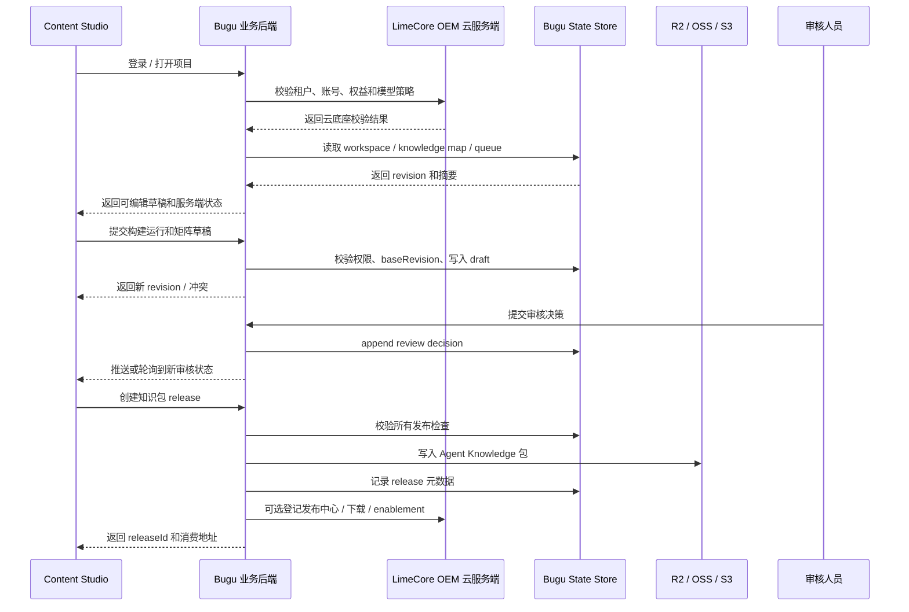
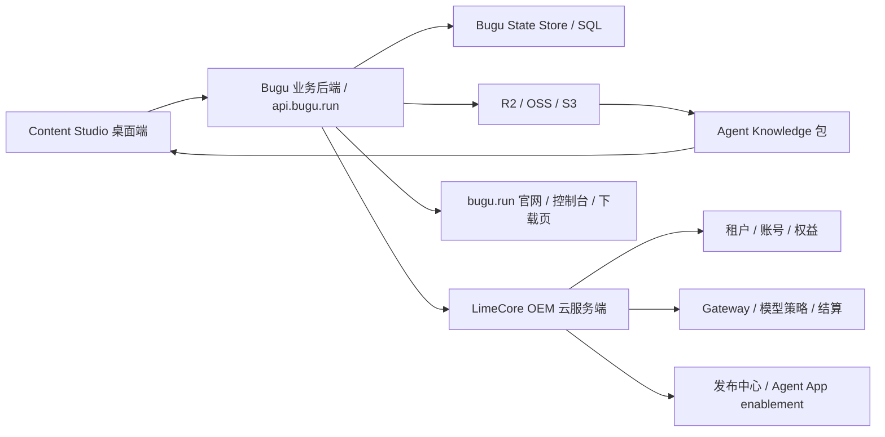

# 服务端集成方案

更新时间：2026-05-31
状态：Local Verified / Production Evidence Pending

## 1. 设计结论

内容制造和生产交接不能只靠桌面端本地目录实现。团队共享、权限、跨设备、发布、审计、素材分发和行动复盘都需要服务端事实源。

本次口径收口为：

```text
Bugu 业务后端事实源 + LimeCore OEM 云服务端 + Content Studio 桌面工作台缓存 + Agent Knowledge 发布包
```

明确废弃以下旧口径，不再作为设计或实现依据：

```text
纯本地 JSON + 手动共享目录
把 OEM 云服务端当内容业务事实源
把 Bugu 业务后端降级成官网或代理层
```

事实源声明：

| 分类 | Surface | 结论 |
| --- | --- | --- |
| current | `/Users/coso/Documents/dev/ai/bugu/bugu` | 布谷内容工厂业务后端。承载内容工作区、知识地图、生成流程、审核任务、生产交接行动记录、素材覆盖、知识包 release 元数据、官网 / 控制台和 API。 |
| current | `/Users/coso/Documents/dev/ai/limecloud/limecore` | OEM 云服务端。承载租户、账号、权益、发布中心、Agent App enablement、模型策略、Gateway、计费和审计等云底座能力。 |
| current | `/Users/coso/Documents/dev/ai/limecloud/content-studio` | 桌面内容生产工作台。本地缓存、离线草稿、生成交互、审核 UI、内容制造批次 UI 和导出预览。 |
| compat | 手动导出包、共享目录、Git repo | 离线交付、审计归档、灾备和小范围人工交换。不能作为 v1 团队事实源。 |
| deprecated | “OEM 云服务端 = 内容业务事实源” | 已废弃口径。LimeCore 只做 OEM 云底座，不承载布谷内容业务对象。 |
| dead | 只靠本地 `.content-studio/` 做团队共享 | 不满足跨设备、权限、审计和发布要求。 |

## 2. 现有服务端事实

### 2.1 Bugu 业务后端

仓库：

```text
/Users/coso/Documents/dev/ai/bugu/bugu
```

已存在的相关能力：

- 官网和控制台入口：`bugu.run`、`/login/`、`/console/`。
- 品牌 API：`https://api.bugu.run/api`。
- Worker API 入口：`workers/api-proxy/src/index.js`。
- 本地 API 服务：`npm run api:dev`，脚本为 `scripts/oem-api-server.mjs`。
- 站点 / 业务内容：site-config、cases、materials、downloads、feature-flags、assets、publish / rollback。
- 存储适配：Cloudflare D1 / R2 / KV，本地 `.bugu/oem-store.json`，以及 SQL State Store、HTTP Asset Store、OSS / S3 兼容上传网关。
- 鉴权适配：可用 Bugu 管理 token，也可调用 LimeCore 会话 / 租户管理员角色校验。

因此，内容制造和生产交接业务对象应落在 Bugu 业务后端，而不是 LimeCore。

### 2.2 LimeCore OEM 云服务端

仓库：

```text
/Users/coso/Documents/dev/ai/limecloud/limecore
```

已存在的相关能力：

- `services/control-plane-svc/`：OEM 商业云底座，承载租户、账号、组织成员、角色、权益、订阅、积分、模型策略、Agent App enablement、审计和发布中心。
- `services/gateway-svc/`：统一 AI Gateway，承载模型调用、usage reservation、结算和审计。
- `packages/api-client/index.ts`：已有 public tenants、client bootstrap、desktop auth sessions、client session、skills、service-skills、site-adapters、agent-apps、Agent App enablements、audit logs 和 tenant release API。

LimeCore 在本方案里的职责是 OEM 云底座，不保存布谷业务的知识地图、矩阵、审核任务和行动记录。

## 3. 职责分层

| 层级 | 所属仓库 / 服务 | current 职责 | 不做什么 |
| --- | --- | --- | --- |
| 桌面工作台 | `limecloud/content-studio` | 生成、审核、矩阵操作、内容制造批次、生产交接 UI、本地缓存、离线草稿、导出预览。 | 不做团队事实源，不做长期权限中心，不直接写服务端数据库。 |
| 业务后端 | `bugu/bugu` / `api.bugu.run` | 内容工作区、知识地图、构建运行、审核任务、覆盖矩阵、生产交接行动记录、素材覆盖、知识包 release 元数据、对象存储适配。 | 不重复建设 OEM 云底座，不绕过 LimeCore 租户、权益和模型策略。 |
| OEM 云底座 | `limecore/services/control-plane-svc` | 租户、账号、成员、角色、权益、模型策略、发布中心、Agent App enablement、审计。 | 不承载布谷内容业务对象。 |
| 模型与结算 | `limecore/services/gateway-svc` | 服务端模型调用、usage reservation、审计和结算。 | 不让业务端绕过租户模型策略。 |
| 对象存储 | R2 / OSS / S3 / 私有对象服务 | 素材、导出包、下载包、预览资源。 | 不存业务权限和审核状态。 |
| Agent Knowledge 包 | Bugu 发布产物，可登记到发布中心 | 给 Prompt、SOP、Agent 客户端消费的稳定知识版本。 | 不作为编辑态事实源。 |

## 4. Bugu 业务事实对象

v1 业务后端应在 Bugu 新增或扩展以下事实对象：

| 对象 | Bugu 服务端用途 |
| --- | --- |
| `ContentWorkspace` | 租户下的品牌 / 产品 / IP 内容工程项目。 |
| `KnowledgeMap` | 内容知识地图版本、状态和质量摘要。 |
| `BuildRun` | 构建运行、步骤、模型、blocked 原因和质量问题。 |
| `ReviewTask` | 主张、证据、禁用表达、竞品边界和 IP 漂移审核任务。 |
| `CoverageMatrix` | 卖点、痛点、人群、场景、素材和证据覆盖状态。 |
| `ActionRecord` | 生产交接行动记录、输入、输出、操作者、拦截原因和回写结果。 |
| `MaterialCoverage` | 素材覆盖组合、审核结论和表现标签。 |
| `KnowledgeRelease` | 团队知识包版本、Agent Knowledge 包路径和消费状态。 |

桌面端可以有本地缓存，但最终团队共享、跨设备协同和发布状态必须回到 Bugu 业务后端。

## 5. API 分组

建议挂在 Bugu API 下：

```text
/api/v1/content/workspaces/*
/api/v1/content/knowledge-maps/*
/api/v1/content/build-runs/*
/api/v1/content/review-tasks/*
/api/v1/content/coverage/*
/api/v1/content/action-records/*
/api/v1/content/material-coverage/*
/api/v1/content/knowledge-releases/*
```

如果需要兼容当前 Bugu OEM API 命名，可先挂在：

```text
/api/v1/oem/content-workspaces/*
/api/v1/oem/content-knowledge-maps/*
/api/v1/oem/content-build-runs/*
/api/v1/oem/content-draft-changes/*
/api/v1/oem/content-review-tasks/*
/api/v1/oem/content-review-decisions/*
/api/v1/oem/content-sync-conflicts/*
/api/v1/oem/content-action-records/*
/api/v1/oem/content-material-coverage/*
/api/v1/oem/content-knowledge-releases/*
```

公共读取只暴露已发布版本：

```text
/api/v1/public/content/knowledge-releases/:releaseId
/api/v1/public/content/assets/:assetId
```

原则：

- Bugu 业务后端负责业务写入、revision、冲突、审核、生产交接行动记录和知识包 release 元数据。
- 写接口必须带租户上下文、操作者、角色和幂等键。
- 租户、账号、权益、模型策略和 Agent App 发布中心可调用 LimeCore 校验或登记。
- 生产环境必须有持久化存储，不能静默退回内存。

## 5.1 Bugu 服务端模块设计

Bugu 承载团队事实源，但内容业务不能继续直接堆进 OEM 路由大函数。v1 服务端应按小型模块化单体落地：

```text
Route Adapter
-> Content Application Service
-> Policy / State Machine
-> Repository
-> State Store / SQL Store
```

建议模块：

| 模块 | 主要职责 | 设计模式 |
| --- | --- | --- |
| `contentWorkspaceService` | 工作区列表、创建、绑定 tenant、读取当前 revision。 | Application Service |
| `contentKnowledgeMapService` | 保存知识地图快照、质量摘要和服务端版本。 | Application Service + Repository |
| `contentDraftChangeService` | 提交变更包、幂等、baseRevision 冲突检测。 | Application Service + Revision Policy |
| `contentReviewService` | 审核任务、审核决策和 append-only 记录。 | State Machine + Append-only Record |
| `contentActionService` | 生产交接动作和行动记录。 | Command Pattern + Policy |
| `contentMaterialCoverageService` | 素材覆盖、表现标签和回写。 | Feedback Policy |
| `contentKnowledgeReleaseService` | 团队知识包版本、发布检查和对象存储登记。 | Publish Policy + Repository |

当前实现已覆盖工作区、知识地图快照、构建运行摘要、变更包、审核任务、生产交接行动记录、素材覆盖、素材补充审核任务、同步冲突、逐项合并处理清单、服务端清单落库审计、知识包 release、发布包对象存储登记、默认版本回滚、发布审批、工作区默认确认模板、桌面端 release 拉取、两账号只读在线验收入口、知识包下载验收入口和 v1 在线验收总报告输出的最小纵向闭环；生产证据重点转向真实生产下载执行报告和真实账号报告归档。

当前落地状态：

- Bugu 业务后端已新增最小团队事实源 API：`content-workspaces`、`content-knowledge-maps`、`content-build-runs`、`content-draft-changes`、`content-review-tasks`、`content-review-decisions`、`content-sync-conflicts`、`content-action-records`、`content-material-coverage`、`content-knowledge-releases`；旧 `content-command-centers` 和 `content-execution-queue` 只作为服务端历史兼容，不是当前客户端事实源。
- Content Studio 已通过 `BuguContentWorkspaceSyncAdapter` 同步知识地图快照、同步构建运行摘要、提交变更包、同步审核任务、提交审核结论、追加行动记录、同步素材覆盖并发布团队知识包版本。
- Bugu `content-knowledge-maps` 是团队版内容知识地图 current 服务端事实源，保存标题、状态、模型、来源 ID、质量摘要、覆盖摘要和可审核矩阵快照；桌面端本地 JSON 只是本机缓存，`content-draft-changes` 只承担变更包和冲突处理，不再承担读取主快照的职责。
- Bugu `content-build-runs` 是生成流程 current 服务端事实源，保存模型、输入集合、质量问题和步骤摘要；重复提交同一构建运行 ID 保持幂等，不推进 revision。
- Bugu `content-action-records` 是生产交接行动记录 current 服务端事实源，保存 Prompt 草稿、场景卡、SOP 运行、素材覆盖变更、审核任务引用、补素材交付文件引用和操作者角色；桌面端 `content-batches.json` 是本机内容制造批次缓存，不是团队共享事实源。
- Bugu `content-review-decisions` 已保存审核调整 payload 和 before / after 快照；Content Studio 会先提交知识地图变更包再提交审核结论，团队成员既能拿到调整后的矩阵，也能追溯调整输入。
- Bugu `content-action-records` 已保留 Prompt 草稿、场景卡、SOP 运行、素材覆盖变更、审核任务引用、补素材交付文件引用和操作者角色 `actorRole`，团队刷新行动记录时不会丢失下游产物 ID、交付包线索或权限审计字段；追加行动记录时会按认证角色做服务端权限校验。
- Bugu `content-action-records` 已把交付物引用安全校验前移到服务端：直接写入本机绝对路径、`file://`、临时目录路径或带 `api_key / token / secret / password` 查询参数的 `artifactRefs` 会返回 `400`，不能只依赖桌面端脱敏或验收脚本事后拦截。
- Bugu `content-action-records` 已补生产交接动作保真：Prompt 草稿、场景卡、SOP 运行、素材覆盖回写、补素材交付包和 blocked 记录可以保存、分页筛选和返回；控制台文案以业务动作展示，不降级成泛化“内容动作”。
- Bugu 团队高频列表已支持服务端分页和筛选：审核任务可按状态 / 目标类型筛选，行动记录可按结果 / 动作类型筛选；Content Studio 刷新生产交接行动记录时已按当前对象传入筛选和分页参数，多人工作区不需要一次全量拉取。
- Bugu 服务端会把旧 `baseRevision` 提交记录到同步冲突队列，同时保持 `409` 返回，禁止静默覆盖团队当前版本。
- Bugu 控制台已新增团队内容工作区面板：内容负责人可查看当前工作区、团队版本、待处理审核、同步冲突、生产交接、最近行动记录、素材覆盖和团队知识包版本；主动作是刷新团队工作区，空态提示回到客户端同步。
- Content Studio 桌面端内容知识地图页和 Bugu 控制台已接入同步冲突队列：展示冲突来源、摘要、版本差异、影响内容和逐项合并处理清单，并可记录“保留团队内容 / 重新提交本机修改 / 按清单转人工确认”；处理后本机地图回到待同步状态。
- Bugu 服务端处理冲突时会接收合并处理清单，保存到冲突记录和行动记录，并推进团队工作区 revision；当前不直接改写卖点、痛点、场景或证据字段。
- Content Studio 素材覆盖回写会把低风险字段补充转为 Bugu 审核任务：目标是补证据、补规则或补素材标签，状态为待确认；服务端继续通过审核任务承接，不在回写时改写团队知识地图主字段。
- Bugu `content-review-tasks` 已保留审核任务业务类型：发布审核、补证据和补素材可以共存；补素材任务以 `taskPurpose=material-supplement`、`status=needs-material`、`suggestedAction=request-material` 写入服务端，控制台按待处理任务展示，避免把补拍 / 补图需求压成普通审核。
- Agent Knowledge 发布包已形成端到端链路：Content Studio 导出 zip，提交 release 时发送包摘要；Bugu 使用对象存储端口登记 `packageObjectKey`、`packagePublicUrl`、`packageUploadStatus` 和包校验摘要；未配置公开对象存储时保留 metadata-only 登记，不伪造公开下载成功。
- Bugu 控制台已支持团队知识包旧版本回滚为默认版本；Bugu 服务端通过 `content-knowledge-release-actions` 记录默认版本切换和回滚审计。
- Bugu 服务端已支持团队知识包审批：发布可进入待确认状态，低权限角色不能批准，负责人批准后才会成为默认团队知识包；控制台展示待确认 / 已确认 / 已驳回状态。
- Content Studio 已能从 Bugu 拉取已同步工作区的团队知识包版本，并把服务端包地址、对象 key、上传状态和本机预览路径合并到本机缓存。
- Content Studio 后续写入会优先携带 Bugu `workspaceId`，避免服务端工作区身份被本机路径 hash 绑定；本机路径派生 key 只作为首次创建和离线兜底。
- Content Studio 已把团队知识包引用写入 PromptDraft 和 WorkflowRun，Prompt 工作台与 SOP 运行记录能追溯实际消费的团队版本。
- 桌面端仍保留本机缓存和本机预览；普通用户 UI 不显示本机绝对路径。
- 生产证据待补：使用真实生产 R2 / OSS、真实账号和两台设备运行 v1 在线验收总入口后的报告归档。

服务端路由只做：

- 解析 HTTP 请求。
- 调用鉴权。
- 调用 Application Service。
- 返回统一 envelope 和错误码。

服务端路由不做：

- 直接合并业务对象。
- 直接判断审核通过。
- 直接写发布版本。
- 直接处理冲突策略。
- 直接拼接 Agent Knowledge 包内容。

核心策略：

| Policy | 必须保证 |
| --- | --- |
| `RevisionPolicy` | `baseRevision` 不匹配返回 `409 conflict`，不 silent last-write-wins。 |
| `IdempotencyPolicy` | 同一个 `idempotencyKey` 或对象 `id` 重复提交返回既有结果。 |
| `PublishPolicy` | 未审核、缺证据、含禁用表达或敏感数据的内容不能发布为团队知识包。 |
| `SecurityPolicy` | 不接受 API Key、登录凭证、本机绝对路径、`file://`、临时目录路径、带凭证查询参数的交付物引用或内网公开包地址进入团队事实源或 release。 |
| `RolePolicy` | owner、content-engineer、reviewer、operator、viewer 权限分离。 |

## 6. 桌面端同步模型

桌面端不直接操作服务端数据库，只通过 Bugu API 同步。

```text
打开项目
-> 通过 Bugu 登录 / 控制台入口获取业务会话
-> Bugu 按需校验 LimeCore 租户、权益和模型策略
-> 拉取 ContentWorkspace、KnowledgeMap、Release、ReviewTask 和 Queue 摘要
-> 本地生成 / 编辑 / 审核草稿
-> 保存为 LocalDraft
-> 提交到 Bugu 业务后端
-> Bugu 校验权限、版本、冲突和发布检查
-> 返回新 revision 或冲突
-> 桌面端刷新本地缓存
```

本地 `.content-studio/` 的定位调整为：

| 本地数据 | 定位 |
| --- | --- |
| 缓存 | 最近打开的工作区、矩阵、资源包、队列摘要和已发布知识包索引。 |
| 离线草稿 | 未提交 Bugu 业务后端的编辑和生成结果。 |
| 运行临时产物 | 构建步骤、模型输出、调试日志和本地导出预览。 |
| 失败兜底 | 服务端不可用时保存待同步草稿，不伪造已发布状态。 |

## 7. 冲突和版本

业务对象必须带：

- `tenantId`
- `workspaceId`
- `revision`
- `baseRevision`
- `updatedBy`
- `updatedAt`
- `idempotencyKey`

冲突策略：

| 场景 | 处理方式 |
| --- | --- |
| 用户基于旧 revision 提交矩阵修改。 | Bugu 返回冲突并写入冲突队列；桌面端和 Bugu 控制台展示冲突摘要、版本差异、影响内容、合并处理清单和处理建议，可记录处理方向；服务端保存清单和行动记录。 |
| 素材审核后发现可补充字段。 | Content Studio 只生成“待确认补充”审核任务并同步到 Bugu；内容负责人确认前不改写卖点、痛点、场景或已发布知识包。 |
| 审核记录和行动记录并发写入。 | append-only，允许并发追加。 |
| 同一主张被两人改名。 | 进入命名冲突队列。 |
| 已发布知识包被修改。 | 禁止原地修改，只能创建新 release。 |
| 服务端不可用。 | 桌面端保存待同步草稿，标记“未同步”。 |

## 8. 存储和发布适配

Bugu 业务后端是内容制造和生产交接元数据事实源，部署适配沿用 Bugu 现有跨云策略：

| 部署 | 元数据 | 文件 |
| --- | --- | --- |
| Cloudflare 参考部署 | D1 / KV | R2 |
| 阿里云 / 私有化 | RDS / PolarDB / MySQL / Postgres / SQLite | OSS / S3 兼容 / HTTP 上传网关 |
| 本地开发 | `.bugu/oem-store.json` 或 SQLite | metadata-only 或本地对象登记 |
| 桌面离线 | `.content-studio/` 缓存和待同步草稿 | 本地临时导出预览 |

内容制造和生产交接对象可以先进入 Bugu 现有业务 state store，后续再拆表：

```text
contentWorkspaces
contentKnowledgeMaps
contentBuildRuns
contentReviewTasks
contentCoverage
contentSignals
contentCampaigns
contentExecutionQueue
contentActionRecords
contentMaterialCoverage
contentKnowledgeReleases
```

LimeCore 只保存 OEM 云底座相关对象，例如租户、权益、Agent App enablement、发布中心记录和模型策略。

## 9. 权限模型

业务后端需要区分至少 5 类角色：

| 角色 | 权限 |
| --- | --- |
| owner | 管理项目、成员、发布知识包和回滚。 |
| content-engineer | 创建知识地图、构建运行、矩阵和资源包。 |
| reviewer | 审核主张、证据、禁用表达、竞品边界和发布检查。 |
| operator | 创建生产交接行动记录、素材覆盖回写和复盘记录。 |
| viewer | 只读查看已发布知识包、矩阵和行动记录。 |

鉴权原则：

- Bugu 负责业务角色、项目权限和内容对象权限。
- Bugu 可调用 LimeCore 校验租户、账号、权益、模型策略和 Agent App 发布资格。
- Agent 执行动作必须带操作者和权限范围；桌面端生产交接动作会传当前团队角色，服务端行动记录保留该角色，并拒绝只读角色写入行动记录。
- Bugu 执行发布检查，桌面端只做前置提示，不能绕过服务端结果。

## 10. 服务端时序



## 11. 总体拓扑图



## 12. 实施顺序

1. 文档修正：把 v1 从纯本地方案改为 Bugu 业务后端事实源方案，并明确 LimeCore 只做 OEM 云服务端。
2. Bugu 业务契约：补 content workspace / knowledge map / signal / campaign / queue / release API。
3. LimeCore 对接：确认租户、账号、权益、模型策略、Gateway、Agent App 发布中心和下载登记边界。
4. Content Studio 客户端：新增服务端连接配置、业务会话、拉取、提交、冲突、离线草稿和未同步状态。
5. 发布包：由 Bugu 生成或接收桌面端生成的 Agent Knowledge 包，并写入对象存储和 release 元数据；必要时登记到 LimeCore 发布中心。
6. 验收：两台设备或两个用户能通过 Bugu 共享同一项目、审核任务和生产交接行动记录。

## 13. 非目标

- 不让桌面端直接写 D1 / SQL / R2 / OSS。
- 不把本地 `.content-studio/` 当团队事实源。
- 不让共享目录 / Git repo 成为 v1 主方案；最多作为离线导出、交付包或灾备兜底。
- 不在服务端执行未授权的模型生成或自动发布。
- 不绕过 LimeCore 的 OEM 租户、账号、权益、模型策略、Gateway、计费和发布中心。
- 不把 LimeCore 扩展成布谷内容工厂业务后端。

## 14. 当前落地状态

已完成的最小服务端切片：

- Bugu `workers/api-proxy/src/oem/content-workspace-service.mjs`：独立承载内容工作区、变更包、审核任务、审核结论、行动记录、素材覆盖和知识包版本的 Application Service。
- Bugu `workers/api-proxy/src/oem/store.mjs`：状态归一增加 `contentWorkspaces`、`contentDraftChanges`、`contentReviewTasks`、`contentSyncConflicts`、`contentExecutionQueueItems`、`contentActionRecords`、`contentMaterialCoverage`、`contentKnowledgeReleases`。
- Bugu `workers/api-proxy/src/oem/service.mjs`：新增 Route Adapter：
  - `GET /api/v1/oem/content-workspaces`
  - `POST /api/v1/oem/content-workspaces`
  - `GET /api/v1/oem/content-draft-changes`
  - `POST /api/v1/oem/content-draft-changes`
  - `GET /api/v1/oem/content-review-tasks`
  - `POST /api/v1/oem/content-review-tasks`
  - `POST /api/v1/oem/content-review-decisions`
  - `GET /api/v1/oem/content-sync-conflicts`
  - `POST /api/v1/oem/content-sync-conflicts`
  - `GET /api/v1/oem/content-action-records`
  - `POST /api/v1/oem/content-action-records`
  - `GET /api/v1/oem/content-material-coverage`
  - `POST /api/v1/oem/content-material-coverage`
  - `GET /api/v1/oem/content-knowledge-releases`
  - `POST /api/v1/oem/content-knowledge-releases`
  - `POST /api/v1/oem/content-knowledge-release-actions`
- Bugu smoke 覆盖：工作区创建、变更包提交、重复提交幂等、旧 revision 冲突、冲突队列登记、冲突处理结论记录、审核任务同步、带结构化 payload 的审核结论、知识包发布、知识包 release 创建权限、release 重复提交幂等、旧 `baseRevision` 发布冲突、不安全 release payload 拦截、内网公开包地址拦截、只读角色创建 release 被拒绝、发布包登记、新版本默认、默认版本回滚、行动记录、行动记录 `actorRole` 和 `artifactRefs` 保留、生产交接行动类型保存和筛选、只读角色追加行动记录被拒绝、素材覆盖。
- Bugu 控制台当前实现：
  - `lib/oem-site.ts` 新增团队内容工作区读取函数和摘要类型。
  - `components/account/content-workspace-panel.tsx` 新增“团队内容工作区”业务面板。
  - `components/account/bugu-account-client.tsx` 将面板接入控制台主路径。
  - `app/globals.css` 新增工作区面板、业务对象、列表状态、知识包和素材覆盖样式。
- Content Studio `BuguContentWorkspaceSyncAdapter`：通过 Bugu API 提交本机变更包、审核任务、审核结论、行动记录、素材覆盖和知识包版本，不发送本机绝对路径。
- Content Studio `ContentWorkspaceSyncService`、`ContentReviewTaskApplicationService`、`ContentProductionHandoffService`、`ContentMaterialFeedbackService`：服务端同步成功后回写本机业务对象的团队同步状态；变更包或 release 冲突会标记本机地图为有冲突，处理结论记录后回到待同步。
- Content Studio `AgentKnowledgeContentExportService`：导出 Agent Knowledge v0.7.2 文件结构时生成 zip、sha256 和 size，作为团队知识包发布包。
- Content Studio `BuguContentWorkspaceSyncAdapter`：发布 release 时发送 zip 包摘要和 base64 内容；请求体不包含本机绝对路径。
- Content Studio `ContentWorkspaceSyncService`：刷新团队知识包版本时从 Bugu 拉取已同步工作区 release 列表，合并服务端包地址和本机预览路径。
- Bugu `contentKnowledgeReleaseService`：使用对象存储端口登记发布包对象，release 返回对象 key、下载地址、上传状态和校验摘要。
- Content Studio `ContentKnowledgeMapModule`：右侧交付栏展示同步冲突、版本差异、人工处理动作和团队知识包可分发状态，普通用户不需要理解 `baseRevision` 等工程字段。
- Content Studio `buildContentSyncConflictMergeDraft` 和 Bugu `content-sync-conflict-merge`：把同步冲突影响内容组装为逐项合并处理清单，桌面端和控制台展示本机提交、团队当前内容、建议处理方式和下一步；Bugu resolve 接口会保存清单、追加行动记录并推进 revision，当前不直接改写业务字段。
- Bugu `content-knowledge-release-actions`：支持将任一已发布团队知识包设为默认版本，控制台用它完成回滚到旧版本。
- Content Studio `scripts/verify-content-knowledge-release-online.mjs`：提供只读在线验收入口，只执行 Bugu release 查询和公开包 HEAD / GET 校验；可验证公开地址、大小、sha256，并阻止 metadata-only 版本被当成可分发成功。
- Content Studio `scripts/verify-content-team-sharing-online.mjs`：提供两账号只读团队共享验收，除工作区、默认知识包和接口可读外，还分页拉取并比对 `content-knowledge-maps`、`content-build-runs`、审核任务、行动记录和团队知识包版本 ID 清单，避免只证明“接口可读”却没有证明两端看到同一批业务对象。
- Content Studio `scripts/verify-content-ontology-v1-report.mjs`：生产归档门禁会拒绝 localhost、内网地址、链路本地地址、mock、公开包不可访问、sha256 缺失、两账号 revision 不一致，以及知识地图、构建运行、审核任务、行动记录和团队知识包版本清单不一致或未完整分页拉取的报告。

生产证据待补：

- 使用真实 Bugu 团队工作区、两个真实用户和两台设备跑通团队共享、默认知识包拉取和下游消费，并归档线上验收报告。
- 使用真实生产 R2 / OSS 公开下载地址执行报告，校验 size、sha256 和公开访问。
