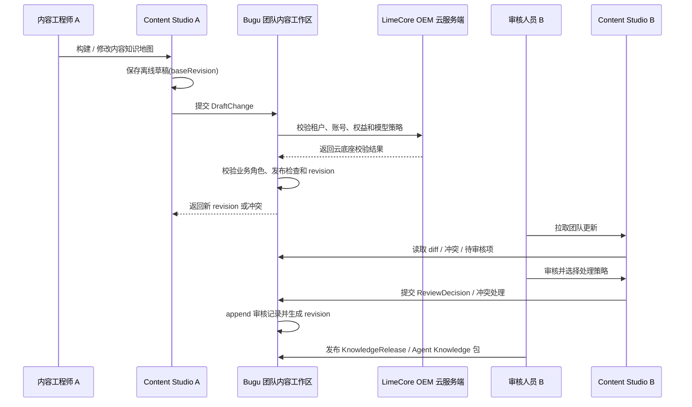

# Ontology v1 团队共享方案

更新时间：2026-06-01
状态：Local Verified / Production Evidence Pending

## 1. 设计结论

Ontology 如果只存在个人本机，就无法支撑团队审核、素材回写、SOP 复用和品牌口径一致。v1 需要把团队共享做成一等能力，但不能一上来做复杂实时协同系统。

v1 采用 **Bugu server-authoritative + desktop cache + offline draft + reviewed package** 的方案：

- Bugu 业务后端是团队内容项目、审核、冲突、发布和业务审计事实源；`content-knowledge-maps`、`content-build-runs`、`content-review-tasks`、`content-action-records` 和 `content-knowledge-releases` 是 v1 团队共享的 current 事实源，分别承载团队知识地图快照、生成流程摘要、审核任务、生产交接行动记录和团队知识包版本。
- 旧 `content-command-centers` 和 `content-execution-queue` 不再是当前客户端事实源；客户端运行时已收敛到内容制造批次和生产交接行动记录。
- Bugu 服务端已新增同步冲突队列，旧版本提交不会覆盖当前团队版本；控制台可以查看冲突并记录人工处理结论。
- Bugu 控制台已新增团队内容工作区面板，内容负责人可以在服务端侧查看当前工作区、待审核项、同步冲突、行动记录、素材覆盖和团队知识包版本。
- Content Studio 桌面端内容知识地图页已接入同步冲突队列，普通用户可查看冲突摘要、版本差异并记录已转人工处理；处理后本机地图回到待同步。
- Content Studio 已能基于已同步工作区拉取 Bugu 团队知识包版本，保留本机预览路径，并显示服务端包地址、对象 key 和上传状态。
- Content Studio 内容知识地图页已能在当前业务对象旁展示团队知识包详情，包括版本、文件、对象 key、sha256、确认状态和最近版本；普通用户不需要进入独立工程详情页。
- Content Studio 内容知识地图页已提供“拉取团队更新”辅助动作，复用工作区刷新链路拉取 Bugu 团队知识包版本、同步冲突、行动记录和资源包交接状态；普通用户只需要在当前内容地图旁刷新团队版本，不需要理解底层同步结构。
- Content Studio 输入源已落地普通用户可理解的“共享范围”：公开资料、团队内部、负责人确认、仅本机。内容知识地图会保存输入源共享范围摘要；包含“仅本机”资料时可以生成本机草稿，但会阻断 Bugu 团队同步、变更包提交和团队知识包发布，避免私密资料被误发给团队。
- Content Studio 内容知识地图页已把共享范围门禁投影为“资料共享检查”：普通用户能看到公开资料、团队内部、负责人确认和仅本机计数；包含“仅本机”资料时，主动作切换为“处理共享范围”，并跳回输入源页面处理，不再继续引导生成变更包。
- Content Studio 内容知识地图页的离线兜底链路已走真实用户动作：点击“导出变更包”生成包目录后，再点击“导入变更包”，主进程打开“选择内容变更包”入口并导入同一包；导入结果进入本机变更包事实源。
- Content Studio 在拿到 Bugu `workspaceId` 后，后续变更包和团队知识包发布会优先携带服务端工作区 ID，不再只依赖本机路径派生 key。
- Content Studio 的 Prompt 草稿、Prompt 协作会话和 SOP 运行记录已能保存团队知识包版本引用；Prompt 工作台和 SOP 执行表单都能选择已发布团队知识包，团队成员可以追溯下游内容使用的是哪一版已审核口径。
- Content Studio 素材覆盖回写已能生成“待确认补充”审核任务并同步到 Bugu；它只承接补证据、补规则和补素材标签，不自动覆盖团队当前主文案。
- Content Studio 生产交接会把 Prompt 草稿、场景卡、SOP 运行、素材覆盖变更、审核任务引用和操作者角色写入 Bugu `content-action-records`；服务端按认证角色拒绝无权限写入，本机记录和团队记录按行动 ID 合并，不静默覆盖。
- Bugu 侧审核任务和行动记录已支持分页和状态 / 动作筛选；当前客户端只按内容知识地图、审核任务和生产交接行动记录刷新团队事实。
- LimeCore 只做 OEM 云服务端，提供租户、账号、权益、模型策略、Gateway、计费、发布中心和 Agent App enablement。
- Content Studio 保留本地 `.content-studio/` 缓存、离线草稿和运行临时产物，保证桌面端体验和断网续写。
- 已审核、可复用的知识通过 Agent Knowledge v0.7.2 包发布，作为团队运行时消费标准。
- 实时多人协同、CRDT、云端图数据库不进 v1，作为远景阶段。

核心原则：

```text
个人离线草稿 != Bugu 团队事实源 != 已发布知识包
```

| 层级 | 作用 | 可变性 |
| --- | --- | --- |
| 个人离线草稿 | 每个人本地构建、修订、试验和暂存。 | 可频繁变更，未同步时只对本人可见。 |
| 团队事实源 | Bugu 保存团队知识地图快照、生成流程摘要、审核任务、生产交接行动记录、素材覆盖和知识包 release。 | 通过服务端 revision、业务角色、冲突队列和 append-only 行动记录合并。 |
| 已发布知识包 | 给 Prompt 工作台、SOP、Agent 客户端消费的稳定数据。 | 版本化发布，默认只读。 |

## 2. 共享模式

### 2.1 v1 主方案：Bugu 团队内容工作区

主路径：

```text
用户 A 在 Content Studio 修改内容知识地图
-> 本地保存离线草稿
-> 提交到 Bugu 团队内容工作区
-> Bugu 校验业务角色、baseRevision 和发布检查
-> Bugu 按需调用 LimeCore 校验租户、账号、权益和模型策略
-> 通过后生成新 revision，冲突则进入冲突队列
-> 用户 B 拉取团队更新，审核或继续组包
-> 审核后的 revision 发布为团队知识包
```

适合：

- 多人协作、跨设备、跨部门审核。
- 需要内容项目权限、业务审计和知识包发布的正式团队。
- 需要把知识包分发给 Prompt、SOP 和 Agent 客户端。

关键规则：

- Bugu 服务端 revision 是团队业务状态唯一依据。
- `ReviewDecision` 和 `ActionLog` 采用 append-only。
- 冲突不能静默 last-write-wins。
- 已发布 release 不能原地修改，只能创建新 release。
- 桌面端不可绕过 Bugu 发布检查和 LimeCore OEM 云底座约束。
- 团队知识包发布同样受 Bugu 服务端 revision、业务角色、幂等键和安全 payload 门禁保护；旧 `baseRevision`、只读角色发布、重复 release 写入、本机路径 / 凭证类发布包引用和内网公开包地址都不能绕过服务端策略。

### 2.2 MVP 兼容：手动导出 / 导入变更包

最小离线方式：

```text
用户 A 导出变更包
-> 通过飞书 / 网盘 / 邮件 / 交付目录发送
-> 用户 B 导入
-> 系统显示 diff、冲突和待审核项
-> 用户 B 提交到 Bugu 或保存为本地离线草稿
```

适合：

- 审核、行动记录、素材覆盖等业务对象尚未服务端化前的数据结构验证。
- 私有交付、客户现场、临时离线环境。
- 审计归档或灾备。

限制：

- 不是团队事实源。
- 不自动同步。
- 只能保证可追溯，不能保证跨设备一致。
- 桌面端导入必须走“导入变更包”用户动作和主进程文件选择入口；测试可替代系统选择结果，但不能绕过按钮直接调用导入 API 作为 UI 验收。

### 2.3 兼容兜底：共享目录 / Git repo

共享目录或 Git repo 只作为导出包和发布包的外部承载方式：

```text
export-root/
  workspaces/
    <workspaceId>/
      draft-change.json
      review-summary.json
      release-manifest.json
  releases/
    agentknowledge/
```

约束：

- 不把共享目录 / Git repo 当作 v1 主方案。
- 不保存模型 API Key、用户凭证和本机绝对路径。
- Git commit / push 属于高风险操作，产品内必须要求明确确认。
- 回到联网状态后，仍应提交到 Bugu 获得权威 revision。

### 2.4 远景：实时协同和跨项目知识 Hub

远景能力：

- 在线多人编辑、锁和通知。
- 版本 diff、回滚和审批流。
- Agent Knowledge 包 registry。
- 跨项目内容知识检索和复用。
- 面向管理者的审计看板和资源覆盖看板。

不作为 v1 前置条件。

## 3. 团队数据模型

### 3.1 `ContentTeamWorkspace`

Bugu 团队内容工作区。

建议字段：

- `id`
- `tenantId`
- `name`
- `ownerUserId`
- `currentRevision`
- `publishedReleaseIds`
- `defaultKnowledgeReleaseId`
- `roleBindings`
- `syncPolicy`
- `createdAt`
- `updatedAt`

`syncPolicy`：

```ts
export type ContentWorkspaceSyncPolicy =
  | 'server-authoritative'
  | 'offline-draft-allowed'
  | 'read-only-release';
```

### 3.2 `TeamMember`

业务成员和项目角色由 Bugu 维护；租户、账号、权益和云底座身份可引用 LimeCore。

建议字段：

- `id`
- `tenantId`
- `displayName`
- `role`
- `lastSeenAt`

角色：

```ts
export type TeamRole =
  | 'owner'
  | 'content-engineer'
  | 'reviewer'
  | 'operator'
  | 'viewer';
```

权限边界：

| 角色 | 权限 |
| --- | --- |
| `owner` | 管理项目、成员、冲突、知识包发布和回滚。 |
| `content-engineer` | 构建内容知识地图、提交变更、生成矩阵和提示词依据。 |
| `reviewer` | 审核概念、主张、证据、约束和覆盖行。 |
| `operator` | 组合资源包、执行标准动作、查看行动记录。 |
| `viewer` | 只读查看已发布知识包、矩阵和行动记录。 |

桌面端执行生产交接动作时会传当前用户团队角色；无权限角色和缺平台发布边界的生产动作会被拦截，Bugu 行动记录保留角色字段用于团队审计，并在服务端拒绝只读角色追加行动记录。

### 3.3 `DraftChange`

离线草稿或一次服务端提交的最小变更单位。

建议字段：

- `id`
- `tenantId`
- `workspaceId`
- `baseRevision`
- `authorUserId`
- `summary`
- `changes`
- `affectedObjectIds`
- `reviewRequirement`
- `createdAt`
- `syncStatus`

变更类型：

```ts
export type DraftChangeKind =
  | 'concept-created'
  | 'concept-updated'
  | 'relation-created'
  | 'relation-updated'
  | 'evidence-created'
  | 'constraint-updated'
  | 'coverage-row-updated'
  | 'review-decision-appended'
  | 'action-record-appended'
  | 'material-coverage-updated'
  | 'agentknowledge-release-created';
```

规则：

- `ReviewDecision` 和 `ActionRecord` 只能追加，不能被普通草稿删除。
- 每个提交都必须显示 diff、作者、baseRevision 和影响对象。
- Bugu 合并成功后返回新 revision。
- 服务端冲突不能在桌面端静默覆盖。

### 3.4 `KnowledgeRelease`

发布给团队消费的稳定版本。

建议字段：

- `id`
- `tenantId`
- `workspaceId`
- `version`
- `sourceRevision`
- `agentKnowledgePackUrl`
- `releaseNotes`
- `approvedBy`
- `createdAt`

发布规则：

- 只有 `owner` 或被授权 `reviewer` 可以创建 release。
- release 必须来自已审核 revision。
- release 可被 Prompt 工作台、SOP 和 Agent 客户端引用。
- 如需进入 OEM 云发布中心、桌面客户端下载或 Agent App enablement，再由 Bugu 登记到 LimeCore。

## 4. 团队同步流程



## 5. 冲突处理

冲突类型：

| 冲突 | 处理方式 |
| --- | --- |
| 同一概念被不同人改名。 | UI 展示两个名称、来源和影响关系，由 owner / reviewer 选择。 |
| 同一主张证据状态不同。 | 取更保守状态，进入审核任务。 |
| 一人删除概念，另一人新增关系引用该概念。 | 阻止合并，要求先处理关系。 |
| 同一覆盖行被不同人发布到不同下游。 | 允许并存，但行动记录必须分别记录。 |
| 已发布 release 被修改。 | 禁止原地修改，要求创建新 release。 |

合并策略：

- 元数据字段可自动合并，例如 tags、aliases、sourceRefs。
- 风险、证据和审核状态不自动放宽。
- 冲突不能被静默覆盖。
- 合并后必须写入服务端 revision、ReviewDecision 和 ActionRecord。

当前实现：Content Studio 桌面端和 Bugu 控制台已生成“合并处理清单”，逐项展示本机提交、团队当前内容、建议处理方式和下一步；Bugu 服务端会把清单保存到冲突记录和行动记录，并推进团队 revision。当前仍不自动覆盖业务内容；素材覆盖的字段级补充只会进入待确认审核任务。

## 6. 团队 UI

v1 的团队 UI 分为桌面端业务工作台和 Bugu 控制台服务端视角。普通用户不需要知道 `Ontology` 或 `KnowledgeRelease` 的内部结构，只需要理解“当前团队工作区正在处理什么、哪些内容待审核、哪些动作已交接、团队当前共用哪个知识包版本”。

当前已完成：

- Bugu 控制台新增“团队内容工作区”面板，围绕一个当前工作区展示团队版本、待处理审核、同步冲突、生产交接、最近行动记录、素材覆盖和团队知识包。
- 面板唯一主动作是“刷新团队工作区”；切换工作区只是选择当前业务对象。
- Content Studio 桌面端可查看旧版本提交影响的内容项、版本差异、合并处理清单和处理建议，并选择“保留团队内容 / 重新提交本机修改 / 按清单转人工确认”；服务端保留处理方向和审计记录。真实客户端点击回归已覆盖“查看清单 -> 按清单转人工确认 -> Bugu 收到合并清单 -> 本机地图回到待同步”。
- Content Studio 桌面端可真实点击“导入变更包”导入离线包；主进程文件选择入口返回包目录后，UI 显示“离线变更包已导入”，本机事实源新增待提交草稿。readiness gate 会检查按钮、IPC、包校验、E2E 点击和文档证据。
- Bugu 控制台可查看旧版本提交影响的内容项、合并处理清单、处理建议，并记录处理方向。
- 面板可查看团队知识包待确认 / 已确认 / 已驳回状态；待确认版本需要负责人批准后才会成为默认版本，也可以被驳回后重新发布；服务端已支持多步骤确认、步骤角色校验和工作区默认确认模板，控制台显示确认进度并可切换模板。
- Content Studio 内容知识地图页的团队知识包区域和右侧交付区都提供“拉取团队更新”；点击后执行同一工作区刷新，新的已发布版本会进入团队知识包详情、最近版本列表和本机团队版本缓存。目标 E2E 会先注入远端已发布版本，再点击该按钮验证页面显示远端版本、版本清单包含该版本，并且 preload 读取到公开包地址和文件清单。
- Content Studio 普通列表入口会自动把 Bugu current 事实源读回本机缓存：内容知识地图列表拉取 `content-knowledge-maps`，生成流程列表拉取 `content-build-runs`，团队知识包区域拉取 release 列表；生产交接行动记录通过 `content-action-records` 保留审计和交付物线索，不再读回旧作战快照。
- Content Studio 当前客户端不再提供旧品牌战情室同步入口；普通用户在内容知识地图、审核台、Prompt 工作台、SOP 和内容制造批次里看到团队同步状态、行动记录、交付结果和被拦截原因，不需要理解服务端 action record 结构。
- 空态恢复路径指向客户端：先在 Content Studio 完成内容知识地图、审核和团队同步。
- 普通用户可见文案不出现 Ontology / Concept / Relation 等工程术语。

| 区域 | 作用 |
| --- | --- |
| 团队连接状态 | 显示当前租户、项目、服务端 revision、本机未同步草稿和最近同步时间。 |
| 变更队列 | 查看 diff、作者、影响对象和审核要求。 |
| 冲突队列 | 展示冲突对象、冲突原因、版本差异、影响内容、合并处理清单和处理建议；当前支持桌面端和 Bugu 控制台逐项查看、记录处理方向、服务端保存清单和行动记录。 |
| 发布版本 | 查看已发布 Agent Knowledge 包、版本、确认状态和 release notes。 |
| 消费入口 | 将团队 release 设为 Prompt 工作台、SOP 或 Agent 客户端的默认知识源。 |
| 离线导出 | 导出变更包或知识包作为交付、灾备和审计附件。 |

生产证据待补：

- Content Studio 已提供 `content:v1:verify-online` 在线验收总入口，可汇总两账号共享和团队知识包下载验收，并支持 `--output=...` 归档 JSON 报告；两账号必须分页完整看到非空且同一批知识地图、构建运行、审核任务、生产交接行动记录和团队知识包版本。
- Content Studio 已提供 `content:v1:verify-report` 归档门禁，生产报告必须证明真实公网 API、真实团队账号、http/https 公网公开包地址、size、sha256、`content-knowledge-maps` 同清单、`content-build-runs` 同清单、审核任务同清单且大于 0、行动记录同清单且大于 0、团队知识包版本同清单且大于 0 和完整拉取标记；本地 mock、localhost 或内网地址报告不能作为完成证据。
- 后续需要用真实账号和两台设备跑通提交、拉取、审核、发布和默认知识包消费，并归档报告。

## 7. 与 Agent Knowledge v0.7.2 的关系

团队共享有两个出口：

| 出口 | 用途 |
| --- | --- |
| 服务端 revision / DraftChange | 团队内部编辑、审核、合并和复盘。 |
| Agent Knowledge v0.7.2 包 | 团队运行时消费和跨工具分发。 |

Agent Knowledge 包只承载审核后的稳定数据：

- `ontology/` 保存结构化 Ontology。
- `answers/` 可选保存 answer-ready 数据。
- `compiled/prompt-grounding.md` 保存运行时摘要。
- `KNOWLEDGE.md` 声明 `metadata.primaryOntology` 和可选 `metadata.primaryAnswers`。

团队协作记录不应完整塞进发布包。发布包可以保存 provenance 摘要，但完整 `ReviewDecision`、`ActionRecord` 和冲突历史应保留在 Bugu 团队事实源。

## 8. 安全和隐私

共享时必须避免把本地敏感数据带出去：

- 不共享模型 API Key、登录凭证和本机绝对路径。
- 可选对 source document 做 redaction，只共享 sourceRef 和必要摘录。
- 普通用户不需要理解 `sensitivity` 字段，只在输入源登记或导入时选择“共享范围”。
- 私有客户资料、未公开产品资料、内部投放数据和用户反馈默认进入“负责人确认”或更高风险范围，不能静默当成公开资料。
- “仅本机”资料只能参与本机草稿构建；团队同步、变更包提交和团队知识包发布都会被 `contentKnowledgeMapSensitiveIssues()` 阻断。
- 导出 / 发布前显示敏感数据检查结果；疑似密钥、凭证、本机绝对路径和仅本机资料都必须先处理。
- 团队共享源要支持只读消费和写入权限区分。
- Bugu 需要记录关键写操作审计，包括发布、回滚、冲突处理和权限变更。

当前实现：

- `InputSourceRecord.sensitivity` 保存输入源共享范围，旧输入源在读取时会按用途、标题和正文做保守推断。
- `ContentKnowledgeMapRecord.sourceSensitivity` 保存当前内容地图的共享范围摘要，包含最高风险等级、计数、仅本机资料标题和负责人确认资料标题。
- `ContentKnowledgeMapApplicationService` 在构建成功或 blocked 记录中都会写入共享范围摘要；包含仅本机资料时不会调用 Bugu 同步适配器。
- `ContentWorkspaceSyncService.createDraftChange()` 和 `createKnowledgeRelease()` 复用同一安全策略，包含仅本机资料、本机绝对路径或疑似凭证时只保存 blocked 结果，不提交团队工作区。
- 输入源页面只显示“共享范围”，不会把 Ontology / sensitivity 等工程术语暴露给普通运营。
- 内容知识地图页面显示“资料共享检查”和受影响资料标题；包含“仅本机”资料时，底部主动作变为“处理共享范围”，目标 E2E 已覆盖从内容知识地图跳回输入源页面的真实点击路径。

## 9. 实施阶段

| 阶段 | 目标 | 说明 |
| --- | --- | --- |
| T1 | 本地离线草稿和手动变更包。 | 验证 diff、冲突模型和敏感数据检查。 |
| T2 | Bugu 团队内容工作区 API。 | 服务端保存工作区、revision、审核、行动记录和素材覆盖。 |
| T3 | 桌面端同步。 | 支持提交、审核、行动记录、素材覆盖和知识包版本同步；已补 `content-knowledge-maps`、`content-build-runs` current 主事实源读回、本机待同步合并保护、团队行动记录只读验收和生产交接记录同步；离线重试作为后续韧性优化，不影响 v1 本地主链。 |
| T4 | 控制台团队视图。 | 已完成工作区面板、同步冲突查看、人工处理结论记录、知识包可分发状态、默认版本回滚、待确认版本批准、多步骤确认进度展示和工作区默认确认模板切换；更细权限配置属于后续管理增强，不作为 v1 本地完成门槛。 |
| T5 | Release 管理。 | 已能将审核 revision 发布为 Agent Knowledge v0.7.2 包并登记对象 key / 下载地址；控制台可回滚默认版本；待确认版本需负责人批准后成为默认版本；服务端支持多步骤确认和默认确认模板；桌面端可在内容知识地图页点击“拉取团队更新”刷新团队版本并写入本机缓存；Prompt 工作台和 SOP 执行表单可选择团队版本，Prompt 草稿、Prompt 协作会话和 SOP 运行记录可追溯团队版本；只读在线验收总入口已能校验公开包地址、大小、sha256、三类 current 主事实源和两账号可见性，并能输出 JSON 报告；真实生产环境执行报告属于生产证据待补。 |
| T6 | LimeCore OEM 云底座对接。 | 校验租户、权益、模型策略、发布中心和 Agent App enablement。 |
| T7 | 远景协同 Hub。 | 在线权限、通知、实时审核和跨项目检索。 |

## 10. 验收标准

- 能登录或绑定 Bugu 团队内容工作区，并按需通过 LimeCore 校验租户与权益。
- 能显示本机 revision、服务端 revision、未同步草稿和最近同步时间。
- 能提交变更并显示 diff、作者、baseRevision 和影响对象。
- 能检测并阻止静默覆盖冲突。
- 审核记录和行动记录在团队共享中保持 append-only。
- 能把审核后的 revision 发布为 Agent Knowledge v0.7.2 release。
- Prompt 工作台和 SOP 能选择团队 release 作为知识源，并在草稿 / 运行记录里显示团队知识包版本。
- 能用只读验收脚本验证团队知识包公开下载地址、大小和 sha256；只有元数据登记时不能显示为可分发成功。
- 能用只读验收脚本验证两账号看到非空且一致的审核任务 ID 清单和行动记录 ID 清单。
- 离线导出包不包含 API Key、凭证和本机绝对路径。
- 输入源共享范围会进入内容知识地图；“仅本机”资料不会同步到 Bugu，也不能发布为团队知识包；内容知识地图页必须把该状态展示为资料共享检查和恢复路径。
