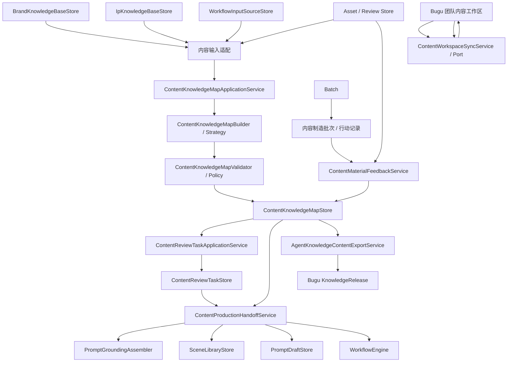
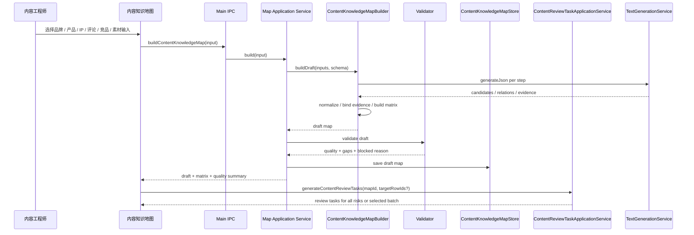
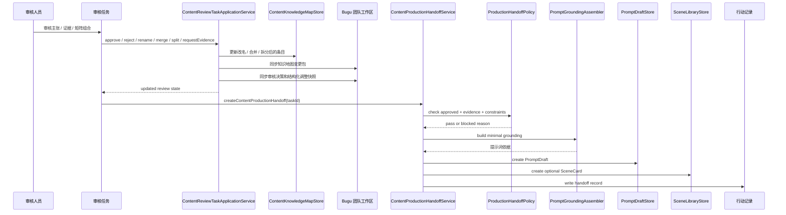
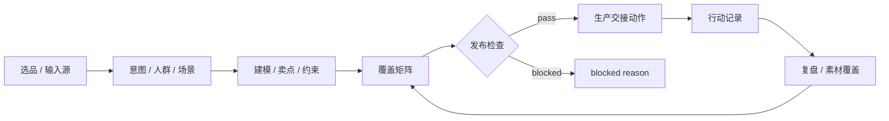
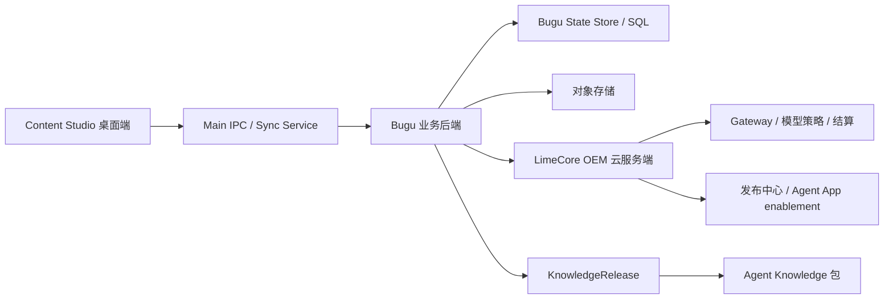

# Ontology v1 工作流集成方案

更新时间：2026-05-31
状态：Local Verified / Production Evidence Pending

## 1. 设计结论

Ontology v1 是现有模块之间的中间层。它不替代知识库、场景库、Prompt 工作台、SOP 或素材库，而是为这些模块提供结构化、已审核、可追溯的上下文。

当前实现已经让团队知识包进入下游消费链路：生产交接生成 Prompt 草稿、场景卡或 SOP 时会绑定团队知识包版本，并把版本写入行动记录；Prompt 工作台手动生成草稿和启动 Prompt 协作时能选择已发布团队知识包，草稿和会话都会保留同一版本引用；SOP 执行表单也能选择已发布团队知识包，默认自动匹配当前内容知识地图版本，显式选择后会写入 `WorkflowRun.teamKnowledgeRelease` 和 `team-knowledge-release:<releaseId>` 产物线索；内容知识地图团队知识包详情页可以直接生成带版本引用、覆盖行、来源引用和禁用边界的 Prompt 草稿；SOP 不再只保存运行记录，而是进入 `WorkflowEngine` 执行到人工审核停顿点，并保留步骤产物引用；素材覆盖已进入待确认补充任务，团队知识包已支持多步骤确认和默认确认模板；内容知识地图矩阵已支持筛选、排序、分页和本批送审；内容制造批次已承接选品、意图、建模、卖点、矩阵、制造、审核、调优和复盘阶段恢复；内容知识地图生成会写入可审计流程记录，并新增 v1 在线验收总入口。生产证据仍需用真实账号、两台设备和生产对象存储归档验收报告。

真实客户端行详情已接入生产交接服务：已审核的矩阵组合可以直接生成 Prompt 草稿、场景卡或启动 SOP；未审核组合会先创建审核任务并进入审核台。若当前工作区没有真实已发布团队知识包，SOP 仍保留本机输入、步骤和产物线索，但不能宣称已完成生产团队 release 绑定。

真实客户端审核和团队共享页已补按钮级闭环：审核任务改名、合并、拆分会真实回写内容知识地图并同步变更包；内容知识地图页创建 / 提交 / 导出 / 导入变更包和创建团队知识包版本会落到本地事实源、Bugu HTTP 适配器和 release 元数据，不再只是原型动作反馈。

真实客户端行动记录已补复盘写入：普通用户可以把复盘结论写入生产交接行动记录，并通过 Bugu `content-action-records` 通道同步到团队事实源；同一次复盘会在内容制造批次的复盘阶段生成恢复任务、素材覆盖回写要求和下一轮输入补齐项。复盘不改写产品事实，只作为下一轮内容行动的输入。旧品牌战情室快照和执行队列不再作为当前客户端事实源读回。

## 2. 模块集成图



## 3. 与现有模块的边界

| 模块 | v1 集成方式 | 不做什么 |
| --- | --- | --- |
| `BrandKnowledgeBaseStore` | 提供品牌定位、产品事实、禁用表达、证据材料。 | 不在品牌知识库里维护关系图和覆盖矩阵。 |
| `IpKnowledgeBaseStore` | 提供 IP 身份、观点、语言规则、故事资产和创作边界。 | 不让 IP 知识库直接生成跨渠道 Prompt。 |
| `WorkflowInputSourceStore` | 统一承接产品 brief、SKU 表、评论、客服问题和竞品观察。 | 不在输入源层判断主张是否可发布。 |
| `ContentKnowledgeMapApplicationService` | 编排输入、构建、校验和本地保存。 | 不做 UI 状态，不做团队事实源。 |
| `ContentReviewTaskApplicationService` | 生成审核任务、记录审核决策和状态迁移。 | 不把未审核内容交给下游生产。 |
| `ContentProductionHandoffService` | 将审核通过的矩阵组合转为提示词依据、PromptDraft、SceneCard 或 SOP 输入。 | 不绕过审核，不注入完整原文，不自动发布平台内容。 |
| `SceneLibraryStore` | 接收审核通过的矩阵组合，生成场景卡。 | 不反向修改知识地图事实。 |
| `PromptDraftStore` | 接收提示词依据，生成可追溯 PromptDraft。 | 不直接拼接完整原始文档。 |
| `WorkflowEngine` | 接收 ready 矩阵组合和提示词依据作为 SOP 输入。 | 不绕过发布检查执行动作。 |
| `AssetReviewStore` | 构建时提供素材审核证据；生产后回写素材覆盖、审核结论和表现标签。 | 不把素材表现自动当成产品事实，不向模型或团队包写入本机素材路径。 |
| `ContentProductionHandoffService` | 将已审核内容交接到 Prompt 草稿、场景卡和行动记录。 | 不回流旧批次入口，不做自动发布、刷量、虚假互动或伪装用户。 |
| Agent Knowledge 导出 | 发布审核后的内容知识包和可选 answer-ready 层。 | 不把知识包变成可执行 Skill 或排名操控指令。 |

## 4. 构建时序



关键规则：

- 每次构建都写生成流程记录，覆盖输入收集、团队状态、生成服务检查、来源证据整理、结构化矩阵生成和质量检查，不能只保存最终结果。
- 任一步失败或模型未配置时返回 blocked。
- 模型输出必须经过结构化解析和规则校验后才能入库。

## 5. 审核和发布时序



发布规则：

- `ready` 行才可以发布。
- `needs-verification` 行只能进入补证据任务，不能进入确定性 Prompt。
- `forbidden`、`rejected`、`deprecated` 直接 blocked。
- 改名、合并和拆分会把当前条目退回待审核或待补证据状态；只有重新通过审核后才可进入生产交接。
- 每次生产交接必须写行动记录或本机交接摘要，包含输入、输出、操作者和发布检查结果。

## 6. 下游生产路径

### 6.1 卖点拆解到 PromptDraft

```text
产品 brief / SKU / 品牌知识库
-> feature / attribute / selling-point / benefit / claim
-> evidence and constraints
-> selling-point coverage matrix
-> review
-> 提示词依据
-> PromptDraft
```

落地要求：

- PromptDraft 必须带知识地图 ID、矩阵组合 ID 和 `sourceRefs`。
- PromptDraft 必须带团队知识包版本；没有已发布团队知识包时仍可生成本机草稿，但不能伪装成团队默认口径。
- PromptDraft 只能使用相关子图。
- 输出文案必须遵守品牌禁用表达和证据边界。

当前实现状态：

- `ContentProductionHandoffService` 在创建 PromptDraft / SceneCard 前调用 `contentProductionHandoffPolicy.ts`。
- 即使审核任务已通过，policy 仍会拦截禁用 / 绝对化表达、竞品观察直交、缺 IP 边界和 IP 漂移；拦截时只写入 blocked 交接记录。
- 交接记录已升级为结构化行动记录：成功时记录 Prompt 草稿 / 场景卡 / SOP 运行产物、覆盖行、证据、来源、团队知识包版本、发布检查和下一步；拦截时记录 blocked 动作、原因和恢复路径，避免发布检查失败只停留在临时错误提示。
- 生产交接行动记录已复用 Bugu `content-action-records` 通道同步到团队事实源；桌面端保留本机交接记录和团队同步状态，Bugu 控制台可继续按行动记录视角展示。
- 生产交接行动记录会回填同一知识地图的内容制造批次运行历史，因此审核页完成的交接、拦截和下一步也能进入批次复盘。
- 生产交接只绑定当前内容知识地图对应的已发布团队知识包版本；如果当前地图尚未发布团队知识包，仍可生成本机草稿，但不能把其他地图 release 伪装成本项目默认口径。
- 生产交接复用同一版本边界：生成 Prompt 草稿、场景卡或启动 SOP 时，只读取当前 `sourceKnowledgeMapId` 对应的已发布团队知识包；没有本项目 release 时，行动记录和下游产物不写其他项目团队知识包。
- 内容制造批次会同步更新交接产物字段：已生成 Prompt 草稿、场景卡、SOP 运行、交接摘要和发布检查 blocked 原因，避免批次只显示输入资料而看不到后续生产结果。
- 生产交接行动记录可导出为本机交付文件：`manifest.json`、`action-records.md` 和 `action-records.json` 只包含脱敏后的行动摘要、产物引用、团队状态和审计信息，不包含本机工作区路径、账号凭证或自动发布指令；导出动作会追加 `export-action-records` 团队记录。

### 6.2 用户反馈到场景穷举

```text
评论 / 差评 / 客服问题
-> pain-point / objection / user quote
-> audience / scenario / channel
-> pain-point coverage matrix
-> SceneCard / SOP input
```

落地要求：

- 痛点命名可以由模型生成，但用户原声必须保留。
- 没有对应卖点的痛点进入产品资料待补清单。
- 场景穷举需要支持筛选、优先级、分页和本批送审，避免一次性生成过多任务。

### 6.3 IP 一致性到内容生成

```text
IP 知识库
-> identity / position / voice rule / methodology / story asset
-> ip-content matrix
-> 提示词依据
-> 口播 / 文章 / 私域 PromptDraft
```

落地要求：

- 所有 IP 内容必须关联 IP 知识库版本。
- 与 IP 立场冲突的表达进入 `ip-voice-drift` validation issue。
- 不同渠道可以调整表达形式，但不能改写核心观点。

当前实现状态：

- 内容知识地图构建器已读取 `IpKnowledgeBaseStore`，把同一 IP 版本写入 `ipKnowledgeBaseIds`、证据、矩阵和约束。
- IP 语言规则和核心立场已进入普通生产前的规则边界；`ContentMatrixRiskPolicy` 已把常见 IP 漂移表达结构化为 `ip-voice-drift` / `IP 口径漂移`，并共享给 validation、审核任务和生产交接 policy。

### 6.4 竞品观察到差异化机会

```text
竞品内容 / 公开页面 / 人工观察
-> competitor claim pattern / proof pattern / audience / scenario
-> difference opportunity
-> competitor boundary constraint
-> content-angle matrix
```

落地要求：

- 只提取结构、模式、机会和风险，不复制可识别表达。
- 竞品材料不能作为本品牌事实证据。
- 竞品观察必须进入人工审核后才能影响品牌定位或 Prompt。

当前实现状态：

- 新增 `competitor-observation` 输入用途，构建器会生成差异化机会、竞品反馈模式和内容结构参考。
- 所有竞品派生矩阵行默认 `needs-review`，并自动加入不可搬运边界；未人工审核前不能作为 ready 生产交接项。
- 生产交接 policy 会阻断竞品观察行直接进入 PromptDraft，要求先转写为本品牌已审核卖点或场景。

### 6.5 素材库到覆盖回写

```text
素材 / 审核标签 / 表现数据
-> material concept
-> covered-by-material relation
-> material coverage matrix update
-> high-performance combination
```

落地要求：

- 素材表现是排序和复盘信号，不是事实证据。
- 素材缺口应该能生成补拍、补图、补证据或补 Prompt 任务。
- 高表现组合可以推荐复用，但必须重新过渠道和证据约束。

当前实现状态：

- 内容知识地图页可把已通过素材回写到卖点、痛点和场景组合，矩阵展示素材状态、素材数量和表现标签。
- 素材库页通过内容知识地图 `materialRefs` 反查每个素材覆盖的组合，详情页展示对应组合、证据数、来源数、素材状态和表现标签。
- 已通过素材只生成待确认补充审核任务；团队负责人确认前，不改写发布中的卖点、痛点、场景或主文案。
- 缺素材组合可以从内容知识地图素材回写页直接创建补素材审核任务；任务写入审核任务 Store，普通用户在审核台看到“待补素材”和恢复路径，而不是只得到页面提示。
- 素材库详情页不是只读复盘：已覆盖的卖点、痛点或场景组合旁可以直接创建补素材审核任务，客户端复用同一条 `material-supplement` 任务链路，并按内容地图分组，避免多地图素材误绑到当前地图。

## 7. 内容制造批次工作流



标准动作：

| ActionType | 输入 | 输出 |
| --- | --- | --- |
| `generate-prompt-draft` | ready coverage rows、渠道、格式。 | PromptDraft。 |
| `create-scene-card` | 人群、痛点、卖点、场景。 | SceneCard。 |
| `request-review` | candidate claims、coverage rows。 | ReviewTask。 |
| `request-evidence` | needs-verification claims。 | EvidenceTask。 |
| `launch-sop-run` | ResourceBundle、SOP 模板。 | WorkflowRun。 |
| `create-material-gap-list` | missing-material rows、资源包缺口、审核任务。 | 本机补素材交付包：`manifest.json`、`material-gap-list.md`、`material-gap-list.json`，并写入行动记录交付引用。 |
| `write-back-material-coverage` | 素材审核和表现记录。 | 覆盖矩阵更新。 |

边界：

- 操作层用于真实内容生产和获客复盘。
- `content-action-records` 是生产交接行动记录 current；内容制造批次在本机缓存和团队行动记录之间保持可追溯，不读回旧作战快照。
- 旧 `content-command-centers` 和 `content-execution-queue` 不再是当前客户端事实源。
- 不做自动发布。
- 不做虚假评论、刷量、伪装用户或绕过平台规则。
- 所有动作都必须留下行动记录。

## 8. UI 落地

v1 已落地或纳入 readiness gate 的视图：

| 视图 | 用户看到什么 | 主要操作 |
| --- | --- | --- |
| 内容知识地图 | 项目、输入源、生成记录、质量指标。 | 新建、重新生成、导入输入源、查看矩阵。 |
| 卖点 / 场景矩阵 | 卖点 / 痛点 / 人群 / 场景 / 渠道 / 证据 / 素材状态。 | 筛选、排序、分页、本批选择、生成审核任务、创建补素材任务。 |
| 审核任务 | 主张、证据、来源、风险、建议处理。 | 通过、驳回、合并、拆分、补证据、禁用。 |
| 提示词依据预览 | 即将注入 Prompt 的卖点、证据、规则和禁用表达。 | 预览、确认、生成 PromptDraft。 |
| 内容制造批次 | 选品、意图、建模、卖点、矩阵、制造、审核、调优和复盘阶段。 | 生成批次、推进阶段、处理恢复任务、查看产物链路。 |
| 生产交接行动记录 | Prompt 草稿、场景卡、SOP 运行、素材覆盖回写和补素材交付包。 | 追溯产物、查看发布检查、导出行动记录、进入复盘。 |
| 行动记录 / 复盘 | 行动、产物、审核、素材表现和回写。 | 过滤、追溯、复用高表现组合。 |

主动作落地要求：

- 内容制造批次“生成批次”写入当前阶段、输入覆盖、产物引用和恢复任务。
- 内容制造批次“推进阶段”只能在阶段门禁通过或人工处理恢复任务后执行。
- 生产交接“生成 Prompt / 场景卡 / SOP”写入 `content-action-records` 行动记录，用于团队共享当前下游产物、发布检查和恢复路径。
- 普通用户界面只展示“批次阶段 / 恢复任务 / 交接产物 / 行动记录”，不展示内部动作枚举。

命名规则：

- 主导航和普通用户页面不使用 `Ontology`。
- 内部服务名、IPC、导出协议和开发者模式可以保留 `ontology:*`。
- 面向用户的错误提示使用“知识地图检查未通过”“发布检查未通过”“需要补证据”，不使用 `validation failed` 或 `DecisionGate blocked`。

## 9. IPC 和服务端边界

v1 IPC 应保持粗粒度业务接口，避免 renderer 直接操作内部文件：

- `contentKnowledgeMaps:list`
- `contentKnowledgeMaps:build`
- `contentKnowledgeMaps:update`
- `contentReviewTasks:list`
- `contentReviewTasks:generate`
- `contentReviewTasks:submitDecision`
- `contentProductionHandoff:create`
- 旧内容制造批次 IPC 运行时已退役，不再作为 current IPC。
- `contentKnowledgePack:export`
- `contentWorkspaceSync:pull`
- `contentWorkspaceSync:submitDraftChange`
- `contentWorkspaceSync:resolveConflict`
- `contentWorkspaceSync:createKnowledgeRelease`

共享类型必须先落在 `src/shared/types.ts`，main、preload 和 renderer 同步更新。

服务端 API 不由 renderer 直连散乱 URL，统一经过 main 进程的同步服务和 Bugu 业务 API。Bugu 负责最终业务权限、revision、审核和 release 状态；LimeCore 只在租户、账号、权益、模型策略、Gateway、发布中心和 Agent App enablement 这些 OEM 云底座边界被调用。

## 10. 团队共享工作流

团队共享不是把某个人的 `.content-studio/` 目录直接覆盖到其他人机器，也不是把共享目录当团队事实源，而是把离线草稿、审核和 release 分层同步到 Bugu 业务后端。

```mermaid
flowchart LR
  LocalDraft["个人本地 draft"] --> DraftChange["DraftChange"]
  DraftChange --> Sync["提交到 Bugu"]
  Sync --> TeamSource["Bugu 团队内容工作区"]
  TeamSource --> Pull["其他成员拉取"]
  Pull --> Diff["Diff / 冲突 / 待审核"]
  Diff --> Merge["服务端合并到团队 revision"]
  Merge --> Release["KnowledgeRelease"]
  Release --> AK["Agent Knowledge v0.7.2 包"]
  AK --> Runtime["Prompt 工作台 / SOP / Agent 客户端"]
```



落地要求：

- 团队同步以 `DraftChange` / 服务端 revision 为单位，必须保留作者、baseRevision、影响对象和 diff。
- `ReviewDecision` 和 `ActionLog` 保持 append-only。
- Bugu 校验业务角色、revision 和发布检查；LimeCore 只校验租户、账号、权益、模型策略和发布中心边界。
- 离线导出包不保存 API Key、登录凭证和本机绝对路径。
- Prompt 工作台和 SOP 默认消费 `KnowledgeRelease`，不直接消费他人本地 draft；当前实现已在手动 PromptDraft、Prompt 协作会话、内容知识地图团队知识包详情生成的 PromptDraft，以及生产交接 PromptDraft / WorkflowRun 中保存团队知识包版本引用。

## 11. 服务端拓扑



边界：

- `content-studio`：桌面工作台、本地缓存、离线草稿、生成和审核交互。
- `bugu/bugu`：布谷内容工厂业务后端，承载内容工作区、审核、矩阵、作战队列、行动记录、素材覆盖和知识包 release。
- `limecore`：OEM 云服务端，承载租户、账号、权益、模型策略、Gateway、计费、发布中心和 Agent App enablement。
