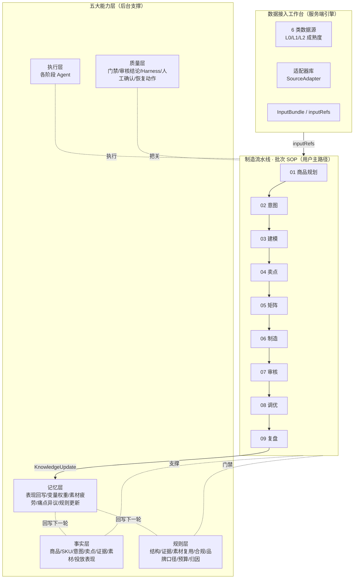
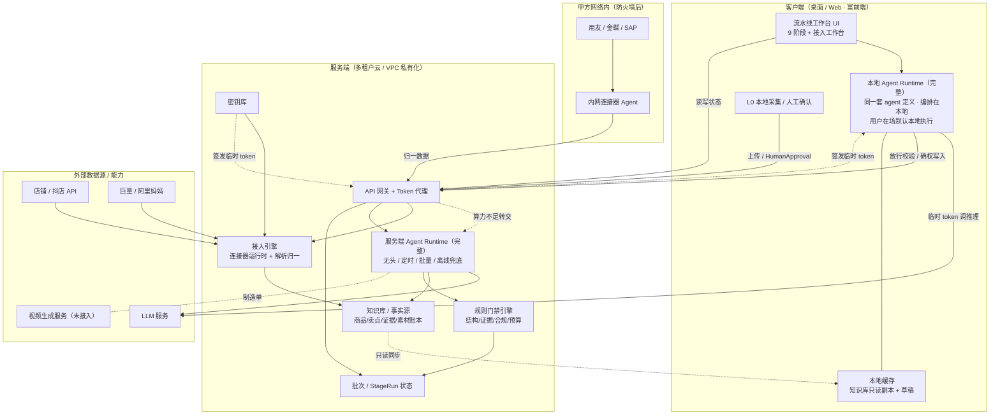
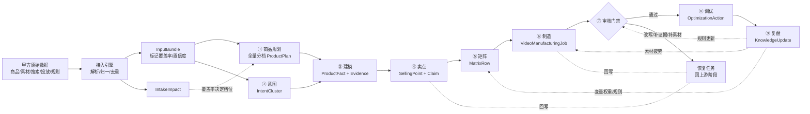
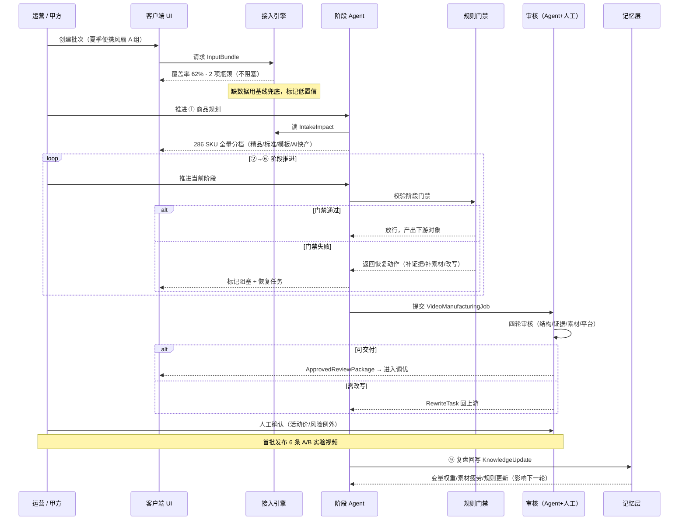
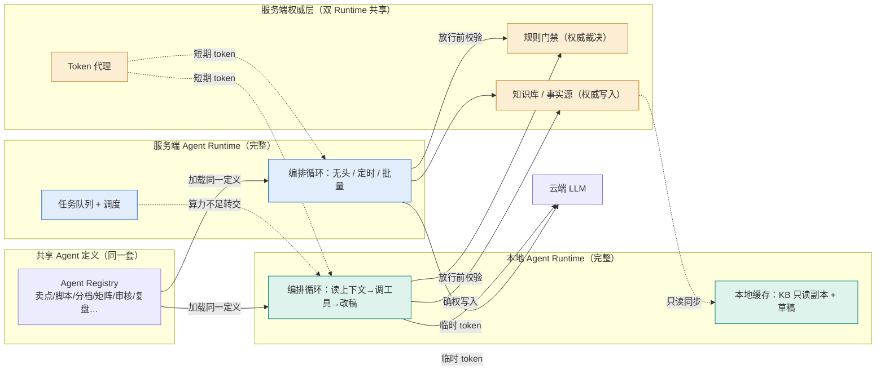
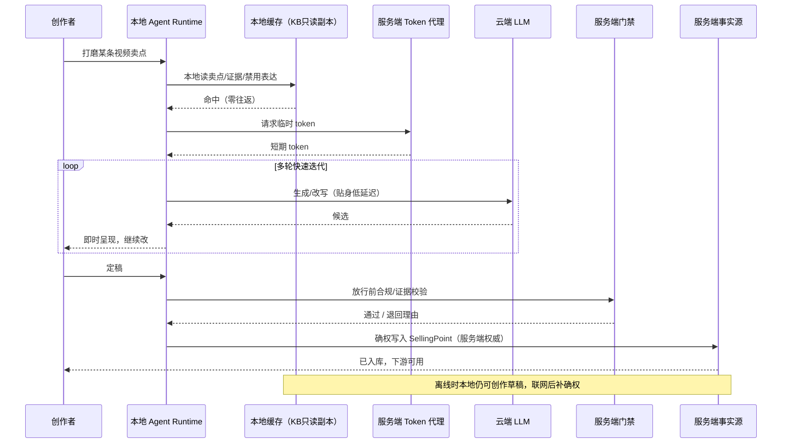
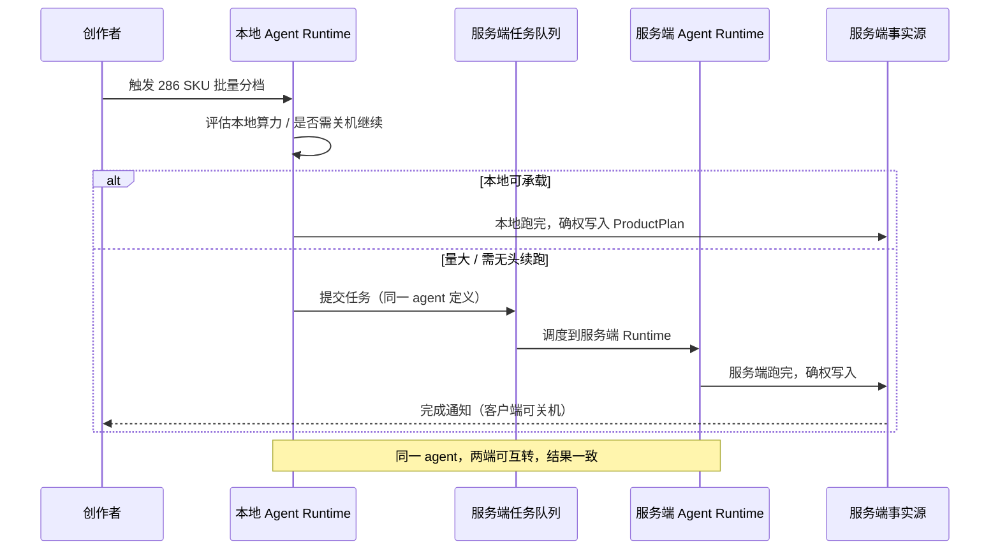

# Ontology v2 系统架构

状态：Draft v1
更新时间：2026-06-01
关联：[`README.md`](./README.md)、[`data-model.md`](./data-model.md)、[`data-intake-workbench-prd.md`](./data-intake-workbench-prd.md)、v1 [`server-integration-plan.md`](../v1/server-integration-plan.md)

本文把电商短视频内容制造流水线从「概念说明」落成可讨论的**整体系统架构**：分层结构、客户端/服务端切分、端到端流程、批次生命周期时序。数据接入子系统的细节见其 PRD，本文只放它在全局中的位置。

---

## 1. 总体分层架构

用户主路径只看到一条流水线；其下由五个能力层支撑。所有阶段不在自己内部造数据，统一消费数据接入层产出的 `InputBundle`。

要点：

- **接入层在最上游**，是全流水线的唯一事实入口；缺数据不阻塞，下游按可达档位降级先跑（见接入 PRD 不阻塞原则）。
- **流水线是用户唯一可见主路径**，9 阶段线性推进，每阶段产出下游对象。
- **五大能力层横向支撑**所有阶段，不暴露给普通用户。
- **复盘回写记忆层**，记忆层回写事实层与规则层，形成闭环——但只回写变量权重/规则，不污染产品事实。

---

## 2. 客户端 / 服务端部署架构

整个系统是**服务端为主、客户端为富前端**。客户端跑一个**完整的本地 Agent Runtime**——与服务端 Runtime 加载同一套 agent 定义，用户在场时默认本地执行（低延迟）；批量/无头/定时任务及离线兜底由服务端 Runtime 承载。两端共享服务端权威层（知识库、规则门禁、密钥）。推理统一调云端 LLM（本地编排、云端推理，类 Claude Code 模型），客户端不下载模型权重。双 Runtime 的对等关系与调度详见第 5 节。

切分原则（与接入 PRD 4.1 一致，适用全系统）：

- **本地与服务端各跑一个完整 Agent Runtime**：加载同一套 agent 定义，差异在「跑在哪、何时跑」，不在「能跑什么」（详见第 5 节）。
- **用户在场默认本地执行**：交互创作低延迟贴身改；算力不足或需无头/定时/团队共享时转交服务端。
- **推理统一调云端**：两端都不下载模型权重，调用走服务端签发的临时 token。
- **凭证与密钥只在服务端密钥库**，绝不下发客户端；agent 用短期 token，过期回服务端续签。
- **门禁与事实源以服务端为权威**：无论 agent 跑在哪端，放行裁决与事实写入都回服务端确权。
- **视频真实生成未接入**：制造阶段只产出可审核的 `VideoManufacturingJob`，不伪造成片成功。

---
<!--SECTION-3-->

## 3. 端到端数据流程

从甲方原始数据到可审核视频制造单的完整链路，贯穿接入、九阶段和回写闭环。

要点：

- **接入覆盖率直接决定商品规划的制造档位**（IntakeImpact → ProductPlan.tier），数据越全档位越高。
- **审核是质量闸口**：不通过则反向创建恢复任务回上游，绝不把风险带到下游。
- **复盘只回写变量权重、素材疲劳、规则**，不回写产品事实，避免表现数据污染事实层。

---

## 4. 批次生命周期时序

一个批次从接入就绪到首批发布、再到复盘回写的端到端时序。

要点：

- **接入未满也能开批次**：覆盖率 62% 时即可创建批次推进，缺口边补边跑。
- **每阶段推进都过规则门禁**：通过才产出下游对象，失败即生成恢复任务。
- **人工确认是不可绕过的闸口**：价格、风险例外必须 `HumanApproval`。
- **复盘回写形成闭环**：本批次的表现影响下一批次的矩阵排序与门禁规则。

---

## 5. Agent 执行拓扑（双 Runtime · 本地编排 + 云端推理）

**同一套 agent 定义，两个对等的 Runtime 执行**。本地与服务端各跑一个**完整的** Agent Runtime——不是按能力把本地阉割成「只能创作」，而是同一份 agent（卖点/脚本/分档/矩阵/审核…）在两端都能跑，按场景分流。形态类比 Claude Code：**本地是一个完整 runtime，跑 agent 编排循环；推理统一调云端 LLM，不下载模型权重**。

调度原则（按场景分流，不按能力切分）：

| 场景 | 默认 Runtime | 原因 |
| --- | --- | --- |
| 用户在场的交互创作（卖点/脚本/单条精修） | **本地** | 低延迟、贴身改、用本地素材、可断点 |
| 用户触发但量大（单批分档/矩阵生成） | 本地或服务端（按机器算力调度） | 本地能跑则本地，扛不住转服务端 |
| 无头 / 定时 / 团队共享（夜间巡航、复盘） | **服务端** | 关机不能断、要常驻、多人共享同一状态 |
| 客户端离线 | 本地（草稿态） | 断网仍可创作，联网回服务端确权 |

要点：

- **两个 Runtime 对等**：都从同一 Agent Registry 加载定义，都能跑任一阶段 agent，都向同一权威层（门禁/事实源）确权。差异只在「跑在哪、何时跑」，不在「能跑什么」。
- **本地优先、服务端兜底**：用户在场默认本地跑（低延迟）；本地算力不足或需无头/定时/共享时，任务转交服务端 Runtime。
- **权威层唯一**：无论 agent 跑在哪端，门禁裁决与事实写入都回服务端，保证多端状态一致。

### 5.1 时序：本地交互式创作（低延迟主场景）

### 5.2 时序：本地任务转交服务端（算力不足 / 转无头）

### 5.3 三条红线（无论 agent 跑在哪端都不得绕过）

| 红线 | 说明 |
| --- | --- |
| **门禁不本地化裁决** | 合规、证据、禁用表达的放行判定必须回服务端（或本地预校验 + 服务端复核），本地不能自行放行违规内容 |
| **事实源服务端权威** | 本地可读缓存、可离线创作草稿，但 `SellingPoint` / 素材账本等的**写入**必须回服务端确权，避免多端状态分裂 |
| **密钥永不进本地** | 本地 / 服务端 agent 调 LLM / 店铺 API 都走服务端签发的短期 token，不下发长期密钥；token 过期回服务端续签 |

### 5.4 离线降级

弱网 / 离线时，本地 Runtime 可继续跑创作型 agent 并暂存草稿（基于知识库只读副本），但所有需要门禁裁决与事实写入的动作进入待确权队列，联网后统一回服务端校验与入库。离线期间不产生「已放行」状态。

---

## 6. 架构关键约束

汇总散落在各文档的硬约束，作为架构评审检查项：

| 约束 | 出处 | 架构含义 |
| --- | --- | --- |
| 接入引擎常驻服务端 | 接入 PRD 4.1 | 持续同步、密钥、适配器库、重计算均在服务端 |
| 缺数据不阻塞 | 接入 PRD 3.3 | 下游按可达档位降级先跑，补齐回填 |
| 全量覆盖不淘汰 | README 商品规划 | 每个 SKU 都有档位+波次，无淘汰终态 |
| 评论/搜索/投放不升级为事实 | README 关键规则 | 事实层与意图/表现层物理隔离 |
| 审核不可绕过 | README 关键规则 | 发布包必须引用 ReviewDecision |
| 预算超阈值转人工 | README 关键规则 | Agent 不可无上限加预算 |
| 不伪造成片 | README 关键规则 | 视频生成未接入时只产出 blocked 任务 |
| 复盘不写产品事实 | README 复盘 | 记忆层只回写变量权重与规则 |
| 本地 agent 编排、云端推理 | 架构 §5 | 本地不下载模型权重，推理走云端 LLM |
| 门禁不本地化裁决 | 架构 §5.2 | 放行判定回服务端，本地不可自行放行 |
| 事实写入服务端确权 | 架构 §5.2 | 本地可创作草稿，写入必须回服务端 |
| 密钥永不进本地 | 架构 §5.2 | 本地 agent 用短期 token，不下发长期密钥 |

---

## 7. 与 v1 的关系

本架构延续 v1 [`server-integration-plan.md`](../v1/server-integration-plan.md) 的服务端集成思路，并把 v1 [`brand-content-command-diagrams.md`](../v1/brand-content-command-diagrams.md) 的图表方法应用到 v2 流水线形态。v2 的核心演进是：从「能力入口合集」收敛为「批次驱动的单一流水线主路径 + 五大能力层后台支撑」。

