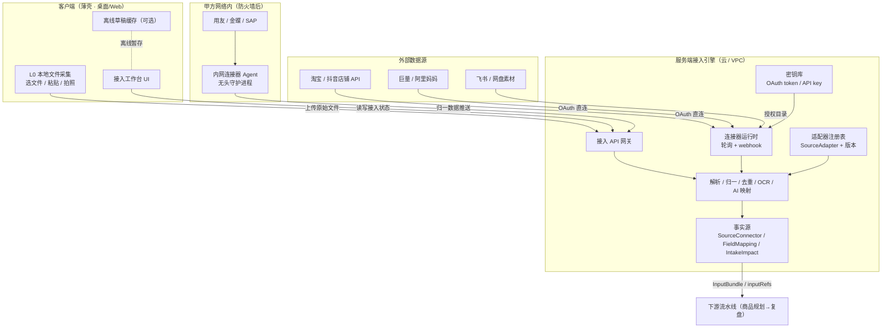
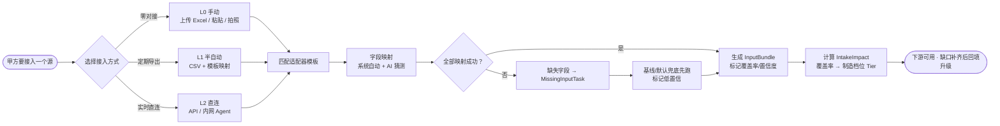
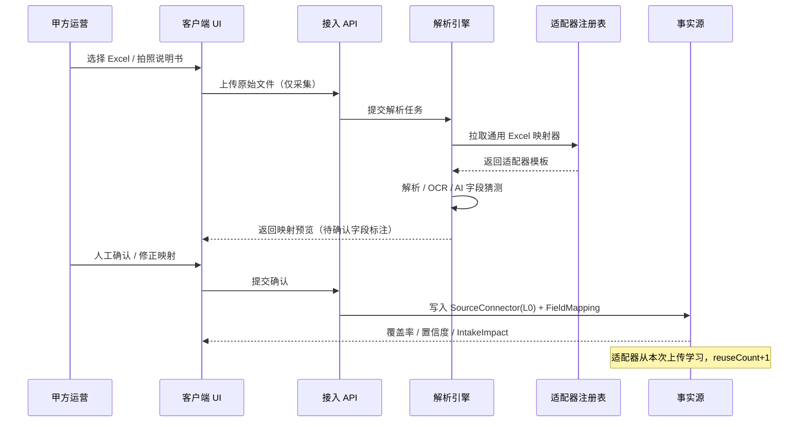
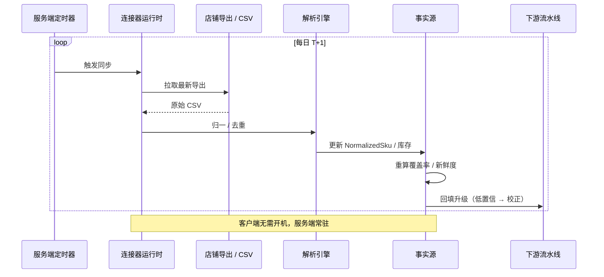
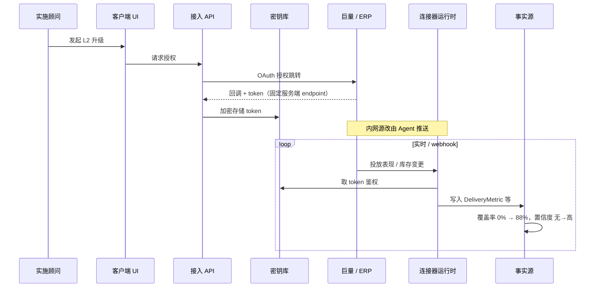

# 数据接入工作台 PRD

状态：Draft v1
更新时间：2026-06-01
对应原型：[`index-v2.html`](./index-v2.html)（侧边栏「数据基座 · 数据接入工作台」）
关联文档：[`README.md`](./README.md)、[`data-model.md`](./data-model.md)

---

## 1. 背景与问题

### 1.1 为什么单独立项

数据接入此前是流水线的一个弹窗（资料接入中心），被画成「点几个按钮连一下」。但真实的电商数据接入是一件极其异构、持续、脏的系统工程：

- **源异构**：淘宝/天猫/抖音/拼多多/京东商品结构互不相同；ERP 有用友、金蝶、SAP、自研；素材散在 OSS、飞书、百度网盘、本地硬盘；广告后台巨量和阿里妈妈是两套体系。
- **数据脏**：标题塞满关键词、规格写在标题里、一个链接挂多个 SKU、库存不实时、评论混入别家产品、说明书是 PDF 扫描件。
- **持续变化**：库存今天接明天过期，价格随活动变，新品不断上架。一次性导入没有意义。
- **甲方配合度差异大**：中小甲方开 API、给 ERP 权限推不动，手里只有 Excel 和微信群里的图；大甲方才有 IT 资源做直连。

### 1.2 核心判断

> 接入不是上线前的门槛，而是一条**渐进供给曲线**。

旧模型的错误是「接没接完」的二元门槛——这与选品「做不做」的二元淘汰是同一个病。统一解法：**分层 + 不阻塞 + 渐进增强**。

把「接入完成才能用」反过来：**第一天用最低成本的数据就能跑，接得越多内容质量越高**。接入从「上线前的成本项」变成「持续拉升质量的价值杠杆」。

### 1.3 商业目标

| 甲方类型 | 接入路径 | 价值 |
| --- | --- | --- |
| 大甲方 | 实施团队做 L2 直连 | 数据新鲜度高、内容质量天花板高，值得投入 |
| 中小甲方 | 全程 L0/L1 自助 | Excel + 粘贴 + 拍照也能跑起来，缺口用基线兜底 |

**生死线**：如果中小甲方必须等实施对接才能上线，产品无法规模化。自助比例是核心北极星指标之一。

---

## 2. 产品目标与非目标

### 2.1 目标

1. 让任意甲方在**零对接**前提下当天跑通流水线（L0 起步）。
2. 把异构源的接入工程沉淀为**可复用、可版本化的适配器**，降低边际接入成本。
3. 让数据缺口**永不阻塞**制造，用基线/AI/默认兜底先跑、补齐后回填。
4. 显式呈现**数据 → 内容质量**的因果链，让接入投入可被甲方理解和决策。
5. 明确区分**自助 / 实施顾问 / 系统自动**三方责任，让 SaaS 自助比例可见可优化。

### 2.2 非目标（本期不做）

- 不做真实的 API 连接器实现（原型为形态设计，连接器工程另立项）。
- 不做 OCR / AI 字段映射的算法实现（先定义交互与状态，算法后续接入）。
- 不替代 ERP / 广告后台本身的能力，只做接入与归一。
- 不做数据存储与权限体系设计（归 server-integration 范畴）。

---

## 3. 核心概念模型

```text
数据接入工作台
= 数据源 SourceConnector（6 类）
  × 成熟度阶梯 L0 / L1 / L2
  × 三方责任 自助 / 实施顾问 / 系统自动
+ 适配器库 SourceAdapter（可复用映射模板）
+ 字段映射 FieldMapping（甲方字段 → 本体字段）
+ 缺口任务 MissingInputTask（不阻塞，补齐回填）
+ 数据→质量因果（覆盖率/新鲜度/置信度 → 制造档位 Tier）
```

### 3.1 成熟度阶梯（同构于商品规划的 Tier）

| 档位 | 名称 | 方式 | 成本 | 适用 |
| --- | --- | --- | --- | --- |
| **L0** | 手动 | 粘贴 / 上传 Excel / 拍照说明书 | 零对接 | 任何甲方第一天 |
| **L1** | 半自动 | 定期导出 CSV + 模板映射 | 中 | 中小甲方主力 |
| **L2** | 直连 | API 实时同步 | 高 | 大甲方 |

每个源从 L0 起步逐步升级，卡片显示当前档位、新鲜度、覆盖率、置信度，而非二元的「已接入 / 待同步」。

### 3.2 三方责任

| 责任方 | 色彩 | 职责 |
| --- | --- | --- |
| **自助** | 绿 | 甲方自己完成：上传 Excel、粘贴文本、拍照说明书、人工确认。零对接。 |
| **实施顾问** | 琥珀 | 布谷实施团队：API 直连、ERP 对接、字段映射调试。只对大甲方值得。 |
| **系统自动** | 蓝 | 系统自动：解析、字段映射、去重、新鲜度监控、缺口检测。 |

### 3.3 不阻塞原则（同构于商品规划「待条件不淘汰」）

缺数据时不卡住流水线：用行业基线 / AI 推断 / 合理默认先跑，标记「低置信」，数据补齐后**回填升级**。例：库存未接通 → 先按「充足」假设跑模板档 → 接通后自动校正。等价于商品规划里「婴儿车夹扇先出合规版」的逻辑。

---

## 4. 架构与部署

### 4.1 核心结论

> 接入引擎必须在**服务端**，客户端只能是薄壳（采集 + 渲染）。

这不是偏好，是子系统硬约束决定的。任何一条都足以否决客户端方案：

1. **持续同步不能依赖客户端开机**。L1 的 T+1 导出、L2 的实时回写本质是定时轮询 + webhook 接收。客户端一关同步就断，库存今天接明天过期。
2. **凭证不能散在每台客户机**。ERP key、广告后台 OAuth token、店铺密钥必须进服务端密钥库统一托管；OAuth 回调也需要固定的服务端 endpoint。
3. **适配器库是共享资产，天生中心化**。复用计数、版本迁移、模板沉淀放在隔离客户端上无从谈起。
4. **接入是团队协作 + 重计算**。实施顾问配 L2、运营传 Excel、审核看覆盖率需共享同一份状态；OCR、AI 字段映射、批量去重需服务端算力。

客户端只负责 L0 的**本地文件采集**（选文件 → 上传）和 UI 渲染；**解析必须回服务端**，这样适配器库才能从每次上传学习、结果才一致。

### 4.2 职责切分

| 层 | 部署位置 | 职责 |
| --- | --- | --- |
| **接入引擎** | 服务端（多租户云 / VPC） | 连接器运行时、定时同步、密钥库、适配器注册表、解析/归一/去重、IntakeImpact 计算，是 SourceConnector / FieldMapping 的事实源 |
| **内网连接器 Agent** | 甲方网络内（防火墙后） | ERP 等内网源的无头守护进程：内网同步 → 归一 → 推送上云。是服务端组件的延伸，**不是桌面客户端** |
| **客户端 UI** | 桌面 / Web（薄） | 渲染工作台、L0 本地文件采集、可选离线草稿缓存。所有处理走服务端 API |

### 4.3 总体架构图



### 4.4 接入流程图（甲方接入一个新源）



### 4.5 时序图：L0 手动上传（自助，客户端采集 + 服务端解析）



### 4.6 时序图：L1 半自动定期同步（系统自动轮询）



### 4.7 时序图：L2 直连授权 + 实时回写（实施顾问 + OAuth）



### 4.8 对象托管归属

| 对象 | 托管位置 | 说明 |
| --- | --- | --- |
| `SourceConnector` | 服务端 | 接入状态事实源，多端共享 |
| `SourceAdapter` | 服务端注册表 | 共享资产，跨租户复用 + 版本管理 |
| `FieldMapping` | 服务端 | 甲方确认后持久化，支持适配器升级迁移 |
| `IntakeImpact` | 服务端 | 由覆盖率实时计算，驱动制造档位 |
| 密钥 / Token | 服务端密钥库 | 加密托管，绝不下发客户端 |
| 原始上传文件 | 客户端采集 → 服务端存档 | 采集在端，`rawRef` 存服务端 |
| 离线草稿 | 客户端（可选） | 仅未提交的临时态 |

### 4.9 部署模式（应对数据合规异议）

部分大甲方不愿 ERP 数据过公有云——这是真实 B2B 异议。答案是改变**部署位置**，而非把引擎推回客户端：

| 模式 | 适用 | 引擎位置 |
| --- | --- | --- |
| 公有云多租户 | 中小甲方默认 | 布谷云 |
| VPC 私有化 | 大甲方 / 数据敏感 | 甲方专属云环境 |
| 内网 Agent + 云 | ERP 在内网防火墙后 | Agent 在内网，引擎在云，仅推归一后数据 |

无论哪种模式，「接入引擎是常驻服务端组件」这一点不变。本节与 v1 [`server-integration-plan.md`](../v1/server-integration-plan.md) 属同一架构线。

---

## 5. 数据源清单（原型基线数据）

| 源 | 当前档位 | 责任方 | 覆盖率 | 新鲜度 | 置信度 | 产出对象 |
| --- | --- | --- | --- | --- | --- | --- |
| 商品与库存 | L1 半自动 | 实施顾问 | 92% | T+1 每日 | 高 | RawProductCandidate / NormalizedSku / SkuCluster |
| 素材与证据 | L0 手动 | 自助 | 54% | 手动上传 | 中 | ClipAsset / Evidence / AssetUsageLedger |
| 搜索与评论 | L2 直连 | 系统自动 | 88% | 实时 | 高 | SearchSignal / IntentCluster / PainPoint |
| 投放与流量 | L0 手动 | 实施顾问 | 0% | 未接入 | 无 | DeliveryMetric / BudgetPlan / KeywordFeedback |
| 平台与品牌规则 | L1 半自动 | 自助 | 79% | 按需更新 | 高 | ForbiddenExpression / ReviewGate / RulePatch |
| 人工确认 | L0 手动 | 自助 | 61% | 事件触发 | 中 | HumanApproval / RecoveryTask |

**当前瓶颈**：投放（0%）+ 素材（54%）是制造档位的两个瓶颈。全量平均覆盖约 62%，4/6 源可自助，1/6 已达 L2。

---

## 6. 适配器库

把平台级映射模板沉淀为可复用、可版本化的 `SourceAdapter`。甲方接入 = 选模板 + 少量字段微调，而非从零建映射。复用次数越高，边际接入成本越低。

| 适配器 | 覆盖字段 | 复用次数 | 责任方 |
| --- | --- | --- | --- |
| 淘宝/天猫商品模板 v3 | 标题、价格、规格、库存、活动、主图 | 41 | 系统自动 |
| 抖音商品模板 v2 | 商品卡、达人挂车、短视频字段 | 23 | 系统自动 |
| 用友 ERP 适配器 | SKU、成本、实时库存、采购在途 | 12 | 实施顾问 |
| 通用 Excel 映射器 | 任意表头 → 本体字段 | 88 | 系统自动 |
| 飞书/网盘素材适配器 | 素材文件、文件夹结构、命名规则 | 19 | 自助 |
| 巨量引擎投放适配器 | 投放表现、预算、词包、转化 | 9 | 实施顾问 |

---

## 7. 功能与交互（原型已实现）

### 6.1 独立工作台入口

- 侧边栏「数据基座 · 数据接入工作台」，带瓶颈数提醒徽标。
- 概览顶部「打开接入中心」按钮亦进入。
- 进入后隐藏流水线/指标/阶段 Tab，全屏呈现接入工作台；点任一阶段或 ESC 退出。

### 6.2 汇总区

四张卡：全量平均覆盖率、可自助源数、已达 L2 源数、制造档位瓶颈数。

### 6.3 数据源卡

每张卡呈现：源名、产出对象、成熟度阶梯（L0→L1→L2 进度可视化）、覆盖率进度条、新鲜度、置信度、责任方标签、所用适配器。健康度用左侧色条区分（绿/蓝/琥珀/红）。

### 6.4 数据源深度抽屉（点击源卡滑出）

- **成熟度阶梯**：当前档位 + 下一步升级方向 + 升级门槛（人日成本）。
- **字段映射表**：甲方字段 → 本体字段逐行映射，状态标「已映射 / AI抽取 / OCR待校 / 缺失」。
- **数据 → 质量因果**：该源覆盖率如何影响制造档位（直连商品规划 Tier）。
- **所用适配器**：复用次数与覆盖字段。
- **操作**：未达 L2 显示「发起升级到 L(n+1)」，已封顶显示「查看监控」。

### 6.5 缺口补齐（沿用既有弹窗）

旧补齐弹窗保留为快速补缺口入口：连接系统 / 上传文件 / 粘贴文本 / 人工录入 / 导入历史 / 创建补拍任务。每条缺口任务标注去哪补、怎么补、补完交付给哪个阶段。

---

## 8. 数据 → 质量因果（关键差异点）

接入工作台与商品规划阶段通过 Tier 档位强耦合：

```text
数据源覆盖率 / 新鲜度 / 置信度
  → 决定每个 SKU 可达的最高制造档位
  → 素材覆盖不足的 SKU 只能落 AI 快产档
  → 补素材后自动升标准 / 精品档
```

示例（原型素材源抽屉文案）：「覆盖仅 54%，是当前制造档位的主要瓶颈。素材不足的 SKU 只能落 AI 快产档，补素材后可升标准/精品档。」

这让甲方一眼看到「补哪个数据能让哪些品升档」，把接入投入转化为可量化的内容质量收益。

---

## 9. 对象模型草案（已并入 data-model.md）

> 已正式并入 [`data-model.md`](./data-model.md) 输入层「数据接入工作台扩展」小节，含接入门禁。下方为同步副本。

```ts
type IntakeLevel = "L0" | "L1" | "L2";
type Responsibility = "self_serve" | "implementation" | "system_auto";

interface SourceConnector {
  id: string;
  name: string;
  level: IntakeLevel;
  responsibility: Responsibility;
  adapterId: string;
  coverage: number;        // 0-100 覆盖率
  freshness: string;       // "实时" | "T+1" | "手动" | "未接入"
  confidence: "高" | "中" | "低" | "无";
  output: string[];        // 产出的本体对象
  health: "ok" | "warn" | "bad" | "info";
  upgrade?: {
    next: string;          // 下一步升级方向
    blocker: string;       // 升级门槛
  };
}

interface SourceAdapter {
  id: string;
  name: string;
  coverFields: string[];
  reuseCount: number;
  responsibility: Responsibility;
  version: string;
}

interface FieldMapping {
  sourceField: string;     // 甲方字段
  ontologyField: string;   // 本体字段
  status: "mapped" | "ai_inferred" | "ocr_pending" | "missing";
}

interface IntakeImpact {
  sourceId: string;
  coverage: number;
  blocksTier: ("premium" | "standard" | "template" | "ai_quick")[]; // 受限档位
  note: string;            // 数据→质量因果说明
}
```

---

## 10. 验收标准

1. 任意甲方在不开任何 API 的前提下，6 类源都能以 L0 方式提供数据并跑通流水线。
2. 每个源显式呈现成熟度档位、覆盖率、新鲜度、置信度、责任方，无二元「已接入/未接入」表述。
3. 任一源缺失时流水线不阻塞，相关 SKU 自动降级到可达的最高制造档位并标记低置信。
4. 数据源抽屉能呈现字段映射表与「数据→质量因果」说明。
5. 适配器库可复用：新甲方接入同类源时可套用已有适配器。
6. 自助 / 实施顾问 / 系统自动三方责任在每个源、每个适配器上明确标注。

---

## 11. 北极星与衡量指标

| 指标 | 含义 | 目标方向 |
| --- | --- | --- |
| 自助接入比例 | 可自助完成的源 / 总源数 | 越高越能规模化 |
| 全量平均覆盖率 | 各源覆盖率均值 | 持续拉升 |
| L0→L1→L2 升级率 | 单位时间内升级的源数 | 反映接入深化 |
| 适配器复用率 | 套用已有适配器的接入次数 / 总接入次数 | 越高边际成本越低 |
| 缺口回填时长 | 缺口任务从创建到补齐的周期 | 越短越好 |
| 数据→档位转化 | 因补数据而升档的 SKU 数 | 体现接入价值 |

---

## 12. 里程碑（建议）

| 阶段 | 范围 |
| --- | --- |
| M1 形态（已完成） | 原型工作台、成熟度分层、三方责任、适配器库、字段映射、因果链 UI |
| M2 数据契约 | 对象模型并入 data-model.md，定义 validator 与 Harness 样例 |
| M3 L0 自助闭环 | Excel/粘贴/拍照的真实解析 + 通用 Excel 映射器 + AI 字段猜测 |
| M4 L1 半自动 | CSV 定期导出 + 平台模板适配器（淘宝/抖音）+ 新鲜度监控 |
| M5 L2 直连 | 实施团队工具链：用友 ERP、巨量引擎等真实连接器 |
| M6 回填闭环 | 缺口补齐自动触发档位升级，打通数据→质量因果的运行时 |

---

## 13. 待决策问题

1. L0/L1/L2 的覆盖率阈值如何定？是否按类目差异化？
2. 「低置信」兜底数据的来源（行业基线库）如何建立与维护？
3. 适配器版本升级时，已接入甲方的存量映射如何平滑迁移？
4. 自助甲方的 AI 字段映射错误率到多少才允许免人工确认？
5. 实施顾问工作量（人日）如何计费，是否打包进 SaaS 订阅或单独报价？
