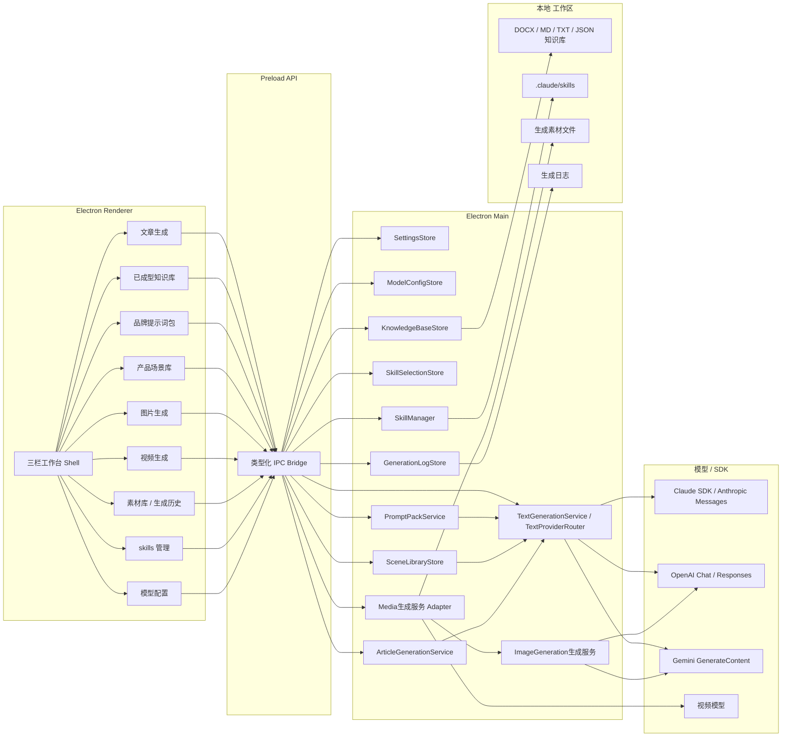
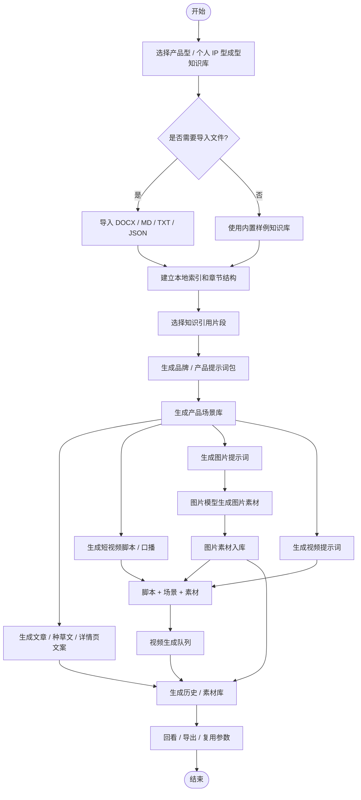
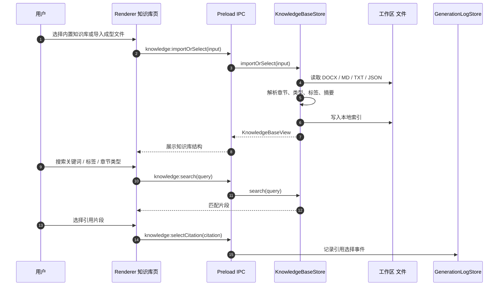
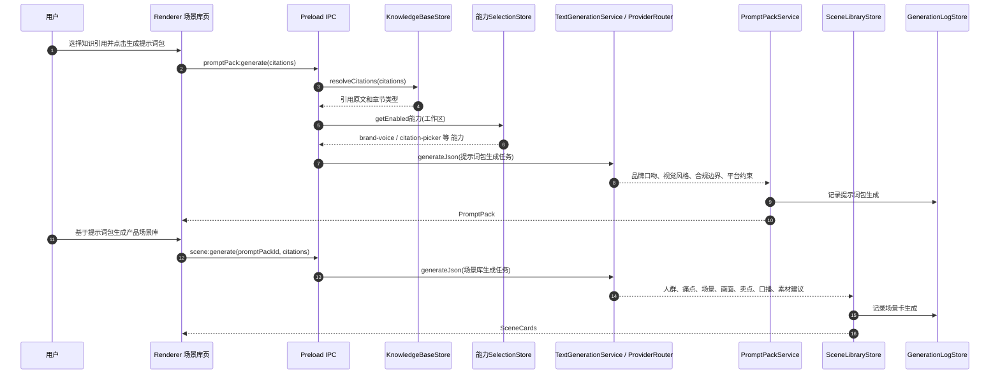
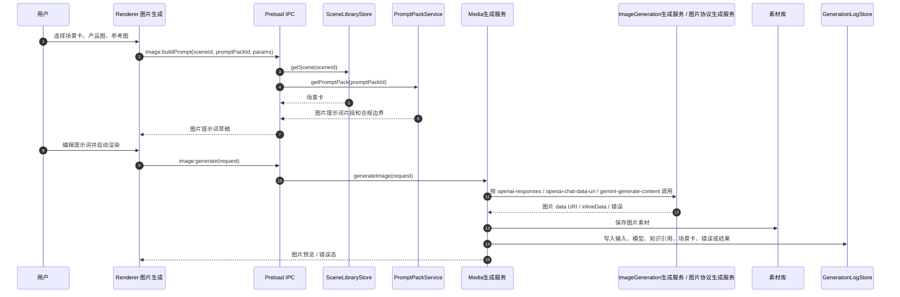
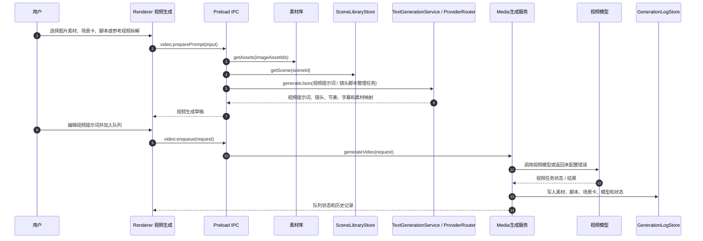
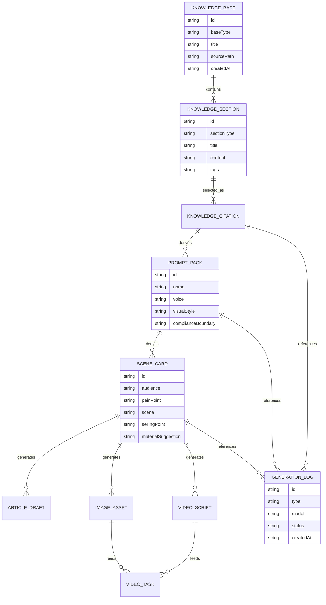
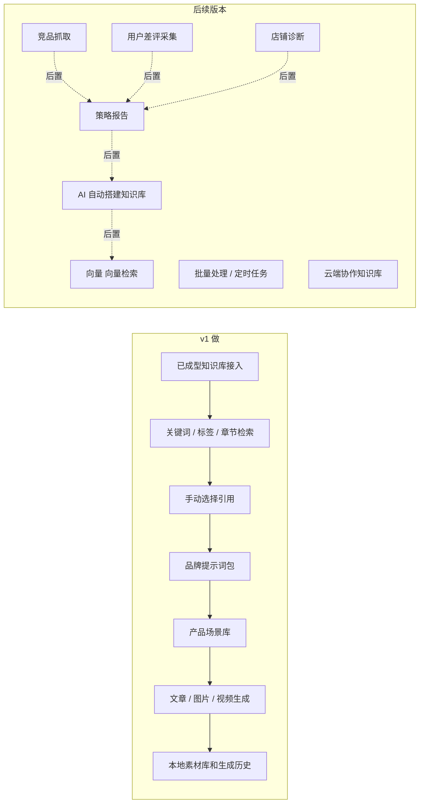

# 布谷AI内容工厂 v1 架构与流程图

更新时间：2026-05-19
状态：Archived historical source

> 归档说明：本文件保留 v1 阶段架构图，包含已废弃的本地 SDK runtime 设想。当前架构图以 `docs/roadmap/v2/architecture-diagrams.md` 和 `docs/roadmap/limeagent/` 为准：Renderer 只经 Preload / IPC 进入 Electron Desktop Host，由 main 侧通过 Lime App Server JSON-RPC 连接 RuntimeCore / backend，且 Lime `app-server` sidecar 随内容工厂打包。

## 1. 设计结论

v1 的核心链路是「已成型知识库 -> 品牌 / 产品提示词包 -> 产品场景库 -> 文案 / 脚本 / 图片提示词 -> 图片素材 -> 视频素材 / 视频生成队列」。

第一期不做策略分析、不抓竞品、不抓差评、不自动搭建知识库；系统只消费已经整理好的产品型知识库和个人 IP 型知识库。

## 2. 系统架构图

## 3. 内容工程流程图

## 4. 知识库接入时序图

## 5. 品牌提示词包与场景库时序图

## 6. 图片素材生成时序图

## 7. 图片素材到视频生成时序图

## 8. 数据关系图

## 9. v1 与后续版本边界

