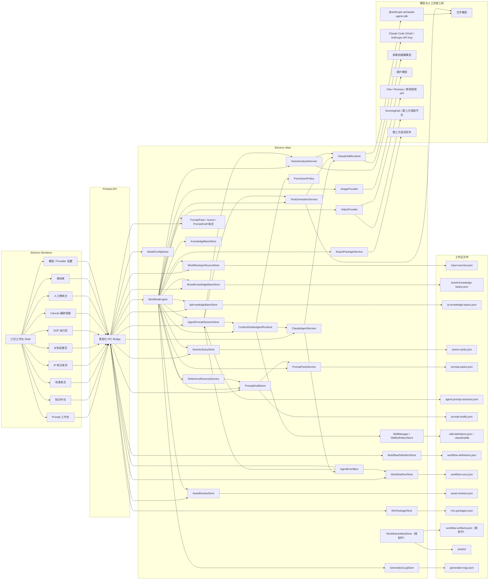
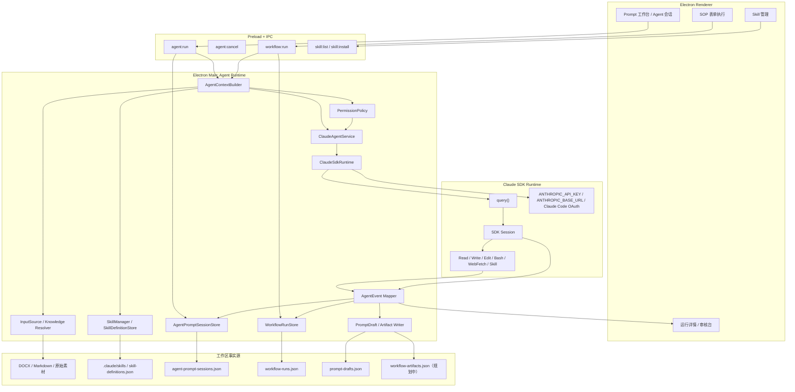
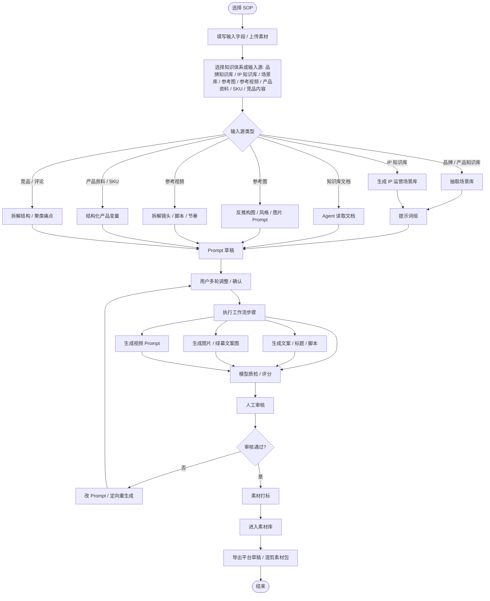
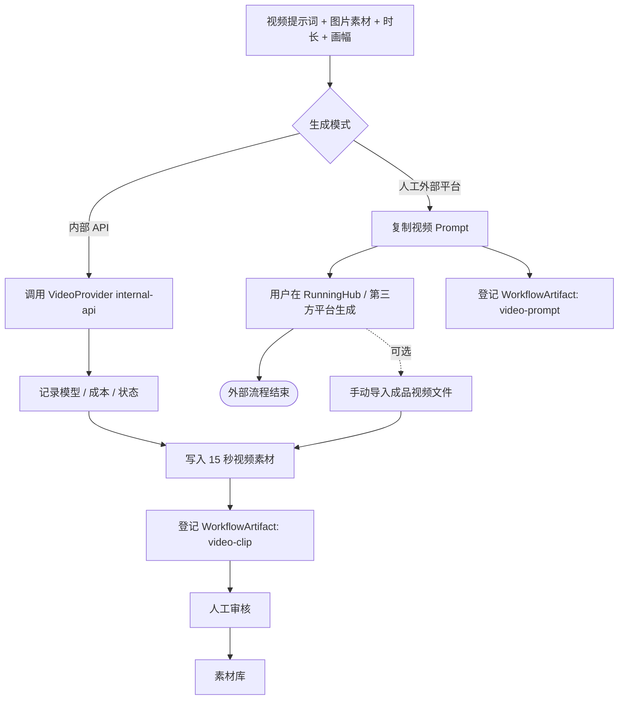
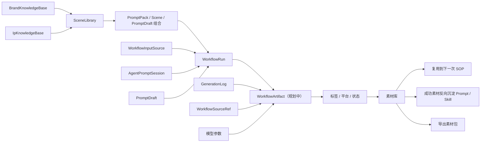
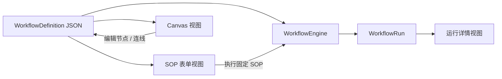

# 布谷AI内容工厂 v2 架构与流程图

更新时间：2026-05-21
状态：Draft

## 1. 设计结论

v2 的架构核心是「知识体系」「场景库」「Prompt 工作台」「工作流服务」和「产物登记」。品牌 / 产品知识库先生成 `PromptPack`，再生成 `SceneLibrary`，再生成 `PromptDraft` / `PromptGroup`；IP 素材先生成 `IpKnowledgeBase`，再延伸出 IP 运营场景库。参考图、参考视频、产品资料、SKU 表和竞品内容仍通过 `WorkflowInputSource` 进入大模型玩法。

底层 Agent 架构参考 `/Users/coso/Documents/dev/js/craft-agents-oss`：Electron Renderer 只做工作台 UI，Electron Main 承担会话、工具、权限、来源、技能和持久化，真正的多轮 Agent 运行通过 `@anthropic-ai/claude-agent-sdk` 启动 Claude SDK runtime。`content-studio` 当前优先走 Claude SDK / Anthropic 链路；非 Claude 模型只走显式协议 provider，不把 OpenAI / Gemini 强塞进 Claude SDK，也不在 v2 默认引入 Pi。

当前落地版本已经具备协议化文字 provider、DOCX / Markdown 输入源抽取、PromptDraft 版本、AgentPromptSessionStore 会话、ReferenceReverseService 真实视觉反推、SOP 最小顺序执行器、知识引用随运行记录保存、品牌场景 SOP、图片生成后自动送审、素材审核、视频 Prompt 人工复制、成品视频导入、绿幕图和混剪包导出。完整 Claude SDK runtime 事件回放仍属于下一阶段，现阶段由 `AgentPromptSessionStore + PromptDraftStore + TextGenerationService + ReferenceReverseService` 承接“读取输入源 + 用户意图 -> 多轮 Prompt 草稿”的最小闭环。

## 2. 系统架构图



## 3. Claude SDK Agent Runtime 架构图

`craft-agents-oss` 的关键经验是：会话是 Agent 的隔离边界，工具调用、权限请求、来源引用和流式事件都要从 runtime 回写到本地会话，而不是只保存最终文本。布谷 v2 需要把这层单独建模，否则知识库读文档、多轮 Prompt 调整、Skill 调用和 SOP 运行记录会混在一起。



运行约束：

- `AgentPromptSession` 是多轮 Prompt 生产的会话边界，保存用户意图、Agent 追问、来源引用、SDK session id 和事件。
- `WorkflowRun` 是 SOP 执行边界，引用一个或多个 `AgentPromptSession`、`SkillRun` 和 artifact。
- Claude SDK runtime 可以读取工作区文档、调用允许的工具和项目 Skill；所有工具事件必须映射为可审计的 `AgentEvent`。
- `PermissionPolicy` 默认不能是全自动写入；生产素材链路可读优先，写文件、调用外部 API、批量改动必须有显式策略。
- `ClaudeSdkRuntime` 负责 SDK 子进程环境、Claude Code OAuth / Anthropic API Key、兼容 base URL 和 SDK 配置修复。
- 非 Claude 协议仍通过 `TextGenerationProvider`、`VisionProvider` 等显式 provider 调用，用于结构化 JSON、图片理解或兼容模型，不进入 Claude SDK Agent runtime。

## 4. 通用 SOP 执行流程



## 5. 视频生成路径



## 6. 素材沉淀流程



## 7. Canvas 与事实源关系



原则：

- `WorkflowDefinition JSON` 是事实源。
- canvas 只能读写定义，不能成为唯一存储。
- 表单视图和 canvas 必须使用同一份定义。
- 运行时只读 definition snapshot，避免执行中被编辑影响。

## 8. Provider 边界

```mermaid
flowchart TD
  WorkflowEngine --> TextProvider
  WorkflowEngine --> VisionProvider
  WorkflowEngine --> ImageProvider
  WorkflowEngine --> VideoProvider
  WorkflowEngine --> PromptExport
  WorkflowEngine --> ExportProvider

  TextProvider --> Claude["Claude SDK / Anthropic"]
  TextProvider --> OpenAIText[OpenAI Chat]
  TextProvider --> GeminiText[Gemini]

  VisionProvider --> ClaudeVision[Claude 多模态]
  VisionProvider --> OpenAIVision["OpenAI / GPT Image 理解"]
  VisionProvider --> GeminiVision[Gemini 多模态]

  ImageProvider --> GPTImage["GPT Image / Responses"]
  ImageProvider --> SD[Stable Diffusion 兼容端点]
  ImageProvider --> GeminiImage[Gemini Image]

  PromptExport --> PromptText["复制视频 Prompt / 导出 Markdown"]
  VideoProvider --> InternalVideo["Vidu / Runway / 其他 API"]
  VideoProvider --> ManualImport[手动导入成品视频]

  ExportProvider --> Manifest["JSON / CSV / XMP"]
  ExportProvider --> Folder[素材文件夹]
```



## 9. 错误与 blocked 状态

| 场景 | 状态 | 要求 |
| --- | --- | --- |
| 文字模型未配置 | `blocked` | 不生成伪文案，记录原因。 |
| 多模态理解模型未配置 | `blocked` | 对标图 / 视频反推不能伪造分析。 |
| 图片 provider 未配置 | `blocked` | 不生成占位图。 |
| 视频内部 API 未配置 | `blocked` | 内部生成不可用，但仍可复制视频 Prompt 到第三方平台。 |
| 第三方视频未导入 | 无运行状态 | 第三方流程脱离软件；软件只保留视频 Prompt 和复制记录。 |
| 审核驳回 | `rejected` | 保留产物和原因，可重生成。 |

## 10. 数据文件建议

```text
.content-studio/
  workflow-input-sources.json
  agent-prompt-sessions.json
  prompt-drafts.json
  workflow-definitions.json
  workflow-runs.json
  workflow-artifacts.json
  generation-logs.json
  prompt-packs.json
  scene-cards.json
  assets/
    images/
    videos/
    green-screen/
    mix-packages/
```
