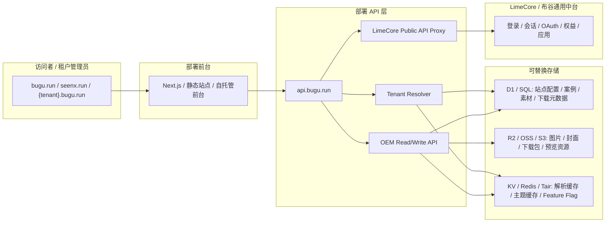
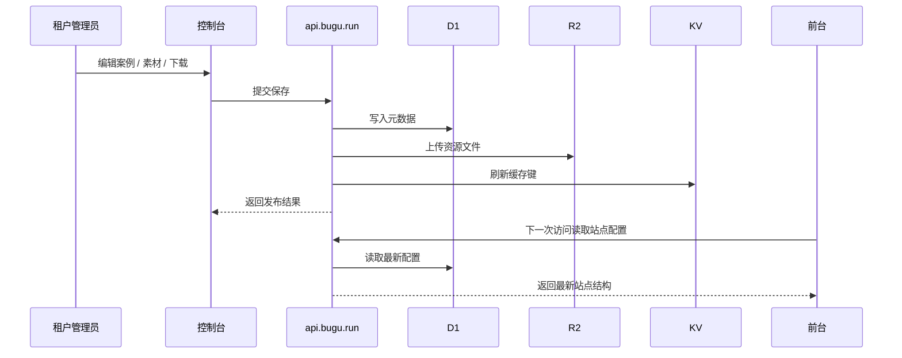

# 布谷 AI v3 架构与流程图

更新时间：2026-05-23  
状态：Draft

## 1. 设计结论

v3 采用 **可移植部署 + 参考云适配器** 的轻量 OEM 架构。  
`bugu` 负责品牌前台、案例、素材、下载、自有登录 / 控制台和租户配置；每个 OEM 租户可以有自己的主域名，例如 `seenx.run`。`limecore` 只负责公共中台抽象。  
不把 Bugu 内容资产放进 Railway，也不把 Cloudflare、阿里云或某个数据库作为唯一运行时事实源。

## 2. 总体架构图



## 3. 站点解析流程

```text
请求进入
-> 读取 Host / path
-> 解析 tenant slug
-> 读取 D1 站点配置
-> KV 命中则直接返回
-> 未命中则回源 D1
-> 组合主题、导航、首页区块和资产列表
-> 返回前台渲染数据
```

### 3.1 路由优先级

1. `primaryDomain` 命中的站点主域名，例如 `bugu.run` 或 `seenx.run`。
2. `{tenant}.bugu.run` 作为兼容别名和预览入口。
3. `bugu.run/o/{tenant}` 作为路径型兼容入口。
4. `/login` 和 `/console` 按命中的站点主域名渲染对应品牌壳。

## 4. 内容发布流程



## 5. 账号与控制台流程

- `/login` 使用当前站点品牌的账号前端逻辑。
- 会话仍由 LimeCore public API 提供。
- `/console` 在品牌一致的前提下承接账号、下载、权益和 OEM 管理。
- 控制台里的 OEM 管理只改 Bugu 自己的 store / assetStore，不改 LimeCore 业务库。

## 6. 失败与降级

- Store 读取失败时，前台显示可解释错误或回退到默认品牌配置。
- 对象资源缺失时，卡片保留文本和可解释降级，不伪造素材已存在。
- LimeCore public API 不可用时，账号和控制台显示可解释错误，不影响公共首页浏览。
- 缓存失效时，API 回源 store，不改变数据事实源。
