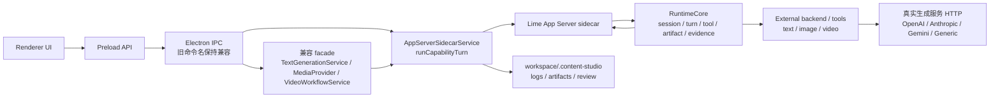

# App Server 生成能力收敛方案

更新时间：2026-06-07  
状态：current

## 1. 结论

`TextGenerationService` 和 `MediaProvider` 背后的应用运行时生成执行已经收敛到 Lime App Server。目标不是把现有代码简单搬进一个更大的 backend 文件，而是让 App Server 成为文字、图片、视频生成执行的唯一 runtime facts 源；content-studio main 保留业务对象组装、IPC 兼容、workspace 持久化、历史日志和 UI 投影。

一句话事实源声明：

> AI 生成执行只允许继续向 Lime App Server capability / tool runtime 收敛；旧 provider 直连 HTTP 路径只允许作为迁移期兼容，不允许新增业务能力。

P4 试点当前状态：

1. Electron main 已通过 `AppServerSidecarService` 启动 / 连接随包 App Server，并以 `agentSession/start -> agentSession/turn/start` 绑定 `businessObjectRef`。
2. Renderer 仍只通过 preload IPC 消费 `agent:run`、`agent:event:<taskId>`、`appServer:health` 和 `appServer:smoke`，不直接读取 sidecar stdout。
3. `AgentEvent` 已覆盖 App Server 投影到业务 UI 所需的 `assistant / tool / result / action / evidence / error / done`。
4. 当前真实 standalone sidecar smoke 能证明 event、artifact、error 和 evidence export；`action.required / evidence.changed` 事件到达后的 UI 投影由 functional fake JSON-RPC 合同固定。真实 external backend action/evidence 事件仍取决于 Lime App Server standalone backend surface 后续开放，不能在本仓库单方面宣称已生产闭环。

## 2. 当前问题

当前架构已经把 Prompt 工作台、通用 Agent runtime、文字 JSON、图片生成和视频生成切到 App Server。仍保留的 main 侧 provider 直连路径只用于未注入 App Server 的迁移期兼容和协议测试：

```text
TextGenerationService -> textGenerationProvider -> 文字模型 HTTP
MediaProvider -> imageGenerationProvider / Generic HTTP -> 图片 / 视频服务
VideoWorkflowService -> TextGenerationService / video provider -> 视频拆解和脚本
```

这会造成三个问题：

1. runtime facts 分裂：Agent 任务有 session / turn / artifact / evidence，普通生成只落 generation log。
2. provider 行为分散：文字协议、图片协议、视频协议分别在 main service / provider 内演进。
3. 新能力容易回流旧路：如果不继续治理，新增生成能力仍可能倾向扩展 deprecated provider 直连路径。

## 3. 目标态



目标态不变量：

1. 新增生成能力必须先定义 App Server capability。
2. 旧 IPC 名可以保留，但只能做参数转换、返回值适配和历史日志落库。
3. App Server runtime events、artifact 和 evidence 是生成执行事实源。
4. `.content-studio` 仍是业务对象、审核、历史和本地产物引用事实源。
5. Renderer 不直接调用 App Server，不读取 stdout，不接触明文 Key。

## 4. 路径分类

| 路径 | 分类 | 说明 |
| --- | --- | --- |
| `src/main/services/appServerSidecarService.ts` | `current` | 已新增通用 `runCapabilityTurn`，承接普通生成 capability 执行。 |
| `src/main/services/appServerPromptAgentService.ts` | `current` | Prompt 工作台业务投影层，继续保留。 |
| `resources/app-server/backend/content-backend.mjs` | `current` | 当前 packaged external backend，后续拆出 text / image / video tool 边界。 |
| `src/main/services/textGenerationService.ts` | `compat` | 保留 `generateJson` 调用面，应用运行时内部委托 App Server。 |
| `src/main/providers/textGenerationProvider.ts` | `deprecated` | 迁移期保留，后续下沉到 App Server backend / tool 或删除。 |
| `src/main/providers/mediaProvider.ts` | `compat` | 保留 `generateImage/generateVideo` IPC 返回值和日志适配，应用运行时委托 App Server。 |
| `src/main/providers/imageGenerationProvider.ts` | `deprecated` | 图片 capability 成熟后迁走。 |
| `src/main/services/videoWorkflowService.ts` | `compat` | 保留视频拆解 / 脚本业务校验和结构化结果落库，执行委托 App Server。 |
| 旧本地 Agent SDK runtime | `dead` | 禁止恢复或作为 fallback。 |

## 5. Capability 设计

| Capability | 输入 | 输出 | 迁移对象 |
| --- | --- | --- | --- |
| `content.text.generate` | prompt、response schema、model metadata、businessObjectRef | text / json artifact、providerEvents、evidence | `TextGenerationService.generateJson`，已落地 |
| `content.article.generate` | 文章请求、知识引用、平台约束 | Markdown artifact、发布检查摘要 | `ArticleGenerationService`，待拆分 |
| `content.prompt.generate` | 输入源、skill、用途、团队知识包 | Prompt Markdown artifact | Prompt Pack、场景、Prompt 工作台，待拆分 |
| `content.video.analyze` | video refs、operation metadata | breakdown JSON artifact、feature evidence | `VideoWorkflowService.analyze`，待迁移 |
| `content.video.script.generate` | 选题、拆解结果、平台规则 | script JSON artifact、quality evidence | 视频脚本生成 / 质检 / 重写，待拆分；当前经 `content.text.generate` 间接执行 |
| `content.image.generate` | prompt、input assets、edit mask、style refs | image artifactRefs、provider job、cost estimate | `MediaProvider.generateImage`，已落地 |
| `content.video.generate` | prompt、image refs、duration、ratio、model | video artifactRefs、provider job、blocked queue artifact | `MediaProvider.generateVideo`，已落地 |

## 6. 迁移顺序

### 阶段 A：通用 capability turn

已新增 `AppServerSidecarService.runCapabilityTurn(...)`，统一处理：

1. sidecar binary / backend 解析。
2. `initialize / initialized`。
3. `agentSession/start`。
4. `agentSession/turn/start`。
5. notification drain 到终态。
6. `artifact/read` 和 `evidence/export`。
7. 失败、取消、超时的统一错误语义。

验收：

- `agent:run` 和 Prompt 工作台仍通过原路径。
- 新入口不改变现有 IPC 合同。
- smoke 覆盖 `content.text.generate` 的 artifact 和 evidence。

### 阶段 B：文字生成先收敛

已将 `TextGenerationService` 改为兼容 facade：

```text
TextGenerationService.generateJson
-> AppServerSidecarService.runCapabilityTurn(content.text.generate)
-> App Server backend text tool
-> 文字模型 HTTP
```

后续专用拆分：

1. `ArticleGenerationService`。
2. `PromptPackService`。
3. `SceneLibraryStore`。
4. `BrandKnowledgeBaseStore` / `IpKnowledgeBaseStore`。
5. `ImageSkillGenerationService`。

验收：

- providerEvents 记录 `runtime: lime-agent-server`。
- 缺 Key 仍返回 blocked / failed，不伪造成果。
- JSON 结构化输出必须继续严格校验字段。

### 阶段 C：视频理解和脚本收敛

将视频拆解、脚本生成、质检、单镜头重写委托 App Server：

```text
VideoWorkflowService
-> runCapabilityTurn(content.video.analyze / content.video.script.generate)
-> App Server video/text tool
-> Generic HTTP 或文字模型 HTTP
```

验收：

- 拆解失败不生成模板化假结果。
- 脚本字段缺失仍失败，不写入不完整脚本。
- 爆款特征库仍从成功拆解日志派生。

### 阶段 D：图片 / 视频媒体生成收敛

已将 `MediaProvider` 改为兼容 facade：

```text
MediaProvider.generateImage/generateVideo
-> runCapabilityTurn(content.image.generate / content.video.generate)
-> App Server media tool
-> 图片 / 视频 provider HTTP
-> artifactRefs / provider job / blocked artifact
```

验收：

- 图片未配置真实服务时仍 blocked，禁止 SVG 占位。
- 视频未配置真实服务时仍只保存 blocked 队列请求。
- 历史抽屉、素材库、审核台读取同一 generation log 和 artifactRefs。
- 重试历史记录时仍能绑定原始业务对象和输入素材。

## 7. 兼容与退出条件

| 兼容面 | 保留原因 | 退出条件 |
| --- | --- | --- |
| `window.contentStudio.generateArticle` 等旧 API | 避免 renderer 大面积改动。 | 全部内部委托 App Server 后，可继续作为稳定 API 保留。 |
| `TextGenerationService` | 调用点多，先保留统一 facade。 | 所有调用都不再需要未注入兼容路径后，可缩小为 adapter 或删除旧直连 provider。 |
| `MediaProvider` | 承接日志、成本估算、历史重试和旧返回类型。 | 图片 / 视频 artifact 契约稳定后缩小为 adapter。 |
| `textGenerationProvider` / `imageGenerationProvider` | 迁移期避免一次性大爆炸。 | App Server backend / tools 具备同等协议覆盖和测试后删除。 |

## 8. 守卫

后续实现时需要继续补仓库守卫：

1. 扫描 `src/main/services` 中新增 provider 直连 HTTP 的引用。
2. 扫描新增 `TextGenerationService` / `MediaProvider` 业务逻辑，要求只能委托 App Server 或做返回值适配。
3. App Server capability smoke 覆盖文字、图片、视频至少一条 blocked 和一条 echo / fake provider 成功路径。
4. functional tests 覆盖旧 IPC 名不变、runtime facts 可追溯、失败不伪造成果。

## 9. 最小验证

| 改动 | 验证 |
| --- | --- |
| `runCapabilityTurn` | `npm run typecheck` + `npm run smoke:app-server` |
| 文字生成迁移 | `npm run app-server:backend:test` + 相关 functional tests |
| 视频拆解 / 脚本迁移 | 视频工作流 functional tests + `npm run build` |
| 图片 / 视频媒体迁移 | AI 生图 / AI 视频 e2e + `npm run smoke:electron` |
| 全链路发布前 | `npm run verify:local` + 对应 `npm run dist:*` |
