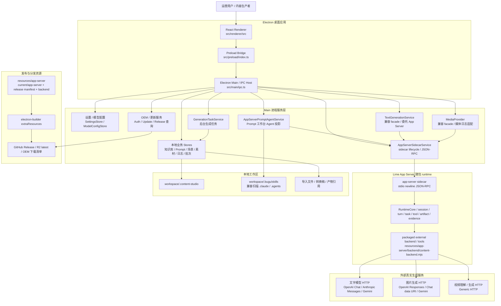
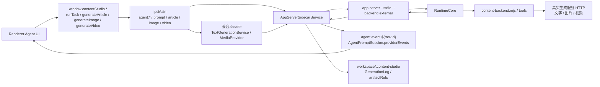
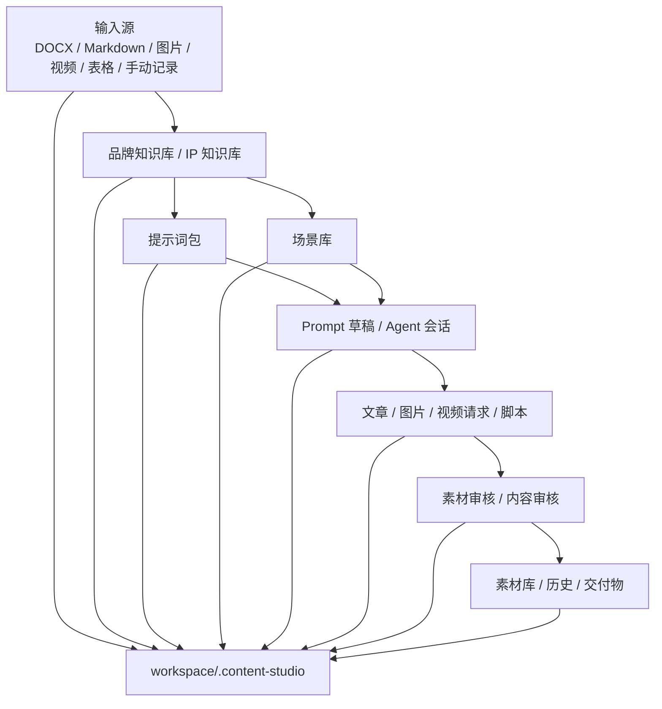
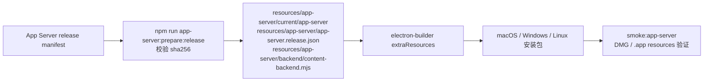

# content-studio 全局架构图

更新时间：2026-06-07  
状态：current

## 1. 架构结论

content-studio 是一个本地优先的 Electron 桌面内容工厂。Renderer 只负责业务 UI 和 runtime facts 投影；Electron main 负责 IPC、数据存储、模型配置、生成编排和 sidecar 生命周期；Agent runtime 与普通文字、图片、视频生成执行统一通过随包 Lime App Server sidecar 承接；文本、图片、视频能力按显式协议调用真实生成服务，未配置时返回 blocked 或 failed，不伪造成果。

当前架构收敛口径是：**AI 生成执行统一通过 Lime App Server capability / tool runtime；content-studio main 只负责业务对象组装、workspace 持久化、IPC 投影和历史日志写入。** `TextGenerationService` 与 `MediaProvider` 已在应用运行时降级为兼容 facade；旧 provider 直连路径只保留为未注入 App Server 时的迁移期兼容，不再作为新增能力事实源。

## 2. 全局架构



## 3. 分层职责

| 层级 | 代码路径 | 职责 | 禁止事项 |
| --- | --- | --- | --- |
| Renderer | `src/renderer/src/` | 页面、组件、用户交互、runtime facts 展示。 | 不直接读取 API Key，不 spawn sidecar，不读取 App Server stdout。 |
| Preload | `src/preload/index.ts` | 暴露类型化 `window.contentStudio` facade。 | 不承载业务状态，不绕过 IPC 访问 main service。 |
| Shared Contract | `src/shared/types.ts` | main / preload / renderer 的协议事实源。 | IPC 字段不能只改调用方。 |
| Electron Main | `src/main/ipc.ts` | 注册 IPC、组装服务、向 renderer 广播事件。 | 不把 UI-only state 当执行事实源。 |
| Main Services | `src/main/services/` | 本地 store、业务应用服务、Agent 投影、发布/更新服务。 | 不新增第二套 Agent runtime adapter。 |
| Providers | `src/main/providers/` | 保留未注入 App Server 时的文字、图片、视频协议化 HTTP 兼容实现；应用运行时由 App Server backend / tools 执行。 | 不在 provider 直连路径新增业务能力。 |
| Lime App Server | `resources/app-server` + `AppServerSidecarService` | Agent session / turn / runtime events / artifacts / evidence。 | 不在 renderer 中模拟 runtime 成功。 |
| Workspace | `.content-studio/` | 本地业务对象、日志、产物引用和草稿事实源。 | 不硬编码用户目录。 |

## 4. 路径治理分类

| 路径 | 当前分类 | 当前目标 | 退出条件 |
| --- | --- | --- | --- |
| `AppServerSidecarService` | `current` | 唯一 runtime 执行入口，新增 `runCapabilityTurn` 一类通用 capability 调用。 | 不适用。 |
| `AppServerPromptAgentService` | `current` | 继续作为 Prompt 工作台业务投影层，内部调用通用 capability turn。 | 不适用。 |
| `TextGenerationService` | `compat` | 兼容 facade，应用运行时内部委托 App Server `content.text.generate`。 | 所有文字生成调用不再需要未注入兼容测试后，删除旧直连 provider。 |
| `MediaProvider` | `compat` | 兼容 facade，负责旧 IPC 返回值和 generation log 适配，应用运行时委托 App Server `content.image.generate` / `content.video.generate`。 | 图片、视频 artifact 契约稳定后，缩小为纯 adapter 并删除直连 provider HTTP。 |
| `src/main/providers/textGenerationProvider.ts` | `deprecated` | 下沉为 App Server backend / tool 实现，或迁移后删除。 | 没有 main service 直接引用。 |
| `src/main/providers/imageGenerationProvider.ts` | `deprecated` | 下沉为 App Server image tool 实现，或迁移后删除。 | 图片生成、局部精修和历史重试都走 App Server artifact。 |
| 旧本地 Agent SDK runtime | `dead` | 禁止恢复。 | 不适用。 |

## 5. Runtime 架构



运行时不变量：

1. `agent:run` 和 Prompt 工作台都通过 App Server sidecar。
2. `agent:cancel` 映射到 `agentSession/turn/cancel`。
3. `message.delta`、`artifact.snapshot`、`turn.completed`、`turn.failed` 等事件由 main 投影给 UI。
4. 缺少 sidecar、backend 或模型 Key 时返回明确错误，不 fallback 到旧 SDK runtime。
5. 新增生成能力时，只允许新增 App Server capability / tool；旧 IPC 可以保留，但必须委托 App Server。

## 6. 目标能力分层

| Capability | 范围 | 首选迁移阶段 |
| --- | --- | --- |
| `content.text.generate` | 通用文本 / JSON 生成，替代 `TextGenerationService.generateJson` 直连。 | 已落地 |
| `content.article.generate` | 文章和平台草稿 Markdown。 | 规划 |
| `content.prompt.generate` | 提示词包、场景、Prompt 草稿。 | 规划 |
| `content.video.analyze` | 视频拆解、爆款特征提取。 | 待迁移 |
| `content.video.script.generate` | 视频脚本、质检、单镜头重写。 | 待迁移 |
| `content.image.generate` | 图片生成、输出 artifactRefs。 | 已落地 |
| `content.video.generate` | 视频生成请求、provider job、blocked 队列和下载 artifact。 | 已落地 |

## 7. 数据与产物关系



## 8. 发布资源架构



发布不变量：

1. 生产包必须携带 `app-server` binary、release manifest 和 packaged backend。
2. `APP_SERVER_BIN` 只用于开发 / 测试覆盖，且不能抢占 packaged resources。
3. OEM 打包前必须检查 App Server 资源存在。
4. macOS 当前默认 unsigned internal preview，正式签名另开任务处理。

## 9. 关键验收命令

```bash
npm run typecheck
npm run build
npm run app-server:backend:test
npm run smoke:app-server
npm run smoke:electron
npm run verify:local
```

发布或打包变更还必须按目标平台执行 `npm run dist:*`。
