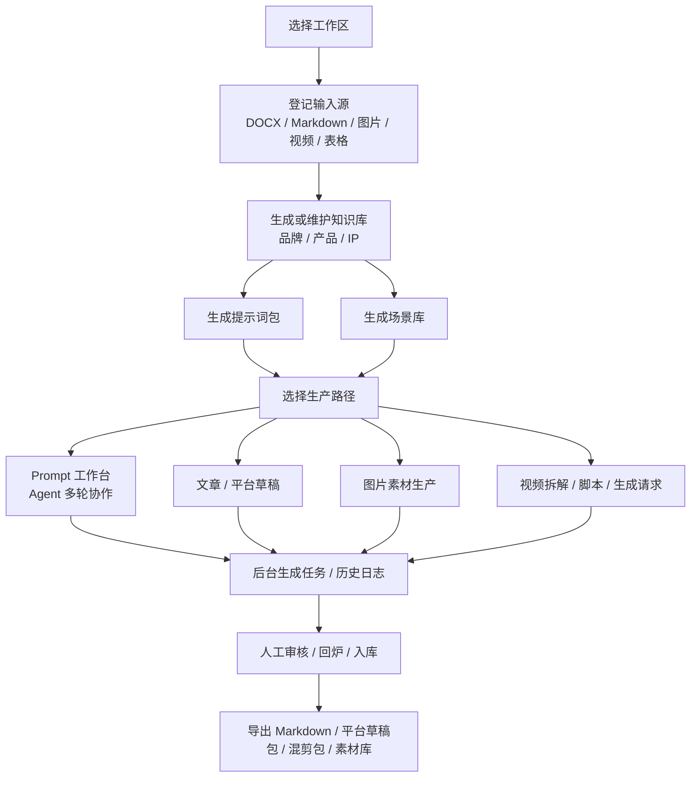
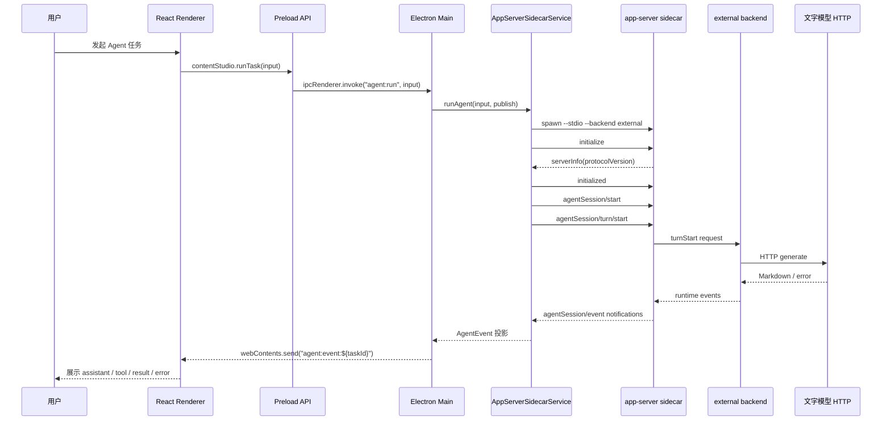
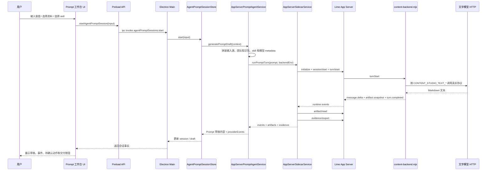
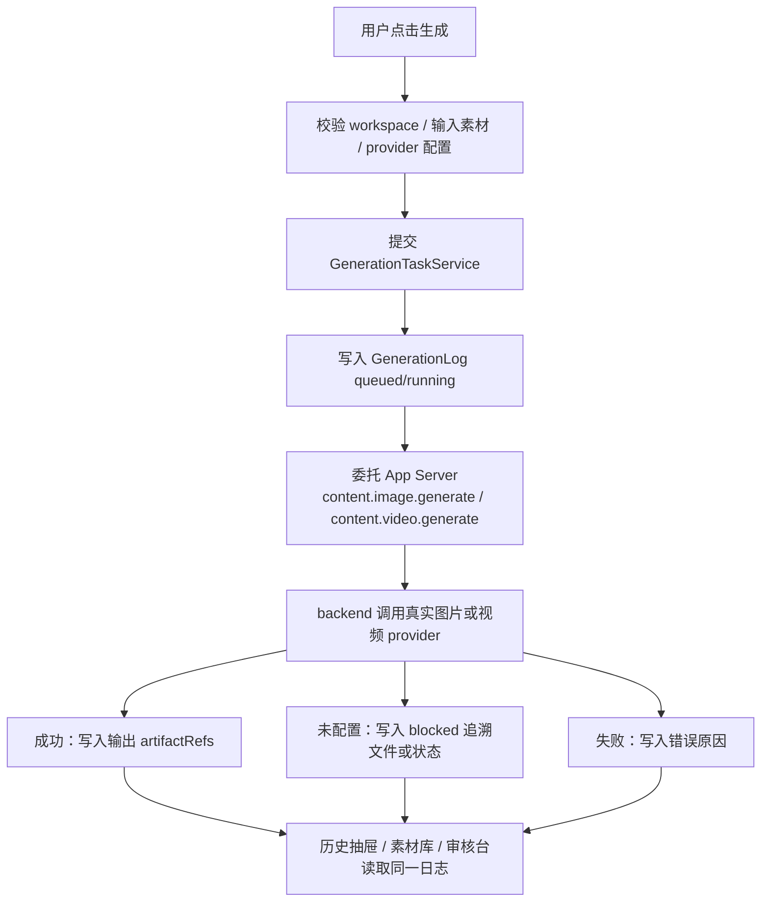
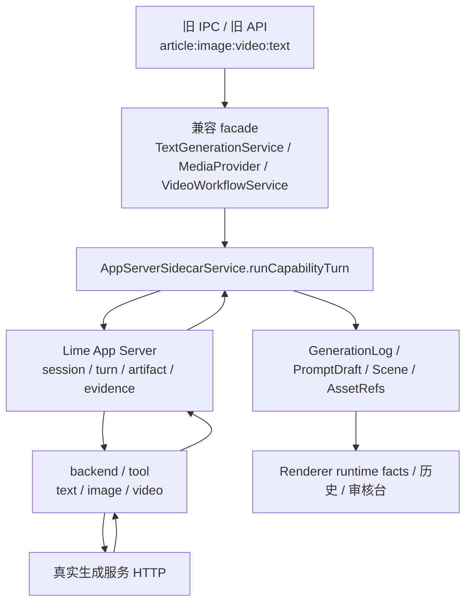
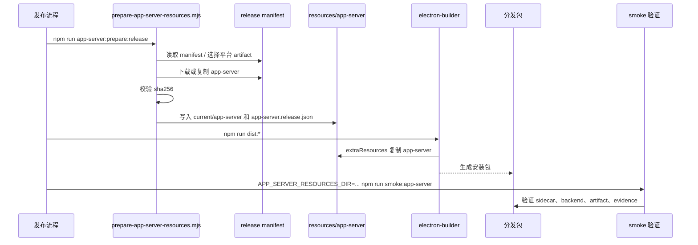

# content-studio 流程与时序 PRD

更新时间：2026-06-07  
状态：current

## 1. 背景

content-studio 的用户主线已经从单点生成工具收敛为内容工厂：用户导入成型资料，形成知识库、提示词包和场景库，再通过文章、图片、视频、Prompt 工作台和素材审核产出可追溯交付物。技术上，Agent runtime、文字 JSON、图片生成和视频生成已经统一切到 Lime App Server sidecar；本地 `.content-studio` 是桌面工作区事实源。

当前治理目标是继续把视频理解、文章和提示词类专用生成收敛到 Lime App Server capability / tool runtime。`TextGenerationService`、`MediaProvider` 和 `VideoWorkflowService` 保留为兼容 facade 或业务结果适配层，不再作为新增生成能力事实源。

本 PRD 用于描述 current 架构下的核心流程、时序和验收标准，作为后续改动 IPC、runtime、生成任务、打包资源时的检查清单。

## 2. 目标

1. 用流程图描述普通用户从资料到交付物的端到端路径。
2. 用时序图明确 Renderer、Preload、Electron main、Lime App Server 和 provider 的协作边界。
3. 固化失败策略：缺配置、缺 sidecar、模型失败和取消任务都必须可追溯。
4. 给出工程验收口径，避免 UI 模拟成功或新增第二套 runtime。
5. 明确生成能力收敛顺序和剩余迁移项，防止新能力继续回流 provider 直连路径。

## 3. 非目标

1. 不重新设计 UI，不新增页面导航。
2. 不引入云端多租户、计费或权限中心。
3. 不恢复旧本地 Agent SDK runtime。
4. 不把图片、视频、文字生成改成模型名猜测或 SDK 私有链路。
5. 不在 `TextGenerationService` 或 `MediaProvider` 上继续扩展新的 provider 直连能力。

## 4. 角色与对象

| 角色 | 目标 | 主要对象 |
| --- | --- | --- |
| 内容运营 | 基于成型资料生产平台内容。 | 输入源、知识库、Prompt 草稿、场景卡、素材、历史。 |
| 审核人员 | 确认可用素材和内容交付物。 | 审核任务、素材记录、生产日志、交付包。 |
| 桌面 Host | 管理 IPC、store、runtime 和生成 provider。 | IPC 请求、模型配置、workspace、sidecar、任务事件。 |
| Lime App Server | 管理 Agent runtime facts。 | session、thread、turn、task、tool、artifact、evidence。 |

## 5. 总体业务流程

验收标准：

1. 每个产物能追溯到工作区、输入源或运行日志。
2. 用户离开当前模块后，后台任务和历史仍可查看。
3. 未配置真实能力时展示 blocked / failed，不生成占位成功产物。

## 6. 通用 Agent 执行时序

关键规则：

1. Renderer 只接收投影后的 `AgentEvent`。
2. main 进程必须持续读取 notification，直到终态事件。
3. `turn.failed` 或任意 `*.failed` 不能再发送成功 done。
4. 取消任务必须先尝试 `agentSession/turn/cancel`，再关闭 sidecar。

## 7. Prompt 工作台时序

验收标准：

1. `providerEvents` 必须记录 `runtime: lime-agent-server`。
2. Prompt 内容优先来自 artifact；没有 artifact 时才聚合 `message.delta`。
3. sidecar 或模型不可用时，会话记录 blocked 事实和恢复动作。
4. UI 不硬编码假 assistant 气泡或固定执行脚本。

## 8. 图片 / 视频后台生成流程

业务规则：

1. 图片通过 `content.image.generate` 走真实图片生成服务；未配置时 blocked，禁止 SVG 占位图。
2. 视频通过 `content.video.generate` 走 Generic HTTP；未配置时只保存 blocked 队列请求。
3. 历史记录从全局生成日志读取，不按页面局部状态伪造。

## 9. 生成能力收敛流程

收敛顺序：

1. 阶段 A：新增 `runCapabilityTurn`，让 App Server capability 调用复用同一套 sidecar lifecycle、notification drain、artifact/read 和 evidence/export。已落地。
2. 阶段 B：迁移 `TextGenerationService.generateJson` 到 `content.text.generate`。已落地；文章、提示词包、场景等专用 capability 待继续拆分。
3. 阶段 C：迁移 `VideoWorkflowService` 的视频拆解、视频脚本、质检和单镜头重写。脚本类已通过 `TextGenerationService` 间接进入 App Server；视频理解 `content.video.analyze` 待迁移。
4. 阶段 D：迁移 `MediaProvider` 的图片生成、视频生成请求和 provider job artifact 到 `content.image.generate` / `content.video.generate`。已落地。

能力命名：

| Capability | 首批调用方 |
| --- | --- |
| `content.text.generate` | `TextGenerationService.generateJson`，已落地 |
| `content.article.generate` | `ArticleGenerationService`，待拆分 |
| `content.prompt.generate` | Prompt Pack、场景库、Prompt 工作台，待拆分 |
| `content.video.analyze` | `VideoWorkflowService.analyze`，待迁移 |
| `content.video.script.generate` | 视频脚本生成 / 质检 / 重写，待拆分；当前经 `content.text.generate` 间接执行 |
| `content.image.generate` | `MediaProvider.generateImage`，已落地 |
| `content.video.generate` | `MediaProvider.generateVideo`，已落地 |

治理规则：

1. 新增生成能力必须先定义 App Server capability。
2. 旧 IPC 名保留，但只能做参数转换、返回值适配和业务落库。
3. provider key 仍由 Electron main 读取并以受控 env / runtime options 传给 backend，Renderer 不接触明文 Key。
4. App Server runtime events、artifact 和 evidence 是执行事实源；`.content-studio` 是业务对象和历史事实源。
5. 迁移期 provider 直连路径归类为 `deprecated`，只允许修 bug 和补测试，不允许新增能力。

## 10. App Server 资源准备与打包时序

验收标准：

1. 缺少 `resources/app-server/current/app-server` 时 release build 失败。
2. 缺少 `resources/app-server/app-server.release.json` 时 release build 失败。
3. 缺少 `resources/app-server/backend/content-backend.mjs` 时 release build 失败。
4. 打包产物必须能通过 `smoke:app-server`。

## 11. 失败路径

| 场景 | 系统行为 | 用户可见结果 |
| --- | --- | --- |
| 未找到 sidecar | `AppServerSidecarService` 返回 missing / error。 | 显示 App Server 缺失，提示本地开发覆盖或生产包资源缺失。 |
| 未找到 backend | `runAgent` / `runPromptTurn` 返回未配置 external backend。 | 会话或任务进入 error / blocked。 |
| 文字模型缺 Key | packaged backend 返回 `turn.failed`。 | Prompt 会话记录模型未配置，不产生成果。 |
| provider HTTP 失败 | provider 或 backend 返回 failed runtime event。 | 历史或会话保留错误原因。 |
| 用户取消任务 | main 请求 `agentSession/turn/cancel` 并关闭 sidecar。 | UI 显示 canceled / status，不追加成功 done。 |
| 后台任务失败 | 生成日志写入 failed 和错误信息。 | 历史详情可追溯失败原因。 |
| capability 未实现 | facade 返回明确 unsupported capability。 | 用户看到能力暂不可用，不回退旧 provider 伪造成果。 |

## 12. 验收清单

| 改动类型 | 最低验证 |
| --- | --- |
| 类型或 IPC 改动 | `npm run typecheck` |
| 前端或 main 普通功能 | `npm run build` |
| App Server runtime 改动 | `npm run app-server:backend:test` + `npm run smoke:app-server` |
| 文字生成收敛 | `npm run app-server:backend:test` + 相关 functional tests |
| 图片 / 视频生成收敛 | AI 生图 / AI 视频 e2e + `npm run smoke:electron` |
| 主工作台 / preload / IPC 主链 | `npm run smoke:electron` |
| 可交付功能改动 | `npm run verify:local` |
| 打包 / release 资源改动 | 对应 `npm run dist:*` 和 packaged resources smoke |

## 13. 追踪矩阵

| PRD 能力 | 事实源路径 |
| --- | --- |
| `runTask` / `cancelTask` / App Server health | `src/shared/types.ts`、`src/preload/index.ts`、`src/main/ipc.ts` |
| App Server sidecar lifecycle | `src/main/services/appServerSidecarService.ts` |
| Prompt 工作台 Agent | `src/main/services/appServerPromptAgentService.ts`、`src/main/services/agentPromptSessionStore.ts` |
| capability 收敛方案 | `internal/tech/app-server-generation-convergence.md` |
| 文字模型协议 | `src/main/services/textGenerationService.ts` 作为 compat facade；应用运行时委托 `AppServerSidecarService.runCapabilityTurn`，`src/main/providers/textGenerationProvider.ts` 保留未注入兼容路径 |
| 图片 / 视频生成 | `src/main/providers/mediaProvider.ts` 作为 compat facade；应用运行时委托 App Server media / video capabilities，`src/main/providers/imageGenerationProvider.ts` 保留未注入兼容路径 |
| 后台任务和历史 | `src/main/services/generationTaskService.ts`、`src/main/services/generationLogStore.ts` |
| App Server packaged backend | `resources/app-server/backend/content-backend.mjs` |
| App Server 资源准备 | `scripts/prepare-app-server-resources.mjs`、`resources/app-server/README.md` |
